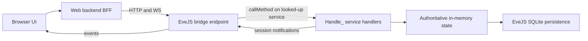

# EveJS Web Client: Scope and Roadmap

**Status:** Active — rewritten 2026-07-18. Supersedes the 2026-07-12 planning baseline and its Goal 0A–0F ladder. The old goal ladder, its execution records, and the deleted `docs/progress.md` live in this repository's git history (through commit `8dccc5d`); do not resurrect their retired decisions (section 11).

**Related repositories:** `eve.js` (game server, sole authority) and `evejs-web-poc` (browser client).

## 1. Goal

Reimplement as much of the EVE Online client as practical in a web browser, by making the browser drive the **same service calls the retail client makes**, dispatched to the **same EveJS handlers** the retail client hits. EveJS remains authoritative for all state, validation, movement, transactions, and persistence. The browser is an alternate client, not another simulation.

The first end-to-end playable milestone is a courier mission completed entirely in the browser (section 7). Combat and the rest of the client surface come later, as practical — deferred, not forbidden.

The UI stays text/data-driven and EVE-styled. Graphical space rendering is not a goal.

## 2. The retail call surface (the spec)

The decompiled retail client at `eve.js/tools/ClientCodeGrabber/Latest` (EVE release V24.01; ~12,500 Python modules present as `.py`/`.pyc`/`.pyj` triplets, ~269 MB) is the specification for what the browser should call. It is client source only — no server implementations and no captured network traffic.

Every server interaction in that client takes one of three forms:

- `sm.RemoteSvc('<service>').Method(*args, **kwargs)` — server-tier call. 157 distinct service names, ~884 literal call sites (e.g. `sm.RemoteSvc('charMgr').GetPublicInfo(charID)`, `sm.RemoteSvc('agentMgr')...`).
- `sm.ProxySvc('<service>').Method(...)` — proxy/session-tier call. 14 names (e.g. `machoNet`, `marketProxy`, `fleetProxy`).
- `sm.GetService('<name>')` — client-local service; never crosses the wire and is out of scope for the bridge.

The unit the bridge mirrors is the tuple **(service name, method name, positional args, keyword args)**.

There is no manifest file in the dump. The call surface is mined by grepping the `.py` sources for `sm\.RemoteSvc\('...'\)` / `sm\.ProxySvc\('...'\)` and reading the surrounding call sites. The transport internals (`carbon/common/script/sys/serviceManager.py`, `basesession.py`, `carbon/common/script/net/machoNet.py`, machoVersion 496) are background only — the browser does **not** speak machoNet.

## 3. How EveJS receives those calls

The retail path in `eve.js` (all under `server/src/`):

- TCP listener `network/tcp/index.js` (default port 26000) → machoNet handshake (`network/tcp/handshake.js`) → `ClientSession` → `network/packetDispatcher.js`.
- `CALL_REQ` packets resolve the service via `serviceManager.lookup(serviceName)` and run `service.callMethod(method, args, session, kwargs)` (`services/baseService.js`), which reflectively invokes **`Handle_<method>(args, session, kwargs)`**.
- ~1,500 unique `Handle_*` methods across ~200 service files under `services/` implement the game.

Two facts make a thin browser bridge practical:

1. **Sessions are duck-typed.** Handlers accept any object with the right fields (`characterID`/`charid`, `shipid`, location fields, `sendServiceNotification`, ...). The 500+ parity tests under `server/tests/` already invoke `Handle_*` directly with hand-built plain-object sessions and no socket.
2. **The dispatch seam is one call.** `serviceManager.lookup(service).callMethod(method, args, session, kwargs)` is the entire retail dispatch below the wire protocol. A bridge that packages browser requests into that call, with a browser-backed session object, exercises the same code path as a retail client.

Login and character selection on the retail path: `handshake.js` `_handleAuthentication` supports `config.devAutoCreateAccounts` (unknown accounts auto-created) and `config.devSkipPasswordValidation` (any password accepted) — the emulator's "who cares" login. A character comes online via `charService.js` `Handle_SelectCharacterID` → `applyCharacterToSession` (`characterState.js`) plus the character-control runtime, which also rejects retail login while a browser controls the character.

## 4. Architecture

Browser → web BFF (this repo) → thin EveJS bridge → the same `Handle_*` handlers the retail client hits.

The bridge is **not new server infrastructure**: it is the **existing** web gateway (`server/src/_secondary/express/evejsWebGateway.js`, HTTP/WS on :26002, already separate from the machoNet game listener on :26000) extended with a whitelisted `callMethod` invocation path — the only eve.js edit in the entire plan (landed in Goal R1).

Rules:

- **The bridge translates transport only.** It turns a browser request into `serviceManager.lookup(service).callMethod(method, args, session, kwargs)` against a browser-backed session, and turns handler results and `sendServiceNotification` traffic back into browser responses/events. It must not reimplement, fork, or "improve" game mechanics.
- **eve.js changes are restricted to bridge/interface endpoints** — concretely, the `_secondary/express` gateway files (plus their tests under `server/tests/`). Never modify game-mechanics code — the same server concurrently serves real retail clients, and their behavior must stay untouched.
- **A browser session is a real client session.** It carries the same duck-typed fields the parity tests use, participates in the same online-character and duplicate-login rules as a retail session, and receives handler notifications for forwarding. Long-term, EveJS's own session registry arbitrates control; the web-side lease machinery is stripped as that takes over (section 5).
- **The web process never reads or writes gameplay SQLite.** Read-only static reference data (names, icons, SDE JSON) may stay local to the web app.
- Retail `Handle_*` handlers expect retail argument shapes (positional tuples, kwargs, occasionally typed/coerced values) and may emit retail-shaped notifications. That is now the point, not a prohibition: the browser mirrors the retail call sites mined from the decompiled client, and the parity tests are the oracle for argument shapes.

## 5. Transitional state — today's app and the strip-down direction

What exists today (built under the previous roadmap, working, tested last on 2026-07-15):

- Eve-dark UI with four faction themes; web login (separate ignored password store); character list.
- Pages: overview, skill browser + drag/drop queue planner with save/save-paused, inventory grouped by location, read-only Jita 4-4 market, read-only industry jobs/blueprints, PI colony/extractor timers with extractor restart. Manual local icon scraper with manifest and rate limiting.
- Plumbing: versioned `/_evejs-web/v1` gateway (broad `/snapshot` route + `src/eveStore.js` table emulation), browser character-control leases, per-character idempotent commands with expected state versions, sequenced WebSocket events with replay/reconnect snapshots. All of that state is process-memory; a restart starts a new event epoch.

Direction: **strip toward the thin bridge.** Pages migrate one at a time to retail calls. As each migrates, delete its `eveStore` emulation path and its dependence on the broad snapshot. Retire the lease/idempotency/event machinery when the session-based bridge covers the same guarantees the way retail does. The v1 gateway remains until its last consumer is gone — but no new feature should be built on it.

**Status (goal R9b, 2026-07-19): that strip is done.** The client is bridge-only, and the emulation dashboards, the `/api/characters/*` route family, `/api/me`, the lease store, the character-event WebSocket proxy, the market client, and the per-character command path are all deleted. What survives of the v1 gateway is four reads the auth/health surface needs — `/account` and `/characters` (login), `/snapshot` (the character-ownership check in `POST /api/bridge/select`), and `/status` + `/health` (`GET /api/health`) — with `src/eveStore.js` slimmed to the normalizer over them. The one remaining consumer of the retired routes is the old vanilla `public/` app, which is superseded by the Svelte client at `/dist/` and is a candidate for removal.

### Web app tech stack (decided 2026-07-18)

The web app began as a slim read-only companion — a single ~2,600-line vanilla `public/app.js` plus hand-rolled WS/event/command layers, no types, no build. That fit the original scope; the client-surface ambition makes the browser a genuinely stateful client (a live session/space/inventory/journal mirror plus the client-side autopilot loop), so the stack moves. **This is web-app-only; eve.js is unaffected, and the Node + Express 5 + `ws` backend stays.**

- **TypeScript** — the project reproduces *typed* retail call/row contracts (`(service, method, args, kwargs)`, marshaled rowsets, flag constants, positional tuples). Types make the bridge compiler-checked; this is the highest-ROI change and the reason to move at all.
- **Vite** — a light build for TS + ES modules + the view layer.
- **A small reactive view layer** — Svelte 5 (recommended) or SolidJS; deliberately not a heavy SPA, to keep the UI text/data-driven and EVE-styled. The exact library is finalized by a spike on the first migrated page.
- **One client-state store** — a single source of truth mirroring the relevant EveJS session/space/inventory/journal state, with the UI **and** the browser autopilot loop as pure readers. It is fed by whatever event transport exists at the time: initially the legacy sequenced WS event stream, transitioning to bridge-forwarded session notifications (§9/G6) as the legacy machinery retires — the store's interface hides which. Keep it framework-agnostic (plain signals) so the view lib isn't load-bearing. This replaces the ad-hoc `eventClient`/`mutationScope` sprawl as pages migrate.

Applied **page-by-page on the R2–R6 rail** — each page rewrite to retail calls also moves it onto the new stack; no big-bang migration. R2 (re-scoped to the login → character select → station-entry spot test) was the proving ground and locked the view library: **Svelte 5** (the plain-signal store deliberately implements the Svelte store contract, so the view lib stays non-load-bearing).

## 6. Security posture (deliberate — do not "fix")

This is an emulator run in a trusted development environment.

- WAN hosting is expected: `0.0.0.0` binding is fine. EveJS already runs this way; **PlayerConnect** handles the WAN side and is out of scope for the web client.
- Login is emulator-style "who cares": the retail path already accepts any password via `devSkipPasswordValidation` / `devAutoCreateAccounts`. The web client should match — take a username and any password, log the character in. No real credential storage, no EveJS-backed auth project.
- Do not add auth hardening, token schemes, session-revocation work, or security-review gates, and do not block work on previously catalogued gaps (token-less loopback fallback, cookie flags, HMAC session lifetime). They are accepted by policy.

## 7. Milestone: courier mission in the browser

The milestone is complete only when a player can do all of this without opening the retail client:

1. Log in with an EveJS account and select an offline character.
2. View available agents and open an agent conversation.
3. Request and accept a courier mission.
4. See the mission briefing, cargo, pickup, destination, reward, and time bonus.
5. Move mission cargo into the active ship when required.
6. Verify the active ship has sufficient cargo capacity.
7. Take browser control of the character and start the route.
8. Undock and travel through every required gate using the browser-run (client-side) autopilot.
9. Dock at the destination station.
10. Deliver the required cargo.
11. Complete the mission through the agent interface.
12. Observe updated wallet, loyalty points, standings, inventory, and journal state.

The browser shows a compact live travel panel (current system, next system, target gate/station, travel state, remaining jumps, elapsed time, failure reason). No map or rendered scene.

Autopilot stays **client-side, in the browser** (decided 2026-07-18): retail autopilot is a client loop (`eve/client/script/parklife/autopilot.py` in the dump), and we keep it exactly that — the ~2-second decide-loop runs in the browser (the client surface) and issues the same atomic movement calls the retail client does (`beyonce.CmdWarpToStuffAutopilot` / `CmdFollowBall` / `CmdStargateJump` / `CmdDock`, `structureJumpBridgeMgr.CmdJumpThroughStructureStargate`). **EveJS gains no travel-job code**; its existing handlers stay authoritative for each atomic move, and route/pathfinding are client-side too (retail's `clientPathfinderService`). **Closing the browser tab is closing the client:** the loop stops, the ship completes whatever server-side command was last issued (a warp or approach in flight) and then sits — no further jumps — and browser control releases as its lease lapses. That is faithful retail behavior (identical to closing the real client mid-autopilot), not a failure mode; on tab close we issue no "stop", the ship simply stops receiving commands. The BFF is a **thin transport relay + session/lease holder; it must never autonomously drive movement when no client is connected** — doing so would make it a server-side bot, not a client. Movement authority stays server-side: the browser never simulates or predicts position, it only *sequences* the authoritative atomic calls, exactly as `autopilot.py` does (this supersedes the earlier "browser timers must never drive movement" phrasing — the browser sequences movement like retail, it just never simulates it). The browser may start, pause, resume, or abort the loop; travel pauses instead of guessing on any unsafe condition (invalid route, failed transition, lost control).

## 8. Roadmap

### Orchestrated execution

This project runs with a **master orchestrator session** and **worker sessions**:

1. The orchestrator writes each goal prompt and checks it into `docs/goal-prompts/`.
2. The operator hands the prompt to a fresh worker session.
3. The worker implements exactly that goal, leaves both repositories working, updates this table with status and evidence, and commits.
4. The operator returns to the orchestrator, which reviews the committed work against the prompt's definition of done before issuing the next goal.

**Every iteration commits its work** — including documentation-only iterations. No iteration ends with uncommitted changes. eve.js and web commits stay separate, both hashes are reported, and nothing is pushed unless separately requested.

| Goal | Status | Scope | Exit condition |
| --- | --- | --- | --- |
| R0 | Complete | Courier-path call inventory: mine the decompiled client for the (service, method, args) sequences behind login, character select, station UI, agent/courier flow, and travel | Done — [retail-call-inventory.md](retail-call-inventory.md) maps all 12 milestone steps to their retail calls with client file refs and EveJS coverage verdicts; key findings: autopilot/route are client-side browser work by design (G1/G2, reframed in the inventory's Direction section) and the courier remote-acceptance parity oracle fails 4 test-side assertions (G3 — own goal prompt; fix before R4) |
| R1 | Complete | Thin bridge endpoint (extend the existing `server/src/_secondary/express/evejsWebGateway.js` web interface; no game-mechanics change) + who-cares web login: browser-backed session creation and a whitelisted `(service, method, args, kwargs)` invocation path through `callMethod`. This is the only eve.js edit in the plan. | Done — gateway `POST /_evejs-web/v1/call` (eve.js `6de856fc`, gateway files + tests only): deny-by-default (service, method)-pair allowlist seeded with `charUnboundMgr.GetCharacterSelectionData` + `map.GetStationInfo`, gateway-materialized browser-backed session (JSON scalars in, `sendServiceNotification` captured into the response), refusals before any service lookup; web side: who-cares login (any/empty password; unknown username → 401 `UNKNOWN_EVEJS_ACCOUNT`), BFF `POST /api/bridge/call` + `eveGatewayClient.callMethod`, live character-selection bridge panel; contract documented in [bridge-wire-contract.md](bridge-wire-contract.md). Evidence: in-process end-to-end test (`eve.js server/tests/webGatewayServiceCall.test.js`, 8/8, drives the reference call and asserts off-allowlist/unknown refusals); live browser round-trip not available this session (no EveJS/web server was running; none started per policy) |
| R1b | Complete | Web stack scaffold (web repo only): TS + Vite build alongside the existing app, the framework-agnostic client-state store skeleton, and a browser-side TS `callMethod` client consuming R1's bridge route through a thin BFF proxy. No page migration, no view library. | Done — TS + Vite scaffold under `web/` (web repo only): `npm run build:web` (tsc typecheck + Vite build into git-ignored `public/dist/`, served at `/dist/` by the existing Express static setup; vanilla app untouched) and `npm run dev:web` (Vite dev server proxying `/api` to the BFF); plain-signal client-state store skeleton (`web/src/store/`: typed session/character/feed slices, subscribe/read API for pure readers, `FeedAdapter` seam hiding the event transport, in-memory adapter as the minimal proof); typed browser `callMethod` client (`web/src/bridge/`) with the reference call `charUnboundMgr.GetCharacterSelectionData` typed end to end incl. long/KeyVal decoding; 28 TS unit tests run natively by the same `npm test` (142/142, was 114/114; Node >= 22.18 for type stripping); scaffold smoke page at `/dist/`; TS-consumer + "how to add a page" notes appended to [bridge-wire-contract.md](bridge-wire-contract.md). View library deliberately not chosen (R2 spike) |
| R2 | Complete | **Spot-test milestone** (re-scoped 2026-07-18; character sheet/skills moved to a later goal): persistent browser-backed session in the gateway + `SelectCharacterID`, and the first page on the new stack (view-lib spike): login → character-selection UI → docked station panel (`GetStationInfo`/`GetStationItemBits`/`GetGuests`) | Done — **in-process end-to-end; live spot test pending operator** (README "Spot test (R2)"). eve.js `14e775aa` (gateway files + tests only): persistent-session store in the gateway runtime — `session/select` mints a live **registered** session (parity-test duck shape, all three notification surfaces captured) and dispatches the retail `SelectCharacterID` tuple through the allowlisted `callMethod` seam; `/call` takes an optional server-held `bridgeSessionID`; release + 30-min idle TTL run the same `sessionDisconnect` path as a retail socket close; refusals surface as typed `CALL_REFUSED` with the handler's own message; allowlist = exactly 5 pairs (R1's two + `charUnboundMgr.SelectCharacterID`, `stationSvc.GetStationItemBits`, `station.GetGuests`), deny-by-default proven still refusing before lookup. `server/tests/webGatewayPersistentSession.test.js` (8/8) proves fixture char online on a persistent session → docked reads + cross-session notification drain → refused-when-controlled → release/TTL → character offline. Web side: BFF `/api/bridge/select`/`release` keep the `bridgeSessionID` server-side in the cookie-session store (never in browser JS); **view lib locked: Svelte 5** (signal store doubles as Svelte stores); `/dist/` page = login → character list (typed `GetCharacterSelectionData`) → station panel (static station identity + `GetStationItemBits` + `GetGuests`; `GetStationInfo` issued faithfully, answers the retail cached-object envelope). Wire contract updated ("Persistent browser-backed sessions"); web tests 168/168 (was 142) |
| R3 | Complete | Station inventory and ship operations via the same services retail uses (`invbroker`, ship/station services) | Done — **in-process end-to-end; live spot test pending orchestrator** (README "Spot test (R3)"). Introduces the retail **bound-object (moniker/`MachoBindObject`) two-step** that R4/R5 reuse. eve.js `0682492e` (bound-object bridge) + `7f22a89d` (echo active shipID in select), gateway files + tests only: `POST /_evejs-web/v1/bound/bind` mints an opaque `boundHandle` (dispatches an allowlisted bind — `invbroker.GetInventory`/`GetInventoryFromId`/`MachoBindObject`, `ship.MachoBindObject` — registers the bound OID on the shared service manager as `packetDispatcher` does, and holds it on the persistent session); `POST /_evejs-web/v1/bound/call` resolves the handle on that session only, enforces deny-by-default on the bound `(service, method)` **before** resolving the OID, sets `currentBoundObjectID`, and dispatches through `callMethod`. Handles are confined to their session and never cross to the browser; released on session teardown. R3 allowlist adds 10 pairs (invbroker `MachoBindObject`/`GetInventory`/`GetInventoryFromId`/`List`/`Add`/`MultiMerge`/`StackAll`/`GetCapacity`, ship `MachoBindObject`/`Board`). `server/tests/webGatewayBoundObject.test.js` (7/7) proves bind→`List` returns the seeded items, `Add` relocates an item hangar→cargo (verified by a follow-up `List`), `GetCapacity` answers a real number, `StackAll` merges, `Board` makes a hangar ship active, a non-allowlisted bound method is refused before any dispatch, and foreign/unknown handles are typed errors. Web side: BFF holds the handles server-side keyed by web session (`/api/bridge/inventory` + `/inventory/move`/`/inventory/stack`/`/ship/board`), the browser addresses items/ships by game IDs only; Svelte **Inventory & Ship** page at `/dist/` (typed `inventoryShip` decoders + `inventory` store slice + flow), `Promise.allSettled` per-container reads. Wire contract + README updated; web tests 198/198 (was 170). |
| R4 | Complete | Agents and courier missions (`agentMgr` and mission services) | Done — **in-process end-to-end; live spot test pending orchestrator** (README "Spot test (R4)"). Reuses R3's bound-object bridge for `agentMgr` and adds the two gateway pieces the R3 de-risk found missing. eve.js `c803ce45` (gateway files + tests only): agentMgr allowlist (top-level `GetAgents`/`GetMyJournalDetails` + the bound two-step `MachoBindObject`/`DoAction`/`GetMissionBriefingInfo`/`GetMissionObjectiveInfo`/`GetMissionKeywords`/`GetAgentLocationWrap`/`GetStandingGainsForMission`); **deferred call responses** handled in BOTH dispatch seams — a gateway adapter drives `DoAction(decline)`'s `buildDeferredCallResponse` to completion (the browser session has no `sendClientCallRequest`, so it degrades to the handler's own no-client fallback) and returns the real result, or refuses a genuinely-blocking deferred with typed `CALL_DEFERRED_UNSUPPORTED` (501) instead of a broken object; **`afterCallResponse`** invoked after every successful non-deferred dispatch (try/catch, mirroring `packetDispatcher.js` — docked-fitting bootstrap / session-change flush / safe-logoff; no-op on R3/R4 methods). `server/tests/webGatewayAgentMgr.test.js` (6/6) proves bind-agent → `DoAction(None)` opens a conversation → **in-person accept CREATES the courier mission** (runtime record + bridged `GetMyJournalDetails`), bound briefing reads return the courier cargo, deny-by-default refuses a non-allowlisted agentMgr bound method before OID resolution, the decline deferred is driven to completion (real result + side effect), and the still-pending deferred is a typed refusal. Web side: BFF holds the agent bound handle server-side (`/api/bridge/agents`, `/api/bridge/agents/:id/action`, `/api/bridge/agents/:id/briefing`, `/api/bridge/journal`), the browser addresses agents by game ID; Svelte **Agents & Missions** page at `/dist/` (typed `agents.ts` decoders with `unwrapLong`/decimal-string ISK+FILETIME + `agents` store slice + flow), `Promise.allSettled` briefing reads + session-loss unwind. Wire contract + README updated; web tests 214/214 (was 201). |
| R5a | Complete | **Space bridge + manually-stepped movement** (the R5 foundation): bridge the atomic space calls on the persistent session and make the browser-backed session participate in space across undock; a Flight page that undocks, warps to a chosen gate, jumps, and docks by explicit buttons (no decide-loop). | Done — **in-process end-to-end; live spot test pending orchestrator** (README "Spot test (R5a)"). eve.js `de8bab1e` (gateway files + tests only): allowlist adds nine deny-by-default pairs — `ship.Undock`, the beyonce remote-park bound two-step (`MachoBindObject` + `CmdWarpToStuffAutopilot`/`CmdWarpToStuff`/`CmdSetSpeedFraction`/`CmdFollowBall`/`CmdStargateJump`/`CmdDock`), and `structureJumpBridgeMgr.CmdJumpThroughStructureStargate`; new read-only `POST /session/flight-status` snapshots the held session's location + ship movement mode and drains the notification backlog. **The persistent browser-backed session participates in space across undock with no new session-carry code** — `Handle_Undock`→`undockSession(session)` attaches it to a scene exactly like the space parity tests' plain-object session (same duck-typed fields + notification surfaces + duck socket); destiny/graphics traffic is gated on a live socket + `initialStateSent`, so it silently no-ops while location/movement still transition authoritatively. `server/tests/webGatewaySpaceBridge.test.js` (5/5) proves — against real world data — undock enters space, a warp advances ship state, a stargate jump transitions the solar system, `CmdDock` returns to a station, and deny-by-default refuses a non-allowlisted beyonce/ship method before dispatch. Web side (web `21c3fc0`): BFF holds the beyonce bound park handle server-side keyed by system (`/api/bridge/flight/status`+`/undock`/`/warp`/`/jump`/`/dock`), `eveGatewayClient.readFlightStatus`; Svelte **Flight** page at `/dist/` (typed `flight.ts` `unwrapLong`-aware decoder + `flight` store slice + flow), movement refusals surfaced as the handler's own reason. Wire contract + README updated; web tests 235/235 (was 214). Footprint = `_secondary/express` + gateway tests; baselines non-regressed (manifest 3/3, agent-parity 6/6, all six gateway files green). |
| R5b | Complete | The **client-side (browser) autopilot decide-loop** on top of R5a: the browser runs `autopilot.py`'s ~2-second loop, sequencing the R5a atomic calls; browser owns route + pathfinding (client-side `clientPathfinderService`); a multi-jump travel panel. Closing the tab stops autopilot (client closed), like retail. | Done — **in-process/simulated end-to-end; live spot test pending orchestrator** (README "Spot test (R5b)"). **Web-only; eve.js untouched** (R5a's allowlist + flight-status already cover every atomic move). Client-side **route solver** (`web/src/nav/routeSolver.ts`): BFS-shortest route over a system-adjacency graph built from the gameStore `stargates` table — each stargate is one directed edge `[fromSystemID, toSystemID, fromGateID (warp+jump source = itemID), toGateID (destinationID)]`, exactly the pair `CmdStargateJump` wants; served as read-only static reference data by `src/staticData.js` (`getSolarSystemGraph`, 5268 gate-connected systems / 13978 edges) via new BFF routes `GET /api/map/graph` + `/api/map/resolve/:id` (station/system→system) — NOT a gateway call, NOT a server travel job (G2). Browser **decide-loop** (`web/src/nav/autopilotLoop.ts`): a port of `autopilot.py Update` that reads flight-status each ~2 s tick and issues one atomic move (undock/warp/jump/dock), replicating the verified **approach-then-redock** (re-issue `CmdDock` through the FOLLOW approach until docked), pausing (not guessing) on any unsafe refusal, and issuing **nothing to the bridge after abort/tab-close**. Travel panel `web/src/ui/Travel.svelte` (Start/Pause/Resume/Abort + live current/next system, target, remaining jumps, elapsed time, failure) on the new `travel` store slice, served at `/dist/`. Tests 236→264: route solver (8; fixture multi-hop + same-system/unreachable/adjacent), decide-loop simulation (10; docked→undock→warp→jump→approach→dock timeline, approach-then-redock, pause-on-scramble, abort issues nothing after, session-loss), travel flow (5), BFF map routes (5). Wire contract + README updated; not pushed. |
| R6 | Complete | Courier milestone end to end: deliver + Complete (the last new gameplay) + the Step-12 reward readout, plus the agent-list usability fix (re-scoped 2026-07-19 — legacy cleanup moved to R7) | Done — **in-process end-to-end; live spot test pending orchestrator** (README "Spot test (R6)"). eve.js `fdc210ea` (gateway files + tests only): the allowlist adds exactly the three Step-12 read pairs `account.GetCashBalance` / `LPSvc.GetAllMyCharacterWalletLPBalances` / `standingMgr.GetCharStandings` (the fourth Step-12 read `agentMgr.GetMyJournalDetails` and Complete itself `agentMgr.DoAction` were already allowlisted, so R6 adds **no** completion pair); `server/tests/webGatewayCourierComplete.test.js` (2/2) proves the capstone through the gateway — in-person accept → deliver the package to the dropoff → `DoAction(Complete)` actually completes (runtime record cleared, package consumed) and the Step-12 reads reflect the payout (wallet grows, an LP balance for the agent corp appears, standing toward the corp grows, the mission leaves the journal), plus deny-by-default re-proven for non-allowlisted account/LPSvc/standingMgr siblings. Web side (web `8ab4b2b`): the **agent-list usability fix** — a courier-only toggle + level + text filter with a capped render (default courier-only, first 60 shown with a match count) so Jita 4-4's ~1,700 agents (882 couriers) stay responsive (pure store/view change); the mission briefing's **Load package into ship** (R3 inventory move) + **Set autopilot to dropoff** (R5b `startRoute`) controls; **Complete** (the existing conversation action) now also pulls the reward readout; the Step-12 wallet/LP/standings decoder (`web/src/bridge/rewards.ts`), `rewards` slice, `app/flow.ts` `loadRewards`/`loadPackageIntoShip`/`setAutopilotToDropoff`, and the BFF `GET /api/bridge/rewards` (independent `Promise.allSettled` reads, deny-by-default). Wire contract + README updated; web tests 280/280 (was 267); eve.js baselines non-regressed (manifest 3/3, agent-parity 6/6, seven gateway files green). Footprint = `_secondary/express` + gateway tests. **The 12-step milestone is now buildable end to end in the browser.** Legacy cleanup (broad snapshot, eveStore emulation, redundant lease/command machinery) is R7. |
| R6a | Complete | Agent Finder: list agents from static reference data, sort by jumps from the current system, and set the R5b autopilot to a chosen agent's station — so a courier agent can be found and traveled to when the per-station roster is empty (`GetAgents` returns 0 for a re-selected docked character). Web-only. | Done — **in-process/simulated; live spot test pending orchestrator** (README "Spot test (R6a)"). **Web-only; eve.js untouched** (static reference data + UI reusing existing bridge routes). `src/staticData.js` `findAgents({kind,level,limit})` reads `agentAuthority/data.json` (`agentsByID`, 10,941 agents) — filters by kind (default courier) + optional level, sorts `(level, agentID)`, caps (default 500 / max 5000), resolves station/system **names** server-side. New read-only BFF route `GET /api/agents/find` (web-login only, like `/api/map/graph` — NOT a gateway call) → `{ ok, source:"static-data", kind, level, total, capped, limit, count, agents }`. Client-side `distancesFrom(graph, originSystemID)` (`web/src/nav/routeSolver.ts`): a **single BFS** over the already-loaded gate graph → jumps to every system (origin=0, unreachable omitted, invalid origin → empty map) — never a `solveRoute` per agent. New `finder` store slice + Svelte **Agent Finder** tab (`web/src/ui/AgentFinder.svelte`): kind/level server-side filters, client-side text search + nearest-first sort + capped render (60 rows; name/level/kind/station/system/jumps columns), a per-row **Set destination** → R5b `startRoute(agent.stationID)` + the current-target readout, then points the user at the Travel tab. Tests 280→297: `distancesFrom` (4), staticData read/filter + `/api/agents/find` route (7, `test/agentFinder.test.js`), finder flow + sort (6, `web/src/app/finderFlow.test.ts`). `build:web` clean; wire contract + README updated; not pushed. **R6b corrects the finder classification + adds the dock refresh (see below).** |
| R6b | Complete | Two live-test fixes on top of R6a, web-only. **(1)** The finder mislabeled Paragon/special agents as courier (IRIS - Jita 3020034 showed as an L1 courier). **(2)** The Agents & Missions / Station / Inventory panels went stale after the autopilot docked at a new station until a full page reload. | Done — **in-process/simulated; live spot test pending orchestrator**. **Web-only; eve.js untouched.** **Fix 1 (classification):** `staticData.findAgents` now classifies by `(divisionID, agentTypeID)` — the retail agent-division scheme — not the raw `missionKind` the static export also stamps on special agents. courier = Distribution div 22 + basic type 2 (3,725 real agents, down from 4,421 by raw missionKind); encounter = Security div 24 / type 2; mining = Mining div 23 / type 2; research = R&D div 18 / type 4. `all` is the union of these; an unclassified kind matches nothing. Paragon (div 37 / type 13, incl. IRIS - Jita 3020034), off-division epic (div 25 / type 12), and career/storyline/event placeholders are all excluded from courier (verified against the 10,941-agent export). `divisionID`/`agentTypeID` are carried through the summary. **Fix 2 (dock refresh):** every flight-status snapshot (manual step / autopilot tick / route-origin read) funnels through one `observeFlightStatus` in `web/src/app/flow.ts`; on a docked-**station** change it applies a new `station/relocated` store event (re-points online `stationID`/`solarSystemID` + static station identity), then re-runs `refreshStationPanel` (always) and `loadAgents`/`loadInventory` (if their tab loaded) — guarded against redundant same-station refetches; a lost session still unwinds. New read-only BFF route `GET /api/map/station/:id` (→ `StationStatic`, like `/api/map/resolve`) supplies the new station's identity. AgentsMissions `onMount` already re-fetches on tab open. Tests 297→307: `test/agentFinder.test.js` +2 (courier lists only div-22/type-2, IRIS - Jita 3020034 excluded; encounter/mining/research by division+type), `test/bridgeMapGraph.test.js` +3 (`/api/map/station/:id`), new `web/src/app/dockRefreshFlow.test.ts` (5: manual dock re-points identity, re-fetches loaded agents/inventory, leaves unopened tabs alone, tab-open re-fetch, same-station guard). `build:web` clean; wire contract + README updated; not pushed. **Known live gap flagged to the orchestrator: the BFF's held-session `stationID` (used to filter `GetAgents` and bind the hangar) is not updated on dock, so live Agents/Inventory re-fetches would still target the select-time station until that is synced — folds into the separate `GetAgents` investigation.** |
| R7 | Complete | Full **Local + Corp chat** for the browser client (presence + read + send): the character appears in Local and Corp member lists, and can read and send in both from a Chat panel. The one goal with an operator-authorized broader eve.js footprint (gateway + a corp chat-gateway helper), core chat mechanics untouched. | Done — **in-process end-to-end; live spot test pending orchestrator** (README "Spot test (R7)"). eve.js `9cd26808` (Local: gateway + helper + local test) + `edec6af4` (Corp: in-process proof): a new **chat-gateway helper** `server/src/_secondary/express/gatewayServices/webChatGatewayService.js` (a plain helper the web runtime calls — NOT a protobuf gateway service, not in the gatewayServices index) gives the persistent browser-backed session Local + Corp presence/read/send by only *calling* existing chat surfaces. Chat delivery bypasses the notification drain, so **READ is a backlog poll** (`chatRuntime.getChannelBacklog`), not an RPC. **Local:** the gateway joins Local on select (`chatHub.joinLocalChannel`) and moves the room on a system change (`chatHub.moveLocalSession`) — the browser session's `sendSessionChange` is a capture stub, so retail auto-sync never fires; presence is derived live from the session registry (`getVisibleLocalSessions`), send is `broadcastLocalMessage`. **Corp** is XMPP-only in retail, so R7 adds a **session-derived corp path mirroring Local**: the roster is enumerated from `sessionRegistry.getSessions()` by `corporationID`, and a corp broadcast writes to the `corp_<id>` backlog (the same core append Local uses) — NOT an XMPP send; `ensureCorpChannel` only ensures the record. Gateway runtime `readChat`/`sendChat` + routes `POST /_evejs-web/v1/chat/read` + `/chat/send` (drain-on-read, typed CALL_INVALID/CALL_REFUSED). `server/tests/webGatewayLocalChat.test.js` (5) + `webGatewayCorpChat.test.js` (4) prove presence in `getVisibleLocalSessions` + the corp roster (session-derived by corporationID: corp-mate in, outsider out), send→backlog→read for both, a same-system pilot seeing the char, a system change moving the room, and a corp-less character refused. Web side (web `ec3c072`): BFF `GET /api/bridge/chat/:channel` + `POST /api/bridge/chat/:channel/send` (held-session gated, drop on SESSION_NOT_FOUND); a `chat` store slice (Local/Corp channel state + active tab), decoder `web/src/bridge/chat.ts`, flow `loadChat`/`sendChatMessage`/`setChatChannel`, and a **Chat** Svelte tab (Local/Corp sub-channels, roster, message list, send box) that polls the open channel every 4s and stops on close. Tests: web 308→329 (`test/bridgeChat.test.js` 8, `web/src/bridge/chat.test.ts` 7, `web/src/app/chatFlow.test.ts` 6); `build:web` clean. eve.js baselines non-regressed (manifest 3/3, agent-parity 6/6, gateway suites 7→9 green). Footprint = `_secondary/express` (gateway runtime/routes + the corp chat-gateway helper) + gateway tests; core chat mechanics untouched. Wire contract + README updated; not pushed. |

| R7b | Complete | **Bridge session-derived chat presence into XMPP (retail sees the web player)** — the one goal with an operator-authorized **core-chat** eve.js footprint (`xmppStubServer` + a minimal `chatHub`/gateway-helper hook), core delivery internals untouched. Retail renders its Local/Corp roster from XMPP MUC presence, which only exists for a live XMPP socket; the socketless browser session emits none, so retail never saw it (Local or Corp), though the web player saw everyone. | Done — **in-process proof; live retail-sees-web spot test pending an operator EveJS restart.** eve.js `0d60477a` (xmppStubServer + webChatGatewayService + a focused in-process test; core chat delivery untouched; parity agents' work untouched): `xmppStubServer` now subscribes to `chatRuntime.runtimeEmitter` `local-join/leave/message` and, for a **socketless** member/author (no `connectedClient`), injects the synthetic MUC presence/message to the room's XMPP occupants (reusing `buildRoomPresenceXml`/`deliverRoomMessage`) — so joins/leaves/**moves** all propagate; a **retail-join roster seam** in `handleJoinPresence` seeds a joining retail client's opening Local/Corp roster with socketless members. **Corp** reconciles the gateway helper's private `corpChatEmitter` (`syncPresence` emits `corp-join`/`corp-leave` on a corp transition, `broadcastCorpMessage` emits `corp-message`; `xmppStubServer.subscribeCorpChatBridge` observes it — cycle-free). **Guardrails:** every handler dedups by characterID and returns before any side effect for a character that holds a live XMPP client (retail machinery covers those), so **retail↔retail rooms are byte-for-byte unchanged**; delayed-local (wormhole/Pochven/nolocal) stays hidden-until-you-speak (the runtime only emits a presence event for them on a speak). `server/tests/xmppSessionDerivedPresenceBridge.test.js` (11) proves — against a simulated retail XMPP occupant — Local join presence + roster seam + message + disconnect (unavailable + admin-leave) + system-change move, the same four for Corp, a **retail-only regression** (exactly one presence, exactly one message copy — no double), and the delayed-room guardrail. eve.js baselines non-regressed (manifest 3/3, agent-parity 6/6, the 9 gateway suites + xmppStubServerParity/chatHubLocalPresence/presenceReconciler/localChatGateway/fleetChat/chatHubSystemMessageRouting/xmppChatMgr all green). Web repo unchanged except **docs** (this roadmap row + the bridge-wire-contract presence-bridge note); no web client/test change, so web tests are unaffected (341/341). eve.js footprint = `xmppStubServer.js` + `webChatGatewayService.js` (the gateway helper) + the new test; `chatHub.js`/`chatRuntime.js` delivery internals untouched. Committed separately (eve.js `0d60477a`, web docs commit); not pushed. |

| R7a | Complete | Two Travel/Flight usability fixes from live testing, web-only. **(1)** The Flight tab showed bare numeric IDs (`In space · system 30000140`, `Docked · station 60003760`, `Solar system: 30000140`) a player can't read. **(2)** You could only set a destination through the Agent Finder / courier flow (Travel's "Start route" was a raw numeric-ID input), so a player who doesn't know EVE IDs couldn't pilot anywhere on their own. | Done — **in-process/simulated end-to-end; live spot test pending orchestrator** (README "Spot test (R7a)"). **Web-only; eve.js untouched.** **Fix 1 (names not IDs):** the Flight readout resolves the current system / station / structure ID → **name** through the existing read-only `/api/map/resolve/:id`, cached client-side in `app/flow.ts` (a `Map` seeded once per unique ID; a definitive `kind:"unknown"` like a player structure is cached too, a transient failure is not) so the flight-status poll doesn't refetch. Resolution funnels through the single `observeFlightStatus` choke point (fire-and-forget, never blocks the autopilot loop) and pushes a new `flight/location` store event tagged with the IDs it resolved for; the reducer applies each name only while the current status still carries that ID (a stale resolve can't mislabel a moved ship) and clears a name on any ID change (falls back to the raw ID). `Flight.svelte` now shows `Docked · Jita IV - ...` and `Solar system: Jita (30000142)`. **Fix 2 (set a destination by name):** new read-only BFF route `GET /api/map/find?q=<text>[&kind=system|station][&limit=N]` (`src/staticData.js` `findMapLocations`) searches the static solar-system + station tables by name, ranks by match quality (exact → prefix → substring, then shorter/alphabetical) so "Jita" surfaces the **Jita system (30000142)** ahead of "Jita IV - ..." stations, ignores a <2-char query, and caps server-side (default 50 / max 200) — mirroring `/api/agents/find`, NOT a gateway call. `Travel.svelte` gains a **Set destination** name search (`flow.searchDestinations` → `api.findMapLocations`, annotating each match with jumps-away via the already-loaded graph `distancesFrom`, like the finder) → a results list → **Set destination** reuses the R5b autopilot `startRoute(id)`; the raw-ID input stays as a **Start route by ID** fallback. Tests 329→341: `test/bridgeMapFind.test.js` (8: real-data name search + rank/cap/kind + the `/api/map/find` route shape/cap/auth against a fixture), `web/src/app/flightFlow.test.ts` +1 (status resolves system+station names, cached — no refetch on a second poll), `web/src/app/travelFlow.test.ts` +3 (search → jumps annotation, too-short query no-request, Set-destination via startRoute). In-process proof against the real gameStore tables (search "Jita" → system 30000142 first + 18 Jita stations; `/api/map/resolve` returns "Jita" / "Jita IV - Moon 4 - Caldari Navy Assembly Plant"; auth-gated). `build:web` clean; wire contract + README updated; not pushed. Live end-to-end deferred: the orchestrator's running :26500 web app predates this route (plain `node`, not watching), and per policy no server was restarted. |

| R7c | Complete | **Names everywhere** — replace raw numeric IDs with resolved names across the whole UI (ships/items → type names, agents → agent names, corps/alliances/factions/characters → names, locations → station/system names), keeping the ID only as a secondary detail or unresolved-fallback. High-value display pass from operator feedback. Web-only. | Done — **in-process/unit end-to-end; live spot test pending orchestrator** (README "Spot test (R7c)"). **Web-only; eve.js untouched** (the resolvers read the existing read-only gameStore reference tables). **Resolution mechanism:** a new batch BFF route `POST /api/names` (`src/staticData.js` `resolveNames`) takes `{ items:[{kind,id}] }` — `kind ∈ type|typeGroup|typeCategory|category|corporation|alliance|faction|character|agent|station|system|region|owner` — and returns `{ names:{ "kind:id": name|null } }` over the existing getters plus three new ones (`getFactionName` from `factions.records`, `getCharacterName` from the characterID-keyed characters table, `getAgentName` from the agentAuthority `ownerName`); `owner` resolves an unknown-entity-type id (a station owner / standings `fromID`) by trying corp→faction→character→alliance. Every item is echoed (a name, or **null** for a definitive "unknown") and the batch is capped at 500 — read-only static reference data mirroring `/api/map/find` and `/api/agents/find`, NOT a gateway/bridge call. A generalized **client name cache** in `web/src/app/flow.ts` (`requestNames`, extending R7a's flight-name `Map`): components ask for names by `(kind,id)`; the cache batches every unresolved ref raised in one microtask into a single POST, caches each result (including definitive nulls, so no refetch), pushes them into a new `names` store slice (`names/resolved` event) for pure-reader components, and does **not** cache a transient failure (so it can retry). Fire-and-forget — never throws, never blocks interaction; the UI shows the raw ID until the name lands (`web/src/store/names.ts` `displayName`/`nameKey`). **Fixed sites:** InventoryShip (row typeID → type name, categoryID → category name, active-ship line → ship type name); Flight (Active ship → ship type name via inventory cross-ref); AgentsMissions (agent lists/conversation/journal → agent names, briefing cargo type → type name, pickup/destination → station + system names, LP corp → corp name, standings `fromID` → owner name); StationPanel (services owner/type → corp-or-faction/type names, guests → character/corp/alliance names); Travel & AgentFinder (remaining `System {id}`/`station {id}` fallbacks now attempt the name cache first, origin-system note resolved). Chat already shows live-roster names (the preferred source — no static lookup wired). Tests 341→355: `test/bridgeNames.test.js` (8: real-data `resolveNames` across kinds/dedup/unknown-null/cap + the `/api/names` route shape/unknown/empty/auth against a fixture), `web/src/app/namesFlow.test.ts` (6: one-round-trip batching, cache-no-refetch, definitive-unknown-no-refetch, transient-failure-retry, never-throws, and a previously-ID Type/Cat cell now rendering the name through the flow→store→`displayName` pipeline). In-process proof against the real gameStore tables (`POST /api/names` batch-resolves type 34→"Tritanium", station 60003760, faction 500001→"Caldari State", unknown→null; auth-gated). `build:web` clean; wire contract + README updated; not pushed. Completeness sweep clean: remaining ID-only fields are justified (mission `title` = a localization message id with no name table; route-hop warp/jump **gate** IDs = a movement-mechanic detail with no friendly name; services **operationID** = raw retail tuple, no operation-name resolver; the labeled **Station ID** reference row, whose name is already the panel header). Live end-to-end deferred: the running :26500 web app predates the `/api/names` route (plain `node`, not watching), and per policy no server was restarted. |

| R7d | Complete | **Zero visible IDs** — the strict follow-up to R7c: a player never sees a raw numeric game ID rendered as data. R7c had kept IDs as a "secondary detail"; the operator wants names only. Every station/type/corp/alliance/character/agent/ship/item/system reads as a **name**; a nameless ID with no player value is **removed** (field/row/column). Web-only. | Done — **in-process/unit end-to-end; live spot test pending orchestrator**. **Web-only; eve.js untouched.** New pure reader `resolvedName(resolved, kind, id, fallback="—")` in `web/src/store/names.ts` — like `displayName` but it **never** falls back to the raw ID (returns the non-ID `fallback` until the name lands or when it is a definitive unknown); every rendered name cell moved onto it. **Per-component:** StationPanel — removed the `Station ID`, `Station item ID`, and `Operation ID` rows (nameless, no player value); dropped the `(typeID …)` / `(ID …)` tails on the identity Station type + Solar system; Owner and services Station type now name-only (`1000002 · CBD…` → `CBD Corporation`); guests show character/corp/alliance names only. InventoryShip — **removed the `Item` column** (the raw itemID; columns now Type / Cat / Qty / Action) and the active-ship line reads `Algos` not `Algos (ship 9988…)`; Type/Cat via `resolvedName`. Flight — Active ship `Algos` (no `(9988…)`), Solar system `Muvolailen` (no `(30002780)`), location fallbacks name-only. Chat — channel header resolves `local_<systemID>`/`corp_<corpID>` to the **system/corp name** (`Local · Muvolailen`, `Corp · <name>`), falling back to bare `Local`/`Corp` (never the raw room string). Travel — current/next/destination/route-hop systems name-only (dropped the `(id)` tails and the `· station <id>`); **removed the raw warp/jump gate-ID detail** on each route hop (movement internal, no player value). AgentFinder/AgentsMissions — station/system/agent/corp/owner fallbacks name-only; **dropped the mission `title <id>`** (a localization message id with no name and no player value). Also removed every `title={String(id)}` hover tooltip (they exposed the raw ID on hover). IDs remain ONLY in interactive inputs/placeholders, `{#each}` keys, onclick args, and client-side search haystacks — never rendered as data. Exhaustive grep sweep of all `web/src/ui/*.svelte` for `(ID`/`(typeID`/`(ship`/`system ${`/`station ${`/`corp ${`/`agent ${`/`type ${`/`local_`/`corp_`/`title=`/`<td>{…ID}` returns zero rendered IDs (only comments, onclick args, and logic comparisons remain). Tests 355→358: `web/src/app/namesFlow.test.ts` +3 R7d guards (`resolvedName` renders the name once resolved and never the raw ID; stays on the fallback for a definitive unknown; returns the fallback for null/zero/invalid ids). `build:web` clean; not pushed. Left the developer-facing method-name blurbs at the top of each tab alone (a separate decision, per the goal). |

| R8 | Complete | **Adopt Tailwind CSS + make every tab responsive (phone → desktop)** — the desktop-shaped UI broke on phones (wide tables, a fixed tab row, small touch targets). Adopt Tailwind and make every current tab mobile-first responsive from ~360px up to desktop, without changing behavior/data or reintroducing any visible numeric ID (R7d must hold). Web-only. | Done — **build + browser-verified at 360/768/1280px; presentation only**. **Web-only; eve.js untouched** (no `flow.ts`/`api.ts`/store/decoder/bridge change — markup + CSS + build wiring only). **Tailwind v4.3.3 via the first-party `@tailwindcss/vite` plugin (4.3.3), CSS-first:** `web/src/styles.css` does `@import "tailwindcss"` and is imported from `main.ts`, so `npm run build:web` emits the compiled bundle (`public/dist/assets/index-*.css`, 0.64 kB → 12.63 kB) and the built `index.html` links it; chose v4 + the Vite plugin over v3 + PostCSS as the lower-config modern path (no `tailwind.config.js`/`postcss.config.js`; palette tokens in an `@theme` block). The app's Eve-dark palette was lifted out of the old inline `<style>` in `web/index.html` into `@theme` tokens + `@layer base`/`@layer components` (so they win over preflight); the inline style is trimmed to a minimal anti-flash background; a `*.css` module shim keeps `tsc` green; viewport meta already present. **Responsive patterns:** (1) tab nav wraps to multiple rows on a phone (`flex-wrap`), each tab a ≥40px touch target, active tab highlighted; (2) **tables → cards**: every record table (Station guests, Inventory hangar/cargo, Agent Finder agents, Travel search results) gets class `reflow` + a `data-label` on each `<td>` and reflows to stacked labelled cards at ≤640px (`td::before { content: attr(data-label) }`, thead clipped) while staying a table on wider screens, each wrapped in an `overflow-x-auto` box so a wide table scrolls in its own container and the page never scrolls sideways; key/value status tables stay as-is; (3) control rows (Flight warp/jump/dock, Travel search/start-route/route, Inventory quantity, Agents conversation + briefing actions, Station actions) get class `controls` — labelled fields stack and inputs/buttons go full-width on mobile; (4) fluid `#app` container capped at 64rem and centred on desktop for readable line length. **Width checks (a static harness of the compiled CSS + representative markup, driven in a browser at each viewport):** 360px — `documentScrollWidth == 360`, zero elements wider than viewport, nav wrapped (40px buttons), reflow rows `display:block` cards with `data-label` shown, action buttons + control inputs full-width; 768px — reflow rows back to `table-row`, thead visible, card labels `none`, no overflow; 1280px — `#app` capped at 1024px + centred, nav single row, no overflow. **ID sweep re-proof (R7d holds):** re-ran the exhaustive grep over `web/src/ui/*.svelte` for `(ID`/`(typeID`/`(ship`/`system ${`/`station ${`/`corp ${`/`agent ${`/`type ${`/`local_`/`corp_`/`title=`/`<td>{…ID}` — every hit is JS logic (`if (id === null)`), a key/onclick arg, a name-resolver argument, or a comment; **zero raw numeric IDs render as data**; the 22 added `data-label` values are words or empty, none numeric. Baseline → final `npm test` unchanged at **358/358**; `tsc` + `build:web` clean. Committed `8c777ce` (Tailwind setup: `package.json`/`package-lock.json`/`vite.config.ts`/`styles.css`/`main.ts`/`svelte-files.d.ts`/`index.html`) + the responsive restyle commit (the 6 tab components) + this docs update; not pushed. |

| R9a | Complete | **Remove the developer-facing blurbs from the player UI** (Phase 1 cleanup, half A) — every tab opened with a paragraph describing the *bridge implementation* to a **player** (bound-object handles, Monikers, the BFF, the notification drain, goal codenames, and named retail service methods). Delete that prose, leaving each tab with either nothing or one short plain-language sentence. Web-only; presentation text only. | Done — **`web/src/ui/*.svelte` only; no `src/`, no eve.js, no behavior/data-flow change** (no handler, store, decoder or bridge call touched; markup structure preserved so R8 responsiveness holds). **Blurbs deleted outright** (tab is self-evident): Inventory & Ship (the "Bound-object bridge … invbroker (GetInventory / GetInventoryFromId); List / Add / StackAll / Board dispatch on those handles" paragraph) and Chat (the "runs on the BFF … chat delivery bypasses the notification drain, so this panel polls" paragraph). **Blurbs replaced with one player-facing sentence:** Travel — "Set a destination and the autopilot flies you there. Closing this tab stops the autopilot — the ship finishes its last move and waits." (was the R5b decide-loop / R5a atomic-move / retail-client paragraph); Agent Finder — "Find an agent and set your destination." (was the agentAuthority-table / per-station-roster paragraph); Agents & Missions — "Talk to an agent, accept a courier, deliver the package, then complete the mission to collect the reward." (was the `agentMgr` / `Moniker('agentMgr', agentID)` / DoAction paragraph); Flight — "Fly manually, one step at a time: undock, warp, jump, and dock. Use the Travel tab to let the autopilot do it for you." (was the R5a / `beyonce` remote-park / `Moniker('beyonce', solarSystemID)` / Cmd\* paragraph). **Headings cleaned of retail method names:** "Station services — stationSvc.GetStationItemBits" → "Station services"; "Guests — station.GetGuests" → "Guests"; "Reward & wallet (post-completion)" → "Reward & wallet". **Embedded asides removed/reworded:** the `map.GetStationInfo` note ("answered with the retail cached-object envelope (rowset rides the object cache)") deleted entirely; Flight "The system transition completes after a short handoff…" → "Refresh flight status to see the new system."; Flight docking "…the handler refuses with a docking-approach reason" → "Docking needs the ship to be in range — warp closer first if it is too far."; character-select "…on a live EveJS session (the same rules as the retail client…)" → "Select a character to bring it online — a character already in use elsewhere cannot be selected."; login "the password is not checked (dev emulator)" → "Sign in with your EveJS account name — any password works."; Station "— live EveJS session." dropped; Agent Finder "The dataset was capped server-side" → "Pick a level to narrow the list."; error strings de-jargoned ("Hangar read failed" → "The hangar could not be loaded", "Some docked reads failed (panel shows what loaded)" → "Some station details could not be loaded", "Some reward reads failed" → "Some reward details could not be loaded", "Loading services row…" → "Loading station services…"); the agent-roster search placeholder "agent id / type" → "mission type or level". Code comments left as-is (explicitly allowed — this pass is about **rendered** text). **Jargon proof:** a template-only sweep (script/style blocks + HTML comments blanked out, so only rendered markup is searched) of all ten `web/src/ui/*.svelte` for `Moniker|BFF|bound|bridge|gateway|invbroker|agentMgr|beyonce|stationSvc|GetStationItemBits|GetGuests|rowset|notification drain|R5a|R5b|R7|decide-loop|retail client` returns **0 hits in every component**; the only remaining source hits are `//` comments and code identifiers (`BridgeCallError`, the `../bridge/*.ts` imports, `isBoardableShip`). **R7d re-proof:** the same sweep re-ran the zero-visible-ID patterns (`(ID`/`(typeID`/`ID {`/`{…ID}`/`system ${`/`station ${`/`corp ${`/`agent ${`/`type ${`/`local_`/`corp_`/`<td>{…ID}`/`<dd>{…ID}`) over rendered text positions only (attribute values and `{#…}` block directives excluded, since neither emits a value) — **0 rendered numeric IDs in every component**; IDs survive only in `{#each}` keys, onclick args, `bind:value` inputs, and logic comparisons, exactly as R7d left them. Baseline → final `npm test` unchanged at **358/358**; `tsc` + `build:web` clean. Committed; not pushed. |

| R9b | Complete | **Retire the legacy v1-gateway / eveStore / lease machinery** (Phase 1 cleanup, half B) — the roadmap had carried this since the migration began. The bridge migration is complete, so the whole `/api/characters/:characterID/*` snapshot-dashboard family, `GET /api/characters`, `GET /api/me`, and their backing modules were dead code the client never called. Web-only. | Done — **`src/` + `test/` (plus two collateral `scripts/` files and docs); no `web/src/**`, no eve.js.** **Split verified independently before deleting:** every `fetch`/`getJson`/`postJson` call site in `web/src/` was grepped — the Svelte client (`web/src/app/api.ts` is the only network module) calls **only** `/api/login`, `/api/logout`, `/api/bridge/*`, `/api/map/*`, `/api/names`, `/api/agents/find`; **zero** references to `/api/characters`, `/api/me`, or any lease/control/event path anywhere under `web/`. The orchestrator's live/legacy list was correct with **no corrections**. **Routes deleted (14):** `GET /api/me`, `GET /api/characters`, the `app.use("/api/characters/:characterID", requireAuth)` guard, and `…/events`, `…/skills`, `…/skills/queue`, `…/overview`, `…/inventory`, `…/industry`, `…/status`, `…/market`, `…/pi`, `…/pi/restart`, `…/control/claim|renew|release`. **Modules deleted:** `src/browserLeaseStore.js`, `src/characterEventProxy.js`, `src/marketClient.js`, plus the dead smoke script `scripts/smoke-character-events.js` (it smoke-tested only the removed WebSocket event proxy and could no longer even `require`). **Modules slimmed:** `src/eveStore.js` 1,436 → 128 lines — all snapshot/emulation reads (`getSkillDashboard`, `getInventoryDashboard`, `getIndustryDashboard`, `getPlanetDashboard`, `getCharacterOverview`, `getCharacterStatus`, `saveSkillQueue`, `restartExtractors`, `claim/renew/releaseCharacterControl`, `listAccounts`, the `withDb`/`RUNTIME_TABLES` snapshot-table machinery and every normalizer they needed) gone, leaving exactly the four the live surface calls; `src/eveGatewayClient.js` drops `buildEventStreamRequest`, `normalizeQueueEntries`, `isUncertainCommandError`/`postCommandJson` (the command retry-once path), `getCharacterStatus`, `claim/renew/releaseCharacterControl`, `getStationAsks`, `listAccounts`, `saveSkillQueue`, `restartExtractors`; `src/server.js` 1,985 → 1,459 lines, also dropping the now-unreachable `publicControlStatus`, `controlUnavailableError`/`invalidLeaseError`/`expiredLeaseError`/`missingLocalLeaseError`/`normalizeControlError`, the whole `COMMAND_ERROR_DETAILS` + `commandError`/`normalizeCommandError`/`readClientCommandMetadata`/`readSkillQueuePayload`/`readPlanetRestartPayload` command-DTO block, the `characterEventProxy` attach in `startServer`, and the `/api/logout` lease-release loop (leases could only ever be minted by the deleted `control/claim`, so the loop was provably dead). `scripts/check.js` was trimmed to the surviving reads (it called the removed `listAccounts`/`getSkillDashboard`, so `npm run check` would have broken). **Auth preserved:** `eveStore` keeps `getAccount` (used by `requireAuth` **and** `POST /api/login`), `listCharactersForAccount` (the login response), `getCharacterForAccount` (the ownership check in `POST /api/bridge/select` — rewritten to read the one `characters` row straight from the gateway snapshot instead of the deleted `withDb` machinery, same semantics), and `getStatus` (`GET /api/health`); correspondingly `eveGatewayClient` keeps exactly four v1 reads — `/account`, `/characters`, `/snapshot`, `/status`+`/health`. Proven by `test/bridgeLoginAndCall.test.js` + `test/webAuthSession.test.js` + `test/bridgeSession.test.js` (22/22: wrong/empty/missing password sign-in, unknown-username 401, banned 403, session-ID signature tamper, select ownership validation, logout release). **Tests: 358 → 319, delta −39, all legacy-only:** whole files removed — `browserLeaseStore.test.js` (3), `characterEventProxy.test.js` (15), `eveStoreCommandDtos.test.js` (3), `eveStoreControl.test.js` (4), `serverCharacterControl.test.js` (11) = 36; plus 3 cases in `test/eveGatewayClient.test.js` (14 → 11): "character-control calls fail closed when the gateway runtime is not ready" (the same 503-propagates-typed behavior stays covered by "runtime-not-ready is propagated without retry or fallback") and the two "command POST retries…" cases (the retry-once `postCommandJson` path no longer exists). **No live coverage weakened:** the three surviving cases that merely *used* removed helpers as vehicles were rewritten onto live ones rather than deleted — the non-gateway-source and unsupported-API-version guards now ride `listCharacters` (GET) + `callMethod` (POST, the bridge), the unversioned-URL guard rides `listCharacters`, and "every gameplay operation uses only the v1 gateway" became "every surviving v1 read uses only the v1 gateway" (asserts the three reads are GET-only, v1-namespaced, and token-carrying). **LIVE surface still registered and green:** `/api/health`, `/api/login`, `/api/logout`, `/api/bridge/` `call`·`select`·`release`·`inventory`(+`/move`,`/stack`)·`ship/board`·`agents`(+`:agentID/action`,`:agentID/briefing`)·`journal`·`rewards`·`chat/:channel`(+`/send`)·`flight/`(`status`,`undock`,`warp`,`jump`,`dock`,`approach`), `/api/map/` `graph`·`resolve/:id`·`station/:id`·`find`, `POST /api/names`, `GET /api/agents/find`, the icon-cache + `public/` static mounts and the SPA fallback. `npm test` 319/319, `tsc` clean, `build:web` clean. **Flagged, not touched (out of my `src/`+`test/` ownership):** the vanilla `public/` app (`app.js`, `eventClient.js`, `commandClient.js`, `mutationScope.js`, `index.html`) is the *old* client and is the only remaining caller of the deleted routes — it is now non-functional and should be removed in a follow-up; its four isolation tests (`commandClient` 11, `eventClient` 11, `mutationScope` 14, `frontendCommandUi` 12 = 48 cases) still pass because they exercise those files directly and were therefore kept. Committed; not pushed. |
| R10 | Complete | **Live event channel (G6 push) — stop polling, start pushing.** Every server→browser signal was pull-based: handler notifications were captured into a per-session array and `splice(0)`-drained onto the next response (and the browser threw them away — `flow.ts` never read `.notifications`), and chat polled a backlog every 4s. eve.js changes **gateway/interface only**. | Done — **eve.js: `server/src/_secondary/express/*` + `server/tests/*` only** (new `sessionEventStream.js`; edits to `evejsWebGateway.js` + `evejsWebGatewayRuntime.js`; new `webGatewaySessionEvents.test.js` plus one frozen-capabilities expectation in `webGatewayV1.test.js`). `chatRuntime`, `characterEventRuntime`, `webChatGatewayService` and all game mechanics **untouched — subscribed to, never modified**. **Gateway push path:** a second WS path `/_evejs-web/v1/session-events` on the existing `onUpgrade` seam, keyed by `bridgeSessionID` + `userid`, reusing the existing `WebSocketServer`, the 2 MB frame / 4 MB buffer guards, the ping/pong heartbeat and the graceful shutdown. Authorization resolves **before** the handshake (new `runtime.authorizeSessionEvents`), so an unknown **or foreign** handle is an opaque 404 `SESSION_NOT_FOUND` rather than an opened-then-closed socket. It carries `event.kind:"notification"` (all three capture stubs, tee'd through a late-bound sink because the `bridgeSessionID` is only minted after `SelectCharacterID` succeeds) and `event.kind:"chat"` (one read-only subscription to `chatRuntime`'s module-level `channel-message`, routed by room name to each live session's Local + Corp rooms — the pushed `entry` is the same backlog shape the READ returns, so push and poll decode identically). **Replay-or-snapshot** copied from `characterEventRuntime`: per-process epoch, per-session monotonic sequence, 256-frame bounded history, subscriber registered **before** the replay batch drains (atomic replay→live handoff), `onFrame()===false` treated as `consumer_rejected`; an unreplayable cursor gets a `snapshot` frame carrying the high-water cursor and a `reason` (`no_cursor` vs `cursor_not_replayable`) instead of silently skipping frames. Frames are retained with no subscriber attached, so a brief drop is lossless. **The token gap is fixed:** `authorizeGatewayUpgrade` returned `false` whenever no `EVEJS_WEB_GATEWAY_TOKEN` was configured — unlike `authorizeGatewayRequest`, which falls back to loopback-allow — which made the entire channel unreachable in the operator's token-less local setup. Both now share one rule (token if configured, else **loopback only**). **Proven, not assumed:** `webGatewaySessionEvents.test.js` deletes the env var, stands up a **real** `http.Server` + real `ws` client, and asserts the socket reaches `OPEN` and receives its snapshot frame; a companion case asserts `10.0.0.4` is still refused. **The drain is untouched (the push is additive):** one case pushes a notification over the socket **and then** asserts the same notification still arrives on the next `/call` response. **BFF:** `openSessionEventStream` in `src/eveGatewayClient.js` (the BFF's only non-request surface) plus `GET /api/bridge/events` SSE in `src/server.js` — same-origin, cookie-authed, routed to the web session's own held session, 409 `NO_LIVE_SESSION` without one. **At most one gateway WS per held session** regardless of how many browsers attach, opened lazily on first attach and closed when the last detaches; the last cursor is remembered so a reconnect resumes and the gateway replays the gap. BFF status frames (`connecting`/`live`/`degraded`/`ended`) tell the page when to lean on its polls; a drop is retried with the cursor, while a gateway 404 ends the channel instead of retrying forever. All eight `bridgeSessions.delete` sites were routed through a new `forgetBridgeSession` so a stream is never orphaned. The `bridgeSessionID` never appears in anything the browser receives (asserted). **Web:** `subscribeBridgeEvents` (injectable EventSource) in `app/api.ts`; `flow.ts` opens the channel on select and closes it on release/logout/every session-lost path, and now **reads notifications for the first time** — pushed notifications land in a new bounded `live` store slice (50-entry tail) with their cursor, pushed chat messages append to the right channel slice **deduplicated** against what a poll already delivered (author + text + timestamp), and a `cursor_not_replayable` snapshot triggers a chat re-read rather than assuming continuity. **Chat is live:** the 4s poll became a safety net via the testable `app/chatPoll.ts` — 30s while the channel delivers, snapping back to 4s the moment it does not. It is deliberately **not** removed: it covers the roster (which the channel does not carry), it covers a browser with no EventSource or a dropped stream, and it keeps the held session warm against its idle TTL for a player who only watches chat. **UI invariants hold:** nothing new is rendered, so R7d zero-IDs, R8 responsive markup and R9a plain-language text are all unchanged; `Chat.svelte`'s only change is swapping its fixed `setInterval` for the poller. **Baselines → final:** web `npm test` 319 → **353** (+34: 8 BFF SSE, 12 flow live-channel, 6 chat-poll, 8 store live-slice), `tsc` + `build:web` clean; eve.js `test:manifest:check` **3/3**, `test:agent-parity` **6/6**, gateway suites 9/9 → **10/10** (the new suite adds 15 cases). Committed separately in both repos; not pushed. |
| R11 | Complete | **Space overview + ship HUD** — in space the player was blind: they could only warp to IDs something else handed them (a route gate, a station, an agent’s location). Give them an **overview of what is actually around the ship** — by name, with distances, sortable/filterable, with **Warp to / Approach on any entry** — and a real **shield / armor / hull / capacitor** HUD. eve.js changes **gateway/interface only** (`_secondary/express/*` + tests). | Done — **in-process/unit end-to-end; live spot test pending orchestrator**. **The research that shaped it:** retail’s overview is a *client-side view over one server structure* — the client enumerates the destiny Ballpark balls paired with their slimItems and re-renders every 0.5-1.0s, computing distance/sorting/filtering/naming locally. So this goal did **not** need R10’s push channel: a **~1s snapshot poll IS retail’s own cadence**, not a compromise, and distance math stays in the browser exactly as it does in the real client. The HUD is a *different source*: shield/armor/hull/cap for the **active ship** come from the ship item’s dogma-backed state (retail `godma.GetItem(shipID)`), not the ballpark; other objects carry only their `damageState`-equivalent fractions. **eve.js (gateway only, `_secondary/express/*` + tests):** new read-only `POST /_evejs-web/v1/space/snapshot` + `readSpaceSnapshot(request)` on the gateway runtime, modelled exactly on `readFlightStatus` (hold the session → reach into the space runtime → return JSON → drain the notification backlog). It **calls** `space/runtime.js` and `space/combat/damage.js` and modifies neither: `getSceneForSession(session)` → `scene.getVisibleEntitiesForSession(session)` (statics + dynamics, already cloak-filtered) and `scene.getShipEntityForSession(session)` for the ego ball, with presentation fields refreshed before projecting (the same refresh `ensureInitialBallpark` runs before a slim payload — reached through the runtime’s only exported handles, `_testing.refreshShipPresentationFieldsForTesting` / `refreshEntitiesForSlimPayloadForTesting`, guarded and optional, since the gateway may not modify `runtime.js` to add public ones), and ship capacities from `getEntityMaxHealthLayers(entity)`. Positions are integrated server-side every tick (`RUNTIME_TICK_INTERVAL_MS = 100`), so each poll sees a freshly integrated scene without the gateway stepping it. Ownership is checked **before** any space read (unknown handle or foreign `userid` → `SESSION_NOT_FOUND` 404); docked answers cleanly with an empty overview; a proxy-only process degrades to an empty overview rather than failing. **No allowlist entry is needed** — like flight-status this is a gateway read, not a `callMethod` dispatch. **Projection per row:** `kind, itemID, typeID, groupID, categoryID, name, ownerID, radius, position{x,y,z}, velocity{x,y,z}, isSelf, shieldRatio/armorRatio/hullRatio` (remaining fractions, null where an object has no damageable health), plus for ship/structure rows `characterID, corporationID, allianceID, securityStatus, maxVelocity, mode, targetEntityID, capacitorRatio`; **`ship`** carries the HUD (`shieldRatio/armorRatio/hullRatio/capacitorRatio` + the `shieldCapacity/armorCapacity/hullCapacity` behind them). **The server never precomputes distance.** **BFF:** `GET /api/bridge/space/snapshot` — a read-only relay on the held session (typed errors, `SESSION_NOT_FOUND` unwinds to character select); it interprets nothing. **Web:** new **Around Your Ship** tab (`web/src/ui/Overview.svelte`) = ship-condition HUD (labelled Shield/Armor/Hull/Capacitor percentage bars, `role="meter"`) + an overview table of **Name / Type / Group / Distance** with **Warp to** and **Approach** on every row. Distance/sorting/filtering/capping are pure and unit-tested in `web/src/space/overview.ts` (metres → km → AU formatting; nearest-first, name sort tie-broken by distance; category + group + free-text filters that compose; a 200-row cap applied *after* sorting so it always keeps the nearest; the player’s own ship is never listed). Decoder `web/src/bridge/space.ts` (long-aware IDs, clamped ratios, `egoPosition` fallback ship → self-row → origin); store slice `space` (`space/snapshot|error|cleared`); flow `loadSpaceSnapshot` / `approach` / `startSpacePolling` / `stopSpacePolling`. **Polling (`web/src/app/spacePoll.ts`):** 1s while in space AND the panel is open; the panel starts it on mount and stops it on unmount; the first beat after the ship docks stops it; a read still in flight when the next beat lands is **skipped, never queued**, and a failed read never tears the poller down — so it cannot pile work behind the autopilot’s own flight-status reads, and it issues no movement call. **Row actions reuse the existing R5a atomic moves unchanged** — *Warp to* → `/api/bridge/flight/warp`, *Approach* → `/api/bridge/flight/approach` (`CmdSetSpeedFraction(1)` + `CmdFollowBall`) — so a player can now warp to anything they can see, through the same server-authoritative handlers; a refusal still surfaces as the handler’s own reason. **Invariants re-proved. R7d:** the rendered-markup sweep (script/style/comments blanked, attribute values + `{#…}` directives excluded) over all **11** `web/src/ui/*.svelte` → **Overview.svelte has zero hits**; the 7 remaining hits are pre-existing name-*resolver arguments* (`resolvedName(..., someID, "—")`, which render the name). Every Overview cell resolves through the name cache — object name → else type name → else "Unknown object"; Type via `type`, Group via `typeGroup`, and the **category/group filter dropdowns are labelled by resolved NAME** (each id labelled from a representative object’s typeID; an unresolved choice is simply not offered yet). IDs survive only in `{#each}` keys, `<option value>`, and onclick args. **R8:** the overview is a record table with the same contract as the already-browser-verified ones — `class="guests overview reflow"` inside `class="table-wrap overflow-x-auto"`, `data-label` on **all 5** `<td>`s (structural parity check across every table component: 1 reflow table, 0 unlabelled cells, 1 wrap), buttons `min-height: 2.5rem` (40px) going full-width in the reflow, and a new `.row-actions` rule that stacks the two row actions on a phone; the HUD is an auto-fit grid. **R9a:** the same sweep’s jargon pattern (`Moniker|BFF|bound|bridge|gateway|ballpark|slimItem|destiny|dogma|godma|R5a|R11|allowlist|…`) returns **0 hits in all 11 components**; the tab reads "Around Your Ship", the blurb "Everything your ship can see, nearest first…", and docked reads "You are docked. Undock on the Flight tab to see what is around your ship." **Baselines → final:** web `npm test` **353 → 381** (+28: `test/bridgeSpace.test.js` 3 BFF-route, `web/src/space/overview.test.ts` 10, `web/src/bridge/space.test.ts` 5, `web/src/app/spaceFlow.test.ts` 10); eve.js `test:manifest:check` 3/3 and `test:agent-parity` 6/6 unchanged, gateway isolated suites **10/10 → 11/11** with the new `server/tests/webGatewaySpaceSnapshot.test.js` (4 tests, against the real space runtime in Jita: the session’s visible entities with finite positions/velocities/radii and a flagged self row, the ship’s dogma-backed capacities + live ratios, a docked empty overview, and refusal of both an unknown handle and a foreign userid). `webGatewayV1.test.js`’s route-inventory guard gained the new path. `tsc` + `build:web` clean. **Live pixel-level responsive check deferred** — the browser pane was unavailable this session; the reflow is proven structurally identical to the R8-verified tables. Committed eve.js and web separately; not pushed. |

| R12 | Complete | **Ship fitting — view the fit, fit/unfit modules, CPU / powergrid / capacitor** — fitting gates almost every other activity (you cannot meaningfully mine, fight, or run harder missions unfitted). Make the browser able to see a ship’s fitting, fit and unfit modules, bring them online/offline, and read CPU / powergrid / capacitor / calibration. eve.js changes **gateway/interface only** (`_secondary/express/*` + tests). | Done — **in-process/unit end-to-end; live spot test pending orchestrator**. **The insight the goal turned on:** *fitting is not a dedicated service.* It is the **same `invbroker` bound-object two-step R3 already built**, with a **slot flag** instead of hangar (4) / cargo (5) — so fit/unfit are literally `invbroker.Add` through the existing `boundCall` + semantic handle cache (`cargo:<shipID>` is reused verbatim for the slot read: one cached handle, not two), and **no new bind machinery exists anywhere in this goal**. (`fittingMgr` is saved fitting *templates* — correctly ruled out of scope.) **eve.js (gateway only — `evejsWebGatewayRuntime.js` + `server/tests/*`; dogma, `liveFittingState.js` and invbroker CALLED, never modified):** six new deny-by-default **pairs** — `invbroker.ListByFlags` (read the fit, one call over every slot flag), `invbroker.DestroyFitting` (the rig path), `dogmaIM.ShipGetInfo` / `ShipOnlineModules` / `SetModuleOnline` / `TakeModuleOffline`. **Zero fit/unfit pairs added** (they ride R3’s `Add`). **`dogmaIM.GetAllInfo` deliberately NOT allowlisted** although the research named it: it serves the same read but is the *session bootstrap* call and fires post-response side effects (`afterCallResponse` → post-GetAllInfo charge refresh, post-undock dogma multi-event, `syncCharacterDogmaState`), and a panel refresh must not replay a bootstrap — `ShipGetInfo` + `ShipOnlineModules` cover it with none. The four `dogmaIM` calls are **top-level** (each handler resolves the active ship from the session), so only the invbroker half binds. **Two corrections to the goal’s stated research, both found empirically and pinned by tests:** (1) **a docked ship reports capacitor capacity (482) and recharge (55) as `null`**, carrying its effective capacitor in **18** (`charge`) — the panel reads capacity-**or**-charge, which is the difference between a working bar and a blank one in station; (2) **calibration used is attribute 1152** (`upgradeLoad`) with capacity **1132**, while **1154 is Rig Slots** (not 1153 = `Calibration cost`) — every attribute ID was cross-checked against this build’s `TYPE_DOGMA.attributeTypesByID` **names** rather than assumed. On the noted rig/subsystem divergence: the **server** ranges (92–99 / 125–132) are used, and the server clamps each family to the ship’s real slot count anyway (`getSlotFlagsForFamily("rig", 597, …)` → `[92,93,94]`), so the wider range never invents or misses a slot. **⚠ The finding that shaped the whole action path:** `invbroker`’s fit validation **can refuse SILENTLY** — the `SKILL_REQUIRED` branch (among others) has no case in `_throwFittingMoveUserError`, so `Add` returns `null` without raising and the bridge answers **200 with nothing moved**. A successful response is therefore **not proof a fit happened**, so every mutating BFF route **re-reads the slots** and returns `applied` — what actually changed. A silent decline reaches the player as *"The server did not apply that change, and gave no reason"*: honest, where naming a cause would be a guess (asserted by test — the message must not mention CPU/skill/slot). A **thrown** refusal is the good case and passes through verbatim as the handler’s OWN reason (*"You do not have enough CPU to online that module."* → typed `CALL_REFUSED` 409). **BFF:** `GET /api/bridge/fitting` (slots + `ShipGetInfo` + `ShipOnlineModules`, three **independent** `Promise.allSettled` reads so a failed resource read still shows the fit and vice versa) plus `fit` / `unfit` / `state` / `destroy-rig`. **The browser never sends a slot flagID** — it addresses a slot by **family + index** ("the third high slot") and the BFF is the only place that maps it, with `family:"auto"` → flag 0 (`flagAutoFit`) letting the **server** choose. **`destroy-rig` refuses with 400 `CONFIRMATION_REQUIRED` unless `confirm===true`, and 400 `NOT_A_RIG` for anything not in a rig slot on the active ship** — a second gate behind the UI’s own two-step confirm, so neither a stray click nor a stray POST can lose a rig. **Web:** new **Fitting** tab — every slot of every family drawn from the ship’s own slot-count attributes with **empty slots visibly empty**, each fitted module by **name**, Online/Offline state, CPU / Powergrid / Capacitor / Calibration as used-vs-total `role="meter"` bars (an absent reading renders **unknown**, never a misleading `0 / 0`), a pick-up/put-down flow over the existing hangar + cargo reads for "what can I fit", **Fit here** per empty slot, **Fit in the first free slot**, **Unfit**, **Bring online / Take offline**, and a rig **Destroy rig… → Yes, destroy it / Keep it** two-step. A module fitted **beyond** the reported slot count is still shown (the server is authoritative about what is fitted; the count only decides how many *empty* slots to draw), and a charge’s tuple `itemID` is never mistaken for a module. **Invariants re-proved by script. R7d:** the rendered-markup sweep (script/style/comments blanked; attribute values and `{#…}` directives excluded) over all **12** `web/src/ui/*.svelte`, with every hit then classified — **0 violations**; all 13 hits are name-*resolver* arguments (which render the name) or equality comparisons (which render a word), and Fitting’s 3 are exactly that. No slot flagID, typeID or itemID renders anywhere. **R8:** structural parity check across all 8 table components — Fitting’s 2 record tables are `.reflow` inside `overflow-x-auto` wraps with `data-label` on **all 7** `<td>`s (0 unlabelled repo-wide), row actions use the `.row-actions` stack class, buttons inherit the 40px touch minimum. **R9a:** the jargon sweep (`Moniker|BFF|bound-object|bridge|gateway|invbroker|dogmaIM|ListByFlags|ShipGetInfo|flagID|…`) returns **0 hits in all 12 components**; the panel says "Powergrid", "Calibration", "High slot 3", "Bring online". **Baselines → final:** web `npm test` **381 → 422** (+41: `test/bridgeFitting.test.js` 16 BFF-route, `web/src/bridge/fitting.test.ts` 13 decoder, `web/src/app/fittingFlow.test.ts` 12 flow); eve.js `test:manifest:check` **3/3** and `test:agent-parity` **6/6** unchanged, gateway isolated suites **11/11 → 12/12** with the new `server/tests/webGatewayFitting.test.js` (10 tests against the real invbroker + dogma services on a seeded docked Punisher: the per-slot read, the CPU/PG/capacitor/calibration/slot-count attributes, the online-module read, a real fit→unfit round trip, online→offline, the silent decline, a refusal carrying its own reason, the destructive rig path, and deny-by-default still refusing 10 non-allowlisted `dogmaIM`/`invbroker` siblings on **both** the top-level and bound seams). `webGatewayServiceCall.test.js`’s exact-allowlist guard updated (it caught the addition, as designed). `tsc` + `build:web` clean. **Live pixel-level responsive check deferred** — the reflow is proven structurally identical to the R8-browser-verified tables. Committed eve.js `b427b5b0` and web separately; not pushed. |
| R13 | Complete | **Flight fidelity — distance-driven autopilot + the missing flight verbs** — browser flight worked but was *unlike* the retail client twice over: it had no align / orbit / keep-at-range / stop / warp-at-range, and its autopilot **guessed and reacted to refusals** instead of measuring distance. Give the player the rest of the in-space verb set, and make the autopilot decide the way retail does. eve.js changes **gateway/interface only** (`_secondary/express/*` + tests). | Done — **in-process/unit end-to-end; live spot test pending orchestrator**. **The insight the goal turned on:** *four of the six “missing” verbs were already bridged.* R5a had been calling the right server methods all along and simply hardcoding the interesting argument away — **keep at range IS `CmdFollowBall(target, range)`** (the autopilot’s approach is the same method at range `0.0`; the BFF hardcoded `0.0` for both), and **warp at range IS `CmdWarpToStuff("item", id, minRange=…)`** (already allowlisted; the kwarg was simply never passed). So R13 adds **exactly three** deny-by-default pairs — `beyonce.CmdOrbit`, `beyonce.CmdAlignTo`, `beyonce.CmdStop` — and nothing else. **`CmdAlignTo` takes KWARGS only** (`dstID` / `bookmarkID`, exactly one non-null), never a positional target; `CmdStop` takes no arguments. **eve.js (gateway only — `evejsWebGatewayRuntime.js` + `server/tests/*`; `beyonceService.js` and the space runtime CALLED, never modified):** the three pairs, plus one additive projection field — `ship.radius` on the space snapshot, because **surface distance needs the ego radius** and the browser had no way to get it. **BFF:** the range stopped being hardcoded. `/flight/approach` takes a range defaulting to **50 m** (retail’s *menu* range; the autopilot now passes **0** explicitly), new `/flight/keep-at-range` (default 1000 m, floored at 50 m), `/flight/orbit` (default 1000 m, range coerced float-under-10 / int-at-or-above as the retail client coerces it), `/flight/align` (kwargs only), `/flight/stop` (no args), and `/flight/warp` gained an optional `minRange` that switches it from `CmdWarpToStuffAutopilot` to `CmdWarpToStuff(["item", id], {minRange})`, validated against retail’s ladder `[0, 10, 20, 30, 50, 70, 100] km` (**retail’s own default is 0**, not 10 km). **The headline change — the autopilot MEASURES instead of guessing.** `web/src/nav/autopilotLoop.ts` carried a comment disclaiming distance awareness (“flight-status has no range readout”); R11’s snapshot had since made that false. Each tick now reads the snapshot, computes **surface distance** `max(0, dist(a,b) - aRadius - bRadius)` — matching `services/drone/droneRuntime.js:1600` exactly — and runs retail’s ladder (`autopilot.py:274-404`) in retail’s evaluation order: **< 2500 m + gate → jump; < 50000 m + station → dock; < 150000 m → approach; else warp**, thresholds strict `<`, and the close-range rule **per target kind** (a gate is never docked at, a station never jumped to). **All three safety behaviours survive:** mid-warp returns *before* any measurement is consulted (a target measured inside jump range still issues nothing while in warp); a **running approach is never re-issued** (the loop remembers what it told the ship to approach and waits while the snapshot agrees it is following that target, bounded so a ship that never closes stops rather than waiting forever); and an unexpected refusal still **pauses rather than guessing**. **Measurement is primary, refusals are the backstop:** when the snapshot cannot be read or cannot see the target, the tick falls back to the original R5b mode-and-refusal path, including approach-then-redock — so the loop never stalls for want of a measurement, and the snapshot read (a READ, which starts nothing) can never fail a tick. **Web UI:** every Overview row now offers **Warp to / Approach / Orbit / Keep at range / Align to**, plus **Stop the ship** at panel level and on the Flight tab — and Stop **aborts the browser autopilot before issuing `CmdStop`**, matching retail’s `CancelSystemNavigation`-then-`SetOff`, so stopping the ship cannot leave something still flying it. **Ranges are picked once at panel level, not per row** (*Warp to within* / *Orbit at* / *Hold at*): a busy grid holds hundreds of rows and hanging three pickers off each would be unusable. **Invariants re-proved by script. R7d: 0 rendered numeric IDs across all 12 components**; every range renders as a distance a player reads — `500 m`, `2.5 km`, `100 km` — never a raw metre count (the 5 remaining jargon-pattern hits are pre-existing name-*resolver arguments* and an equality comparison, both of which render a word, in files this goal did not touch). **R8:** Overview stays 1 reflow table in an `overflow-x-auto` wrap with **0 unlabelled `<td>`s**; the five row actions reuse the existing `.row-actions` flex-wrap that stacks them full-width at 40px touch height on a phone, and the three range pickers use the existing `.controls` pattern (full-width selects on mobile); the 23 unlabelled cells elsewhere in the repo are byte-identical to the baseline. **R9a: 0 jargon hits** in the changed components — the panel says “Warp to within”, “Hold at”, “Stop the ship”, “Cuts the engines and switches the autopilot off”. **Baselines → final:** web `npm test` **422 → 453** (+31: `test/bridgeFlightVerbs.test.js` 16 BFF-route incl. the `CmdAlignTo` kwargs shape and every warp-range pass-through, and 15 new `autopilotLoop` tests driving the ladder off **synthetic distances** — each threshold boundary, the per-kind close-range split, no-re-issue, mid-warp-does-nothing, unmeasurable-falls-back, plus a full measured route that flies warp→approach→jump→warp→approach→dock **with no refusal injected at all**); eve.js `test:manifest:check` **3/3** and `test:agent-parity` **6/6** unchanged, gateway isolated suites **12/12 → 13/13** with the new `server/tests/webGatewayFlightVerbs.test.js` (8 tests against the real beyonce service + space runtime: the exact three-pair delta, each verb’s observable effect on ship mode, `CmdFollowBall` at non-zero ranges, `CmdWarpToStuff` with `minRange`, the ship radius on the snapshot, and deny-by-default still refusing **8** non-allowlisted `beyonce` siblings before OID resolution while an allowlisted sibling on the same handle dispatches). `webGatewayServiceCall.test.js`’s exact-allowlist guard and `webGatewaySpaceBridge.test.js`’s deny-by-default siblings were both updated (the former caught the addition, as designed; the latter had been using `CmdStop`/`CmdOrbit` as its off-list examples and now uses `CmdGotoPoint`/`CmdAbandonLoot`). `tsc` + `build:web` clean. **Live pixel-level responsive check deferred** — the reflow is proven structurally identical to the R8-browser-verified tables. Committed eve.js and web separately; not pushed. |
| R14 | Complete | **Inventory depth + corporation hangars** — the Inventory tab could only move one item at a time between the hangar and the ship, with no way to split a stack, re-merge one, look inside a container, throw anything away, or touch the corporation's hangar at all. Give the player the rest of the station inventory: multi-select moves, split/merge, container browsing, a confirmed destroy, and the corp hangar's divisions **by name** with role-gated actions. eve.js changes **gateway/interface only** (`_secondary/express/*` + tests). | Done — **in-process/unit end-to-end; live spot test pending orchestrator**. **The insight the goal turned on:** *almost none of this is new server surface.* Split, re-merge and container browsing are the **R3 `invbroker` two-step** called with arguments R3 hardcoded away — **a split IS `Add(itemID, source, qty=<partial>)`** (the same `Add` the R3 move already used, with a `qty` short of the whole stack), **re-merge IS `MultiMerge`** (allowlisted since R3 and never called), and **a container IS the ship-cargo bind** (`GetInventoryFromId`, byte for byte). A corp hangar is likewise the *station* hangar with two differences — bind the corporation's **office** instead of the stationID, and scope by a **division flag** instead of flag 4 — so `List`/`Add`/`MultiAdd`/`GetCapacity` carry it unchanged. So R14 adds **exactly four** deny-by-default pairs: `invbroker.MultiAdd` (the batch sibling of `Add`), `invbroker.TrashItems` (destroy), `officeManager.GetMyCorporationsOffices` (which office to bind) and `corpRegistry.GetCorporation` (the seven free-text division **names**) — the last two both plain reads. **eve.js (gateway only — `evejsWebGatewayRuntime.js` + `server/tests/*`; `invBrokerService.js`, `officeManagerService.js` and `corpRegistry` CALLED, never modified).** **Two rules the suites pin because both are silent when you get them wrong.** (1) **A container is listed with NO flag.** Container contents carry `flagID` **0**, not 4/5, so a flag-scoped `List` answers **EMPTY** — a caller reusing the hangar `List` would report a full container as empty. The reverse bites too, and was found by a failing test rather than by reading: filing an item **into** a container needs `flag: 0` **explicitly**, because a container binding carries a *null* flag context and a null flag falls back to the **hangar** flag — the item lands inside the container but stamped `flagID` 4, and the no-flag `List` still shows it, which is exactly how that bug hides. Container-ness itself is a purely **client-side static-data test** (`groupID` in {12, 340, 448, 649} + `singleton`); the protocol has no notion of it. (2) **Office identity.** An office record carries **three separately allocated ids** — `officeID` (where the contents actually sit), `officeFolderID`, and `itemID` — and `GetMyCorporationsOffices` publishes **`office.itemID`** in its `officeID` column. `GetInventoryFromId` accepts any of the three and normalizes the bound context to `office.officeID`, so **binding with the published value is correct** (and it is the only value a client can see) — but it is **not** the items' `locationID`, and quoting it as a move-out's **source location** is declined **silently**: a 200 with nothing moved. The bridge therefore takes the source location from each **listed row's own `locationID`**, never from an office identifier. In a freshly seeded world the three counters happen to run in lockstep, which would have hidden the trap entirely, so `webGatewayCorpHangar.test.js` seeds an office whose three ids **deliberately differ** and pins the whole contract — including a test that performs the wrong move on purpose and asserts the item never moved. **BFF:** one general `POST /api/bridge/inventory/transfer` carries split, multi-move and every hangar/cargo/container/division combination (one `Add`, optionally partial-`qty`; or one `MultiAdd` for a selection — never N round-trips), plus `/inventory/merge`, `/inventory/trash`, `GET /inventory/container/:itemID` and `GET /inventory/corp`. The browser names a **place** — `{kind:"hangar"|"cargo"|"container"|"corp", …}` — and every retail flag (4, 5, 0, 115-121) is mapped **on the BFF**; a division crosses the wire as an **ordinal**, never a flag. All of it reuses the R3 `boundCall` bind/handle cache (new keys `container:<itemID>`, `corpOffice:<officeID>`, `invManager:<stationID>`); no parallel path was forked. **Trash is fenced exactly as R12 fenced the rig destroy** — 400 `CONFIRMATION_REQUIRED` unless `confirm === true`, behind a two-step UI confirm. **The R12 lesson applied throughout:** `invbroker` declines silently in several branches (source-location mismatch, no room, a rig, a corp division the character cannot take from) — it returns `null` **without raising** — so every mutating route **re-reads** and reports `applied` / `moved` / `declined` / `declinedSilently`, and a refusal with no reason surfaces as *"The server did not move anything, and gave no reason"* rather than an invented cause. A **split** is judged differently on purpose: it mints a **new** stack and leaves the source itemID in place, so `applied` comes from the **source stack shrinking**. A *thrown* refusal is better and is passed through verbatim — the corp-hangar `CrpAccessDenied` reaches the player as the handler's own sentence (a dedicated `readRefusalReason` keeps the message the shared code-only reader would have dropped). **Web — the Inventory tab (not a new panel):** tick-boxes on every row with a bulk bar (*Move to …* for each other place, *Merge the two stacks* when exactly two same-type loose stacks are ticked, and a two-step *Trash…* → *Destroy N permanently — confirm*); an *Open* action on containers with a *← Back to the hangar* way out; and a **Corporation hangar** section with a division picker. A selection is scoped to **one place** — ticking somewhere else starts fresh, and opening a container or switching division clears it — so a tick made in the hangar can never be applied to a corp division; a reload also drops ticks whose row has vanished. After any mutation **every open view is re-read** (hangar, container and corp), because one move can change all three. **Role gating is cosmetic by construction:** a division the character cannot query reads **empty**, which is indistinguishable from a genuinely empty division, so the UI only *dims* the label and never blocks the action — if the player tries anyway, the **server's** refusal is what they see. **Invariants re-proved by script. R7d: 0 rendered numeric IDs across all 12 components** — the 10 sweep hits are the known pre-existing name-*resolver argument* pattern (`resolvedName(…, row.typeID)`, which renders a name); divisions render as their corporation-authored name (`Ore Bay`) falling back to `Division 3` — **never `flagCorpSAG3`, never 117** — and a BFF test asserts a division descriptor exposes an ordinal and a name and **no flag**. **R8:** the four tables are `class="guests reflow"` inside `table-wrap overflow-x-auto` with **0 unlabelled `<td>`s** (20/20 labelled, 0 numeric labels), row actions reuse the existing `.row-actions` flex-wrap that stacks full-width at 40px touch height on a phone, and each checkbox carries an `aria-label`; two new rules were added — `button.danger` (the armed half of the destroy) and `section.bulk`. **R9a: 0 jargon hits** — the section reads "Corporation hangar", the picker "Division", and no `invbroker` / `MultiAdd` / `flagID` / goal codename appears in rendered text. **Baselines → final:** web `npm test` **453 → 504** (+51: `test/bridgeInventoryDepth.test.js` 20 BFF-route against a fake gateway holding a **real mutable item world** so every re-read sees the real consequence — including a `declineAll` mode that makes every mutation a silent no-op, and a corp fake whose published office id differs from its content location; `web/src/app/inventoryDepthFlow.test.ts` 20; `web/src/store/inventorySlice.test.ts` +8; `web/src/bridge/inventoryShip.test.ts` +3); eve.js `test:manifest:check` **3/3** and `test:agent-parity` **6/6** unchanged, gateway isolated suites **13/13 → 15/15** with `server/tests/webGatewayInventoryDepth.test.js` (10) and `server/tests/webGatewayCorpHangar.test.js` (12) against the real invbroker/officeManager/corpRegistry — split/multi-move/merge/trash, the container no-flag rule both directions, the office identity contract, division-scoped reads, moves both ways, and deny-by-default refusing **13** non-allowlisted `invbroker`/`officeManager`/`corpRegistry` siblings on both the top-level and bound seams. `webGatewayServiceCall.test.js`'s exact-allowlist guard caught the four additions as designed, and `webGatewayFitting.test.js`'s refusal set was updated (it had been using `TrashItems`/`MultiAdd` as off-list examples). `tsc` + `build:web` clean. **Live pixel-level responsive check deferred** — the reflow is proven structurally identical to the R8-browser-verified tables. Committed eve.js (`d31e3578`) and web separately; not pushed. |
| R15 | Complete | **Industry — blueprints, jobs, facilities** — EveJS implements industry for real (~7,200 lines across four registered services) and `industryManager` genuinely installs jobs, delivers products and cancels, but the browser could not see or touch any of it. Give the player their blueprints, their jobs, the facilities in range, and the ability to install, deliver and cancel — all by name, with installation behind an informed confirmation. eve.js changes **gateway/interface only** (`_secondary/express/*` + tests). | Done — **in-process/unit end-to-end; live spot test pending orchestrator**. **The insight the goal turned on:** *industry needs no bridge machinery at all.* The entire retail industry surface is **TOP-LEVEL** `sm.RemoteSvc(...)` — there is **no `MachoBindObject` anywhere in it**, unlike invbroker / ship / agentMgr / beyonce, which all need the bound-object two-step. So the plain `callMethod` seam that has existed since R1 carries every industry call, and the only gateway change is the allowlist pairs themselves. **Thirteen new deny-by-default pairs across two commits.** Slice A (reads): `blueprintManager.GetBlueprintDataByOwner` / `GetBlueprintData`, `industryManager.GetJobsByOwner` / `GetJob` / `GetJobCounts`, `facilityManager.GetFacilities` / `GetMaxActivityModifiers` / `GetFacilityLocations`. Slice B (mutations): `industryManager.InstallJob` / `CompleteJob` / `CancelJob` and `industryMonitor.ConnectJob` / `DisconnectJob`. **Two siblings deliberately absent:** `facilityManager.SetFacilityTaxes` (a corp-admin mutator rewriting what every member of a corporation pays to use a structure — and it sits on the **same service** as three of the listed reads, so a service-granular allowlist would have exposed it) and `industryManager.CompleteManyJobs` (batch delivery across a whole job list is not something a stray click should fire; the panel delivers one job at a time). **eve.js (gateway only — `evejsWebGatewayRuntime.js` + `server/tests/*`; blueprintManagerService / industryManagerService / facilityManagerService / industryMonitorService CALLED, never modified).** **⚠ THE PAYLOAD, pinned by test because a malformed one was the likeliest failure:** `InstallJob` takes **ONE POSITIONAL DICT** (`args.length === 1`, `kwargs: null`) — the `industry.Job.dump()` shape — and a **plain JSON object IS that dict** (`marshalObjectToObject` accepts it directly; no marshal wrapper). The server **recomputes** materials, time and cost from the blueprint definition plus facility modifiers, so `cost`/`tax`/`time`/`materials` are **advisory**: the suite installs with `cost: 0` and asserts the wallet is charged the server's own figure. What genuinely decides the outcome is `blueprintID` / `activityID` / `facilityID` / `runs` (plus `licensedRuns` for copying, `productTypeID` for invention, and the two locations; a **null** location means "the server picks the default hangar"). **Three shape traps, each pinned because each fails SILENTLY:** (1) `GetBlueprintDataByOwner` answers a **2-TUPLE** `[list<instance>, dict<facilityID→count>]`, not a list — read as a list it yields nothing, and a test asserts exactly that; (2) `materialEfficiency` and `timeEfficiency` are **distinct fields** and a transposition looks plausible, so the fixture seeds them to 10 and 20; (3) `industry.Location` puts its fields in **`header[2]`** as `{type:"dict",entries}` while the top-level `dict` is **empty** — a decoder reading `value.dict` silently leaves the player with nowhere to draw materials from. **⚠ Job status is COMPUTED at read time, not stored** — `getJobStatus()` promotes an `INSTALLED` job whose `endDate` has passed to `READY` on every read — so the browser **never** compares an end date to the clock to decide whether a job is done; it shows the server's status and uses `endDate` only for a cosmetic countdown. **TWO REFUSAL-PATH BUGS found by the new tests, both general rather than industry-specific.** `readWrappedUserErrorRefusal` read only the `info` key, so it was **throwing the reason away** in both shapes industry refuses with: (1) **`notify`** — `throwWrappedUserError("CustomNotify", {notify: "<sentence>"})` is used by **132 call sites across the services**, industry's deliver and cancel among them, and every one of them was surfacing to the player as the literal string `"CustomNotify"`; (2) **structured** — `throwIndustryValidationError` raises a bare `IndustryValidationError` code whose real content is an `errors` list of `(KeyVal{value,name}, args)` tuples, so a client learned THAT an install was refused but not WHY and would have had to invent a cause. Both are read now; the gateway appends the server's **OWN** error names unreworded (`"IndustryValidationError: MISSING_MATERIAL, ACCOUNT_FUNDS"`, capped at 8), and turning a name into a sentence is the client's presentation job — an **unmapped** name falls back to a generic sentence rather than leaking the code. **BFF:** `GET /api/bridge/industry` (five **independent** `Promise.allSettled` reads, so a player whose region answers no facilities still sees their blueprints and jobs) plus `preview` / `install` / `deliver` / `cancel`. Every owner-scoped read passes the **HELD session's own characterID** — the browser never supplies an owner — and `GetFacilities` takes no arguments at all (it scopes off `session.regionid`), so neither can be pointed at another character or region. **The browser names an ACTIVITY, never an activityID**, exactly as R14 named a place and R12 a slot family. **`install` refuses with 400 `CONFIRMATION_REQUIRED` unless `confirm === true`** (it consumes materials and charges the wallet) and **so does `cancel`** — cancelling returns the blueprint but refunds **neither the materials nor the fee**, which the suite asserts explicitly because it is what a player must be told before clicking. **The R12/R14 lesson applied:** `applied` always comes from the **RE-READ**, never the response — install re-reads both the job (carrying the cost actually charged) and the blueprint (now locked into that job), and an `InstallJob` answering a null jobID or a `CompleteJob` leaving the status unmoved are reported as `declinedSilently: true`, reaching the player as *"The server did not apply that change, and gave no reason."* **Live vs static:** the live calls answer what is true of **this player** (which blueprints, at what efficiencies, with how many runs left, whether one is busy; which jobs; which facilities), static data answers what is true of **the game** (every name via the existing `/api/names` cache — a blueprint and its product are types, a facility is a station in a system — and every **recipe** via the new `POST /api/industry/blueprints`, which is pure reference data needing no live session and echoes an unknown type as an explicit `null` so the client caches the miss). **⚠ The one thing the confirm step genuinely cannot show is the ISK fee:** no allowlisted retail call quotes a cost without also installing the job, so rather than invent an estimate the panel says the server works it out on confirm and reports what was actually charged straight afterwards. The material half **is** informed: `ConnectJob` (always paired with `DisconnectJob` — it persists a monitor row, so the route always releases what it opened) answers what the player **has**, shown against a static-data estimate of what the job will use, with material efficiency applied to **manufacturing only** because the server sets the blueprint modifier to 1.0 for every other activity and discounting a copy job would under-quote. **Web:** new **Industry** tab — jobs in progress (what they are making, the work, runs, where, status, time left, **Collect the results** when ready, and a **Stop this job… → Yes, stop it and lose the materials / Keep it running** two-step), finished jobs, the player's blueprints (material efficiency and time efficiency **spelled out**, runs as *"Unlimited (original)"* or *"N left"*, a **Busy** marker for one locked into a job, and **Start a job…**), a three-step install (pick a blueprint → choose work / where / runs → *See what this will take* → *Yes, start the job*), and the facilities in range with their fee as a percentage. **Invariants re-proved by script. R7d:** the rendered-markup sweep over all **13** `web/src/ui/*.svelte` (script/style/comments blanked, attribute values and `{#…}` directives excluded) — Industry's **13 hits are all name-resolver arguments**, every one going through `resolvedName`, which by contract **never** falls back to a raw ID; activities and statuses render as names, and an unknown `activityID` decodes to **null** rather than leaking `6`. **0 violations.** **R8:** Industry's **5** tables are all `guests reflow` inside `table-wrap overflow-x-auto` wraps with **26/26 `<td>`s labelled** and 0 numeric labels (the 23 unlabelled cells elsewhere are byte-identical to the baseline); row actions reuse `.row-actions`, the install form reuses `.controls` (full-width stacked selects/inputs on a phone) and `section.bulk`, and the armed halves of both destructive confirms use `button.danger` — every control inherits the 40px touch minimum. **R9a: 0 jargon hits** in rendered text across all 13 components — the panel says "Places you can work", "Ready to deliver", "10% saved", "Collect the results". **Baselines → final:** web `npm test` **504 → 572** (+68: `test/bridgeIndustry.test.js` 25 BFF-route against a fake gateway holding a **real mutable job world** so every re-read sees the real consequence — including a `installAnswersNull` mode for the silent decline and a `deliverDoesNothing` mode for an unmoved status; `web/src/bridge/industry.test.ts` 28 decoder; `web/src/app/industryFlow.test.ts` 15 flow); eve.js `test:manifest:check` **3/3** and `test:agent-parity` **6/6** unchanged, gateway isolated suites **15/15 → 16/16** with the new `server/tests/webGatewayIndustry.test.js` (16 tests against the real industry services on a seeded docked character: the read contract, a real install→deliver round trip, a real install→cancel, the wallet charge, the material consumption, the blueprint lock, the malformed-payload refusal carrying the server's own reasons, and deny-by-default refusing **13** non-allowlisted industry siblings with `SetFacilityTaxes` and `CompleteManyJobs` asserted by name). `webGatewayServiceCall.test.js`'s exact-allowlist guard caught both batches of additions as designed. `tsc` + `build:web` clean. **Live pixel-level responsive check deferred** — the reflow is proven structurally identical to the R8-browser-verified tables. **Note for the orchestrator:** mid-run the shared eve.js tree briefly failed to load at all (`server/src/space/runtime.js` both imported and re-declared `buildOwnerDamageStateSendOptions`) — a transient mid-save state from another agent's in-flight destiny work, which they then committed as `59a9a9af`; it resolved on its own, nothing of theirs was touched, and every suite was re-verified green afterwards. Committed eve.js (`9a8962e8` Slice A, `4989bd2e` Slice B) and web separately; not pushed. |

| R16 | Complete | **Market — browse order books, see your orders/transactions/escrow, place and manage orders** — EveJS's market is real (`marketProxyService.js`, ~4,265 lines): daemon-backed order books, order placement, cancel and modify, backed by real `debitCharacterWallet`/`creditCharacterWallet`, escrow records, broker fees, an SCC surcharge and skill-gated order limits — and the browser could not see or touch any of it. **This is the first feature in the whole ladder that spends the player's ISK.** eve.js changes **gateway/interface only** (`_secondary/express/*` + tests). | Done — **in-process/unit end-to-end; live spot test pending orchestrator**. **THREE TRAPS, each of which fails silently and each now pinned by a test.** *(1) The service is `marketProxy`, NOT `market`.* EveJS registers two market services and the obvious name is the wrong one: `marketService.js` registers as **`market`** and is a **dead stub** whose every method answers an empty rowset; the live implementation is `marketProxyService.js` as **`marketProxy`**. Calling the stub gives a market page that renders perfectly and is **permanently empty** — indistinguishable from a bridge bug, and very hard to trace. Both the gateway suite and the BFF suite assert **by name** that `market` is never called and never allowlisted. *(2) `marketQuote` has no server handler and is not missing.* In retail it is a **client-local** service — order caching, sorting, jump-distance filtering, skill-gated limits and best-bid matching all live in the client. There is nothing to allowlist; the browser implements that logic itself in `web/src/bridge/market.ts`, which is also why re-sorting a book costs no round-trip. Sells sort cheapest-first and buys highest-first (**not symmetric** — backwards puts the worst offer at the top), ties break on distance, and a "no limit" jump filter is an explicit no-op because a filter that hid everything would look exactly like an empty market. *(3) An external daemon on TCP `127.0.0.1:40111` backs all of it.* When it is down the reads **throw** rather than answering empty, and the BFF reports an **outage** — because *"nobody is trading this item"* and *"the market is not answering"* are different facts, and telling a player the first when the second is true is a lie about their own position. An ordinary read failure is **not** reported as an outage. **A FOURTH trap found during the work: the cached envelope.** `GetOrders`/`GetCharOrders`/`GetMarketOrderHistory` answer a retail `CachedMethodCallResult`, not the rowset. Unlike `map.GetStationInfo` (R2), whose cached-**object** reference genuinely cannot be decoded, these use the **inline** form — the payload rides `args[1]` as `{type:"substream"}`. A decoder reading the envelope as a rowset finds nothing; one meeting the reference form answers `null` rather than fabricating an empty book. Two more shape traps alongside it: `GetOrders` answers a **2-TUPLE** `[sells, buys]` whose halves are **not interchangeable** (transposing them shows a player the wrong prices for the direction they are trading in — so each row's own `bid` flag is treated as authoritative and a row disagreeing with its half is **dropped**), and the two rowsets use **different row classes** — the book is `blue.DBRow` (lines are bare arrays), the owner orders are `util.Row` (lines are `{type:"list"}` wrappers), so a decoder assuming one reads zero rows of the other. **Sixteen new deny-by-default pairs across two commits.** Slice A (12 reads): `marketProxy.StartupCheck` / `GetOrders` / `GetCharOrders` / `GetMarketOrderHistory` / `CharGetTransactions` / `GetCharEscrow` / `GetOldPriceHistory` / `GetNewPriceHistory` / `GetHistoryForManyTypeIDs` / `GetStationAsks` / `GetSystemAsks` / `GetRegionBest`. Slice B (4 writes): `PlaceBuyOrder` / `PlaceMultiSellOrder` / `CancelCharOrder` / `ModifyCharOrder`. **Deliberately absent, each for a stated reason:** `GetCorporationOrders` and `CorpGetTransactions` (corp scope — and they sit on the **same service** as eleven listed reads, so a service-granular allowlist would have handed the browser a corporation's whole market position; `GetCorporationOrders` is refused **by name** in a test), the **entire PLEX surface** (a special *global*-market path, not the regional order book this models), and `BuyMultipleItems` (a batch immediate-buy across a shopping list, charging the wallet once per entry — not something a stray click should fire). **eve.js (gateway only — `evejsWebGatewayRuntime.js` + `server/tests/*`; `marketProxyService.js` CALLED, never modified).** **⚠ EXACT POSITIONAL SIGNATURES, every argument read by INDEX** (there are no kwargs anywhere in the market surface, so a mis-ordered list is a *silently different order*, not an error): `PlaceBuyOrder([stationID, typeID, price, quantity, orderRange, minVolume, duration, useCorp, expectedBrokersFee])`; `PlaceMultiSellOrder([itemList, useCorp, duration, expectedBrokersFee])` with each entry `{itemID, typeID, stationID, price, quantity}`; `CancelCharOrder([orderID, regionID])`; `ModifyCharOrder([orderID, newPrice, bid, stationID, solarSystemID, oldPrice, range, volRemaining, issueDate])`. **The server IGNORES `CancelCharOrder`'s `regionID` and reads only `ModifyCharOrder`'s first two arguments**, re-deriving the rest from the order it loads — both pinned by passing **deliberately wrong** trailing arguments and proving the outcome is unaffected, because a client that got one wrong would *not* be corrected by an error. **⚠ Selling is ITEM-based, not type-based:** the handler moves a specific **stack** out of the hangar into escrow, so a sell must name an `itemID` — "10 of Tritanium" is not something the market can act on, and there is no single-sell method in the whole retail surface. The panel therefore offers a sell only against stacks the player is actually holding, read from the existing inventory slice. **⚠ THE MONEY DECISION — `expectedBrokersFee` is a RATE and a CHECK, not a payment.** `validateExpectedBrokerFeePercentage` compares it against the character's real `brokerCommissionRate` and **refuses the whole order** with `MktBrokersFeeUnexpected2` on a mismatch; its purpose is to stop a player being charged a rate other than the one they were shown. The browser **cannot compute that rate** — it is `3% − (Broker Relations × 0.3%) − standings terms`, floored at 100 ISK, and arbitrary at a player-owned structure, and **no allowlisted read answers any of those inputs**. Sending a guess would refuse legitimate orders from any trained trader, so the bridge sends **`null`** (the documented "do not check" value) and the honesty is delivered the other way round: the confirm step labels its 3% figure an **estimate**, says plainly that skills and standings change it and that this app cannot see either, and after the order lands the BFF **re-reads the wallet** and reports what was actually charged. A gateway test places an order with a deliberately wrong 99% rate, proves it is refused, and proves the wallet was **not touched**. *(Deviation from the goal text, which assumed the client would compute and send the fee; the goal's own money-honesty rule is what forced this, and it is documented in the wire contract.)* **Client-side guards applied BEFORE dispatch, as retail does:** price rounded to 2dp (the server rounds whatever it is sent, so an unrounded price is not rejected — it is silently **changed**, and rounding here means the number in the confirm dialog is the number that gets used), `price > MARKET_MAX_ORDER_PRICE` (9 223 372 036 854) rejected with a clear message, duration restricted to the accepted 0/1/3/7/14/30/90, and order range fixed to station-only because a wider one is skill-gated. **BFF:** `GET /api/bridge/market` (seven **independent** `Promise.allSettled` reads, so a failed order book never hides the player's own orders, trades or ISK; `typeID` optional so the own-market half answers before an item is picked), a new `GET /api/market/find` static type search (**the only way the panel ever obtains a typeID**, because a player must never be asked for one — R7d; published + market-group types only, so it cannot offer something no market will list), and `buy` / `sell` / `cancel` / `modify`. **Every write refuses with 400 `CONFIRMATION_REQUIRED` unless `confirm === true`, and the refusal happens BEFORE anything reaches the gateway** — asserted, not merely stated. **⚠ A 200 IS NOT PROOF, and this is where it bites hardest.** The four handlers cannot be told apart by their return values: `PlaceBuyOrder` answers `None` whether it created an order, filled one immediately, or did nothing at all; `CancelCharOrder` and `ModifyCharOrder` answer `None` even when the order was already closed or the price unchanged. So every route reads the **wallet before and after** and the **own orders after**, and `applied` is judged from those: the wallet moved / the open-order count fell / the order now carries the new price. **`charged` is `before − after`, computed through BigInt hundredths** (ISK exceeds 2^53 and a float subtraction at that magnitude loses ISK) — the **only** authoritative statement about what an order cost. The client's estimate never appears in a response and is never compared against it; a refund reads as a **negative** charge. A write that succeeds while nothing moved is `declinedSilently: true`, reaching the player as *"The server did not apply that change, and gave no reason."* — **no cause is ever invented**; a *thrown* refusal keeps the handler's own sentence verbatim, and a named market error becomes a plain sentence (presentation, not diagnosis). **Web:** new **Market** tab — item search by name, an order book split into *On sale (you can buy these)* and *Wanted (you can sell to these)* by **station name** with price/quantity/distance/reach, a client-side distance filter and best-price readout, recent price history, and tabs for **Your orders** / **Your trades** / **What is tied up**. Both writes are two-step: *Offer to buy… → Check this order… → Yes, place this buy order*, with the confirm panel showing the item, price × quantity, *That comes to*, **Broker's fee (estimate)** and **Your ISK right now** — plus a paragraph stating in plain words that the fee is an estimate, that skills and standings change it, and that the real amount is shown afterwards. Cancel and reprice are armed two-step row actions (*Take it down… → Yes, take this order down*), and the actual charge lands as *"That went through. You were actually charged 1,137.50 ISK."* **Invariants re-proved by script. R7d:** the rendered-markup sweep over all **14** `web/src/ui/*.svelte` (script/style/comments blanked, `{…}` runs stripped **brace-balanced before** tags, because arrow functions in attribute expressions contain `>` and break a naive tag regex) — Market's **14 ID expressions are all name-resolver arguments** (`typeName` / `stationName` / `systemName`, every one through `resolvedName`, which by contract never falls back to a raw id), **0 bare numbers** in rendered prose, and the `orderID` is a hidden handle that is never rendered — an order is identified by what it is for, where it is and at what price. Range sentinels decode to words (`-1` → "This station only", `32767` → "Anywhere in the region") rather than printing as numbers. **R8:** Market's **9** tables are all `guests reflow` inside `table-wrap overflow-x-auto` wraps with **48/48 `<td>`s labelled** and **0** numeric labels; row actions reuse `.row-actions`, the order form reuses `.controls` and `section.bulk`, and the armed halves of all three destructive/spending confirms use `button.danger` — every control inherits the 40px touch minimum. **R9a: 0 jargon hits** in rendered prose across all 14 components. **Baselines → final:** web `npm test` **572 → 651** (+79: `test/bridgeMarket.test.js` 29 BFF-route against a fake gateway holding a **real mutable wallet**, so a charge is a real consequence and the silent-decline modes are genuine; `web/src/bridge/market.test.ts` 30 decoder + client-local `marketQuote` + money, several at 2^53+1 where a JS number silently loses a digit; `web/src/app/marketFlow.test.ts` 20 flow); eve.js `test:manifest:check` **3/3** and `test:agent-parity` **6/6** unchanged, gateway isolated suites **16/16 → 17/17** with the new `server/tests/webGatewayMarket.test.js` (20 tests against the real `marketProxyService` on a seeded docked character with a **fake market daemon**, so the contract is proved deterministically and never depends on the daemon being up: the read contract and its column lists, deny-by-default refusing eight marketProxy siblings **plus the `market` stub by name** with **no refusal reaching the daemon**, a daemon outage failing the read rather than answering empty, and — for the writes — a **real wallet debit** proving escrow **plus** a broker's fee the server chose, a real escrow refund on cancel, a real modification charge, the over-ceiling price refused, the mismatched-rate order refused **without touching the wallet**, and another character's order refused by the handler). `webGatewayServiceCall.test.js`'s exact-allowlist guard caught both batches of additions as designed. `tsc` + `build:web` clean. **⚠ The market daemon on 40111 was NOT running during this work** (`ECONNREFUSED`), which is exactly why every suite stubs `marketDaemonClient` — so a live spot test of real order books still needs the operator to start it. **Live pixel-level responsive check deferred** — the reflow is proven structurally identical to the R8-browser-verified tables. Committed eve.js (`34bd10d9` Slice A, `b990e96a` Slice B) and web separately; not pushed. |
| R17 | Complete | **Mail + Contracts — the last two backlog items.** A player could not read or send EVE mail, and could not see the contract board or their own contracts. Both surfaces are implemented deeply in EveJS and both are **top-level calls**, so no bound-object machinery was needed. eve.js changes **gateway/interface only** (`_secondary/express/*` + tests). | Done — **in-process/unit end-to-end; live spot test pending orchestrator**. **SLICE A — MAIL (`mailMgr`), four pairs: `SyncMail` / `GetMailHeaders` / `GetBody` / `SendMail`.** *(1) The inbox is a DELTA SYNC, not a list call.* There is no "give me my mail" method: `SyncMail(firstID,lastID)` takes the min/max messageID the CALLER already holds and answers only what falls **outside** that window — so a caller that invents a window gets a **partial mailbox and no error at all**. The browser caches nothing across a page load, so it is permanently cold and the BFF always sends the cold-start pair **`[null,0]`**; both the cold and the warm shapes are pinned (the warm test proves a message already inside the window is **not** re-sent, which is exactly what would silently truncate an inbox). *(2) ⚠ `GetBody` returns a zlib-DEFLATED buffer, not text* — `zlib.deflateSync(body)`, crossing the JSON bridge as `{type:"Buffer",data:[…]}`. **The BFF inflates it** (`src/server.js` `mailBodyText`) and hands the browser plain text; decompressing in the browser was rejected outright, since it would mean shipping an inflate implementation to every page load to undo something the server did for a wire format the browser never speaks. The gateway suite asserts the payload really is a DEFLATE stream (`0x78` CMF byte) that inflates back to the exact sent body, and the BFF suite builds a **real** deflated buffer and asserts **no `{"type":"Buffer"}` survives into the response**. A body that will not inflate is reported `unreadable` rather than rendered as byte values. *(3) `toCharacterIDs` is ASYMMETRIC* — a comma-joined **STRING** on the way out, a real **list** on the way in; a decoder assuming an array turns two recipients into one character whose id is the whole string. *(4) `GetMailHeaders` takes a list **nested** in `args[0]`* — a flat list silently answers nothing. **⚠ A TRAP FOUND DURING THE WORK, not in the brief: `SendMail` with NO recipients SUCCEEDS.** `mailState.sendMail`'s `NO_RECIPIENTS` guard reads `recipients.length === 0 && !saveSenderCopy`, and `Handle_SendMail` **hardcodes `saveSenderCopy: true`** — so the guard **can never fire through the gateway**: mail addressed to nobody allocates a real messageID, is written, is filed into the *sender's own* mailbox, and **looks sent**. The BFF refuses an empty recipient list itself, because nothing downstream will; a gateway test pins the server's actual behaviour and a BFF test proves the refusal happens **before** the bridge. **Security property, asserted structurally:** not one of the four calls takes an **owner** argument — `resolveSessionCharacterID` derives the mailbox from the session, proven by a third character being blind to a message's header, its body **and** its presence in a sync. **A 200 is not proof:** `markedRead` comes from a **fresh `SyncMail`**, not from the call succeeding, and when that re-read fails it is `null` and **no claim is made**; a send is confirmed by finding the **sender's own copy**; and `SendMail`'s bare `null` — a decline carrying **no reason at all** — is reported as exactly that, with no invented cause. **⚠ R7d runs BACKWARDS for composing:** everything renders by name, but `SendMail` needs a `characterID` and asking the player for one is what R7d forbids — so a new read-only static route `GET /api/characters/find` searches the characters table **by name** (mirroring `/api/map/find`) and the id rides along invisibly; the caller's own character is excluded, since the server treats a self-addressed message as a sender copy with no recipient. **Out of slice, refused before dispatch and named in a test:** the whole `mailingListsMgr` service, and `mailMgr`'s own label/bulk-delete surface. **UI:** a **Mail** tab — inbox by sender name with subject/date/unread, an unread badge, open-a-message (marking read), reply, and compose to a person found by name. **SLICE B — CONTRACTS (`contractProxy`), seven READ pairs.** *(1) The service is `contractProxy`, NOT `contractMgr`* — the same shape as R16's market trap: `contractMgrService.js` is **86 lines of dead stubs** (`GetLoginInfo` → three empty rowsets, `SearchContracts` → empty list, `NumOutstandingContracts` → 0) that the retail client never calls. Naming it gives a contracts page that renders perfectly and is permanently empty — **indistinguishable from trap 2**, which is what makes it expensive. The gateway test registers the dead service **deliberately** and then refuses it **by name**, so the refusal proves the *allowlist* rather than its absence. *(2) ⚠ A PUBLIC BROWSE IS LEGITIMATELY EMPTY, AND THAT IS NOT A BUG* — independently re-confirmed: `createContract` exists only in `contractRuntimeState.js` and its own handler, **nothing calls it at startup**, and there is no seeder anywhere. So `SearchContracts` answers nothing until a player creates a contract, and the panel says so plainly: *"There are no public delivery jobs in this world yet. Jobs appear here once a player creates one — nothing posts them automatically."* **The BFF sets `worldHasNoContracts` ONLY when the browse SUCCEEDED and returned nothing** — a *failed* browse must never set it, and a test pins exactly that, because *"there is nothing to find"* and *"we could not look"* are different facts the panel words differently. *(3) `SearchContracts` is KWARGS-ONLY* — `args` is ignored entirely, so filters sent positionally are **silently dropped** and a courier browse quietly answers every contract type. *(4) `GetContractListForOwner` reads only `args[0..2]`* — its 4th argument and **both** documented kwargs (`num`, `startContractID`) are ignored, so a caller that thinks it is paging gets the first page every time; pinned by passing deliberately-ignored values and proving the result is unchanged. **⚠ A FIFTH TRAP FOUND DURING THE WORK, contradicting the brief's "page size 100 both sides": `maxResults` is NOT the page size.** The envelope reports `MAX_CONTRACTS_PER_SEARCH` (**1000**, `contractProxyService.js:29`) while `searchContracts` slices by `CONTRACTS_PER_PAGE` (**100**, `contractRuntimeState.js:48`) — **the two constants disagree**, so a client paging by `maxResults` (the obvious reading) would advance `startNum` by 1000 and **skip 900 contracts per page**, silently. The BFF pages by 100 and never reads that field; both the gateway and BFF suites pin it. **A sixth shape trap:** a **search entry WRAPS** the contract (`entry.contract`) while a **list bundle** carries rows directly — reading a search entry as a row finds no `contractID` and drops every result, producing an empty browse indistinguishable from trap 2. **Security property:** every contract **mutator** sits on the **same service** as the seven reads (`AcceptContract`, `CompleteContract`, `CreateContract`, `DeleteContract`, `DeleteMultipleContracts`, `SplitStack`, `SetContractExpired`), so a service-granular allowlist would have handed the browser the power to move a player's items and ISK; all are refused before dispatch and named in a test, and a BFF test asserts the panel's own routes issue **no mutator at all**. Auctions/bids are stubbed server-side, so no bidding was built. **Accepting a contract was deliberately NOT implemented** — a stretch goal whose signature is in fact unambiguous (`[contractID, forCorp]`, read positionally, mined and recorded), but it **transfers items and ISK** and with no contract generator there is **nothing in this world to accept**, so the path could not be exercised end to end even once; a two-step confirm gate that has never been run is worse than no gate. **UI:** a **Contracts** tab — the public delivery-job board (with the empty-world note), your own contracts split *Waiting / Taken on / Expired* with plain-language status, and one contract in full: items by name, collect-from and deliver-to **by station and system name**, pay, collateral and cargo size. ISK stays a **decimal string** end to end (it exceeds 2^53) and dates stay **bigints** (FILETIMEs) until rendered. **INVARIANTS RE-PROVED BY SCRIPT. R7d:** a refined rendered-markup sweep over all **16** `web/src/ui/*.svelte` — script/style/comments blanked, attribute values and `{#…}` block directives excluded, then, for each rendered `{expression}`, string literals and **resolver-call arguments** stripped before testing for a surviving `…ID` identifier — reports **zero rendered numeric IDs in every panel including the two new ones**; `messageID`/`contractID` survive only as `{#each}` keys and onclick args. **R8:** structural parity checked programmatically — Mail 2 reflow tables in 2 `overflow-x-auto` wraps with **8/8 `<td>`s labelled**; Contracts 3 reflow tables + 1 key/value table in 4 wraps with **16/16** reflow-table `<td>`s labelled (the 11 unlabelled are exactly the key/value detail rows, which per the R8 convention omit `.reflow`), plus `.row-actions` on every row-action group, so both inherit the 40px touch minimum and the ≤640px card reflow with no new CSS. **R9a: 0 jargon hits** in rendered prose across all 16 components. **Baselines → final:** web `npm test` **651 → 761** (+110: mail — 21 BFF route incl. the zlib inflate and the `[null,0]` cold start, 21 decoder, 18 flow; contracts — 15 BFF route, 20 decoder, 15 flow); eve.js `test:manifest:check` **3/3** and `test:agent-parity` **6/6** unchanged, gateway isolated suites **17/17 → 19/19** with the new `server/tests/webGatewayMail.test.js` (12 tests against the real `mailMgrService` on seeded characters — real mail sent, really synced, really inflated) and `server/tests/webGatewayContracts.test.js` (12 tests against the real `contractProxyService`). `webGatewayServiceCall.test.js`'s exact-allowlist guard caught both batches of additions as designed. `tsc` + `build:web` clean. Committed eve.js and web separately; **not pushed**. |
| R18 | Complete | **Fix the Fitting tab — clicking it did nothing at all.** Every other tab switched correctly; Fitting alone was inert from every origin, `page` never went `active`, and with `window.onerror` + `unhandledrejection` + patched `console.error/warn` installed before the click **nothing was captured**. The BFF was healthy (`ok:true`, all three reads clean), the DOM button was enabled and hit-testable, and every import resolved — so the failure looked like a state bug with no error anywhere. **Web-only; eve.js untouched.** | Done — **root-caused, fixed, regression-tested and verified LIVE.** **ROOT CAUSE: `Fitting.svelte:247` rendered `{activeShipName()}`, invoking a `$derived` STRING as a function.** `activeShipName` is `$derived.by<string>`, so Svelte compiles the read to a getter and the source `()` made it `activeShipName()()` — `TypeError: activeShipName(...) is not a function`, thrown while Svelte was **creating the component**. Because the throw happened inside the render that the `page = "fitting"` assignment scheduled, Svelte abandoned the whole flush: the new panel never mounted **and** the nav's `class:active` update — part of the same aborted flush — was discarded too, so `page` *looked* unchanged. That is why the tab appeared inert rather than broken. **⚠ The orchestrator's leading hypothesis (an `$effect` iterating a non-array `fitting.slots` on first mount) was WRONG and was disproved rather than patched around:** every list-typed slice in `clientStore.ts` starts as `Object.freeze([])`, so no slice is ever non-iterable before its first load. Reproduced the real throw first, with the real stack, before changing a line. **⚠ WHY NOTHING IN THE SUITE COULD HAVE CAUGHT IT: no test had ever executed a component, and `tsc` does not parse `.svelte` files** (`web/src/svelte-files.d.ts` says so explicitly). The typecheck that would have caught `string()` in a `.ts` file is structurally blind to templates — 761 passing tests and a clean `tsc` + `build:web` were all consistent with a panel that dies on sight. **THE FIX:** `{activeShipName()}` → `{activeShipName}`. **A SECOND, REAL BUG FOUND AND FIXED WHILE VERIFYING LIVE:** the header read *"Fitting your ship"* instead of naming the ship whenever Fitting was the **first** panel opened — its R7c name-resolution `$effect` requested names for fitted modules and fittable rows but **not for the active ship's own type**, so the header fell back unless some other panel (Inventory) had already warmed the flow's shared name cache. Added an `activeShipTypeID` derived matching the identical pattern already in `InventoryShip.svelte` and `Flight.svelte`, and put the ship's type in the same batch. Confirmed live on a **cold** cache: header now reads **"Fitting Mammoth"** on a fresh load with Fitting opened first. **REGRESSION TEST — `web/src/ui/panelFirstMount.test.ts` (+18), the first tests in this repo that RENDER a component.** New harness `web/src/ui/svelteSsrHook.ts` registers a `node:module` load hook compiling `.svelte` through Svelte's **server** generator on import — no DOM, no new dependency. Three layers: **(1)** every one of the **16** components renders on first mount against the store's **initial** state; **(2)** `<Fitting>` renders against the **raw BFF read shapes** (`slots:{type:"list",items:[packedrow…]}`, `shipInfo` `dict`→`util.KeyVal`→attribute dict with a **docked** capacitor via attribute 18, `online:{type:"list"}`) decoded through the **real** `createAppFlow`/`loadFitting`, asserting 14 slots, the plain-language family headings, and — R7d — that the ship's itemID is **not** in the markup; **(3)** a static sweep asserting **no `$derived` binding is ever invoked as a function** in any `.svelte` file, which also covers template branches a render does not reach. **Proven to fail without the fix: 3 failures** — two `TypeError: activeShipName(...) is not a function`, one `Fitting.svelte:247 calls the $derived 'activeShipName' as a function`. `$effect`/`onMount` do not run under the server generator, so this pins **render-time** correctness — the half where the bug lived. **SIBLING AUDIT (all 16 components):** the render sweep passes for every panel, and the static sweep found **exactly one** offender repo-wide — Fitting. Manually audited every `$effect` that iterates a store slice (`AgentsMissions`, `Fitting`, `InventoryShip`, `Overview`, `StationPanel`, `Travel`): all are either guarded by an explicit null check (`journal`, `briefing`, `container`, `snapshot?.entities ?? []`) or iterate slices that start as frozen empty arrays. **No other latent instance of either bug.** All other `{name()}` call-sites in templates (`Flight`, `Overview`, `InventoryShip`, `AgentFinder`) are genuine `function` declarations, verified one by one. **LIVE VERIFICATION** (operator's EveJS on :26002, app on :26500, Farmer docked **Jita IV-4 Caldari Navy Assembly Plant**): Fitting opens and renders the **Mammoth** — CPU **0 / 312.5 tf**, Powergrid **0 / 100 MW**, Capacitor **700 GJ**, Calibration **0 / 400**; **2 high** (empty), **4 mid** (empty), **5 low** all **Expanded Cargohold II / Online**, **3 rigs** (empty); *Modules you can fit* lists 8 hangar modules by name (Ice Harvester II ×2, Small Clarity Ward Enduring Shield Booster, 200mm Crystalline Carbonide Restrained Plates, Small Armor Repairer I, Networked Sensor Array, Cynosural Field Generator I, Nanofiber Internal Structure II). **Zero** entries in the persistent `onerror`/`unhandledrejection`/`console.error` trap across the whole session. All **13** tabs re-swept live and switch correctly. **INVARIANTS live on the rendered panel — R7d:** zero 6+-digit numbers anywhere in the rendered text. **R8:** at 375×812 no horizontal page scroll and **zero** elements overflowing the viewport. **R9a:** plain player language throughout (*"Pick a module below, then choose an empty slot to put it in."*, *"Rigs cannot be taken off a ship. Removing one destroys it for good."*). **Baselines → final:** web `npm test` **761 → 779** (+18), `tsc` + `build:web` clean; eve.js **untouched** (read-only, not one file changed). Committed web only; **not pushed**. |
| R19 | Complete | **EVE-like visual identity — a design system, applied to every panel.** The client worked but looked like plain HTML tables and lists, and was drifting: two panels had `.panel`/`.panel-head` markup that **was never styled at all** (dead classes), while thirteen improvised their own headers. Give it one documented EVE-like language and apply it everywhere, so R21's fitting window has something to build on rather than inventing a second look. **Web-only, presentation-only — no behavior, data or bridge change.** | Done — **system + every panel, verified in a headless browser at three widths.** **BUILT ON WHAT EXISTED, not beside it:** Tailwind v4 CSS-first (`@import "tailwindcss"` + `@theme` + `@layer base`/`components`) from R8 was **extended**; no second styling approach was introduced. The whole system is `web/src/styles.css`, documented in `docs/design-system.md`. **PALETTE:** four surface depths (`bg #05080d` → `panel #0d131c` → `panel-2` raised control → `panel-3` inset well, plus a darker `field` so an input reads as a hole not a bump), a cool blue-grey text ramp (`text`/`text-bright`/`cell`/`muted`), one restrained accent, semantic `good`/`warn`/`danger`, and — **first-class, because R21 leans on them** — the **shield `#4a9fd8` / armor `#c8a24a` / hull `#c46a5a`** triad with `capacitor`/`cpu`/`powergrid`/`calibration`. **CHROME:** panel frame with a fading accent hairline (a pseudo-element, so it insets from the rounded corners), `.panel-head` header band, an accent tick on section headers, `.divider`. **TYPOGRAPHY:** condensed uppercase letter-spaced headers (0.14/0.12/0.08em) — the single strongest "EVE" signal — over comfortable mixed-case body copy, and **tabular numerals on every numeric surface**. **DENSITY:** tighter rows, uppercase column headers on a stronger rule, zebra + hover **above 640px only** (below it every row is its own card and striping would fight the card background), `.num` for right-aligned numeric columns, and `.empty` as the one "nothing here" treatment — deliberately **visibly not an error**, because an empty result is a fact and not a fault. **CONTROLS:** primary/secondary/minor/danger, an EVE-style tab strip, one always-visible focus ring. **APPLIED TO ALL 15 COMPONENTS + shell:** every panel now opens `section.panel` > `header.panel-head`; Contracts and Mail's orphaned `.panel-head` became a real component and their `h1` → `h2` so App.svelte's app title stays the page's only `h1`. **98 numeric cells** across 8 panels tagged `.num` (ISK, quantities, distances, jumps, runs, efficiencies, percentages), **every one keeping its `data-label`** so the R8 reflow is untouched; **27 empty states** across 11 panels moved to `.empty`; each panel's most-expected action marked `.primary`. Overview's gauges (`shield`/`armor`/`hull`/`capacitor`) and Fitting's (`cpu`/`powergrid`/`capacitor`/`calibration`) pick up the new tokens with **no markup change** — the key names already matched. **VERIFICATION — a seeded SSR harness, not the live app.** Panels are pure readers of Svelte-store-contract signals, so a stub store with **realistic seeded state** (including real-shaped IDs) renders exactly what the real one would; all 15 were server-rendered to static pages and driven in **headless Chrome via CDP on port 26591/26592** — the orchestrator's app (:26500), EveJS (:26002) and the market daemon (:40111) were **never touched**. **45 audits (15 panels × 360/768/1280).** ⚠ **Screenshots were unavailable in this environment** (the capture channel timed out; DOM/JS/computed-style reads worked), so verification is **measured layout, not eyeballed** — and stated as such. **R8 PROVEN:** no horizontal page scroll at **any** width on **any** panel (measured `scrollWidth` vs `clientWidth`, plus a per-element sweep for anything crossing the viewport edge — zero); **122 interactive targets, none under 40px**; **19 reflow tables** measured `display:block` with `thead` visually hidden and `td::before` emitting the `data-label` ("Character", "Select", "Module") at 360, and real `table` layout above; **0 `<td>` missing a `data-label`**, **0 reflow tables outside a `.table-wrap`**. **R7d PROVEN:** the harness deliberately seeded **57 real-shaped IDs** (station 60003760, ship 9001, system 30000142, agent 3018886, …) and swept the rendered text of all 16 pages — **zero appear**. The only 7+-digit numbers on screen are genuine **quantities** (1,250,000 Tritanium; 5,482,000 SP; market volumes). **R9a PROVEN:** a 40-pattern jargon sweep over rendered text — clean. *(It first flagged `speed NaN%` on Flight; traced to the **harness's own** incomplete seed, not the app — `bridge/flight.ts:51` always sets `shipSpeedFraction` via `floatOrNull`. Seed corrected, re-swept clean. No app change made for it.)* **`panelFirstMount.test.ts` green throughout** — all 16 render on first mount. **ACCESSIBILITY:** every palette colour measured against all three surfaces — floor is `hull` at **4.93:1** on panel, everything else ≥5:1 and most AAA; filled controls measured ink-on-fill (`.primary` 8.42:1, `.danger` 7.67:1). **Nothing critical is colour alone:** `.error` carries a leading marker, `tr.unread` and `tr.self` use weight, badges carry text, every gauge prints its value. **Baselines → final:** web `npm test` **779 → 779** (presentation-only: no behavior to add tests for), `tsc` + `build:web` clean, CSS bundle 15.0 → 21.0 kB (4.1 → 5.2 kB gzipped). eve.js **untouched**. Committed web only, in two increments (system, then panels); **not pushed**. |
| R21 | Complete | **The fitting window — radial slot layout + real ship statistics.** The Fitting tab worked but was a stack of tables; the operator asked for a real fitting tool like EVE Workbench: the ship centred with its slots as clickable sockets on arcs around it, and honest statistics alongside. | Done — **in-process/unit end-to-end; NOT visually inspected** (the screenshot channel has been unavailable for three workers running, so every claim below is by measurement, not by looking). **Slice A — the ring.** New pure module `web/src/ui/fittingGeometry.ts` turns "the server says this hull has N high slots" into where each socket sits, and nothing else. A family arc never moves (high top, mid right, low left, rigs beneath, subsystems inner-top) and sockets sit a fixed **arc length** apart until the arc fills, then compress. **Nothing assumes 8/8/8** — a Rifter (4/3/3/3) draws 13 sockets and a Drake (8/6/5/3) draws 22 from the same code, pinned by a render test against the raw BFF read. Measuring rather than eyeballing caught two real defects before they shipped: the gap *between* two arcs was tighter than the spacing *within* one (arcs are now 100° with 20° of clear air between them), and holding the socket step constant in **degrees** overlapped the inner ring, which has less circumference to spend — the step is now scaled by 1/radiusFraction, holding arc length constant, so both rings match on screen. Sockets are proven non-overlapping and in-bounds at both ends of the responsive range (416px ring / 40px sockets and 544px / 52px) against a worst-case hull. Sockets **drive R12's actions, they do not reimplement them**: one call site each for unfit / online / destroy-rig shared by the ring and the list, rig two-step destroy intact, pinned by test. Icons come from the **local** cache the icon-manifest work already filled (536 types, served at `/icon-cache`) — no external image host is contacted — falling back to a shortened name that keeps the tier marker so "Hardener I" and "Hardener II" never look alike. List view below the R8 breakpoint, ring above it, a visible toggle either way, and the choice is remembered. **Slice B — the statistics.** New `web/src/bridge/shipStats.ts`. **No new wire read**: resistances (`1 − resonance`), per-layer and total EHP, align time (the server's own `ln(4)·mass·inertia/1e6` helper), speed, warp speed, signature, mass, targeting range / targets / scan resolution / named sensor, cargo, drone bay / bandwidth / control range, and capacitor capacity + recharge are all derived from the **`shipInfo` attribute map `GET /api/bridge/fitting` already returns**. Validated against R20: **all 8 corpus fits reproduce the divergence report's reference table exactly** (Drake EHP 75 982 and resists 61.3/80.6/76.8/69.0, align 8.21 s; Rifter, Mammoth and Skiff likewise). **The R20 trap does not apply to this route** — traced `Handle_ShipGetInfo` → `_buildShipAttributeDict` → `getShipFittingSnapshot` → `buildFittingSnapshot` → `buildSnapshotResourceState`, which re-solves through `collectAssumedActiveFittingEffects` with `assumeActiveShipModules` defaulting true, so hardeners are already applied in what the browser receives; pinned by a **Drake EM ≈ 61.25%** regression test plus a companion that feeds the passive-only map through the same code to show exactly what a regression would look like on screen. **Correction to the R20 report:** its "~38 000" trapped-Drake EHP is an approximation — computed exactly it is **43 512** against 75 982 (1.75×). The report's "factor of two" is exactly right about the **shield layer**, which is what the vanished hardeners act on (62 967 → 30 497, 2.065×); armor and structure are untouched by the trap, which dilutes the total. **Shown as UNAVAILABLE with the reason, never as zero:** DPS, volley, drone DPS, mining yield, all three repair rates, and capacitor delta / stability / "lasts for". The cause is the **wire, not the export**: the gateway allowlist exposes only `ShipGetInfo` and `ShipOnlineModules`, and **nothing returns per-module effective attributes** — so exporting `buildEffectiveFittedModuleAttributeMap` (the one permitted eve.js change, done) is **necessary but not sufficient**, and a new allowlisted per-module read is a separate goal. Capacitor stability is a further gap again: no solver in EveJS and none usable from R20's oracle. A `Stat` is `{known,value}` or `{known,why}` at the type level, so a missing value **cannot** be rendered as 0. Invariants re-proven: **R7d** (no itemID / typeID / flagID as visible text; typeIDs appear only inside icon `src` asset paths), **R8** (page never scrolls sideways at 360/768/1280 — the ring's own wrapper scrolls instead; targets ≥40px at every width; record tables keep `.reflow` + `data-label`), **R9a** (plain language; the implementation word "socket" replaced with "slot" throughout player-facing copy), and `panelFirstMount` green. web `npm test` **779 → 834** (+55), `tsc` clean. eve.js: **one export + 4 new tests**, all fitting/dogma suites green, 20 web-gateway suites / 187 tests with **1 pre-existing failure** (`webGatewayEvents` upgrade-rejection timeout, reproduced identically at HEAD with the change reverted). Committed separately, **not pushed**. |
| R23 | Complete | **The mining loop — and the targeting/activation keystone.** The ship could MOVE but not ACT: warp/orbit/approach/align/stop and a HUD existed, but there was no way to lock a target or turn a module on, so space was inert. **Slice A** fixes that with a **generic** targeting + module-activation layer, and **slice B** lands the first complete economic loop on top of it (mine → haul → refine → sell). | Done — **in-process/unit end-to-end; NOT visually inspected (screenshots unavailable), verified by measurement and by rendered-output assertions**. **The insight the goal turned on:** *locking a ball and switching a module on are the two verbs behind EVERY in-space action in the game.* A mining laser, a turret, a launcher, a salvager, a remote repper and an ewar module are the **same two calls** with a different module `itemID` and a different effect name — so slice A was built once, as a primitive, and **slice B added no mining action pair at all**: mining a rock IS `AddTarget` + `Activate`. A later combat goal adds **no gateway pairs, no BFF routes, no store slice and no UI**. **eve.js (gateway only — `evejsWebGatewayRuntime.js` + `server/tests/*`; dogma, the mining runtime, the reprocessing runtime and the space runtime CALLED, never modified):** slice A adds six `dogmaIM` pairs (`AddTarget` / `CancelAddTarget` / `RemoveTarget` / `GetTargets` / `Activate` / `Deactivate`) and slice B adds four (`miningScanMgr.perform_scan`, `reprocessingSvc.MachoBindObject` / `GetQuotes` / `Reprocess`) — **ten pairs for two whole systems**. **Deliberately still closed on the same services:** `RemoveTargets` and `ClearTargets` (a one-call "drop every lock"), `GetTargeters` (who is locking YOU), `GetAllInfo`, and `GetQuote` / `GetOptionsForItemTypes` / `GetReprocessingInfo` — a service-granular allowlist would have handed over all seven, and tests name them. **The effect name is an OPTIONAL argument**, and that is what makes the layer generic: leave it out and the SERVER resolves the module's own default activation effect from its `typeID`, so the browser never guesses what kind of module it is holding. **Snapshot additions:** `ship.activeModuleIDs` (read off the ship entity's own active-effect map, so module state is SERVER state and not the page's memory of what it clicked) and, on asteroid rows only, `miningYieldTypeID` / `beltID` / `remainingQuantity`. **"A 200 is not proof" bit three times here and is handled three ways:** `AddTarget` answers 200 while the lock is still being ACQUIRED (so `locked` and `acquiring` are reported separately, and the page shows "Locking…"); `RemoveTarget` returns `null` either way (so unlock re-reads `GetTargets`); and `Activate` can be accepted and then quietly not run (so it is verified against the snapshot's cycling list). Where a call succeeded, changed nothing and gave **no reason**, that is surfaced as a **silent decline** — its own store field, its own message, and **no invented cause**. Where the verification read itself failed, the answer is **"not known"**, which is neither success nor decline. **The honesty rule that did the most work: `null` is not `0`.** An unknown `remainingQuantity` would read as a mined-out rock and send a player past a full belt; an unknown `activeModuleIDs` would read as "Idle" and invite a double activation; an unknown reprocessing **tax rate** would tell the player the refinery is free. All three render as "not known". **Two real bugs the tests caught before they shipped:** the ore-hold rows were leaking `flagID` to the browser (a straight R7d violation, since the shared row decoder carries it), and `recoverables` had been decoded as a dict of typeID → amount when the handler actually returns a **LIST of `util.KeyVal`s whose `client` field is the player's share** (`unrecoverable` is the station's) — reading the wrong field would have put a confidently wrong mineral count in front of the player. **Ore-hold flag ladder (134 ore / 135 gas / 181 ice / 182 asteroid → 5 cargo) never leaves the BFF:** each rung is handed over as a NAME, and a test asserts the string `flag` and every flagID appear nowhere in the response body (R9a: "ore hold", not "flag 134"). **Reprocessing** is behind the R12 destroy-rig gate with the server's numbers in between — a pure `GetQuotes` read showing the ISK tax first, then an arm keyed to **the exact stacks it was armed for** (changing the pick disarms it), then a BFF that refuses without `confirm: true`. **Invariants re-proven by test on the new markup:** R7d (no `itemID`/`typeID`/`flagID` in visible text), R8 (3+ reflow tables in scroll wrappers, `data-label` on every `<td>`, real buttons in `.row-actions`), R9a (no API vocabulary on screen), R18 (`panelFirstMount` green, now 17 panels with the new Mining tab). Web tests **834 → 955**; eve.js gateway suites green (`webGatewayTargetingActivation` 8/8 and `webGatewayMiningLoop` 7/7 new). |
| R24 | Complete | **The in-space cockpit — smart Dock, live hold, cycle times, and a warp-loop BUGFIX.** The operator asked for a Dock that closes the distance itself, a compact in-space screen with a LIVE ship inventory, module cycle times, and proof the mining loop works end to end. Combat explicitly out of scope. eve.js **gateway/tests only**. | Done — **in-process/unit end-to-end; NOT visually inspected (screenshots have been unavailable to every worker), verified by measurement and by rendered-output assertions**. **Slice A shipped a LIVE BUG FIX, and it is the lesson of the goal: R13's autopilot warped at 150 km measured surface distance, which is not the gate the server applies and the server never says so.** `warpState.js:236` refuses when the distance to the WARP-IN POINT is under `MIN_WARP_DISTANCE_METERS`; that refusal is `WARP_DISTANCE_TOO_CLOSE` (`warpCommands.js:250-255`), and `_throwWarpFailureUserError` (`beyonceService.js:1693`) translates only criminal / bubble / scramble / immobile — everything else hits `default: break` (`:1713`) and **throws nothing**. So the browser saw `ok:true, result:null`, re-measured the same distance, decided "warp" again, and **span forever**, because the warp branch had no attempt bound (the jump branch has had one since R5b). Three corrections, all needed: **stop paying the autopilot call's built-in 10 km** (`CmdWarpToStuffAutopilot` hardcodes `minimumRange: 10000` at `:2983`; the loop now sends retail's own `WarpToItem(warpRange=0)` shape via `CmdWarpToStuff("item", id, minRange=0)`, which reaches the identical `warpToEntity` without that term); **measure against the gate the server really applies** (a station warp is accepted at `surfaceDist >= 150000 + minRange + shipRadius`, a stargate warp at `150000 + minRange - shipRadius ± 2500` because `resolveStargateWarpTarget` jitters the warp-in point by a RANDOM offset inside `WARP_EXIT_VARIANCE_RADIUS_METERS` — **so no client can reproduce it exactly, and the right answer is to take the worst case of both kinds and never ask for a warp the server might refuse**); and **bound the branch**, because a decision that cannot make progress must pause with a reason. In the residual band the ladder APPROACHES, which is what retail does under minWarpDistance anyway and which actually closes the gap. **Slice B found the SAME class of bug twice more.** The dock gate was 50,000 — that is `maxDockingDistance`, retail's OUTER hand-off trigger; a station actually takes you at **`DEFAULT_STATION_DOCKING_RADIUS` = 2,500 m SURFACE** (`runtime.js:700`, tested by `canShipDockAtStation` `:7563` against `distance - shipRadius - stationInteractionRadius`, and `getStationInteractionRadius` `:7453` returns the station's own radius, so that expression IS our surface distance). And writing the test for "CmdDock can return 200/null without docking" (`:3031-3042` — `WARP_LANDING_PENDING`, `STATION_NOT_FOUND`, `SHIP_IMMOBILE`, `DOCKING_APPROACH_REQUIRED` all arrive as `ok:true`) exposed that `MAX_DOCK_ATTEMPTS` only ever counted **refusals**, so a Dock that answered 200 and seated nobody looped forever too — now bounded separately, and explicitly reset when the server DOES refuse with a reason, so the two failure modes are never conflated. **Dock does not fork a second autopilot**: retail's `Dock` is `GetCloseAndTryCommand(itemID, RealDock, interactionRange=2500)` driven by `__NavigateSystemTo` at 2000 ms, which IS this app's decide-loop, so it gets a **zero-hop plan** handed to the same controller. Arrival is `isAtDestination` reading `docked` back out of **flight status** — never the Dock call's 200. **Slices C+D turned on the most interesting finding: the R10 push channel already carried everything, and the page was throwing it away.** R10 kept only a notification's METADATA, but the gateway has always pushed the whole thing (`encodeJsonSafeCallValue`, `evejsWebGatewayRuntime.js:2672`). **`OnItemsChanged` DOES arrive** (verified end to end in `webGatewaySessionEvents.test.js`), so the live hold needs **no polling fallback** — and the browser deliberately does **not** apply the delta: the frame is a TRIGGER and the ship is RE-READ, because a hold derived from a stream of deltas drifts the first time a frame is missed and this channel is explicitly allowed to drop and resynchronise. **`OnGodmaShipEffect` also arrives, carrying the server's EFFECTIVE cycle duration** (`runtime.js:13012`) — the one number no allowlisted call returns, the same wall that blocks DPS — so cycle times have TWO sources that are never conflated: the server's figure where it has arrived, and otherwise **attribute 73** off static data through `staticData.getTypeDogmaAttribute`, **exported since it was written and with no caller until now**, behind a new zero-bridge-call `GET /api/types/cycle-times`. The base one is labelled *" before skills"* on screen and **never displaces** a server one; a `-1` duration yields NO cycle rather than a 0 ms one. Specialty holds are detected by **whether the capacity attribute is populated**, so a Venture and a Mammoth differ by DATA and neither is special-cased. **Slice E states each step's OBSERVABILITY instead of assuming it**, including the one that is not observable at all: a full hold stopping the cycle. `stopReason: "cargo"` is a return value INSIDE the server (`miningRuntime.js:990`), **not** a notification — a client sees a stop event and a full hold and must not claim one caused the other. Depletion is likewise observable only as an ABSENCE. **Invariants re-proven by test on the new markup:** R7d, R8 (`data-label` on every new `<td>`, real buttons), R9a, R18 `panelFirstMount` green. Web tests **962 → 992**; eve.js gateway suites green. |
| R25 | Complete | **Drones + hostile awareness — survive the belt.** Warping to a belt is a spawn roll for a pirate that will attack you, and the client could neither see the threat nor answer it. **Slice A** gives a miner drones (launch / engage / mine / recall); **slice B** makes a hostile impossible to miss. eve.js **gateway/tests only**. | Done — **LIVE-VERIFIED against the running server (both servers restarted and left healthy); NOT visually inspected (screenshots have been unavailable to every worker), so every UI claim below is by rendered-output assertion, not by looking**. **The finding that shaped the whole design: LAUNCHING IS THE DEFENCE.** An idle combat drone AUTO-ENGAGES whatever shoots the ship it came from (`droneRuntime.noteIncomingAggression`, gated on a per-drone `aggressive` setting that **defaults true**), so a miner who launches is defended with **no further clicks** — `CmdEngage` is for *choosing* a victim, not for being protected, and the panel says so in as many words rather than letting a player sit there clicking. **The allowlist delta is five pairs across TWO services** — launch/scoop are `ship`, every in-space order is `entity`; one feature, two services, and a reader who assumes otherwise wires half of it to the wrong place. **⚠ `CmdAssist` / `CmdGuard` / `CmdUnanchor` have NO server handler at all.** They are real verbs in the retail *client* and read as obvious siblings of the three listed `entity` pairs — and because `BaseService.callMethod` answers **null** for an unknown method rather than raising, allowlisting one would not fail loudly: the browser would get a cheerful 200 for an order that was never given, and a player would believe drones were guarding them while nothing was. All three are refused BY NAME, **proven live at 403**, and asserted to have no `Handle_*` at all. `CmdAbandonDrone` (which PERMANENTLY DISOWNS a player's drones), `CmdReturnHome`, `CmdSalvage` and `CmdReconnectToDrones` are real handlers on the same service and stay shut for the same reason. **"A 200 is not proof" was not a precaution here — it was observed live, twice, with real values.** `ship.LaunchDrones` for three bay stacks answered **200** carrying one launched droneID and two `CustomNotify: "Not enough drone bandwidth to launch that drone."`; `entity.CmdMineRepeatedly` putting an *Ice Harvesting Drone II* on a Veldspar rock answered **200** with `"That drone cannot mine the selected resource."` — while the three order verbs answer an **empty dict on SUCCESS**. So no route trusts a return value: every one re-reads the **space snapshot**, and `launched` is only ever "what is in space now that was not before". **The honesty rule that did the most work: `null` is not `[]`, and here that is load-bearing in a way it is nowhere else in this client** — "you have no drones in space" and "we could not look" are the same pixels and opposite facts, the first inviting a launch and the second inviting a SECOND flight on top of the one already flying. Gateway, BFF, decoders, store slice and panel all keep them apart, and a rendered-output test asserts the empty-state wording never appears on a failed read. **The two limits add NO allowlist pair**: `maxActiveDrones` (352) and `droneBandwidth` (1271) are ordinary ship dogma riding back in `dogmaIM.ShipGetInfo`, allowlisted since R6, decoded with the fitting panel's own `decodeShipAttributes` — and **live, the Procurer reports bandwidth 50 and NO `maxActiveDrones` attribute at all**, so the client shows "Drones at once: not known" rather than a confident 0 that would read as "this hull may carry none". The client never pre-refuses a launch; the server owns both limits and refuses per drone with its own reason. The drone bay needs no new pair either (the already-allowlisted `invbroker` `GetInventoryFromId`/`ListByFlags([87])`), and **flag 87 never leaves `src/server.js`** — the browser is handed drones by NAME (R7d). **Slice B's finding: a belt rat is `kind: "ship"`.** It is built through the same `buildShipEntityCore` path as the player parked next to you, with the same name, position, health and velocity — nothing the snapshot projected before R25 separated them. **Observed live, on one grid, in one snapshot: `"Guristas Plunderer"` (`kind: ship`, `isNpc: true`, `npcEntityType: "npc"`, `characterID: null`) alongside `"Procurer"` (`kind: ship`, `isNpc: false`, `npcEntityType: null`, `characterID: 140000005`).** So exactly **two** new ship-row fields are projected gateway-side and nothing else. **⚠ `characterID === 0` is the trap that almost works** — structures and corp-owned balls carry it too, so a panel built on it flags harmless furniture as a threat, and a warning that cries wolf gets ignored, which is worse than none; a test names that case. Player-facing wording is decided once, in the browser (R9a): **"Pirate"**, "Police", "Drifter" — `concord` is deliberately **not** hostile (law enforcement does not shoot a miner), and an NPC of an *unreadable* kind IS treated as hostile, because for a warning whose job is to keep a miner alive, unknown is the case to be wrong about in the loud direction. **Threats are read from the WHOLE snapshot, never from the overview rows** — the overview is searchable, filterable and capped at 200, so a miner who searched for "Veldspar" would have filtered away the thing shooting them; only NEW arrivals are announced ("A pirate has arrived — …"), with the seen-set primed from the first snapshot so landing in an occupied belt does not announce every rat in it. **"You are under attack" is the honest version**: there is no damage-log read on this server and none was invented — `healthIsDropping` claims only what two consecutive HUD readings showed, and a `null` on either side is unknown, never damage. Drone rows project `controllerID` (which HULL is flying it — the question that matters after a ship swap), `controllerOwnerID`, `targetEntityID`, and `droneActivity` as a **WORD** derived from `droneRuntime`'s OWN exported `STATE_*` constants (`null` for "we could not tell", **never** "idle", and never the raw enum — a test asserts `activityState` is absent from every row). **LIVE VERIFICATION (EveJS restarted, both servers left running and healthy):** deny-by-default 403 for all nine refused pairs; the five new pairs 200; bay read 7 stacks; launch 200 with 1 of 3 accepted and two bandwidth refusals; snapshot showed `"Ice Harvesting Drone II"` with `ownerID` = mine, `controllerID` = my ship, `droneActivity: "idle"`; `CmdReturnBay` 200 (empty dict) and the snapshot went 1 → 0 with the item back in the bay; the world was left with the character docked where it started. **Invariants re-proven by test on the new markup:** R7d (no drone/rat/rock/ship/character id in visible text; drones and rats by name), R8 (real buttons throughout the drone and threat blocks), R9a ("Pirate", never `nativeNpc`/`npcEntityType`/"NPC entity"; the threat badge carries the WORD so colour is never the only signal), R18 `panelFirstMount` green. Web tests **995 → 1047** (+52), `tsc` clean; eve.js gateway suites green with the new `webGatewayDronesAndHostiles.test.js` 6/6 and the one known pre-existing `webGatewayEvents` upgrade-rejection failure untouched. |
| R26 | Complete | **Automated play — a mining bot you can leave running.** Every piece of the mining loop was proven by R23–R25; the operator asked for something that composes them and can be walked away from. Browser-side, **web-only: zero eve.js changes, zero new gateway pairs, zero new BFF routes.** | Done — **LIVE-VERIFIED against the running server for a full cycle with real values; NOT visually inspected (screenshots have been unavailable to every worker), so the live evidence is the loop's own measured readout, driven through the identical module and the identical BFF routes the browser calls**. **This is the FOURTH instance of one pattern and deliberately not a new one**: like R5b's autopilot, R13's measured ladder and R24's Dock, it reads authoritative state each tick, issues **at most one** atomic call, never simulates or predicts, bounds every branch, and pauses with a reason. The ladder is danger → hold → rock: **(1)** health below the floor abandons the belt and docks (checked BEFORE the drones, because once you are under the floor no launch saves you), a pirate with no drones of ours in space launches them (R25: *launching IS the defence*), and a pirate **plus an unreadable shield bar** stops the bot outright — that is the "cannot tell what is happening" case, and guessing next to a rat is how an unattended ship dies; **(2)** docked with ore unloads, docked and confirmed-empty undocks (an *unread* hold does neither — heading back out full mines nothing); **(3)** a full hold docks at the chosen station through R24 slice B's ladder; **(4)** no rock locked picks the nearest with ore and locks it, a locked rock runs the equipment one module per tick, a depleted rock advances, and a belt with nothing left **pauses rather than wandering**. **Every bound is one construction, and it is R24 slice A/B's**: the decision only ever chooses an action while the AUTHORITY still says it has not happened, so counting consecutive identical decisions bounds it exactly — an action that lands resets its own counter and one that keeps answering 200 while changing nothing runs out. Lock is bounded per rock (3) and then per run (3 rocks with no lock ever landing); activate is bounded per module and **pauses** ("asked three times and your ship still reports it as off"); launch is bounded and **heads home rather than pausing**, because a paused defenceless ship beside a pirate is the worst available outcome; unload, undock, warp and dock are bounded; and a stall clock catches lasers that run for three minutes without the hold growing. **A 200 is never proof of anything**: locks are confirmed against `GetTargets`, modules against the snapshot's `activeModuleIDs` (**null there is "we could not tell", never "off"** — switching a laser on twice because the ship would not say is exactly the fabricated progress this refuses to make), drones against the snapshot's own rows, ore against the hold, docking and undocking against **flight status**. Ore mined is counted **only from the hold growing** — never from a cycle count or a yield sum. **`decideCloseIn` was EXTRACTED from `autopilotLoop.ts` rather than copied**, so the arrive/closing/approach/warp rungs — R24's warp dead band and the never-restart-a-running-approach rule included — are stated once and shared; and **starting the bot aborts the travel autopilot**, because a ship flown by two decide-loops is a bug neither can see. **THE LIVE RUN FOUND TWO REAL BUGS AND ONE OF THEM WOULD HAVE STOPPED THE BOT DEAD.** ⚠ **A Retriever's ore hold stopped at `15999.95` of `16000` m³.** Veldspar is 0.1 m³ a unit, so the server had filled it to within half a unit and stopped the lasers — but `used >= capacity` is FALSE at 15999.95, so the bot read "not full", switched the lasers back on, watched the server short-cycle them, and did it again; **it would never have hauled.** The fix invents nothing: `used` ÷ the units the hold reports holding is the volume of one unit of what is actually in there, and if the remaining space is smaller than that, not one more unit fits. That is "the hold cannot take another cycle" **observed**, from two server numbers, with no fudge factor and no yield prediction — and with the items unreadable it falls back to the plain test rather than inventing a unit size. ⚠ **Second live bug: the readout contradicted itself.** A full hold sets no "heading home" flag (it does not need one — the hold says so every tick), so the phase label keyed off that flag announced *"Flying to the belt"* while the ship warped to the station with a full load. The reason line was right and the phase was wrong, which in a panel whose entire job is being interrogable is worse than no phase at all; the label is now decided from **where the move is aimed**. A third, smaller live finding: the convenience default that pre-ticks equipment reading like a mining laser also matched **"Ice Harvester Upgrade II"**, a passive low-slot module — "Upgrade"/"Rig"/"Processor" are now excluded from the *default*, which remains only a starting tick the player can change (the browser still never decides which of your modules is a mining laser). **LIVE RUN (both servers left running and healthy, character left docked with the bot stopped):** a Retriever with 2× Strip Miner I at Perimeter II - Asteroid Belt 1. A **`Guristas Plunderer` was on the grid at tick 0** and rung 1 fired first — drones launched — then it locked **Veldspar at 6.4 km**, switched both Strip Miners on, and mined it from **445,067 units remaining down to 436,504** while the ore hold went **15,143.65 → 15,999.95 of 16,000 m³** (**8,563 units of ore counted, from the hold alone**). With the fullness fix it then warped to **Perimeter VI - Ytiri Storage**, docked, unloaded (**hauls: 1**, hold read back **0/16,000**), undocked, and warped back to the belt for the next load — a complete cycle, unattended, every step chosen from a re-read rather than from a response. **UI:** a **Mining bot** panel in *Around your ship* (deliberately outside the in-space guard, since the bot docks itself and must still be stoppable from inside a station): belt and station pickers off the live snapshot, the equipment ticked by the player, a health floor in plain percent, Start / Pause / Stop, and a readout carrying phase, action, hold fill, loads hauled, ore mined — and **`why`**, the reason for the last thing it did, on screen at all times rather than only when something breaks. **Invariants re-proven by test:** R7d (a sweep asserts no rock/belt/station/module/ship id ever reaches the readout; the rock is named "Veldspar"), R8 (`data-label` on every new `<td>`, real buttons and labelled form controls), R9a (plain player language throughout — "The ore hold is full, so the load is going to …", never a flagID or an effect name), R18 `panelFirstMount` green with `MiningBot` added. Web tests **1047 → 1102** (+55: 46 in `miningBotLoop.test.ts` including a full synthetic undock→belt→lock→mine→dock→unload→back-out cycle and a world where every branch fails and it still stops, 8 in `botFlow.test.ts`, 1 first-mount), `tsc` clean; **no eve.js change at all**, and the two known pre-existing eve.js failures (`webGatewayEvents`, `droneRuntimeParity`) untouched. |
| R27 | Complete | **Use the icons we already scraped — one shared item icon, designed fallback-first.** The app was entirely text. 536 EVE type icons were already cached at `data/icon-cache/types/64/icon/`, already served correctly at `/icon-cache`, and `staticData.js` already exported `getTypeIconUrl`/`getLocalTypeIconUrl` — with **zero call sites anywhere**. The cheapest visual upgrade available. **Web-only: zero eve.js changes, zero new BFF routes, zero new gateway pairs.** | Done — **verified by measurement and by rendered-output assertions; NOT visually inspected (screenshots have been unavailable to every worker), so no claim below rests on looking at the app**. **The finding that inverted the design, and it is the whole story of the goal: the icon cache is 95% SKILLS, and skills appear on none of these panels.** Measured against the 23,805 published types in static data: **Skill 466/466 = 100%**, and then **Ship 3/393 (0.76%), Module 12/3,812 (0.31%), Drone 2/129 (1.55%), Charge 1/1,002 (0.10%), Commodity 1/2,459 (0.04%), and Asteroid 0/406, Material 0/240, Blueprint 0/3,794 — all exactly ZERO.** So the ore hold, the mining overview and the whole Industry panel have **no cached icon at all**, and never will until the scraper is re-run. The 25 non-skill icons are an almost comic set: 3 published ships (Capsule, Reaper, Algos) plus three GM-only Polaris frigates, and modules like *Civilian Miner*, *Civilian Gatling Autocannon*, *1MN Civilian Afterburner*, *Damage Control I* — **which is, almost exactly, the rookie-ship starter fit**. A brand-new character in a Reaper sees pictures; everyone else sees tiles. That is why **the fallback was designed first and the picture treated as the bonus**, and it is reinforced by a constraint that is easy to miss: **`data/` is gitignored**, so on a fresh clone and in CI there is no cache at all and *every* icon on *every* screen takes the fallback path. A component whose missing state is an afterthought would render the entire app as broken-image glyphs on any machine but this one. **One component, `web/src/ui/TypeIcon.svelte`, and a test that it is the ONLY component in the app allowed to render an image** — because the fitting window (R21) already had its own two `` tags and its own missing-icon `Set`, and a second implementation growing back is precisely the failure mode. The fitting window was **unified onto it, not left duplicated**: `socketIcon`, `shipIcon`, `iconMissing` and `noteMissingIcon` are deleted, and `fittingIcons.ts` keeps only `abbreviate` — the genuinely socket-specific half, since **a socket is the one caller with no name rendered beside it**, so its tile has to *be* the label rather than an anchor for one (hence the `fallbackText` prop; every other caller gets two initials from the name). **R8 no-jitter is a property of the markup, not a hope:** the size lives on the `.type-icon` wrapper and **nowhere else**, so the picture and the tile occupy an identical box and a row measures the same before, during and after an image loads — asserted by rendering both states and diffing the emitted classes. Icons ride **inside the existing name cell** (`.cell-item`) rather than in a new column, so no `<td>` gained a `data-label` and no reflow card gained a row — **`<td>`/`<th>` counts are byte-identical to HEAD in all six panels**. **THE CACHE-ABSENT PROOF was run, not asserted:** with `data/icon-cache` **physically moved off disk**, (a) the full suite passed **1119/1119**, (b) `npm run build:web` emitted **byte-identical bundle hashes**, (c) the SSR render of all six touched panels was **byte-identical by SHA-256** to the with-cache render, and (d) the running BFF returned a real **404 `application/json`** for a previously-cached icon rather than `index.html` with a 200 — which is what makes `onerror` fire reliably. The directory was restored (536 files verified back). A unit test also pins that `typeIcons.ts` stays **dependency-free and never touches the filesystem**, which is *why* those renders are identical. **Local only, and it stays that way:** a sweep asserts no component contains `images.evetech.net` or any `https?://`. `getRemoteTypeIconUrl` remains unwired. **Icons now appear on:** Overview (object rows **and** locked targets), Inventory & Ship (all four tables — hangar, cargo, containers, corp hangars), the Mining ore hold and the refine quote, Market (search matches, the chosen item, both order books, and trade history), Industry (blueprints and material lines), and Fitting (sockets + hull). **Invariants re-proven by test:** R7d — the typeID is permitted in the `src` path only (the R21 asset-path precedent, and the existing `visibleText()` sweeps already strip `` tags entirely); a test strips `src` and asserts **no trace of the typeID survives anywhere else**, and that `alt`/`aria-label` is the item's **name** in *both* states. R8 — fixed boxes, no new columns, `data-label` sweeps green. R9a — plain wording. R18 `panelFirstMount` green (all 18 panels). **⚠ Widening coverage is the open question and it is an operator decision, so the scraper was NOT run** (it fetches from an external service). `--source gamestore` is **character-state-driven** — it reads the live gamestore's `skills`/`items`/`industryJobs`/`market*` tables, which is exactly why it returned the full skill list and almost nothing else — so re-running it yields more only as the character acquires more. `--source all-types` would fetch all 23,805 published types: at the 60/min rate the last run used that is **~6.6 hours and ~190 MB**; the script's default 250 ms delay would be ~100 min if the CDN tolerates it. **The high-value slice is much cheaper: Asteroid + Material + Ship + Drone = 1,168 types, ~9 MB, ~20 minutes at 60/min**, and it would light up the ore hold, the mining overview and ship rows — the screens the mining bot's operator actually watches. Blueprints (3,794) are the other zero, and would want the `bp` variation the cache does not yet hold at all. Web tests **1102 → 1119** (+17: 7 in `typeIcons.test.ts`, 12 in `typeIcon.test.ts`, less 2 relocated out of `fittingIcons.test.ts`), `tsc` + `build:web` clean; **no eve.js change at all**. |
| R28 | Complete | **Skills — the character sheet and the training queue.** The one major retail system with a complete server-side implementation and **zero client surface**: R9b deleted the legacy UI and nothing replaced it. Also the only screen where R27's icon cache — **466 of 536 cached icons are skills, 100% of every skill type** — would actually appear. | Done — **live-verified against the running emulator with real numbers; NOT visually inspected (screenshots have been unavailable to every worker), so every claim below is a measurement or a rendered-output assertion**. **THE FINDING THAT DECIDED THE DESIGN, and it was measured rather than assumed: the gateway's existing `POST /skill-queue` is structurally unreachable from a logged-in web client.** That route runs `SAVE_SKILL_QUEUE` under `AUTHORIZATION_POLICIES.OFFLINE_COMPANION`, and `characterCommandRuntime.authorizeInsideLane` requires `controlState === "offline" && online === false`. A browser that has selected a character HOLDS a bridge session, so `charService` records a retail session and `/character-status` reports **`retail_client` / `online: true`** — confirmed live and pinned by a test that attempts the offline command with a session held and proves the queue is untouched afterwards. The offline command is a **companion-app** surface for a character who is *not* playing; a player looking at their own skill sheet in this client *is* playing. So R28 adds **exactly one gateway pair — `skillMgr.SaveNewQueue`** — the retail in-session write, which lands in the **same `skillQueueRuntime.saveQueue`** as the offline command and therefore raises the same eleven public refusal codes. **No read pair was added**: a new **`GET /_evejs-web/v1/skills`** answers the same authority (`skillQueueRuntime.getQueueSnapshot`) as plain JSON, needs no session, and — critically — **evaluates the SP curve server-side by CALLING `skillTrainingMath.getSkillPointsForLevel`**, so the browser is handed the SP threshold for all five levels of every skill instead of a formula to re-derive. **Time is converted, never invented:** every instant leaves as epoch milliseconds beside `serverNowMs` sampled in the *same* read, so the client measures its own clock offset once per read (**live: −49 ms, −58 ms**) and a countdown between reads is right even on a machine whose clock is wrong. **A 200 is never proof:** `SaveNewQueue` returns **null** on success, so the BFF re-reads the sheet after every save and returns *that*; the flow lands the re-read sheet **before** it records the action, so "saved" can never sit next to a stale queue. **Refusals are the feature (R9a):** all eleven codes — `QueueTooManySkills`, `QueueTooLong`, `QueueSkillNotUploaded`, `QueueCannotTrainPastMaximumLevel`, `QueueCannotTrainOmegaRestrictedSkill`, `QueueCannotTrainPreviouslyTrainedSkills`, `QueueCannotPlaceSkillLevelsOutOfOrder`, `QueueCannotPlaceSkillBeforeRequirements`, `UserAlreadyHasSkillInTraining`, `SkillInQueueRequiresOmegaCloneState`, `SkillInQueueOverAlphaSpTrainingSize` — arrive as the **bare code** in the `CALL_REFUSED` message (these `throwWrappedUserError` sites carry no `info`/`notify` prose) and are turned into a sentence with something to do next, naming the skill the player was acting on where the code implies one. A test asserts the client's refusal table is **exactly** the gateway's allowlist — no more, no fewer — and that no message contains its own code, leaks camelCase, or is shorter than an explanation. **The interpolation is bounded on both sides:** SP is clamped to the server's own `destinationSP` and the countdown clamped at zero, so a page left open cannot over-train a skill or run a negative clock; when the head entry's finish instant passes the panel **re-reads** rather than promoting the level itself, and a test asserts the component contains no local level promotion and no local SP accrual. **Add, remove and reorder are ONE call** — save the whole list, exactly as the server models it — so there is no way for three client verbs to disagree with one server behaviour. **LIVE RUN (all three servers left up and healthy; Farmer left docked, untouched, queue empty):** read Farmer through the real BFF route — **511 skills across 24 groups, 641,792,000 SP, 0 unallocated, all 511 at level V**. Because Farmer is maxed, every add is refused, and both attempts returned **409 `CALL_REFUSED` / `QueueCannotTrainPreviouslyTrainedSkills`** with the queue still empty on re-read — a live refusal, unforced. The successful edit was made on **Test Two (384,402 SP, 52 skills)** on the same emulator, through the identical BFF routes: **add** → `[Surgical Strike I]`, **add two more** → `[Surgical Strike I | Repair Systems I | Mining Upgrades I]` (queue ends +3,976 s), **reorder** → `[Mining Upgrades I | Surgical Strike I | Repair Systems I]`, **remove** → `[Mining Upgrades I | Repair Systems I]` (queue ends +2,500 s) — **every one confirmed by re-reading the authority, never by the 200.** The clock genuinely moves: two probes 25 s apart read **Mining Upgrades 7 → 20 SP** at the server's own 30 SP/min with remaining **1,984 s → 1,959 s**. **ICONS — measured, and the honest answer is two-sided:** all **511 of 511** skills on screen resolve to a cached file and **zero** fall back to a letter tile (the BFF serves each as a real `200 image/png`, and an uncached type still 404s). **But 511 of the 536 cached icons are BYTE-IDENTICAL** (md5 `b358f65a…`, 4,519 B) — the generic EVE skillbook render, which is what the CDN serves for skill types. So R27's "100% skill coverage" is true and the pictures are real, and they are also all **the same picture**; the skill's name beside it is what distinguishes it, exactly as `TypeIcon`'s contract requires. **Invariants re-proven by test:** R7d — a sweep asserts none of the rendered typeIDs survives anywhere outside the `src` path, and a skill is always its name; R8 — `data-label` on every new `<td>`, the queue's Up/Down/Remove stack full-width under 640 px, ≥40 px targets on the pips row and the group folds; R9a — plain language throughout, with a jargon sweep for `CALL_REFUSED`/`typeID`/`SaveNewQueue`/`skillMgr`/`queuePosition`; R18 `panelFirstMount` green with `Skills` added (19 panels). Web tests **1119 → 1160** (+41: 20 in `bridge/skills.test.ts`, 8 in `app/skillsFlow.test.ts`, 12 in `ui/skillsPanel.test.ts`, 1 first-mount), `tsc` + `build:web` clean. **eve.js: 8/8 in the new `server/tests/webGatewaySkills.test.js`**, changes confined to `server/src/_secondary/express/*`; the two known pre-existing failures (`webGatewayEvents`, `droneRuntimeParity`) untouched. |

| R29 | Complete | **PvE combat — but prove the wire first.** Turrets, launchers, rat health, a damage log and wreck loot. The goal shipped with a feasibility survey that had been adversarially re-verified by two independent skeptics, and it ordered a four-probe live gate before any feature code. **The gate is why this row reads as it does: two of the survey's surviving conclusions were wrong, and the most damaging defect found was in code nobody had flagged.** | Done — **live-verified against the running emulator; NOT visually inspected (screenshots unavailable), so every claim is a measurement, a captured payload, or a rendered-output assertion.** No combat-capable ship existed, so one was bought and fitted live: a **Rupture (8,594,400 ISK)**, two **220mm Vulcan AutoCannon I** and a **Heavy Missile Launcher I**, ~12.9M ISK total, each purchase confirmed by wallet delta and hangar re-read. **PROBE 1 — firing needs NO new pair, confirmed.** A turret and a launcher both fired through the existing `dogmaIM.Activate` with an **empty effect name**; the server resolved each module's own default effect. Final engagement: **631.3 damage across 11 outgoing shots from weapon 490 (turret) and 501 (launcher)**. An **empty** weapon answers `409 CALL_REFUSED / "NoCharges"` — a clean typed refusal, not a silent decline. **PROBE 2 — the survey was WRONG, and this is the headline reversal.** It concluded that no NPC emits damage and that an "under attack" indicator was therefore impossible. Sitting in a Perimeter belt with a rat shooting and **nothing of ours firing**, the SSE stream carried **16 `OnDamageMessage` frames, 14 landed, 253.8 damage**, each naming `source` = the rat and `target` = our ship. Both directions are real, and they are distinguished by the payload's own **`attackType`** (`"me"` with a null `attackerID` for our shots; `"otherPlayerWeapons"` with it populated for theirs) — read, never inferred from which id looks like a ship. **PROBE 3 — confirmed, and it uncovered something worse.** Loot **mints a new itemID** at the destination and destroys the source row, so the BFF's destination-membership predicate can never see it. But the route did not report `applied:false` as predicted: it reported a **hard `CALL_FAILED`**, because eve.js `nativeNpcWreckService.js:222` calls `scene.sendSlimItemChangesToAllSessions`, **a method defined nowhere in the tree** — pre-existing at HEAD and **absent from the other agent's in-flight `runtime.js` diff** (verified by `git grep HEAD` and by diffing their working copy). The throw happens **after the item has already moved**: **5 of 5 loot calls returned a hard error and all 5 items were in the cargo hold**, each under a new id. The lesson is the mirror of this project's founding one — **a 500 is no more proof of failure than a 200 is of success** — and the route now remembers the dispatch error, re-reads, and raises it only if the source gave up nothing. **PROBE 4 — confirmed exactly as predicted.** An ammo-type swap through `invbroker.Add` is a genuine silent decline: **200, null body, no reason, the old charge still loaded and the source stack untouched at 500** (`liveFittingState.js:2937` raises `CHARGES_USE_LOAD_AMMO`, a string produced in one place and mapped nowhere). But the survey's other half was **also wrong**: `Add` **does** load a charge into an EMPTY module — measured, 1x EMP M in, hangar 500 to 499 — just **one unit per call**, which is not a weapon. So **exactly two gateway pairs were added, `dogmaIM.LoadAmmo` and `dogmaIM.UnloadAmmo`**, and EveJS was restarted to load them (a stale process being R23's recurring failure mode). `LoadAmmo` fills a stack in one call and is the only thing that can replace a loaded charge — verified both from the **station hangar** (153 rounds) and from **ship cargo while in space**. `LoadAmmoToBank`, the whole-bank sibling, is **deliberately refused** and a test names it. **THE BUG NOBODY FLAGGED:** the same mint-at-destination defect lives in `fitting/fit`. Fitting two turrets out of a stack of three reported **`applied:false` twice** while both turrets fitted under new itemIDs and the stack fell 3 to 1 — so the fitting window has been calling successful fits failures for as long as anyone has fitted from a stack. Fixed by judging **slot occupancy**. **WEAPON BANKING — the goal's premise, corrected by measurement.** The concern is structurally real (`Handle_Activate` redirects a banked weapon to its bank master and the snapshot reports only the master), but it is **unreachable from this browser**: banks are built solely by `dogmaIM.LinkWeapons`, which is not allowlisted. Two same-type turrets fired together each reported **their own itemID**, and every damage frame carried **`isBanked:false`**. The set-delta guard was still written — it costs one snapshot read and cannot be wrong — but it guards a future widening rather than fixing a bug firing today, and this row says so rather than claiming a phantom win. It also exposed a genuine limit: a weapon joining an **already-cycling** bank is **indistinguishable from a silent decline** without a bank map, so that case reports **`null` — unknown — never a confident "off" over a firing gun.** **LIVE RUN:** **3 rats killed** (Dire Guristas Saboteur, Guristas Invader, Guristas Plunderer) and **3 wrecks looted, 14 items**, via both the single-item `Add` and the `MultiAdd` paths, every one re-read against the authority. Loot was taken from **10 km**, confirming the goal's warning that **range is not enforced server-side** (retail requires 2,500 m). Ammo consumption is real: 7 EMP M, 4 Fusion M, 1 Scourge in one engagement. Farmer left **docked at Perimeter VI - Ytiri Storage, modules off, nothing locked, no drones out**. **BUILT:** rat/target **condition bars** from `shieldRatio`/`armorRatio`/`hullRatio` — data that has arrived on every snapshot row since R11 and that nothing drew — as **percentages only**, because the capacities needed for absolute HP exist for the ego ship alone, with an on-screen note that a full shield bar on an unshot rat may mean it **has no shield** (`nativeNpcService` spawns `shieldCharge:1` unconditionally); and a **"Shots fired"** log, a **bounded 40-entry tail** explicitly **not** summed into a total, because the push channel is lossy by design. `healthIsDropping` was **deliberately not rebuilt on it** — a lossy log going quiet is not evidence of a quiet fight, while two health readings cannot lie — and the three stale comments claiming *"this client has NO damage log to read"* (`space/overview.ts`, and twice in `Overview.svelte`) were corrected in lockstep rather than left to mislead the next reader. **Invariants re-proven by test:** R7d — the weapon in every log line is named through the name cache, no id rendered; R8 — `data-label` on every new `<td>`, and the existing sweeps pass over both new tables; R9a — plain wording; R18 `panelFirstMount` green. Web tests **1160 to 1173** (+13: 3 loot-predicate, 5 banking set-delta, 5 damage-log), `tsc` + `build:web` clean. **eve.js footprint: two files, both permitted** — `server/src/_secondary/express/evejsWebGatewayRuntime.js` (the two pairs) and `server/tests/webGatewayTargetingActivation.test.js` (**8/8**, the allowlist pin updated deliberately, plus `LoadAmmoToBank` pinned refused); `webGatewayFitting.test.js` **10/10**. No game mechanics touched, and the wreck-loot crash was **reported, not fixed** — it lives in `space/npc/`, outside the permitted footprint. |
| R30 | Complete (all six slices) | **Stop making the player leave the cockpit.** The operator, twice: *“I still don’t like having to go between multiple tabs to warp, mine, etc.”* Three designers, three judges and a tie-breaker produced a six-slice plan; a first run took A (gate jump), B (the poll refcount) and C (the flight strip), and a second took D (the selection bar), E (contextual verbs) and F (collapses, reorder and the destination row). **Web-only: zero eve.js changes, zero new BFF routes, zero new gateway pairs.** | Done for A-C — **live-verified where the harness allowed it, and the harness limit is stated plainly below because it is severe**. **THE FINDING THAT REFRAMED THE GOAL, true before any code was written: leaving “Around your ship” STOPPED THE DATA FEED.** Overview was the only caller of `startSpacePolling`/`stopSpacePolling`, and tabs unmount their panel, so switching to Travel to set a destination froze the snapshot, the lock list, the gauges, the distances and the hostile list **for a ship that was still flying** — and coming back made the numbers jump. The app punished the very tab switch it forced. So the flag became a **reference count**: Overview, Flight, Travel, Mining and MiningBot each claim on mount and release on unmount, and the feed stops only when the LAST viewer lets go. Two edges the count alone cannot cover are handled explicitly: a **hidden tab is not a viewer** (stops, and resumes on `visibilitychange` — live: snapshot reads went **1 to 5 in five seconds, ~1/s**, once the page reported visible), and a **claim survives docking**, so `observeFlightStatus` — the single funnel every flight status flows through — re-arms the poller when the ship is back in space. The old test asserting *“one start, one stop, no poll”* was **re-pointed, not weakened**: it was true, and it WAS the bug; the single-viewer guarantee is kept as its own test beside a last-release-stops test and one proving stray releases cannot drive the count negative. A comment says why this must not be “simplified” into a global `isInSpace()` test — that would poll continuously while the player sits in Market, and would make both functions lying no-ops. **SLICE A — Jump to {System}, on the gate row.** The answer was already in the browser: the R5b route solver caches the whole gate graph, and each directed edge carries exactly the pair `CmdStargateJump` wants — the gate HERE (which **is** the overview row’s own `itemID`) and the gate on the far side. Being in the graph as a source gate is the **only** test for “this row is a gate”: the snapshot’s coarse `kind` does not separate a stargate from any other structure, and the same fact that identifies it supplies its destination, so a row can never be labelled a gate we cannot route. **LIVE, against the real emulator — the only thing that could prove the reference data is not stale:** Perimeter’s 5 graph gates matched the 5 stargate itemIDs on the real grid; `jump(50002185, 50001249)` — the graph’s own `gateID`/`destinationGateID` pair — was **ACCEPTED**, and the authoritative re-read showed `solarSystemID` move **30000144 to 30000142**. **The 200’s own flight block still said Perimeter; only the re-read showed Jita** — a 200 was again not proof. On the Jita grid all **7 graph gates matched all 7 stargates present, zero unmatched either way**. The button is offered at **any distance on purpose**: the server owns the range rule and states its own refusal (`NotWithingMaxJumpDist`, observed live), and inventing a distance test in the browser would put a guessed rule beside the real one. **⚠ Slice A shipped broken and was fixed in a follow-up commit, and the fix is the more interesting half.** The links were held in component-local `$state` written from an `$effect` that awaited the flow — and **the write landed but the template never saw it**: the effect could read all seven links back immediately after assigning them, while the same component instance rendered an empty list. A synchronous write in that effect rendered fine; every asynchronous one was invisible. Three shapes were tried (a `{@const}` at the top of the keyed `{#each}`, the lookup as the `{#if}` condition, and the links folded into the row objects by a `$derived`) and all three rendered the empty value. Rather than keep guessing at the framework, **the links now ride WITH the snapshot through the store** — the path every other piece of this panel’s data already travels. That is independently the better design: they are computed from the **same read that produced the rows**, so a gate can never be tagged with a destination worked out for a different system; a snapshot **never waits on a map read** (`gateLinksForSnapshot` answers synchronously or not at all, and “not at all” means the slice keeps what it had, so the one-time async graph load cannot blank every Jump button for a beat); and an unreadable star map is reported **once, not once per second**, kept distinct from an empty list because *“there are no gates here”* and *“I could not tell where these gates go”* are different facts. It is also now testable without a browser, which the original shape was not. **SLICE C — the flight strip.** Overview never showed **location** — not the system, not docked-vs-in-space, not the active ship, not the last refusal — all of which lived only on the Flight tab, which is a large part of why anything meant leaving and coming back. Three lines (**where** / **doing** / **wrong**) and one control: **Undock** when docked, **Stop** in space. **Narration is never synthesized:** the “doing” line is passed straight through from the bot’s or the autopilot’s own `{phase, action, why}` and renders **only while one of them is actually running** — hand-flying produces no line at all, and a bot that has STOPPED says nothing, because stale words from a finished loop are not what is happening. Inventing a phrase would make a browser guess indistinguishable from something a loop really reported, the same line `cycleProgressPercent` already refuses to cross. **⚠ Stop is never disabled, enforced in two places because it can fail two ways:** the button renders no `disabled` attribute at all AND routes through an unguarded runner, since an enabled button that silently drops the click because another concern is in flight is the same failure wearing a friendlier face. Busy state is a **per-concern set**, never one shared flag — one flag is exactly what greys out Stop mid-fight over a pending lock — and the exemption is written in the source as *“DO NOT CLEAN THIS UP”* with a test on both halves. **Deleting a string is the acceptance test:** *“You are docked. Undock on the Flight tab to see what is around your ship.”* is **gone — deleted, not reworded, and quoted nowhere, not even in a comment**, with a test that it cannot come back. The three other tab-switch instructions (Overview’s Fitting-tab line, `Mining.svelte`, `MiningBot.svelte`) belong to slices D-F and **remain**. No sticky/fixed positioning: `styles.css` has no precedent for either, `#app` is width-capped, and a floating bar would occlude the last grid row invisibly at desktop width. **⚠ THE HARNESS LIMIT, stated plainly: NOTHING IN THIS ROW HAS BEEN SEEN DRAWN.** The browser pane available to this worker is **never composited — `requestAnimationFrame` fires 0 times in 2 seconds while timers tick normally** — so Svelte’s DOM flushes never run and the page is frozen at first paint. Measured live: the server reported the ship moving at **262 m/s** with a gate going **8,517 m to 9,660 m in four seconds**, while the DOM still read **2.8 km**. **The identical freeze reproduces on the parent commit with none of this code**, so it is the harness, not the app — but it means the rendered Jump button, the moving distances across a tab switch, and the strip at 375 px were **all unverifiable**, and no claim here rests on looking at the app. What IS verified live is the layer underneath: the emulator accepted the graph’s own gate pair for a real system change, and the store demonstrably held all seven correct Jita links (first = gate 50001248 to Maurasi, far gate 50000802) against the running server. **Invariants re-proven by test:** R7d — no numeric id renders anywhere in the strip (station, system, ship item and type ids all asserted absent) and a gate with no resolved system name reads *“Jump through this gate”*, with a sweep over every label the graph can produce; R8 — no new table columns, no `data-label` change, the strip is plain flow content using the existing ≥40 px button styling; R9a — a jargon sweep over the strip for `solarSystemID`/`stationID`/`itemID`/`typeID`/`inSpace`/`KeyVal`; R18 `panelFirstMount` green. Web tests **1173 to 1205** (+32: 8 in `space/gateLinks.test.ts`, 3 `nearbyGates` in `travelFlow`, 5 gate/refcount in `spaceFlow`, 16 in `ui/flightStrip.test.ts`), `tsc` + `build:web` clean. **Zero eve.js changes** — every verb mapped to an existing `AppFlow` method, and `nearbyGates` is a read of already-cached static reference data. **Farmer left docked at Perimeter VI - Ytiri Storage.** **SLICES D-F.** **D — the selection bar.** The grid stamped every verb onto every row: up to nine buttons on each of up to 200 rows, re-rendered every poll, and at the phone breakpoint each row became a stack of nine full-width buttons to scroll past. The row now carries one Select; the verbs act on what you picked. What decides them is **`space/rowActions.ts`, a pure module returning them as DATA** — which is what let the three source-grep assertions the goal warned about be **re-pointed rather than weakened**: `/class="row-actions"/` (proved eleven characters were somewhere in a 1,900-line template) now asks `actionsForRow` for a station-with-a-gate's full set and pins the single `{#each}` drawing every one as a real button, plus the disabled-by-own-concern binding; `/flow\.dockAt\(row\.itemID\)/` (pinned a variable name in markup) now reads the dock branch of the dispatch, requires `dockAt` and **forbids `flow.dock(` anywhere in the panel**; and "a station row offers Dock; a rock row does not" (grepped visible text, which has no selection in an SSR snapshot) now exercises `actionsForRow` over the same kinds, proving a rock is **refused** rather than that four letters were absent from a page. The call-count numbers all went **down or level** — unlock 4 to 3 — and **seven movement verbs were added at one call site each**, so the single-dispatch claim is pinned rather than assumed. Selection never silently retargets: `selectedRow` is looked up in the current rows every time, and a selection that leaves the snapshot is **cleared and said** ("That is no longer around your ship"), guarded on being in space with a loaded snapshot so a dock does not cry wolf. Slice C's per-concern busy set was **extended** with a matching per-concern ERROR map, so a refused lock is drawn beside the lock button; Stop still has no `disabled`. **`position: sticky` is the first in `styles.css`**, where the flight strip deliberately refused both sticky and fixed — the reason it refused was occlusion, and sticky keeps its own box in the flow so nothing is hidden under it; desktop breakpoint only, and the fixed-bottom phone bar remains separate work needing body padding. **E — contextual verbs, and three tab-switch instructions DELETED:** `Overview.svelte` "Turn equipment on in the Fitting tab first", `MiningBot.svelte` "Switch your equipment on in the Fitting tab first", and `Mining.svelte` "…switch your mining equipment on from Around Your Ship". A test pins each one gone — **and caught the first draft of that commit, in which the comments explaining each deletion quoted the deleted sentence verbatim**. "Mine this" is deliberately **not a fan-out-and-forget**: every `activateModule` lands its outcome in the SAME store slot, so a loop that fired them all and rendered what was left would tell a player with two lasers it worked while one of them never started — each module is read back after its OWN call and **three** outcomes are distinguished (the server's refusal verbatim, accepted-then-not-running confirmed against the ship's own `activeModuleIDs`, and running), one named line each. It is offered on ANY row, because what can be mined is the server's call and a browser that pre-filtered on runtime kind would refuse ice and gas it has never been told about. "Haul now" is **always drawn**, every blocked case wearing its own reason (no station on this grid / nothing in your holds / docked, where it becomes the unload), and it NAMES the station it would fly to. Power up / down put `setModuleOnline` on the equipment row; powered-up and running stay separate questions, so an offline module reads "Not powered up" — never "Idle", which would invite a switch-on that cannot work, and never "Not known", which stays reserved for the server genuinely not saying. The mining-equipment name guess now lives in ONE place shared with the bot, **including the exclusion a live Retriever run paid for** ("Ice Harvester Upgrade II", a low-slot passive). **F — the grid moved from LAST on the page** (under ship condition, threats, drones, the range pickers, locked targets, equipment and the damage log) to directly under the flight strip, threats and the HUD; the range pickers and the drone panel fold into native `
` below it, **each summary carrying what it hides** — the range labels are read back out of the same fixed menu the picker offers, so the summary can only say something the player could have chosen (never "10.0 km", never a raw metre count), and the drone summary carries how many are OUT, with `null` still "could not be read" rather than "none out". **"Somewhere else…"** is the last forced tab switch out of the grid: a row that is not a ball in space, with **no fabricated distance** (a 0 m would sort it nearest), a **negative sentinel id** that cannot collide with a server-issued itemID and is explicitly skipped by the lost-selection check (or it would announce itself as vanished every poll), and search results in **component-local `$state`** — the documented decision `Travel.svelte` already made — handed to the existing `flow.startRoute`. **LIVE-VERIFIED with real numbers (bridge session held, then released):** `setModuleOnline` round-tripped **both directions on module 9988400091517, confirmed by re-reading authoritative state** — the online set went `[…521, …522, …517]` to `[…521, …522]` and back, with the ship's powergrid moving **180 to 270 and back to 180** and attribute 49 **31.5 to 69 to 31.5**; `/api/map/find` returned **19 matches for "Jita" and 6 for "Perimeter"** in exactly the `DestinationMatch` shape the bar renders; the Rupture's holds read **no specialty holds present and a cargo hold at 278.59 / 450 m³ across 14 stacks**, which is the docked "Unload the hold here" branch (**the unload itself was NOT executed** — it would move the operator's real cargo); and two `activateModule` calls answered **individually**, each with its own `NOT_IN_SPACE`. **NOT VERIFIED, and structurally unverifiable in this harness:** anything rendered. The browser pane reports **`document.visibilityState === "hidden"` and a 0x0 viewport**, the DOM stayed frozen at first paint across a programmatic click, and slice B's own visibility gate means the space snapshot can never populate there — so **the selection bar, the collapses, the synthetic row, the sticky behaviour and every layout at 375 px have not been seen by anyone**. Also **NOT verified: "Mine this" against 2+ real miners** — Farmer's hangar holds exactly one ship (the Rupture) and no mining modules, so reaching it would have meant buying and fitting equipment, well outside "leave the character docked and sane"; the per-module reporting is pinned by structure tests and by the server answering each `activateModule` separately, but the mixed-outcome fan-out including a live silent decline remains unobserved. **Invariants re-proven by test:** R7d — every action label swept for embedded ids, the synthetic row and the collapse summaries included; R8 — every `<td>` still carries `data-label` (the synthetic row too), the bar uses the shared touch-sized `.row-actions` group, and the `
` controls are >=40 px; R9a — an unavailable action states its reason as a sentence, and `unavailable` is never `""`; R18 `panelFirstMount` green. Web tests **1228 to 1253** (+25: 14 in `space/rowActions.test.ts`, 11 re-pointed or added in `ui/overviewActions.test.ts`), `tsc` + `build:web` clean, **zero eve.js changes** — every verb mapped to an existing `AppFlow` method. **Farmer left docked at Perimeter VI - Ytiri Storage, balance and fitting unchanged.** |
| R31 | Complete | **The server's refusal, in the player's language.** R9a — plain player language, never codes or jargon — was being violated in the one place a player is most likely to look. `flightErrorReason` passed the server's raw refusal straight through and every flight verb interpolated it, so R30's one-click **Jump to {System}** could show, verbatim, `Jump refused: CALL_REFUSED: 101,UI/Menusvc/MenuHints/NotWithingMaxJumpDist`. **Web-only: zero eve.js changes, zero BFF changes, zero new routes or gateway pairs.** | Done — **live-verified against the running emulator through the real BFF; NOT visually inspected (the browser pane never composites, so Svelte's DOM flushes do not run — R30 measured this and it reproduces on parent commits), so every claim below is a measurement or a rendered-output assertion.** **THE VOCABULARY WAS DERIVED, NOT INVENTED, and the derivation is the work.** R28's precedent was a table equal to the gateway's own allowlist — but **movement has no such allowlist**: the only two code tables in `evejsWebGatewayRuntime.js` (`PUBLIC_SKILL_QUEUE_ERROR_CODES`, `PUBLIC_PI_RESTART_ERROR_CODES`) both gate the *offline character-command* path, not `/call`, so movement refusals pass through `readWrappedUserErrorRefusal` **unfiltered**. The bound was therefore built from two facts instead: `WEB_CALL_ALLOWLIST` says which `(service, method)` pairs a browser can dispatch at all, and every `throwWrappedUserError` site inside the handlers those pairs reach was enumerated **and attributed to its enclosing handler**, so unreachable names were excluded rather than guessed — `Handle_CreateNewbieShip`, `Handle_InitiateModuleRepair`, the overload and probe-launch helpers, `Handle_Scoop` and the fleet-bridge path are all real UserError sites this client **cannot provoke**, and none is in the table. That yields **exactly 24 bare codes and 2 localization labels**, asserted by a test as a deep-equal against the enumeration. **WHERE `101,` COMES FROM — it is not a protocol field.** `_throwStargateJumpUserError` throws `CustomInfo {info: [101, "UI/Menusvc/MenuHints/NotWithingMaxJumpDist"]}` and the gateway does `String(proseEntry[1])`, so **a JS array is comma-joined on its way out**; `101` is `carbon.common.lib.const.UE_LOC`, retail's localization marker, which the real client substitutes and we cannot. Only **two** such tuples can reach us (both from that one function, under an `info` key) — the two others in eve.js sit under a `reason` key `readWrappedUserErrorRefusal` never reads, so their labels are discarded and they arrive as a bare code. `Withing` is CCP's own typo and is reproduced faithfully, because matching the server's string **is** the job. **ONE PREDICATE, LOAD-BEARING TWICE.** `isPlainPlayerLanguage` decides at runtime whether an unrecognised refusal is the server speaking plainly (**pass it through** — over 130 handlers refuse with a real sentence via `CustomNotify`, and rewording those would be us talking over the server) or jargon (**fall back**, keep the raw as `detail`); the same predicate is the sweep that proves no rendered refusal can regress into a code. Two functions could disagree; one cannot. **⚠ THE TRANSLATION IS APPLIED AFTER CLASSIFICATION, NEVER BEFORE, and this was the trap.** `classifyJumpRefusal` decides approach-and-retry versus a dead stop by looking for `NotWithingMaxJumpDist` in the **server's own string**, and `isRangeRefusal` decides whether the mining bot closes in. Translating before those would match none of their patterns, silently reclassify **the single most ordinary refusal in the game** as fatal, and pause the autopilot on it. So `flightErrorReason` stays raw and is documented as raw, the loops hold **two** strings side by side, and a test **mutation-checked to fail** pins it. **DEGRADING HONESTLY.** An unknown refusal is never dumped raw: the player reads a fallback that says only that it was refused (no cause invented — asserted by a test that the fallback contains no causal language), and the raw text rides a `console.info` line so it stays recoverable. The candidate splitter tries the whole string, then **after** the colon, then before it — order chosen so the server's specific reason beats the envelope, which is also why `CALL_REFUSED` is **deliberately absent** from the bridge table. **TWO BUGS FOUND WHILE WIRING IT.** (1) Prose almost always arrives with the envelope glued on (`CALL_REFUSED: You do not have the required roles.`); judging only the whole string saw the SCREAMING_SNAKE prefix, called it jargon and **binned a sentence the server had already written for the player** — so the candidates, not just the raw, are tested for plain language. (2) `fittingFlow`'s test *“a refusal shows the SERVER'S OWN reason”* asserted `CALL_REFUSED` — **the envelope** — while dogma's actual reason (*“You do not have enough CPU to online that module.”*) rode along inside the same error and was dropped on the floor. The seam now keeps the message for every panel, so **that test only now does what its name says**. R14's two-seam split (`readRefusalReason` for corp hangars, `readErrorReason` everywhere else) was **collapsed into one**, because R31 makes “keep the handler's own sentence” the rule rather than a special case. **LIVE RUN — three real refusals, end to end through the real BFF and emulator, unforced.** Before → after, exactly as the player would read them: out-of-range jump `Jump refused: CALL_REFUSED: 101,UI/Menusvc/MenuHints/NotWithingMaxJumpDist` → **“Jump refused: That gate is too far away to jump through. Get closer to it first.”**; out-of-range dock `Dock refused: CALL_REFUSED: DockingApproach` → **“Dock refused: You are too far from the station to dock. Your ship is closing in — try docking again once it arrives.”**; out-of-range lock `Lock refused: CALL_REFUSED: TargetTooFar` → **“Lock refused: That is too far away. Get closer and try again.”** Each printed a matching `[refusal]` console line carrying the raw text, proving it is recoverable and not merely discarded. **Invariants re-proven by test:** **R9a** — a sweep walks every sentence the module can produce (26 server keys + 26 bridge codes + both fallbacks) and asserts none contains `UI/`, a numeric prefix, `CALL_REFUSED`, SCREAMING_SNAKE or a camelCase hinge, that none names the code it explains, and that each is a real sentence rather than a label; **R7d** no ids introduced; **R8** no UI or table change — this is a string seam; **R18** `panelFirstMount` green (21). Web tests **1205 → 1228** (+23: 20 in the new `bridge/refusals.test.ts`, 1 end-to-end in `flightFlow`, 2 in `autopilotLoop`), stable across four consecutive runs, `tsc` + `build:web` clean. **Nine pre-existing tests were re-pointed, not weakened** — each asserted a raw code where the intent was *“the failure is surfaced, not swallowed”*, and that intent is asserted unchanged beside the new wording. **Farmer left docked at Perimeter VI - Ytiri Storage, session released.** |
| R32 | Complete | **The contract detail panel has been getting `null`.** A live bug in shipped code, not a missing feature. `contractProxy` builds LIST rows with `buildKeyVal` but DETAIL rows with `buildPackedRow` — and the same packed row rides inside every SEARCH entry's `contract`, while the detail's ITEM rows are packed too. `decodeContractRow` read every field with `readKeyVal`, which gates on `type === "object" && name === "util.KeyVal"`; a packedrow fails that gate, so every field came back `undefined`, `contractID` fell to `0`, and the decoder **returned `null`**. The list worked; the detail did not. **Web-only: zero eve.js changes, zero BFF changes, zero new routes or gateway pairs.** | Done — **the decoder was proved against a payload captured from the real `contractProxy.GetContract` handler, and the same payload decodes to `null` before the fix and to a fully populated row after it.** The branch went into the SHARED `wire.ts` helper rather than becoming a fourth inline style: `isPackedRowValue` / `readPackedRow` / **`readRowField`**, which reads a row in either shape, so the next decoder inherits it; `fitting.ts`, `inventoryShip.ts` and `rewards.ts` already had three separate inline spellings of the same branch. Rows now read through `readRowField`; only the surrounding BUNDLE is still read as a KeyVal, which is correct — every bundle really is a `buildKeyVal`. **A SECOND defect of the same class surfaced only because the live verification used real server bytes**: FILETIMEs arrive as **bare decimal strings**, not `{type:"long"}` wrappers — the gateway's `encodeJsonSafeCallValue` renders every BigInt as a plain string — and `unwrapLong` rejects a bare string, so every contract date decoded to `null` on the list AND the detail. Fixed in `toFiletime`, contained to `contracts.ts` rather than widening `unwrapLong` app-wide. **The fixture was the bug**: `contracts.test.ts` built its rows with `keyVal(...)` under a header claiming to test real wire shapes, and its dates with a `{type:"long"}` wrapper the server never sends. Both were re-pointed at the shapes the server actually emits — descriptor columns copied verbatim from `CONTRACT_DETAIL_ROW_DESCRIPTOR_COLUMNS` — with **no assertion weakened**; tolerance for the `{type:"long"}` wrapper is asserted separately. **Both fixes were watched failing against the pre-fix decoder**: 8 tests fail on the packedrow fix (including 2 pre-existing search tests that only passed because their fixture was the wrong shape), 3 more on the FILETIME fix. **The sweep found no third instance**: every `buildPackedRow` call site was walked against the gateway allowlist, and apart from these contract rows each is either already handled (`invbroker.List`/`ListByFlags` via `inventoryShip.ts` and `fitting.ts`, `dogmaIM.ShipGetInfo`) or unreachable from the browser because its method is not allowlisted; the inverse direction (packedrow-only decoder vs a `buildKeyVal` handler) is clean, including the BFF's `decodeOfficeRows`. **LIVE VERIFICATION COULD NOT USE A REAL CONTRACT, and that is stated plainly rather than papered over**: the world has none. `contractRuntime` holds only its `_meta` row with `nextContractID` still at its initial `980000000`, so no contract has ever existed; the live BFF agrees — `worldHasNoContracts: true` from a SUCCESSFUL browse, and `/contracts/detail` answers `CONTRACT_NOT_FOUND` for every id. There is no contract generator and **every contract mutator is deliberately absent from the gateway allowlist**, so one could not be created through the client. The proof used instead is the real server's own code: the actual `ContractProxyService.callMethod("GetContract", …)` handler, run against a throwaway store (`EVEJS_GAMESTORE_DATA_DIR` pointed at scratch, so the live `_local` world was provably untouched — re-checked after), its result passed through the gateway's own BigInt encoding, then fed to the real client decoder. **Invariants:** **R7d** no ids introduced — the decoded row carries ids the panel already renders as names; **R8** no UI or table change, this is a decoder seam; **R9a** no new player-facing strings; **R18** `panelFirstMount` green. Web tests **1253 → 1259** (+6), `tsc` + `build:web` clean. **No character left online — the held session was released and the login logged out; all three servers left healthy.** |
| R33 | Complete | **Never offer a control that cannot work.** R30 established that an unavailable action renders disabled WITH the honest reason; R31 did it for refusals already received. This is the case in between: **a control the client already holds the field to know the server will refuse.** A live run found an abandoned `Ice Harvesting Drone II` (`controllerID: null`) in Perimeter II - Asteroid Belt 1; `POST /api/bridge/drones/recall` answered **200** and the drone did not move — the **ninth** confirmed silent decline on this server. **Web-only: zero eve.js changes, zero BFF changes, zero new routes or gateway pairs.** | Done — **the discriminator was verified live against the real drone before a line was written, and the verification found more than the goal described.** **THE DISCRIMINATOR IS THE HULL, NOT NULL.** `droneRuntime.js` gates every drone order — `commandReturnDrones`, `commandEngage`, `commandMineRepeatedly`, `commandSalvage`, `commandAbandonDrone`, **five sites, one condition** — on `toInt(droneEntity.controllerID,0) !== toInt(shipRecord.itemID,0)`. So `controllerID !== null` would have been the WRONG test: a drone under **another ship's** control fails identically and would have been waved through. The client-side predicate `canMyShipOrderDrone` compares against `snapshot.ship.itemID` for that reason, and a test pins the other-ship case. **WHY R31 COULD NOT SAVE THIS ONE — the finding that reframed the fix.** The server is not silent at all: it answers "That drone is not currently under this ship's control." — already plain player language. But `buildMultiDroneResult` returns a marshal **dict**, `appendDroneError` writes the reason **into that dict keyed by droneID**, and the BFF's `droneOrderRoute` forwards only `outcome.notifications` and **discards `outcome.result`**. Measured live, the raw call result was `{9988400023314: ["CustomNotify", {notify: "That drone is not currently under this ship's control."}]}` — **the reason existed and never left the building**. There is therefore no refusal for R31 to render, which is precisely why this control had to be predicted client-side rather than left to answer for itself. **WHY THE DRONE IS LISTED AT ALL:** the BFF's `readDronesInSpace` filters on `owner === characterID` **OR** `controller === shipID`, which is strictly wider than the order gate — so a drone you own but no longer fly is listed and cannot be commanded. That disjunction is the whole defect, and `isMyDrone` (listing) and `canMyShipOrderDrone` (control) now sit beside each other with the gap documented. **LIVE — the exact before and after.** Before: `<button disabled={busy}>Bring home</button>` — enabled, and the press did nothing forever. After, rendering the **real component against the real snapshot pulled from the running emulator** (`controllerID=null`, `myShipID=9988400091515`): **`DISABLED "Your ship is not flying this drone"`**, with the three group verbs reading **`DISABLED "Your ship is not flying any of these drones"`**. The reason is the **label**, following R30's `unavailable` pattern — a `title` alone is invisible on touch and arrives only after the press, which is the silent decline one layer up. **THE SENTENCE NAMES NO REMEDY, on purpose:** regaining control is `entity.CmdReconnectToDrones`, which is **not in `WEB_CALL_ALLOWLIST`** — this client cannot dispatch it, and an invented remedy is the same failure as an invented reason. A test asserts the wording contains no `reconnect`/`regain control`. **CAPABILITY IS NOT REMOVED.** The group list drops only drones **positively established** as un-orderable and keeps every drone it could not check; a mixed flight still recalls, attacks and mines with the rest, pinned by its own test. `groupOrderUnavailable` fires only when **not one** drone is ours. **THE SWEEP — every candidate, and which side of the line it fell on.** **FIXED, second instance of the identical defect:** "Mine this" on a **mined-out rock**. The panel has printed **"Mined out"** in the Ore left column since R23 slice B and printed it **beside a live button**; `miningRuntime.js` answers `TARGET_NOT_FOUND` when `remainingQuantity <= 0` and `droneRuntime.js` treats a rock as mineable only while `> 0` — both gates read and confirmed. It now reads **"There is no ore left in it"**, checked against a **hard `0`** (never falsiness) so the decoder's deliberate `null` = "we were not told" keeps the verb enabled, and placed **first** in the ladder because powering up a laser and locking the rock cannot put ore back. **LEFT ENABLED, deliberately, with the reason:** (a) **Launch at the active-drone cap** — the client holds `maxActiveDrones` and renders it beside `spaceRows.length`, but **`spaceRows.length` is not the server's operand**: it counts owner-matched drones, so the very abandoned drone this goal is about would inflate it and **block a legal launch**. This round supplied the counter-example to its own most tempting fix. The bandwidth half is not computable at all — the client never holds a per-drone bandwidth load. (b) **"Attack what I have locked" / "Send drones"** — the server tests `hasDamageableHealth` (max HP **layers**); the client holds remaining-health **ratios**. Adjacent, not the same field; a proxy is a guess. (c) **"Lock"** while warping — the server ANDs `mode === "WARP"` with `warpState`/`pendingWarp`, which the client never receives, and `mode` is projected only onto ship/structure rows. (d) **Warp/Approach/Orbit/Keep at range/Align/Dock** — `WARP_LANDING_PENDING`, `SHIP_IMMOBILE`, `WARP_SCRAMBLED` and the docking gates are **not projected to the client in any form**. (e) **"Scan the rocks"** — argument-free and session-scoped; no structural refusal exists to predict. **Correctly handled already:** power up/down (branch on `online`/`running`), Release lock, Undock, Stop. **Fields with no gate found:** `beltID`, `isNpc`, `ownerID`/`isSelf` (self is filtered out of overview rows, so `TARGET_SELF` is unreachable). **The wording lives in `refusals.ts`** — R31's rule is that it is the only place a refusal becomes words — but in a **separate `PREDICTED_REFUSAL_TEXTS` export, deliberately NOT in `SERVER_REFUSALS`**, whose value is that it matches the wire key-for-key; a test asserts the two tables never merge. The R9a **language** bar applies to both; the R9a **punctuation** rule does not, because a predicted refusal is a **button label** following R30's no-full-stop convention, not prose in an error paragraph, and that distinction is written into the test. **NOT VERIFIED, stated plainly:** nothing was **seen drawn**. The browser pane reports `visibilityState === "hidden"` with a 0x0 viewport, so the space poll never runs there and Svelte never composites — R30 measured this and it reproduces on parent commits. The after-text above is real rendered output from the real component fed real wire data through the SSR harness, **not a screenshot**. **Invariants re-proven by test:** **R7d** — no id reaches the drone panel (drone item, ship, character and type ids all asserted absent); **R8** — no markup or table change, the existing `.row-actions` touch-sized buttons; **R9a** — the reason is plain language naming no field, no code and no remedy we lack; **R18** `panelFirstMount` green (21). Web tests **1259 to 1274** (+15: 9 in `ui/dronePanel.test.ts`, 4 in `space/rowActions.test.ts`, 2 in `bridge/refusals.test.ts`), `tsc` + `build:web` clean. **`webGatewayEvents` re-run: 8/8 green.** **The abandoned drone was left EXACTLY as found** — same position, `controllerID` still `null`, re-checked after the run; **Farmer left docked at Perimeter VI - Ytiri Storage (60000358), session released, character offline; all three servers healthy.** |
| R34 | Complete | **The thirteen sentences the server already wrote for us.** R33 shipped a client-side *prediction* that a drone is not under this ship's control, justified on the grounds that "R31 had nothing to render." That was true, and **the cause was ours**: `droneRuntime.js` writes a plain-language reason for every drone-order failure — `appendDroneError(response, droneID, "<sentence>")`, **thirteen distinct sentences**, all already R9a-compliant — into the call **result** dict keyed by droneID, and `droneOrderRoute` (`src/server.js`) forwarded only `outcome.notifications` and **discarded `outcome.result`**. **Web + BFF only: zero eve.js changes, zero new routes, zero new gateway pairs.** | Done — **the reason is recovered, and it was verified live end to end against the running emulator.** **THE MEASUREMENT.** `POST /api/bridge/drones/recall` on the abandoned `Ice Harvesting Drone II` (`9988400023314`) answered **HTTP 200 with `notifications: []`** — the only channel the BFF forwarded was **empty**, which is precisely why nine silent declines looked silent — while `result` carried `{"type":"dict","entries":[[9988400023314,["CustomNotify",{"type":"dict","entries":[["notify","That drone is not currently under this ship's control."]]}]]]}`. **THE PLAYER NOW READS, rendered from those exact bytes through the real decoder, the real R31 seam and the real component: `Ice Harvesting Drone II` — `That drone is not currently under this ship's control.`** **PROOF OF ORIGIN, not assertion:** `describeRefusal` returned **`detail: null`**, which by its own contract means the text was NOT translated and IS the server's own string; and R33's prediction wording (`Your ship is not flying this drone`) is **absent** from the render. **WHERE EACH MECHANISM NOW APPLIES, and why they cannot contradict.** R33's **prediction** fires *before* a call, as a **button label**, to stop a press that would go nowhere — it covers **one** of the thirteen and is untouched. R34's **sentence** arrives *after* a call the server actually refused — it covers **all thirteen**, including the twelve no client could predict (wrong drone profile, un-mineable target, out of scoop range…). They cannot both describe the same event: a control R33 disables is never pressed, so the server is never asked. Both directions are pinned by test. **PER DRONE, NOT PER CALL — R30's pattern reused, not reinvented.** A drone order fans out and each drone answers separately; `actionError`/`silentDecline` are **single slots**, and R30 measured with two Strip Miner Is that a later success clears a shared slot and hides an earlier refusal. `DronesState.orderReports` is therefore a **list**, replaced wholesale per order, with **no dedupe and no merge** — two drones sharing a name and a reason still render two lines, pinned by test at the decoder and at the render. **R7d MADE STRUCTURALLY IMPOSSIBLE, not merely checked.** The dict is keyed by droneID, so the id is genuinely load-bearing data that must cross the wire. It **dies in `flow.ts`**, spent on a name lookup — and **`DroneOrderReport` has no id field at all**, so there is nothing for the panel to leak; a source-level test asserts the type carries no id and that the markup references only `report.label` and `report.text`. A drone we cannot name reads **"One of your drones"**, never a number. Live render confirmed all four ids (drone, hull, character, station) absent. **A LATENT HOLE IN THE R7d SWEEP ITSELF WAS FOUND AND FIXED:** three id assertions used `` `${id}` `` inside a **template literal**, where `` is the **backspace character** — they searched rendered text for a control code and **could never fail**. Corrected in `dronePanel.test.ts` and twice in `overviewActions.test.ts`; all three pass for real now, so nothing was actually leaking — but the sweep had been reading as proof while testing nothing. **UNKNOWN SENTENCES SURVIVE.** There is **no thirteen-entry lookup table**, deliberately: one would have looked correct today and silently blanked the fourteenth sentence eve.js adds. The text passes through `describeRefusal`, which forwards prose untouched and falls back to R31's generic wording **only** when what arrives is a code or identifier (guarded and tested both ways). A test pins that all thirteen satisfy `isPlainPlayerLanguage` **as written**, so a server-side rewording that broke the pass-through would fail loudly rather than degrade quietly. **THE FIXTURE WAS CORRECTED BY THE LIVE RUN** (R32's lesson): R33's writeup quoted the payload **without** `type` tags; the measured wire **has** them. The fixture now carries the real bytes, and the untagged variant is pinned separately rather than assumed away. **EVERY NEW TEST WAS WATCHED FAILING** against four deliberate regressions — collapsing the report list, leaking a droneID where the label goes, deduping in the decoder, and paraphrasing a sentence — plus the four BFF tests watched failing against the pre-fix route. **Invariants:** **R7d** proved structurally and at the render; **R8** the reports reuse R30's wrapping flex list, no layout change; **R9a** the words are the server's own, unedited; **R18** `panelFirstMount` green. Web tests **1274 to 1300** (+26), BFF `bridgeDrones` **14 to 18** (+4), `tsc` + `build:web` clean. **`webGatewayEvents` re-run: 8/8 green.** **NOT VERIFIED, stated plainly:** nothing was seen **drawn** — the browser pane reports `visibilityState === "hidden"` with a 0x0 viewport, so the space poll never runs and Svelte never composites there; the player-facing text above is real rendered output from the real component fed the real live payload, **not a screenshot**. The **launch** path also carries per-item errors (`appendLaunchError`, a different list shape) and was left alone as out of scope. **The abandoned drone was left EXACTLY as found** — the refusal returns before any mutation, and the post-run store row confirms owner Farmer, **no controller**, `STOP`, zero velocity, unmoved in Perimeter; its grid was never entered. **Farmer re-docked at Perimeter VI - Ytiri Storage (60000358), session released, logged out; all three servers healthy.** |
| R35 | Complete | **Prove the distribution-mission rail, and fix the three predicates that lied.** Every roadmap row for the courier milestone had said *"in-process end-to-end; live spot test pending orchestrator"* — declared buildable, never observed. Part 1 settles that on the live server; Part 2 fixes three shipped client predicates that reported success they had not verified. **Client + bridge only: zero eve.js changes, zero new BFF routes, zero new gateway pairs.** | Done — **the rail is observed working end to end, twice, with real numbers; and the refusal it produces is nothing like what the code assumed.** **PART 1, THE LIVE RUN.** `Test Two` (140000002) had only a Capsule — 0 m³ of cargo — so the run began by buying a **Badger** on the live market at Jita 4-4 for **1,549,142 ISK** (`applied:true`, charged exactly the ask, an immediate fill) and boarding it: **4,095 m³**, checked **before** accepting as the goal requires. Agent **Antaken Kamola** (3008416, level 1, CBD Corporation 1000002) at **Muvolailen X - Moon 3 - CBD Corporation Storage** (60000004) offered **"Tidings of Conflict (1 of 2)"** — a **chain fragment**, exactly the shape the goal warned of. Cargo **Reports x1, 0.1 m³**; dropoff **Elonaya X - Moon 22 - CBD Corporation Storage** (60000256, Lonetrek, 0.67 sec), **6 jumps** — Muvolailen → Jita → Sobaseki → Isanamo → Uemisaisen → Litiura → Elonaya, every hop flown through the real BFF (`/flight/warp`, `/flight/jump`, `/flight/dock`). Accepted in person, package loaded, hauled, Completed at the dropoff: **+140,250 ISK** (9,998,450,818 → 9,998,591,068 — the two `normalRewards` entries 102,000 + 38,250, summed exactly), **LP 0 → 213**, **standing 0 → 0.18**, package consumed (cargo used 0.1 → 0), journal row gone. A **second full run** then re-proved the rail through the *fixed* code: mission 58608 (the chain's next), **+140,250 ISK**, **LP 213 → 426**, **standing 0.18 → 0.357**. **THE CAPTURE THAT DECIDES THE BOT'S SUCCESS PREDICATE — and it contradicted the goal prompt.** The prompt predicted a refused Complete would answer `buildAcceptedConversation` with `missionCompleted: false`. Pressed docked at the **pickup** station, the live server actually answered **HTTP 200, `ok:true`, an EMPTY available-actions list, and `missionCompleted: null` — not `false`**. So `missionCompleted === true` is the only safe test, and `!== false` would have been wrong. **The refusal is not silent after all:** it carries `OnMissionsUpdated` with `info: ["TransportItemsPresent", "3814", "60000256", "1"]` — the server naming the unmet objective, type, place and quantity. That channel was not previously known to carry a reason. **A SECOND CORRECTION TO THE PROMPT:** `actions.length === 0` was documented as the *standing-gate* signal ("do not retry"). It is **also** what a refused Complete returns, and re-opening the conversation at the wrong station **still** returns zero actions — so emptiness alone must never be read as "this agent is closed to you". It is **location-dependent and recovers**: at the dropoff the same agent offered Complete + Quit with **freshly minted action tokens** (815/816 → 819/820 → 821/822), so **action tokens are per-conversation and must never be cached across a move**. **THE JOURNAL, CONFIRMED AMBIGUOUS AS DOCUMENTED.** Captured immediately before and after: before, one active row `[2, 0, "UI/Agents/MissionTypes/Courier", 58607, 3008416, …]` with all three objective bookmarks; after, **`tuple(list[], list[])` — both buckets empty.** The row is **deleted**, never moved to state 4, so complete/quit/decline/expire remain indistinguishable from the journal alone. `lastActionInfo.loyaltyPoints` read **0 on the very completion that paid 213 LP** — it is not the payout and must not be reported as one. **PART 2, THE THREE PREDICATES.** (1) `chooseAction` cleared the briefing and pulled the reward reads on **any** COMPLETE press; it now reads `lastActionInfo.missionCompleted === true`, so a refusal leaves the mission on screen exactly as it still is on the server. (2) `loadPackageIntoShip` took `.find(row => row.typeID === cargoTypeID)` — the **first** stack of that type, which is the player's own goods whenever they happen to hold any; courier cargo is ordinary tradeable stock (this mission hauled **Reports**, a market commodity). It now selects by the mission's **quantity** as well, preferring the exact-size stack and otherwise splitting precisely the mission quantity off a larger one. (3) The load went through `POST /api/bridge/inventory/move`, which returns `{ok:true}` with **no re-read** and therefore cannot tell a move from a silent decline; it is re-pointed at `POST /api/bridge/inventory/transfer`, which re-reads and judges by the **source giving something up** (the R29 new-itemID lesson). Verified **live** with the exact payload the fixed code sends: `applied:true, moved:[9988400091902], declinedSilently:false`, item confirmed at `flagID 5` in the ship — evidence `/move` structurally could not have produced. **EVERY NEW TEST WAS WATCHED FAILING FIRST** (4 fail / 10 pass before the fix; the successful-Complete control passed throughout, proving the refusal test discriminates rather than merely asserting). Fixtures are built from the **captured bytes**, not from the prompt's description — which is precisely why the `null`-vs-`false` divergence surfaced. **AN R7d LEAK WAS REMOVED IN PASSING:** the old not-in-hangar error read `The mission package (type ${cargoTypeID}) is not in the station hangar.` — a raw **typeID shown to the player**; the replacement names no number. **SERVER-SIDE DEFECT FOUND, MARKED, NOT FIXED (per the operator's explicit instruction):** `getCourierProgress` (`agentMissionRuntime.js:2524-2588`) judges delivery by **typeID, not itemID**, so pre-existing stock of the cargo type at the dropoff can satisfy the objective without anything being hauled — and this mission's cargo was **Reports**, ordinary market goods, which makes the hole reachable in normal play rather than theoretical. **Invariants:** **R7d** a leak removed, none added; **R8** no layout change; **R9a** the new refusal wording names no id and states only what was observed; **R18** `panelFirstMount` green. Web tests **1300 to 1305** (+5), `tsc` + `build:web` clean. **`webGatewayEvents` re-run: 8/8 green.** **`_local` PROVABLY UNTOUCHED by the gateway suite:** `webGatewayCourierComplete` (2/2 pass) was run through eve.js's own `npm run test:isolated`, which copies the store to a temp root and whose gameStore **refuses to open at all** in an unisolated `node:test` process; all **147** files under `_local/gameStore` were byte-identical in size and mtime afterwards. **NOT VERIFIED, stated plainly:** nothing was seen **drawn** — the browser pane reports `visibilityState === "hidden"` with a 0x0 viewport, so the run was driven through the BFF's own HTTP surface, not by clicking the Svelte UI; predicate 2's tie-break could not be staged **live** because no Reports were for sale at either station to act as a decoy stack, so its discrimination is proven by test against captured shapes only; and where a player holds a stack of the **identical type and quantity** the choice stays genuinely ambiguous — the server names the package's itemID nowhere the client can read (not the objective, not the journal, not the refusal notification), which is recorded rather than papered over. **Test Two left docked at Elonaya X - Moon 22 (60000256) in the Badger, hangar and cargo clean, session released; all three servers healthy.** |
| R36 | Complete | **The distribution-mission bot** — the other half of the operator's "run mining or courier missions on its own". R26 shipped the mining bot; this is the NPC-agent courier equivalent: request, gate, accept, load, haul, deliver, complete, repeat — pausing with a readable reason on anything it cannot handle. **Client only: zero eve.js changes, zero new BFF routes, zero new gateway pairs.** | Done — **live-verified on a twelve-jump unattended round trip, and it deliberately does not own a flight ladder.** **THE STRUCTURAL DECISION.** R26 shares `decideCloseIn` with the autopilot rather than copying it; this goes further. A courier route is **multi-system**, which is exactly what R5b already solves, sequences and bounds — warp, approach, jump, handoff, dock, with R24's warp dead band and silent-dock bound intact — so the mission bot has **no flight ladder of its own at all**. It hands a destination to the **same** `AutopilotController` the Travel panel drives (`startTravel`) and reads that controller's status back (`getTravel`). One flight ladder, one set of bounds, one place any correction lands. **ZERO NEW SURFACE, AND THE REASON IT IS POSSIBLE WAS READ RATHER THAN ASSUMED:** the pre-accept gate needs the cargo volume and dropoff of an **offered** mission, and `getMissionRecordForRead` (`agentMissionRuntime.js:3907`) serves offered missions too — it only special-cases the accepted state for a re-sync — so the existing briefing read answers before Accept. **WHAT R35 MEASURED IS ENCODED, NOT RE-DERIVED.** `completed()` is `=== true` and nothing else: the fixtures are R35's **real captured bytes**, and a test asserts the two predicates genuinely **disagree** on them (`missionCompleted !== false` is `true` on that refusal — the exact bug). `doAgentAction` answers success on every branch, so each rung is confirmed against the authority that owns the fact — the **journal** for accepted-ness, the **ship's cargo** for the load, the **hangar** for the delivery, **flight status** for the flight. Action tokens are re-minted across a move, so **nothing caches one**: the conversation is re-opened and spent in the same tick, and there is deliberately no memory field that could hold an `actionID`. An empty actions list is **not terminal** ("not here, not now"); a **missing journal row is never read as success**; Accept is only ever attempted **in person**. **THE LIVE RUN.** `Test Two` (Badger, **4,095 m³**) started docked at **Elonaya X - Moon 22** — a station with **no distribution agent**, which is the ordinary case — and was pointed at **Antaken Kamola** at **Muvolailen X - Moon 3** (CBD Corporation). Unattended it flew **6 jumps** to the agent, asked for work, **gated the offer on real numbers** ("the cargo fits and the delivery is 6 jumps away"), accepted in person, loaded the package, flew the **6 jumps** back, unloaded into the dropoff hangar and handed the job in: **+140,250 ISK** (9,998,731,318 → 9,998,871,568), **LP 426 → 639 (+213)**, **corporation standing 0.357 → 0.531**, **agent standing 0.199 → 0.297**, faction 1.08 → 1.241; cargo used back to 0, journal row gone (deleted, as R35 documented). The ISK and LP deltas match R35's measured payout **exactly**. **TWO DEFECTS THE LIVE RUN ITSELF EXPOSED, BOTH FIXED:** (1) the mission cap was tested **after** the "fly to the agent" rung, so a bot that had just finished its last job at the dropoff flew the whole route back — six jumps, seven minutes — purely to reach the place where it would then refuse to work; it is now tested **before** the flight, because nothing is owed at that point and stopping there leaves the ship docked and sane. (2) the destination's **name** was lost mid-flight (the loop deliberately does not re-read the briefing while flying), so the readout said "Flying to the station" for six jumps when it knew perfectly well it was the delivery point; the name is now captured when the flight is chosen. **A THIRD WAS FOUND BY THE PANEL'S OWN TEST:** the picker passed the **current** station as the agent's, which would have sent the bot to ask for work from someone who was not there — and the picker only offered agents at the current station, making the control **narrower than the ladder underneath it**, which can fly to a remote agent. It now offers Agent Finder results with their own station and jump distance. **EVERY NEW TEST WAS WATCHED FAILING FIRST, MECHANICALLY: 30 targeted mutations, 30 caught** (22 on the loop, 8 on the panel) — each one breaks a single behaviour and the harness asserts the right tests go red. That discipline caught one of my own tests **asserting nothing**: an "unmeasured payout reads as unknown" check matched a bare `—` anywhere on the page and passed even when the value rendered as `0`, because three other cells are em-dashes; it now pins the specific cell. **KNOWN BAD GROUND HANDLED, NOT HIDDEN:** where the hangar holds more than one stack identical in **type AND quantity** to the package, the bot loads one and **says it could not be certain** (a `caution`, rendered as its own note — neither a success nor a failure), because the package's `itemID` is readable by no client. **SERVER-SIDE DEFECT STILL OPEN, MARKED NOT FIXED** (per standing instruction): `getCourierProgress` judges delivery by **typeID, not itemID**. **Invariants:** **R7d** — a source sweep proves no id is interpolated into any player-facing string, and a render test proves none reaches the screen; **R8** — `data-label` on every cell, ≥40 px targets; **R9a** — plain player language throughout, with a jargon sweep; **R18** `panelFirstMount` green with `MissionBot` added. Web tests **1305 → 1370** (+65: 53 loop, 11 panel, 1 first-mount), `tsc` + `build:web` clean. **`webGatewayEvents` re-run isolated: 8/8 green.** **NOT VERIFIED, STATED PLAINLY:** nothing was seen **drawn** — the browser pane reports `visibilityState === "hidden"` with a 0×0 viewport, so the run was driven through the real `AppFlow` (the production dep wiring, `createMissionBot` + `makeMissionBotDeps`) against the live BFF, not by clicking the Svelte UI; the **volume** and **jump** gates were never seen refusing a real offer, because the only offer the live agent produced passed both (0.1 m³, 6 jumps) — their refusals are proven by test and by mutation only; and only **one** mission was run end to end, so multi-mission looping is proven by the ladder and its tests rather than by a second live cycle. **Test Two left docked at Elonaya X - Moon 22 (60000256) in the Badger, cargo empty, journal clear, session released; all three servers healthy.** |
| R37 | Complete | **Personal Assets** — the operator's "see where our stuff is, and set destination to those locations". A read-only view over the emulator's existing global-assets API plus the already-built set-destination action. **Client + bridge; three new gateway pairs.** | Done — **live-verified end to end through the real `AppFlow` against the live BFF.** **THE SERVER ALREADY ANSWERS THE QUESTION.** `charMgrGlobalAssets` resolves every item up its container chain to a dockable root and groups by station, so the feature is ONE call (`ListStations`) plus one per expanded station (`ListStationItems`) — nothing aggregates assets client-side. **THREE PAIRS, AND THEY ARE THE ENTIRE `charMgr` SURFACE THE BROWSER CAN REACH** (it had **zero** before): `charMgr.MachoBindObject` (the moniker is `(charID, 10002)`, the global-assets container — `_parseBindContext` **refuses any other containerID**, so the bind cannot be steered at the rest of charMgr), `charMgr.ListStations`, `charMgr.ListStationItems`. **`List`, `ListIncludingContainers` and `GetAssetWorth` are deliberately absent** — each is a strictly wider read (a cluster-wide item dump, the latter walking every container; the third prices the lot) and nothing on screen needs one; charMgr's own writes are absent for the same pair-granular reason. A refusal sweep **names all five**, and widening the allowlist by one pair was watched turning that sweep red. **Set-destination added NO pair and NO navigation:** `setDestinationToAssetStation` is a one-line wrapper over the same `startRoute` Travel, the cockpit, the agent finder and the mission bot all call. **THE R32 TRAP RECURRED AND WAS CAUGHT BEFORE IT SHIPPED, BY READING THE HANDLERS FIRST.** The two reads send **different packedrow variants**: `ListStations` is a **CRowset** whose rows are on **`list`** (not `items`) in the **POSITIONAL** form (`columns` + parallel `values`, no `fields`), while `ListStationItems` is a plain list of **NAME-KEYED** rows (`fields`, no `values`). Everything decodes through `readRowField`. **THE BIGINT TRAP DID NOT BITE, AND THAT WAS MEASURED RATHER THAN ASSUMED:** `stationID`/`solarSystemID`/`itemID`/`locationID` are declared **int64** (type code 20), but the handler builds them with `toInteger()`, so they arrive as **plain JS numbers** (captured: `stationID 60003760`, `itemID 9988400022007`). The decoder still accepts `{type:"long"}` **and** the bare decimal string the gateway emits for a real BigInt, and a test pins each. **A THIRD WIRE FACT THE BRIEF DID NOT PREDICT:** `quantity` is **-1** for an assembled item (measured on every singleton row) — the retail convention, not a count. Rendering it raw puts "-1 Badger" on screen; the decoder exposes `units` using the server's own rule (`_calculateItemUnits`). **EMPTY IS DISTINGUISHABLE FROM FAILED, THE `worldHasNoContracts` WAY:** `ownsNothing`/`hasNoItems` are true **only** when the read succeeded and was empty; a failed read leaves them false, sets `error`, and is **not decoded at all**, so a partial answer can never be shown as the whole truth. Three distinct sentences on screen for loading / failed / genuinely-empty. **Volume costs no bridge call:** it is a property of the type, absent from the row descriptor, so the BFF attaches it from `staticData` like `/api/names`; an unknown type renders `—`, never a measured zero. **LIVE:** `GM Elysian` (in space, system 30000140) → **Jita IV - Moon 4 - Caldari Navy Assembly Plant [Jita]**, 9 stacks: Upwell Palatine Keepstar ×12 (800,000 m³ ea), 4× Polaris Inspector Frigate, Polaris Centurion Frigate, Torpedo Launcher II, Skill Extractor (0.01 m³), 10000MN Afterburner II — every singleton correctly ×1 despite `quantity:-1`. Set destination → **status `running`, 1 of 1 jumps, phase "Approaching gate", action "Approach gate 50000802"**, `failureReason` null; route then aborted, session released. `Test Two` → **Elonaya X - Moon 22 - CBD Corporation Storage [Elonaya]**, 1 stack (Badger); destination to the station it is already docked at correctly reports **`arrived`, 0 jumps** — the degenerate case handled, not fudged. **EVERY NEW TEST WAS WATCHED FAILING FIRST:** seven injected defects, seven caught — `readKeyVal` for `readRowField` (10 red), CRowset read from `items` (6 red), raw `quantity` for `units` (2 red), bare-string bigint rejected (1 red), `ownsNothing` inferred from an empty list (1 red), an errored payload decoded anyway (1 red on each route), and `setDestination` made a no-op (1 red). **Two of my own tests were caught proving nothing** and were strengthened: the failed-read guards passed trivially because the failure fixture carried `null` rows, so both now send an error **with** rows; and a name-sweep mutation initially edited the wrong one of three identical lines, which is exactly how a green-but-empty test is born. **PRE-EXISTING FAILURE FOUND AND REPAIRED (test-only, no runtime pair touched):** `webGatewayServiceCall`'s "ships exactly" assertion had been **red since R29** — `dogmaIM.LoadAmmo`/`UnloadAmmo` were added to `WEB_CALL_ALLOWLIST` but never to the expected list, so the allowlist's own pinning test was pinning nothing. Verified against `HEAD` before touching it. **Invariants:** **R7d** — stations, systems and item types all render as names via `resolvedName`; ids appear only in `{#each}` keys and onclick args; a flow test pins the batched `/api/names` sweep. **R8** — `table-wrap`/`overflow-x-auto` + `reflow` with `data-label` on every cell. **R9a** — plain language throughout. **R18** `panelFirstMount` green with `PersonalAssets` added. Web tests **1370 → 1400** (+30: 17 decoder, 12 flow, 1 first-mount); eve.js `webGatewayServiceCall` 8/8, `webGatewayBoundObject` 7/7, `webGatewayContracts` 12/12, **`webGatewayEvents` 8/8 green**. `tsc` + `build:web` clean. **ALSO DRIVEN THROUGH THE REAL SVELTE UI IN A REAL BROWSER:** logged in, selected `GM Elysian`, clicked the **Personal Assets** nav button, then **See what's here** and **Set destination**, reading the rendered DOM back each time. The panel showed the 9 stacks by name with per-unit and total volumes (**9,706,020.01 m³** in total; Keepstar 12 × 800,000 m³), and the course note read "Course set for Jita IV - Moon 4 - Caldari Navy Assembly Plant — 1 of 1 jumps to go." **R7d was re-proved against the LIVE DOM:** a sweep for `60003760`, `30000142`, `52678` and `9988400022136` found **none of them on screen**. **NOT VERIFIED, STATED PLAINLY:** nothing was seen **drawn** — the pane reports `visibilityState === "hidden"` with a 0×0 viewport (`read_page` returns empty; the DOM was read via `get_page_text` and scripted clicks), so **R8's width and reflow behaviour could not be checked at any breakpoint**; the markup follows the established `table-wrap`/`reflow` contract and is asserted only structurally. **THE MULTI-STATION CASE WAS VERIFIED LIVE** (a first report that `Farmer` was unreachable was **WRONG** — I read a stale on-disk `accounts/data.json` holding only `test`/`test2` and concluded account 3 had no username, instead of asking the live gateway, which lists it as **`rrfarmer`**; login takes any password per R1. Trusting a file over the running authority is the exact failure this codebase's "a 200 is not proof" rule exists to prevent, and it cost the feature's core case a round trip). **`Farmer` (#140000005), docked at Perimeter VI - Ytiri Storage, holds assets in FOUR places:** Jita IV - Moon 4 - Caldari Navy Assembly Plant **22 stacks** (incl. an **Avatar** at 155,000,000 m³, a Thanatos at 13,095,000 m³, Uranium Charge S ×102 at 0.0025 m³), Jita III - Moon 1 - Tash-Murkon Family Trade Embassy **5**, Perimeter VI - Ytiri Storage **4**, and a **player-owned Astrahus** in Perimeter **3** (Standup Market Hub I, Astrahus Upwell Quantum Core, Squall — **282,500 m³** total). Rendered end to end in the real browser: *"Your things are spread across 4 places."* **Set destination from a station Farmer was NOT at** (Jita III - Moon 1, from Perimeter) → *"Course set for Jita III - Moon 1 - Tash-Murkon Family Trade Embassy — 1 of 1 jumps to go."* **R7d re-swept on the 4-row render and on the expanded structure: zero known ids AND zero digit-runs of 5+ characters anywhere on screen.** 
| R38 | Complete | **Player structures have names** — find them once, use them everywhere. R37 left a player-owned Astrahus rendering as *"an unnamed place"*; this is that fix, done as **one shared resolver** rather than a patch on the Assets panel. **Client + bridge; ONE new gateway pair.** | Done — **research first, and the research is the story.** **THE READ EXISTS AND IT IS `structureDirectory.GetStructureInfo`.** Found by enumerating every `Handle_*Structure*` in eve.js and separating the *name/info reads* from the actions: the brief pointed at `officeManagerService`/`invBrokerService`/`marketProxyService`/`miningRuntime`/`sovPlayerDeployment`, and **none of them was it** — the canonical read lives in `services/structure/structureDirectoryService.js`, which the brief did not name. **Allowlist status was grepped, not assumed:** `structureDirectory` had **zero** pairs, and the live gateway refused `GetStructures` with `CALL_NOT_ALLOWED` before any change. **IT ANSWERS FOR A STRUCTURE YOU NEITHER OWN NOR ARE DOCKED AT** — verified live as Test Pilot (corp 1000044) against a structure owned by corp 98000001: `Handle_GetStructureInfo` branches on ownership and returns the public **eight-key** payload to a non-owner (`typeID, structureID, upkeepState, wars, ownerID, solarSystemID, itemName, inSpace`), the **28-key** full record to the owner. **Both carry `itemName`, which is the only field read**, so one decoder serves both — the R32/R37 shape trap avoided by capturing *both* branches as fixtures rather than one. **Failure mode measured, not guessed:** `null` for an unknown ID, for an NPC station ID, and for `0` — a uniform, definitive "no such structure", never an error and never an empty name. **THE BATCH FORM IS DELIBERATELY NOT ALLOWLISTED, AND THIS IS A SERVER DEFECT FOUND IN PASSING (reported, not fixed).** `GetStructures` is the obvious pair to list — a list of IDs in, a dict out, one round trip instead of N — but `Handle_GetStructures` calls `buildStructureInfoPayload` for **every** requested ID with **no ownership check at all**, handing a non-owner fuel expiry, reinforcement timers, vulnerability schedule and quantum-core state for structures they have nothing to do with, while `Handle_GetStructureInfo` correctly gates exactly that data. Allowlisting the batch would have put a defender's operational calendar behind a browser read; the BFF pays the per-structure round trip instead, bounded by a cap and a 60 s TTL cache. **ONE PAIR, AND IT IS THE ENTIRE `structureDirectory` SURFACE THE BROWSER CAN REACH.** A refusal sweep names **ten** siblings that stay shut (`GetStructures`, `GetStructuresInSystem`, `GetSolarsystemStructures`, `GetMyCorporationStructures`, `GetCorporationStructures`, `GetStructureMapData`, `SetStructureDescription`, `RenameStructure`, `BoardStructure`, `EjectFromStructure`), and **widening the allowlist by that one tempting pair was watched turning both the pinning test and the sweep red** before being reverted. **ONE RESOLVER, TWO ROUTES, NO DUPLICATED MECHANIC.** `resolveRuntimeStructureNames` is the only place a structure name is fetched; `POST /api/names` (Assets, overview, contracts, market) and `GET /api/map/resolve/:id` (Travel, the flight readout) both call it. **The cheap path stays cheap:** only `station`/`structure` misses with an ID **≥ 1e12** fall through, so a batch with no structures makes **zero** gateway calls — pinned by a test. **"NO NAME" IS DISTINGUISHED FROM "THE LOOKUP FAILED", THE `worldHasNoContracts` WAY.** A `null` in `names` means the server looked and found nothing — cacheable. A key in the new `unresolved` list (or `lookupFailed:true` on the map route) means the question was **never answered** (no character online, gateway error, past the cap); the client releases those pending marks and **caches nothing**, so one failed lookup can no longer pin a real place to its fallback for the whole session. **Unknown stays honest** — `"an unnamed place"`, never the ID (R7d), never a fabricated label. **LIVE, AGAINST THE RUNNING AUTHORITY:** `rrfarmer` → Farmer (140000005), assets in **four** places; the batch the panel actually sends resolved **all four in ONE round-trip** — Jita IV - Moon 4 - Caldari Navy Assembly Plant, Jita III - Moon 1 - Tash-Murkon Family Trade Embassy, Perimeter VI - Ytiri Storage, and the Astrahus as **"Perimeter - asdf"** (`source: static-data+runtime-structures`, `unresolved: []`). **A second panel benefits, proved separately:** `/api/map/resolve/1030000000001` → `kind:"structure"`, `structureName "Perimeter - asdf"`, system **Perimeter** (30000144) read from the *same* KeyVal — no second call. **The honest-failure path was proved live too, on a cold cache with no character online:** `names` `null` **plus** `unresolved:["station:1030000000001"]`, and `kind:"unknown", lookupFailed:true`. **EVERY NEW TEST WAS WATCHED FAILING FIRST** — 10 of 11 new server tests red against the pre-change BFF, and the load-bearing client test red against the pre-change client; **the 3 that passed either way are named as invariant guards, not new-behaviour proofs**, rather than being claimed as wins. **A BRIEF CLAIM CHECKED AND FOUND STALE:** `webGatewayServiceCall`'s allowlist pinning test was said to have been red and unnoticed for six goals — it was **green** at `HEAD` before this change (R37 repaired it), verified by running it against the committed file. **Invariants:** **R7d** — the structure renders as its name; no numeric ID reaches the screen, asserted in both the resolver tests and the fallback test. **R9a** — plain language. **R18** `panelFirstMount` untouched and green. Web tests **1400 → 1414** (+14: 11 BFF-route, 3 client-cache); eve.js `webGatewayServiceCall` **8/8**; `tsc` + `build:web` clean. **NOT VERIFIED, STATED PLAINLY: the rendered Assets panel was never seen.** The browser pane reports `visibilityState === "hidden"` with a **0×0** viewport; `read_page` returned an empty tree and every panel stayed on *"Loading..."* because the effects that fetch never ran, so — unlike R37 — **the real Svelte UI could not be driven this session**. The chain was instead verified at the layer directly beneath it: the exact four-ID batch the panel sends, against the live BFF, plus a unit test proving `resolvedName` renders the resolved name and the honest fallback rather than the ID.
| R39 | Complete | **Leave it running — the bot soak.** Both bots were live-proven only briefly (mining 2 cycles, missions 1 job). This is the unattended long run: soak both, record every pause reason with counts, and fix only what the soak exposes. **Verification-first; client only — zero eve.js changes, zero new BFF routes, zero new gateway pairs.** | Done — **both bots soaked ~1 hour each, concurrently, and the soak found one real unbounded loop that no test had.** **THE RUNS.** Mining: `Farmer` in a **Procurer** (2× Strip Miner I) at **Perimeter II - Asteroid Belt 1**, hauling to Perimeter VI - Ytiri Storage — **59m 40s**, **2 hauls**, **311,464 ore units**, **zero pauses**, still running when the harness stopped it. Missions: `Test Two` in a **Badger** with **Antaken Kamola** (Muvolailen), `maxMissions 0` — **55m 01s**, **3 consecutive missions**, **zero pauses, zero cautions**. **THE LOOP-BACK R36 COULD ONLY PROVE BY TEST IS NOW PROVEN LIVE, THREE TIMES:** accept → load → haul 6 jumps → unload → Complete → **fly back and accept again**. Measured on the AUTHORITY, not the bot's claim: balance **9,998,871,568 → 9,999,292,318 = +420,750** (exactly 3 × 140,250) and **LP 639 → 1,278 = +639** (exactly 3 × 213); corp standing **0.531 → 0.955**. **THE BUG: AN OFFER THAT KEEPS FAILING A GATE SPUN FOREVER.** `bound()` had a counter for request, accept, load, unload, complete and travel — and **none for decline**. With the player's jump cap below the route the agent re-offers indefinitely, so the ladder ran request → offer → gate refuses → **decline** → request, one decline every ~12 s, forever. Worse, decline fell into the `action.kind !== "wait"` branch that **resets `requestAttempts`**, so the one existing counter that could have caught it was cleared by the very action alternating with it. **Watched live: 5 declines in 49 s, status still `running`, `failureReason` null**; an in-process probe reached **100 declines in 300 ticks**. **THIS IS NOT A HARMLESS SPIN — IT IS MEASURABLY DESTRUCTIVE.** Agent standing with Antaken Kamola went **+0.297 (R36) → −0.136** across this session: three completed missions *raised* it, and **8 declines drove it negative**, roughly −0.09 each — about what a completed mission earns. Left overnight it would floor the character's standings while looking busy. **THE FIX:** `MAX_DECLINE_ATTEMPTS = 3`, cleared **only by an Accept** — deliberately *not* by the Request that alternates with it, which is the whole difficulty and is pinned by its own test. The pause names the player's own limit and what to do: *"3 jobs in a row were outside the limits you set… every job refused costs you standing with the agent. Allow more jumps, use a ship with more room, or pick a different agent."* **BOTH NEW TESTS WERE WATCHED FAILING FIRST** (20 and 15 declines issued against the unfixed loop), and the second fixture **models the live alternation** — a Decline clears the offer, the next Request puts it straight back — because a static conversation declines back-to-back and would have proved nothing; the first version of that test did exactly that and was rewritten. **Re-verified live against the running server: 3 declines, then it stopped itself with the reason above.** **WHAT THE SOAK CONFIRMED WORKING.** The R26 hold-full fix earned its keep: haul 2 stopped at **15999.90 / 16000** where `used >= capacity` is **false** — the exact R26 shape — and the per-unit test caught it (free 0.10 < average 0.12896). **Rock depletion was reached:** a Scordite rock ran 146,253 → 535 units and the server **deleted it from the grid** rather than reporting zero, so the `OUT_OF_VIEW` branch handled it, not the `remainingQuantity === 0` "mined out" branch the code was primarily designed around; the bot correctly picked Veldspar and carried on. **Two accounts ran live sessions concurrently for an hour with no takeover.** **THE MIXED-ORE HOLD DEFECT — DISSOLVED, NOT PATCHED, ON THE OPERATOR'S RULE.** The soak measured a real defect in `holdIsFull`: it derived one unit's volume as `used ÷ units`, which across a MIXED hold is an **average describing neither ore**. Measured on the live Procurer, whose hold held Veldspar (0.1 m³) and type 17464 (0.15 m³, derived as the residual after subtracting Veldspar and confirmed independently against the 257.85 m³ / 1,719-unit mining increment). When that average sits **below** the volume of the ore actually arriving, the test fires too **late** and the R26 bug is back: the bot reads "not full", relights on a rock whose unit cannot fit, stalls three minutes on `MAX_NO_YIELD_CYCLES`, then ends the run with the **false** reason *"the equipment has been running without the hold growing"* — a wrong pause. **Haul 1 was in exactly that configuration** (average 0.1433, mining 0.15) and escaped only because the fill happened to land on **0.00 free**, letting `used >= capacity` fire first. **The operator's answer removes the question rather than answering it better:** *"For mining, let's just say 'mine until we hit % full', so do like 90%."* `holdIsFull` becomes **`holdShouldHaul`** — `used >= capacity × HAUL_AT_FRACTION` at **0.9** — and the per-unit derivation, the `holdUnits` call and the "items unreadable" fallback that existed only to feed it are **deleted**. The headroom is load-bearing and commented as such: stopping at a fraction makes the decision immune to cycle size, unit volume, a mixed hold and wherever the server chooses to stop filling, because **the last cycle no longer has to fit exactly**. A side effect worth naming: the old derivation needed the stack list, so an unreadable item read fell back to `used >= capacity` and returned FALSE on 15999.95 — **the original R26 bug, still live whenever that read failed**; capacity alone now decides and that hole is closed too. The **per-type-volume follow-up goal is no longer needed for this purpose** — no `volumes` map on `/api/bridge/ship/ore-hold`, no decoder change, nothing added to the BFF. Semantics changed from "nothing more fits" to "time to go", so the readout no longer claims a full hold: *"The ore hold is 90% full, so the load is going to …"*. The threshold is left at the **90% default constant**; surfacing it as a per-run panel control would need a `MiningBotRequest` field, a panel input and its own tests, which is more than a small change and was not done. **THE R26 REGRESSION IS RE-POINTED, NOT DELETED** — 15,999.95 of 16,000 is still asserted, and under the new rule it is emphatically past the 14,400 mark rather than a boundary needing special handling; the soak's own measured hauls (16,000.00 and 15,999.90, with their real stack quantities) are fixture material now, alongside the 14,399.99 / 14,400 crossing. **Both new tests were watched failing first** against the old predicate. **Confirmed live, twice.** Undocked with 15,855.90 m³ already aboard, the bot decided immediately *"The ore hold is 90% full, so the load is going to Perimeter VI - Ytiri Storage"* and hauled — where the old predicate, with 144 m³ free against a 0.1 m³ unit, would have carried on mining. Then, mining up from an empty hold, it was still **Mining at 14,179.80 (88.62%)** and turned for home on the very next cycle at **14,437.60 (90.23%)** — the 14,400 mark for a 16,000 m³ hold, crossed and acted on rather than climbing to capacity; docked, unloaded, hold empty. **A session-loss path also fired for real during that run** ("The live session ended (idle timeout or another client took over)") on three separate client sessions: the bot detected it, stopped with that exact reason and fabricated no progress, and the hold persisted server-side across each restart, so a reconnecting client picked the fill straight back up. A plain flight-status poll held the same session for three minutes without a single failure, so the drop is specific to the bot call pattern and is **reported, not diagnosed** — it is server/session-layer behaviour outside the client, and the final crossing run needed no restart at all. **PAUSE-REASON TABLE (both bots, full runs): zero pauses of any kind.** The only recurring non-progress event was **"Waiting for your ship to answer"** — a transient flight-status read failure — **9 times (mining) / 16 times (missions)**, every one recovering on the next tick; the first fired **before** the second session existed, so it is not a concurrency artifact. **`MAX_WARP_ATTEMPTS` and `MAX_SILENT_DOCK_ATTEMPTS` were never reached.** **NOT VERIFIED, STATED PLAINLY:** nothing was seen **drawn** — the browser pane reports `visibilityState === "hidden"` with a 0×0 viewport, so both bots were driven through the real `AppFlow` (production dep wiring, `createMiningBot`/`createMissionBot`) against the live BFF, not by clicking the Svelte UI. **No hostile ever arrived** in 60 minutes at the belt (rat spawn chance confirmed at its **0.25 default**, unmodified), so the drone-defence and health-floor paths were **not exercised at all** — the one drone found in space was left there by an earlier session and was scooped. **Belt depletion was not reached** (one rock emptied; the belt still holds hundreds of thousands of units), so the "no rocks with ore left" pause is still unproven live. The mining soak was cut off by the harness at 59m 40s before it could write its own summary, so its totals are read from the tick log rather than the bot's final snapshot. **A SECOND STRUCTURAL GAP FOUND BY READING, REPORTED NOT FIXED:** `MAX_READ_FAILURES` bounds only `getStatus()`; a throw inside `observe()` returns `wait: "read failed"` **unbounded**, leaving a stale `why` on screen. Every read inside `observe()` is wrapped in `safely()` so no production trigger could be produced, which is why it is reported rather than fixed. **Invariants:** **R7d** no id in any new string; **R9a** plain player language naming the player's own limit; **R18** `panelFirstMount` untouched and green. Web tests **1414 → 1417 for this goal alone** (+2 decline-bound; the hold boundary tests re-pointed 2 → 3), `tsc` + `build:web` clean. **The suite reads 1467 at the end of this goal because another agent ship-bays work landed in the same working tree during the soak** — that work is untouched here and is NOT part of this commit, which is by pathspec over `miningBotLoop.ts`, `miningBotLoop.test.ts` and this row. Their concurrent live sessions are also the most likely explanation for the mid-run session takeovers reported above. **Farmer left docked at Perimeter VI - Ytiri Storage (modules off, nothing locked, drone scooped); Test Two left docked at Muvolailen X - Moon 3, cargo empty, journal clear; both sessions released; all three servers healthy.** |

| R40 | Complete | **Inventory — ships apart from things, and a hangar you can look at.** The operator's ask: two cards (Ships, click one to reveal its bays — some hulls have several) and the hangar as a grid of icons captioned with name and amount. **Client + bridge; ONE new BFF route, ZERO new gateway pairs, so no EveJS restart.** | Done — **the bay set was measured, not assumed, and the measurement changed the design.** **A BAY IS AN INVENTORY FLAG**, the same mechanism R12 fitting uses for slots, so enumerating a hull's bays is one `GetCapacity` per candidate flag. **THE CLIENT CANNOT DO IT, AND THAT WAS CHECKED BEFORE ANY CODE WAS WRITTEN:** `/api/bridge/call` is a **top-level** proxy — bound-object dispatch happens only inside `boundCall`, so the browser physically cannot run the bind-then-List two-step. The three existing routes each read a fixed slice and none answers *what bays does THIS ship have*: `/ship/ore-hold` covers four mining holds plus cargo and **only for the ACTIVE ship**, `/drones` covers the drone bay (active ship again), and `/inventory/container/:itemID` binds an arbitrary itemID but calls `List`/`GetCapacity` with **no flag**, so it can describe one unnamed default hold and never enumerate the rest. **A ship sitting in the hangar that the player has not boarded was unreadable.** Hence exactly one new route, `GET /api/bridge/ship/:shipID/bays`. **IT ADDS NO ALLOWLIST PAIRS AT ALL** — `GetInventoryFromId`, `ListByFlags` and `GetCapacity` were already listed and already driven from this file (by `containerBindSpec`, `/api/bridge/drones` and `/api/bridge/inventory` respectively), so the gateway was never touched and never restarted. R37 added three pairs and R38 one; **this adds zero.** **THE FIRST MEASUREMENT KILLED THE OBVIOUS IMPLEMENTATION.** Sweeping *every* flag in eve.js's `ITEM_FLAGS` reported a phantom **1,000,000 m³ "material bay" on a Badger**. `_calculateCapacity` (`invBrokerService.js:5679`) initialises `let capacity = 1000000.0` and, when no branch matches, **returns it untouched** — flag 151 is in `ITEM_FLAGS` but in neither `MINING_HOLD_DEFINITIONS` nor `SPECIAL_SHIP_HOLD_DEFINITIONS`, so it matches nothing. The route therefore asks only about the **27 flags eve.js actually maps to a hull attribute**, which makes a capacity of 0 unambiguously mean *this hull has no such bay*. Had that sentinel been treated as data, every hull in the game would have grown a phantom bay. **(Server observation, reported not fixed: the unmapped-flag fallback is a silent 1,000,000 rather than a refusal.)** **ABSENT, EMPTY AND UNKNOWN ARE THREE STATES, END TO END.** `present:true` (capacity > 0) · `present:false` (the server answered 0) · `present:null` (**the capacity read itself failed**), and orthogonally `items:[]` (*we looked, it is empty*) vs `items:null` (*we could not look*). The decoder reads a **missing** `present` as `null`, never `false` — a test pins that, because defaulting to `false` would silently tell a player a bay does not exist that nobody ever checked. The panel draws only `true`, stays silent on `false`, and **names the `null` ones out loud** (*"These bays could not be checked, so we cannot say whether this ship has them: Ore hold."*). **Proved live against a bogus shipID: all 27 bays came back `present:null` / `CALL_REFUSED` — never "a ship with no bays".** **CONTENTS COST ONE CALL, NOT 27:** capacities are read in parallel, then a single `ListByFlags` over just the present flags is grouped by `flagID` **on the BFF**, which strips `flagID`/`locationID` before sending (R7d). **THE REAL BAY SETS, MEASURED LIVE.** `Test Two`'s **Badger**: exactly **one** bay — Cargo hold **4,095 m³** — with **26 absent, 0 unknown**. `Farmer`'s **Procurer**: **three** — Cargo hold **350 m³**, Drone bay **50 / 100 m³** holding 6 stacks (Warrior II ×5 plus five assembled), Ore hold **16,000 m³** — with **24 absent, 0 unknown**. **NO CAPABILITY WAS LOST, AND EACH IS PINNED BY A TEST:** selection (a labelled checkbox on every tile), bulk move/merge/clear, the two-step armed trash, stack-all for hangar **and** cargo, container open/close, the corp division picker, and the ship's own `Board`. **One honest reduction, stated in the UI:** `transferItems` addresses a ship only as the place `cargo` (the BFF resolves it to the **active** ship), so there is no way to address *the ore hold of a ship I am not flying* — those bays render read-only and the card says **"Board this ship to move things in and out of it"** rather than drawing a button that cannot work. **The panel now has zero tables**; the container and corp division moved onto the same tile grid. **R8, THE INVARIANT MOST AT RISK, IS STRUCTURAL RATHER THAN ASSERTED BY EYE:** `repeat(auto-fill, minmax(8.5rem, 1fr))` fits as many whole columns as the container allows and no more, so the grid reflows with **no media query**; `min-width: 0` on the tile defeats the grid item's automatic `auto` minimum and `overflow-wrap: anywhere` breaks long type names — **without both, one long name forces a horizontal body scrollbar**. Tests assert the CSS itself, plus `min-height: 2.5rem` (40px) on every tile control. Bays reuse the existing `.hud-gauge`, which prints the numbers as text beside the bar, so the bar is never the only reading. **EVERY NEW TEST WAS WATCHED FAILING FIRST — eight injected defects, and one of my own tests was caught proving nothing.** Red on demand: `present` defaulting to `false` (4 red), assembled `quantity:-1` passed through raw (1), absent bays drawn (3, including the Badger's single-bay case), unreadable bays hidden (1), the amount caption removed (2), an `itemID` rendered into a tile (R7d sweep, 1), the grid class removed (1), and the store's stale-reply guard dropped (2). **The `flagID` sweep initially passed against a decoder that leaked it** — the captured fixture has no `flagID`, because the BFF strips it, so the test was sweeping for a field that was never there; it now feeds the decoder a raw `flagID:134` and demands it be dropped, and was re-watched going red. That is the same vacuous-assertion class as this repo's three backspace `\b` sweeps, and the new R7d sweep uses the escaped form with a companion test proving the regex matches a string that *does* contain the id. **LIVE, THROUGH THE REAL `AppFlow` AND THE REAL SVELTE COMPONENT:** `Farmer` docked, hangar **228,293.35 / 1,000,000 m³**, rendered as *"Procurer · you are flying this"* → *"Cargo hold 0 of 350 m³ · Nothing in here yet · Drone bay 50 of 100 m³ · Warrior II 5 … · Ore hold 0 of 16,000 m³"*, and a **9-tile hangar grid** — Veldspar 13,096 / Scordite 5,121 / Veldspar III-Grade 139,222 / Scordite III-Grade 96,728 / Veldspar 14,908 / Scordite III-Grade 71,866 / Veldspar 52,200 / Veldspar 158,559 / Veldspar 144,376 — 3 grids, 16 tiles, 3 bay blocks, **0 tables**, 16 shared `TypeIcon` boxes. **Invariants:** **R7d** — a sweep over the rendered markup (with `src=` stripped, the R27 carve-out) finds none of 13 real ids, and the word *flag* never appears; **R9a** plain language throughout; **R8** as above; **R18** `panelFirstMount` green, 23/23. Web tests **1417 → 1467** (+50: 12 decoder, 33 panel, 5 flow); `tsc` + `build:web` clean. **NOT VERIFIED, STATED PLAINLY — AND FOR A GRID THIS IS THE CENTRAL CAVEAT: NOTHING WAS SEEN DRAWN.** The browser pane reports `visibilityState === "hidden"` with a 0×0 viewport and `requestAnimationFrame` never fires, so the component was rendered through Svelte's **server** generator and read back as markup. **The grid's appearance and its behaviour at every width are therefore unverified by eye** — reflow, column counts, tile proportions, icon legibility and the 40px targets are asserted only structurally, from the CSS and the markup. `$effect` and `onMount` do not run under that generator, so the name-resolution effect was driven manually. **The 404-to-tile icon fallback could not be exercised** (the server generator always emits the ``; the no-id fallback path was rendered instead, and the `onerror` path stays covered by `typeIcon.test.ts`). **A concurrent R39 mining-bot soak held Farmer's session**, so each probe took it over briefly; Farmer was left **docked** with the bot's ore in the hangar, Test Two docked at Muvolailen X - Moon 3, both sessions released, and the throwaway BFF instance this work used on port 26777 was stopped. All three standing servers healthy. |
| R41 | Complete | **Planetary Interaction — the last thing the old app had that the SPA did not.** `:26500` serves two apps: `/` is the legacy 6-tab app, `/dist/` the 18-panel SPA, and PI was the one gap. **Research first — the orchestrator deliberately did not guess the read surface.** **Client + bridge; ONE new BFF route, ZERO new gateway pairs, so no EveJS restart.** | Done — **three findings, and the first one killed the plan the brief was built on.** **FINDING 1: THE LEGACY PI TAB IS DEAD, AND HAS BEEN SINCE R9b.** The brief called `public/app.js`'s PI tab "a live, working reference for which calls actually answer" and the cheapest research available. It is neither. `loadPage()` fetches `GET /api/characters/:id/:page`, and that whole route family was **retired in R9b** — `src/eveStore.js:8` says so in a comment (*"All of that is gone"*). `curl` confirms it: the request returns **200 with `Content-Type: text/html`**, because `express.static` + the catch-all serve `public/index.html` to anything unmatched, so `requestJson` gets HTML and throws. The tab has been rendering an error, not a colony, for thirty-odd goals. **Reading it as a reference would have taught nothing; measuring it took one curl.** **FINDING 2: THE READ SURFACE EXISTS, AND IT NEEDS NO ALLOWLIST PAIR AT ALL.** `GET /snapshot` has always carried the colonies: `buildPlanetRuntimeForCharacter` (`evejsWebGatewayRuntime.js:2129`) filters `coloniesByKey` to rows whose `ownerID` is the requested character **before** serializing, gated by the gateway's own `validateOwnedCharacter` — and, like `/skills`, needing **no held session**, because reading what you built is not an act of piloting. The BFF's `eveGatewayClient.getSnapshot` already existed. **FINDING 3: THE OBVIOUS `planetMgr` READS ARE AN R38-SHAPED LEAK, AND WERE DECLINED.** The service enumerated to `server/src/services/planet/planetMgrService.js`, and its reads are deliberately **owner-agnostic** because in retail they back the *in-space* planet view: **`Handle_GetFullNetworkForOwner` takes the ownerID from `args[1]`** — allowlisting it would let any logged-in browser read **any** character's pin layout on any planet by passing someone else's id — and `GetCommandPinsForPlanet` / `GetExtractorsForPlanet` iterate `listColoniesForPlanet` across **all** owners. `GetPlanetsForChar` is session-scoped and safe but answers only the planet *list*; the contents still need one of the leaky three. **Allowlist status was grepped, not trusted:** enumerating every `service:` in `WEB_CALL_ALLOWLIST` yields 29 services and **no `planetMgr`**, before and after. **A LIVE REFUSAL SWEEP PROVES IT STAYS SHUT:** with the panel fully working, eleven `planetMgr` methods through `POST /api/bridge/call` all return **`CALL_NOT_ALLOWED`** — `GetPlanetsForChar`, `GetPlanetInfo`, `GetFullNetworkForOwner`, `GetCommandPinsForPlanet`, `GetExtractorsForPlanet`, `GetPlanetResourceInfo`, `GetResourceData`, `UserUpdateNetwork`, `UserLaunchCommodities`, `MachoBindObject`, `GMGetSynchedServerState`. **Owner-scoping proved the other way too:** four other characters read `colonies: 0` while Farmer's colony sits in the same table. **THE BUG ONLY A LIVE READ COULD FIND — AND THE UNIT TESTS AGREED WITH IT.** `cycleTime` is **not seconds**; it is a duration in the same 100ns FILETIME ticks as the instants (`planetRuntimeStore` divides by `SECOND_TICKS` = 10,000,000 everywhere it uses it). The real colony carries **`9000000000` = 900 s**, a 15-minute cycle, exactly retail PI. The first version copied it across raw as `cycleTimeSeconds`, which renders a cycle **285 years long** — and every test passed, because the fixture had been written with the same wrong assumption. **This is precisely what "a 200 is not proof" means:** the route returned 200, the shape was right, the number was nonsense. Fixed, and a test now drives the exact live tick value. `"0"` (EveJS's *never* — a launchpad that has never launched) leaves as **null**, never epoch 0. **FIXTURES FROM REAL SERVER CODE, NOT FROM IMAGINATION.** The live `planetRuntimeState` JSON file is `{}` (the table lives in sqlite), so the BFF fixture was **generated by running eve.js's own `planetRuntimeStore._testing.buildPin` + `normalizeColony`** — which is why it carries the defaults a hand-written fixture would have missed: `typeID: 2280` on every link, `charID` on every route, string-keyed `contents`, sorted `heads`. **THREE OUTCOMES BECAME FOUR, AND ALL FOUR ARE WORDED DIFFERENTLY.** Beyond the usual loading / failed / genuinely-empty triad, a fourth exists here: the read succeeded but the gateway carried **no colony table at all**. `coloniesReadable` carries the difference; the panel says *"This server did not report any colony information… That is not the same as having no colonies"*, and `hasNoColonies` is set **only** from `coloniesReadable && colonies.length === 0`. A failed read leaves `colonies: null`, never `[]`. **EVERY NEW TEST WAS WATCHED FAILING FIRST, AND TWO OF MINE WERE CAUGHT PROVING NOTHING.** The 11 BFF tests were run against a sabotaged route path (11/11 red). The client tests were mutation-proved — 8 mutations of `planets.ts`, 6 of the store/flow, 6 of the panel — each applied to a **pristine** copy and reverted. **Two mutations survived the first pass and exposed real gaps:** `asInstant` coercing to `0` instead of `null` was invisible because the fixture had no zero-valued instant (fixed — the sweep now feeds a literal `0`, the spelling EveJS actually uses for *never*, plus a negative), and *pooled contents left unsorted* was invisible because the fixture happened to arrive in descending order already (fixed — a companion case now arrives smallest-first). After the fixes all 20 mutations go red. The R7d id sweep carries a **companion test** proving its regex matches a string that *does* contain the id, and asserting `pattern.source.charCodeAt(0) !== 8` — the backspace-`\b` trap that has bitten this repo three times. **LIVE, AGAINST THE RUNNING AUTHORITY.** `rrfarmer` → **Farmer (140000005)**, docked at Perimeter VI - Ytiri Storage. **One real colony: Jita I** (Jita, *Planet (Barren)*, command centre **level 5**, 3 links, 3 routes) — a **Barren Command Center**; a **Barren Extractor Control Unit** pulling **Carbon Compounds**, 1,965 per **15-minute** cycle, **4 heads**, **expired 117 hours ago**; a **Barren Basic Industry Facility** holding **2,671 Carbon Compounds**; a **Barren Launchpad** holding **40 Biofuels**; routes for Biofuels ×20 and Carbon Compounds ×3,000 and ×537. **The other four characters have no colonies at all** — `FarmerDummy`, and `test2`'s `Test Two`, `Test Three` and `GM Elysian` all read `coloniesReadable: true, colonies: 0`, which is the *successful empty* path proved live rather than only in a fixture. **READ-ONLY, DELIBERATELY.** The emulator's write (`submitPiRestartExtractorsCommand`, four already-player-safe refusal codes) is real and reachable; this slice ships **looking** before **acting**, and the refusal seam is already in place for it. **`/` IS UNTOUCHED** — the static mount and catch-all at `src/server.js:6869-6872` are exactly as they were; retiring the legacy app stays the operator's call. **Invariants:** **R7d** — a planet is *"Tanoo I"*, an unnamed one is *"a planet in Tanoo"*, never the id; swept over rendered markup for 7 real ids. **R9a** — the panel is swept for emulator vocabulary (`pinID`, `ECU`, `schematicID`, `programType`, `coloniesByKey`, `FILETIME`). **R8** — the table reflows to labelled cards, controls are real buttons. **R18** `panelFirstMount` green with `Planets` added, 24/24. Web tests **1467 → 1520** (+53: 13 BFF-route, 14 decoder, 9 flow, 16 panel, 1 first-mount); `tsc` + `build:web` clean. **NOT VERIFIED, STATED PLAINLY: nothing was seen drawn.** The browser pane reports `visibilityState === "hidden"`, `requestAnimationFrame` never fires and async panel content never flushes, so the panel was rendered through Svelte's **server** generator and read back as markup — layout, reflow at real widths, icon legibility and the 40px targets are asserted structurally from the CSS and markup, not by eye. `$effect`/`onMount` do not run under that generator, so the countdown's 1-second tick was never observed advancing live; its arithmetic is covered by the decoder tests instead. **Server defect found in passing, reported not fixed:** the legacy app's PI tab (and its other five tabs) fetch a route family that no longer exists and receive `index.html` with a 200 — a JSON client cannot tell that from a server error, so the legacy app fails opaquely rather than 404ing. **Farmer left docked at Perimeter VI - Ytiri Storage; all five sessions released, both logins logged out; all three servers healthy.** |
| R42 | Complete | **Per-tab sessions — ten tabs, ten accounts, ten bots.** The operator's ask, verbatim: *"So I could even have 10 tabs, each a different account logged in running bots."* **Client + bridge; no eve.js change, no new gateway pair.** | Done — **the server was never the blocker; the browser was.** The R39 soak had already run two accounts concurrently for an hour with no interference, and takeover only ever happened when two clients drove the *same* character. What collapsed the tabs was `setSessionCookie` issuing an `httpOnly` cookie at `path:"/"`: **a cookie belongs to the browser profile, not to the tab**, so the second login overwrote the first and all ten tabs became whichever account signed in last. **THE FIX IS A CHANGE OF CARRIER, NOT OF AUTH.** Same `createSessionToken`, same `verifySessionToken`, same `req.webSessionID` — the token now also rides `Authorization: Bearer`, fed from the tab's own `sessionStorage` (per-tab by specification, and it survives a reload of that tab). `readSessionToken` is the ONE place that decides the carrier, and `requireAuth` stays the single choke point — a factory, not scattered logic. **The header WINS over the cookie**, deliberately: a tab holding its own token must not be overridden by the stale profile-wide cookie another tab just wrote. The cookie still works everywhere, so nothing regresses mid-migration. **THE PART MOST EASILY MISSED — THE PUSH CHANNEL.** `EventSource` cannot set request headers; the API simply has no hook. A per-tab session whose SSE stream still rode the shared cookie would be **half a feature — tab two watching tab one's account**. `GET /api/bridge/events` therefore takes `?access_token=<token>`, and **the query carrier is accepted by that route and NO other** — a leaked stream URL can be used to *watch* a session, never to drive one, because every mutating route goes through `requireAuth`, which ignores the query string. Proved both ways live: the same token in the query opens the stream (200, `text/event-stream`) and is refused with **401 `AUTH_REQUIRED`** on `/api/bridge/call`, `/api/bridge/select`, `/api/bridge/flight/status` and `/api/agents/find`. **THE COSTS ARE WRITTEN DOWN AT THE CHANGE SITE, NOT LEFT IMPLICIT.** Moving off `httpOnly` loses XSS protection for the token; a credential in a URL reaches history, `Referer` and access logs. Both notes live in the code (above `setSessionCookie` in `src/server.js`, at the top of `web/src/app/sessionToken.ts`, and above `requireStreamAuth`) and say the same thing: acceptable **here and only here**, because this is a local dev emulator whose login already accepts any password for any existing username (goal R1), so there is no secret left for `httpOnly` to protect — **do not copy this into anything a network can reach**. The BFF writes no access log today (nothing logs `req.url`; the error handler logs the `Error` alone), which is what keeps the query token out of logs; the code says to redact it if logging is ever added. **LIVE, TWO ACCOUNTS, COOKIE-FREE BY CONSTRUCTION.** Two isolated `fetch` contexts that never read a `Set-Cookie` and never send a cookie — the Bearer header is the only thing carrying identity. `rrfarmer` → **Farmer**, docked at **Perimeter VI - Ytiri Storage**, **511 skills / 641,792,000 SP**; `test2` → **Test Two**, docked at **Muvolailen X - Moon 3 - CBD Corporation Storage**, **52 skills / 385,914 SP**. Both selected concurrently, then **three rounds of interleaved simultaneous reads** (flight status + skills, all four in flight at once) returned each character's own numbers every round, and both were still alive afterwards. Strip the header and the identical request is **401**. **THE PUSH CHANNEL PROVED BY DIVERGENCE, NOT BY A 200.** Both streams opened at once return 200 and the same opening handshake (`connecting` → `live` → gateway `snapshot`) — which proves nothing on its own, since a shared channel would look identical. So one tab was made to diverge: **TAB-1 released Farmer and TAB-2 touched nothing.** TAB-1 received `stream-status: ended (session_released)` and the server closed its stream; **TAB-2 received nothing new, stayed open, and read its 52 skills afterwards at HTTP 200**. That is the isolation, demonstrated. **EVERY NEW TEST WAS WATCHED FAILING FIRST.** The 11 BFF tests were run against `git show HEAD:src/server.js` — **8 went red**, and the 3 that passed are the intended controls (cookie-only still works, and the negative "query authenticates nothing else" guard). The 10 client tests were run against the pre-R42 `api.ts` + `callMethod.ts` — **5 went red**, the 5 that passed being pure `sessionToken.ts` module tests. The BFF tests use the **REAL `src/webAuth`**, not a fake, precisely because the claim is that authentication did not change. **`callMethod.ts` is the client's SECOND fetch site** and was easy to miss — character selection and the station panel go through it, so it carries the header too; a test asserts it. **Invariants:** **R7d/R9a/R8** untouched (no UI surface changed); **R18** `panelFirstMount` green. Web tests **1520 → 1541** (+21: 11 BFF, 10 client); `tsc` + `build:web` clean. **NOT VERIFIED, STATED PLAINLY:** no real browser tab was driven — the browser pane cannot flush async panel content, so the two-account proof is two isolated `fetch` contexts, which is what the goal permits. And **the long-running `:26500` BFF still runs the pre-R42 code** — it was not restarted, since this worker did not start it; the rebuilt `/dist/` bundle it serves degrades gracefully there (no `sessionToken` in the login body means no header is attached and the cookie carries everything, exactly as before), but **`:26500` needs a restart before ten tabs actually work**. **Farmer and Test Two left docked where they were found; all sessions released, both logins logged out; the verification BFF on :26599 was this worker's own and is stopped; all three original servers healthy.** |
| R43 | Complete | **One place to start a bot — and the launcher fixes two bots steering one ship.** The operator's ask: *"a button or tab somewhere for a user to initiate the different bots we create"*, extended mid-goal to *"add a 'starting requirements' to any bot"* and then corrected to *"miner module is a High slot only… rigs don't matter"*. **Client only; no BFF route, no gateway pair, no eve.js change.** | Done — **the bug was the more important half, and it was live.** `startMissionBot` stopped the mining bot; `startMiningBot` aborted only the travel autopilot and **never stopped the mission bot**. Start the mining bot on a ship the mission bot was flying and BOTH loops kept ticking, each issuing movement and module calls against one ship. **THE FIX IS STRUCTURAL, NOT A THIRD LINE.** `nav/botRegistry.ts` owns one `BotID` union; `createShipClaim` takes an **exhaustive `Record<BotID, () => void>`** and walks *every other* registered bot. A fourth bot cannot compile without its stopper and inherits exclusion from all existing bots without anyone writing a line. The store carries **one `runningBotID`**, and it is a **view, not a second source of truth** — recomputed from the loops' own statuses in `apply()` after *every* event (one line, not eight per-case calls), through a `Record<BotID, () => status>` that is exhaustive for the same reason. **A paused bot still holds the ship**: it is one press from issuing orders again. **THE REQUIREMENTS ARE DECLARED, NOT SCATTERED.** Each bot declares pure functions over injected reads returning **met / not-met / cannot-tell**, so every case is a plain `node --test` with no server. **Cannot-tell does not pass** — a failed fitting read blocks the start and says *"Could not read what is fitted to your ship"*, never *"you have none"*. Two axes beyond that, and both were forced by real bugs: **`severity`** (blocking vs advisory) and **`source`** (ship vs plan). **THE ADVISORY AXIS EXISTS BECAUSE THE OBVIOUS CHECKLIST WAS WRONG.** Gating on *"you must be docked"* / *"you must be in space"* would have made **the launcher narrower than the bot**: `missionBotLoop.ts:552` reads *in space with no flight of ours running* and flies to the station it needs; `miningBotLoop.ts:422` reads a docked ship and unloads, then undocks. Both are live-proven paths and `botFlow.test.ts` already pinned the docked mining start. So those states are declared, checked and shown — as **what the bot will do** (*"The bot will unload anything aboard and undock before it starts mining"*), not as a refusal. This is the same failure `MissionBot.svelte`'s own comment records having fixed once already. **THE MINER CHECK, AFTER THE OPERATOR'S CORRECTION: A SLOT RULE FIRST.** A mining module is **high-slot only**, confirmed directly against Farmer's live Procurer — both `Strip Miner I` at **flags 27 and 28**. That makes every decoy vanish *by construction* rather than by being named: `Ice Harvester Upgrade II` is a **LOW** slot module and `Medium Ice Harvester Accelerator I` is a **RIG**, and neither is reachable from a high-slot filter. **The check still intersects with the loop's own predicate**, deliberately — that makes the preflight set a strict **subset** of what the bot would switch on, which is the property that matters: it can never clear a start for a hull the loop cannot mine with (start, then immediately pause). A test asserts exactly that subset relation. **An authoritative signal exists and needs no new route** — `/api/names` resolves `typeGroup:17482` → **"Strip Miner"** — but moving to it would break the subset property unless the LOOP moved at the same time, so it is **reported for a separate goal rather than half-adopted**. **"NOT FITTED" AND "FITTED BUT OFF" ARE TWO REQUIREMENTS**, because they are two problems with two fixes: one sends the player to Fitting, the other to a single click on a row under Around Your Ship. Each owns exactly one failure, so a player is never given two contradictory reasons. **THE PANEL REUSES THE COMPONENTS AND FORKS NOTHING.** `MiningBot.svelte` and `MissionBot.svelte` are **embedded** with the same props — their Start/Pause/Stop and their live readouts are the live-proven ones. A static sweep asserts the launcher never reads `cyclesCompleted`, `iskEarned`, `failureReason` or any other readout field and never calls `startMiningBot`/`stopMiningBot`; **the sweep reads comment-stripped source**, after the first version failed on the panel's own comment explaining the property. A second sweep asserts no editor affordance (`addNode`, `draggable`, …) — visual bot authoring is under separate discovery and this stays a **launcher**. The panel shows only **ship-sourced** requirements, because *"you have not picked a belt"* above the belt picker is noise; the plan-sourced ones are still enforced by the authoritative preflight. **FRESHNESS IS THE WHOLE POINT AND IT IS SPLIT DELIBERATELY.** The panel evaluates the same requirement objects against the **store** (advisory, possibly a minute old); `flow.ts` evaluates them against reads taken **fresh, immediately before the first call** — flight status, a real `/fitting`, `/ship/ore-hold`, and a names round-trip that is **awaited** rather than fire-and-forget (reading the cache without waiting would report *"no miner fitted"* about Strip Miners nobody had looked up yet). Only the second decides. **The hold check reuses the loop's own `destinationHold` + `holdShouldHaul`**, including its 0.9 headroom — a separately written `used < capacity` would call a hold at 95% roomy. **THE CLAIM IS TAKEN BEFORE THE PREFLIGHT CAN REFUSE**, and a test pins it: the player has already said which bot they want, so a refused start must still stop the other bot. The reverse order would be the old two-loops bug wearing an error message. **EVERY NEW TEST WAS WATCHED FAILING FIRST, AGAINST REAL DEFECTS.** The exclusion suite was run against un-fixed `flow.ts` — **2 red**, `'running' !== 'stopped'` on exactly the asymmetric half. Removing the high-slot restriction: **5 red**. Removing the structural rig skip (before the correction): **3 red**. Suppressing the checklist's reason text: **5 red**. **FIXTURES ARE CAPTURED BYTES, NOT IMAGINATION** — `botFixtures.ts` is Farmer's live Procurer read from the running BFF (11 modules, slot counts 2/3/3/3, 16,000 m³ ore hold), and it carries both decoys precisely because they are the trap. **LIVE, THROUGH THE REAL `AppFlow` AGAINST THE RUNNING BFF.** The preflight issued real `/flight/status` + `/fitting` + `/ship/ore-hold` + `/api/names` reads and refused with *"Pick the asteroid belt you want the bot to work."* while issuing **no movement at all**; the names came back `Strip Miner I` / `Ice Harvester Upgrade II` / `Medium Ice Harvester Accelerator I`. A real start then took the ship — `runningBotID: mining`, *"Leaving the station — The hold is empty, so it is time to head back to a belt"* — and drove a genuine **`/api/bridge/flight/undock`**. Starting the mission bot on top of it left `mining: stopped`, `mission: running`, **exactly one holding the ship**. Both stopped cleanly to `runningBotID: null`, and Farmer was **docked back at Perimeter VI - Ytiri Storage**. **Invariants:** **R7d** — the launcher is swept for every real id in the fixture (ship, station, both Strip Miners, all 11 typeIDs); **R9a** — every requirement sentence goes through the same `isPlainPlayerLanguage` predicate that pins arriving refusals, the wording lives in `refusals.ts` with every other *"this will not happen"* sentence rather than in a third mechanism, and the panel is swept for `runningBotID` / `cannot-tell` / `blocking` leaking to screen; **R8** — `minmax(min(100%, 20rem), 1fr)` so the card grid collapses rather than overflowing, `min-height: 40px` on its controls; **R18** `panelFirstMount` green with `Bots` added, and the launcher renders against a **completely empty store** with every requirement unreadable. Web tests **1541 → 1582** (+41: 19 registry, 16 panel, 6 exclusion); `tsc` + `build:web` clean. **NOT VERIFIED, STATED PLAINLY: nothing was seen drawn.** The browser pane cannot flush async panel content, so the panel was rendered through Svelte's **server** generator and read back as markup — layout, reflow at real widths and the 40px targets are asserted structurally from the CSS, not by eye. `$effect`/`onMount` do not run under that generator, so the panel's own `loadFitting`/`loadMiningHolds` calls and the auto-open-the-running-bot effect were **never executed in a browser**; the launch path was proved by driving the real `AppFlow` instead. **Reported, not fixed:** the `typeGroup` signal above, and the resulting duplication between `looksLikeMiningEquipment` (name-based, used by the loop and the cockpit) and the high-slot rule. **Farmer left docked at Perimeter VI - Ytiri Storage; session released, login logged out; all three servers healthy.** |

| R44 | Complete | **Show the ladder, and light up the rung that fired — slice 2 of the player-authored-bot discovery.** Render the *existing* hand-written mining ladder as rows and mark the one that fired this tick. **No editor, no interpreter, no storage, no new runtime.** The stated point was that **falsifying the vocabulary hypothesis in two days beats finding out after a six-week editor build**. **Client only; instrumentation, not behaviour.** | Done — **and the experiment returned a mixed verdict, which is the useful kind.** `MiningDecision` gained ONE field, `rung`, and nothing else changed: `miningBotLoop.test.ts` passed **untouched (47/47, `git status` clean on that path)**, proving the loop's behaviour is identical. The field is **REQUIRED, not optional**, so the *compiler* — not a reviewer — proves every one of the ladder's return points names itself; the same reasoning made `rung` required on the `bot/progress` feed event, since an optional field on a feed event is exactly the shape that goes quietly missing and leaves a readout dark while everything still compiles (that choice cost four one-line fixture additions in unrelated panel tests). **THE PER-RUNG VERDICT: 14 of 26 rungs rendered CLEANLY, 10 rendered WITH DISTORTION, 2 could NOT be rendered** — and the ladder itself does not survive flattening. **FINDING 0, THE BIGGEST AND NOT ON THE GOAL'S LIST: THE LADDER IS NOT FLAT.** `travelDecision` is a five-step sub-ladder (warp → approach → closing → arrive) reached from **five** different rungs, and `runTheLasers` is a three-step one reached from two. A flat row list has no notion of *call*, so those steps are not rows: the rung reported is the CALLER, and which step it took survives only in the action and the why. Rendering them as rows would take a **5 callers × 5 steps cross-product for code written once**. Any editor built on rows-only would force the author to write that cross-product by hand. **FINDING 1 — `headingHome` IS A LATCHED SENTENCE, NOT A FLAG,** confirmed and worse than stated: `health-floor` and `no-yield-haul` each latch their **own prose**, `heading-home` reads it back on every later tick and has *no reason of its own*, and the launch bound in the controller's `bound()` sets it too — **from outside the ladder entirely**. A row list cannot enumerate the sources of the state its own rows read. Asserted in tests, not merely described. **FINDING 2 — THE ADOPT SHORTCUT DOES TWO THINGS AND FORCED A CHOICE.** It returns an action **plus** a memory write, and the action it returns is *borrowed from the equipment sub-ladder*. One "row that fired" can name the shortcut or name the move, **not both**. It names the shortcut (a player needs to know a lock was skipped), and the cost is recorded on the row and asserted in a test: **the three equipment rows stay dark on a tick that ran the equipment**. **FINDING 3 — THE TWO RELEASE VERBS STAYED SEPARATE ROWS,** which is the one the goal most wanted protected. `rock-out-of-view` and `rock-mined-out` are distinct ids with distinct `dropRock` verbs, and a test named for the bug pins that they never collapse — merging them empties a full belt by bookkeeping alone. **But the distinction is carried by a STRING COMPARISON** (`decision.dropRock !== OUT_OF_VIEW` in the controller), not by a field: the row model has no "release verb" slot, so two rows that look alike differ only by prose the controller happens to match on. Rendered, but distorted. **FINDING 4 — `noYieldCycles` WAS NOT FORCED, AS INSTRUCTED.** Both no-yield rungs are marked **`unexpressible`** in the catalogue and **say so on screen, on every tick, whether or not they fired**: *"This rule is more than one line can say…"*. The condition counts ticks on which the equipment ran **AND** the hold did not grow between one tick and the next — a firing row conjoined with an authority *not changing*, across time. The test for them deliberately **hands the counter in directly**, which is itself the admission: a row can only read state, and this state is manufactured by the controller across ticks. **A FIFTH THING NOBODY ASKED FOR: NOT EVERY TICK HAS A RUNG.** Settle windows, a status read being retried, and a paused bot never reach the ladder, so `rung` is **null** there and the panel says *"none of them is running — it is waiting on your ship rather than deciding"* rather than leaving the last row lit. A readout that kept a row lit would claim a rule ran on a tick where the loop never asked one. **THE PANEL IS `MiningBot.svelte` ITSELF — NOT A FORK** (R43's finding that a forked readout drifts and then lies). Rungs that did not fire are **visible and unlit**, each saying *"not this time"* in words rather than by colour alone, and the rows render **in the loop's own order** because the order *is* the behaviour — a test fails if the panel sorts them. **R7d, AND A SCAR.** Two rungs were first called `unload` and `undock`; the panel's own intro sentence contains *"unloads it"*, so the sweep proving no identifier reaches the player **could never have meant anything for those two**. They are now `docked-with-ore` and `docked-and-empty`, and a test requires **every id to be a hyphenated compound no sentence produces** — an identifier that can occur in prose makes its own sweep untestable. The sweep has the mandatory **companion** test proving its matcher really matches. **EVERY NEW TEST WAS WATCHED FAILING FIRST, AGAINST NINE DELIBERATE MUTATIONS**, not by assertion: collapsing the two release rungs (**1 red**), the adopt shortcut ceasing to override (**1**), a rung dropped from the catalogue (**1**), `unexpressible` quietly relabelled `clean` (**1**), hiding the rungs that did not fire (**5**), lighting every row (**4**), rendering the identifier instead of the name (**4**), sorting the ladder alphabetically (**1**), and dropping the *"not this time"* words to rely on colour (**1**). A tenth failure was **unplanned and the most valuable**: the danger-rung fixtures fell straight through to *"head for the belt"* because a row is only a pirate if `isNpc` is true — **the fixture was wrong, not the loop**, and the test caught it by going red before it ever went green. The fixture builders were then rewritten with **no `as` casts**, because the casts had hidden two shapes that did not match reality at all. **LIVE, AGAINST THE RUNNING EMULATOR, THE REAL LOOP AND REAL READS.** `createMiningBot` was driven with deps that are actual BFF calls; Farmer's Procurer undocked, and the rungs fired **in this order, with this state**: `travel-to-belt` (warp — *rocks=0*, mode `GOTO`) → **no rung** (settle window) → `in-warp` (mode `WARP`) → `lock-nearest-rock` (*68 rocks in view, nearest Veldspar at 10,716 m, 85,798 units left*) → **no rung** (settle) → `equipment-on` (*active=[]*) → `equipment-on` again (*active=[…240] — the second Strip Miner still off*) → `mining-running` (*active=[…239, …240]*), which then held for ~90 ticks. **The hold read 2,062.7 of 16,000 m³ afterwards** — real ore, counted from the authority, not from a cycle count. That sequence is the proof the instrumentation is honest: it is the ladder walking downward exactly as written, and the settle-window nulls appear precisely where the controller short-circuits. **Invariants:** **R7d** every rung id swept out of the rendered panel for all 26 rungs, plus no long number reaches the page; **R9a** the ladder is swept for `rung`, `decideMiningAction`, `boolean`, `null`, `noYieldCycles`, `OUT_OF_VIEW` and `miningBotLoop`; **R8** `min-height: 40px` rows, `overflow-wrap: anywhere`, and the lit row marked by weight + edge + words, not colour; **R18** `panelFirstMount` green. Web tests **1582 → 1614** (+32: 19 ladder, 13 panel); `tsc` + `build:web` clean. **NOT VERIFIED, STATED PLAINLY: nothing was seen drawn.** The browser pane cannot flush async panel content, so the panel was rendered through Svelte's **server** generator and read back as markup — the 40px rows and the wrapping are asserted structurally from CSS, not by eye. **Nine of the 26 rungs never fired live** — the whole danger group, the hold group, both release rungs, the adopt shortcut and `belt-empty` — so their mapping is proved only by synthetic states; the adopt shortcut in particular needs a rock the player locked before pressing Start. **`no-rock` is unreachable by construction** (a type-safety guard, not a rule) and renders as a permanently unlit row, which is itself a small finding: the row model must show a row that cannot fire. **Reported, not fixed:** the controller still distinguishes the two release verbs by string comparison rather than by the new rung id — switching it would be behaviour-adjacent and this goal was instrumentation only. **Farmer left docked at Perimeter VI - Ytiri Storage; session released; all three servers healthy.** |

| R45 | Complete | **Delete the legacy app; the SPA becomes `/`.** The operator's decision, verbatim: *"Delete the legacy. Make our app the new '/'"*. `:26500` served TWO apps — the dead vanilla shell at `/` and the real Svelte SPA at `/dist/`. **Client + bridge; no eve.js change.** | Done — **the dead app is gone and typing `:26500` now gives the real one.** The legacy shell had been broken since **R9b** retired the `/api/characters/:id/:page` route family it was the last caller of; all six of its tabs kept returning **`200 text/html`** because `express.static` plus the catch-all handed back `index.html`, so a JSON client could not tell breakage from a server error. **A 200 hid a dead app for thirty goals**, which is why every check in this goal asserts CONTENT and never status. **THE SILENT-BREAK WAS THE BASE, AND IT WAS REAL.** `vite.config.ts` set `base: "/dist/"`, so the built `index.html` emitted **absolute** `/dist/assets/index-*.js|css`. Serving that document at `/` without changing the base yields a **blank page** — document 200, both assets 404 into the catch-all as `200 text/html`, and nothing anywhere reports an error. `base` is now `/`, and the **emitted `index.html` was inspected before anything was declared done**: `/assets/index-CR6BU842.js` and `/assets/index-Cbimu6lo.css`. **`outDir` deliberately STAYED `../public/dist`** — pointing it at `public/` itself would let `emptyOutDir` wipe sibling files on every build. `public/` now contains **only** `dist/`, so nothing else was ever served from there and nothing else was lost. **THE R27 ORDERING GUARANTEE WAS THE LIKELY CASUALTY AND IT IS RE-PROVED.** The `/icon-cache` mount stays **above** the catch-all with **`fallthrough: false`** — the only reason a missing icon answers a real 404 so `` fires instead of receiving `index.html` with a 200. Live: a cached icon returns **`200 image/png`** with real `‰PNG` magic bytes, and an uncached typeID returns a genuine **404** whose body is a JSON `ENOENT`, **not** the SPA shell. A comment at the mount now says why the order is load-bearing. **`/dist/` REDIRECTS (302) rather than serving a second copy** — one canonical URL, and temporary so the redirect is never baked into a browser cache we cannot reach; the bookmark still lands on the app. **TEN FILES DELETED, NOT SIX.** The six legacy app files (`index.html`, `app.js`, `styles.css`, `commandClient.js`, `eventClient.js`, `mutationScope.js`) plus the **four isolation test files** that `require`d them and would otherwise fail on a missing module — exactly the follow-up R9b left written down. **`web/src/styles.css` is the SPA's OWN Tailwind entry and was NOT touched**; the confusion is real enough that the first version of the new test **failed on it**, flagging the SPA's own HTML comment mentioning `web/src/styles.css` as if the deleted `public/styles.css` were still wired in. The markers are now full quoted attributes (`href="/styles.css"`, `src="/app.js"`) plus legacy-only DOM ids, each verified present in the captured legacy HTML. **THE NEW TEST WAS WATCHED FAILING FIRST, AGAINST THE REAL LEGACY SERVER** — 3 of 7 red, the root returning `<title>EveJS Web POC</title>`, `id="login-view"` and `src="/app.js"`. It boots a **real server on port 0** against a scratch data dir and fetches over HTTP rather than grepping source, and it pins the blank-page mode directly: it parses the served HTML, follows its own asset URLs, and asserts each body does **not** start with `<!doctype html` — a bundle that fell through to the catch-all fails even though it answered 200. **LIVE, BY CONTENT, AFTER A RESTART.** `GET /` returns `
` and `<title>EveJS Web</title>` with every legacy marker absent; the JS serves **488,294 bytes** of `text/javascript` and the CSS **36,058 bytes** of `text/css` beginning `/*! tailwindcss v4.3.3`; `/dist/` 302s to `/`; the deep link `/industry/jobs` resolves to the shell. Logged in as `rrfarmer` → **Farmer**, docked at **Perimeter VI - Ytiri Storage**, selected, and the **inventory panel returned real hangar rows** from the authority. **Invariants:** **R7d/R9a/R8** untouched — no UI surface changed, only where it is mounted; **R18** `panelFirstMount` green. Web tests **1614 → 1568** (−53 legacy-module tests deleted with the modules they tested, **+7** new serving tests); `tsc` + `build:web` clean. **NOT VERIFIED, STATED PLAINLY:** the browser pane confirmed the SPA **renders** at `/` — title `EveJS Web`, the login screen drawn, `#app` populated, which rules out the blank-page mode — but it **could not flush the post-login panel**, and its network and console recorders captured **nothing at all** (not evidence of failure: the page demonstrably loaded its assets). The login-and-panel proof is therefore the HTTP/API cycle above, not a driven browser tab. **Farmer left docked at Perimeter VI - Ytiri Storage; bridge session released (`released: true`); all three servers healthy, `:26500` restarted by this worker with no `EVEJS_*` overrides.** |
| R46 | Complete | **The lit row can be wrong about what happened.** R44 shipped the lit-up ladder and called the adopt shortcut *"distorted"*. A follow-up investigation found it worse than reported: **the readout could state something that did not happen.** Carry the caller row AND the action's own leaf instead of choosing between them. **Client only; instrumentation, not behaviour.** | Done — **and the defect was a false claim, not a lost detail.** `runTheLasers`'s `rungOverride` did not *annotate* the leaf, it **substituted** for it, and a decision carried exactly one rung. So on an adopt tick where the ship would not report `activeModuleIDs`, the borrowed action was `wait "unknown module state"` — **the equipment was NOT switched on** — while the only lit row read *"…skip the lock and go straight to the equipment."* A panel whose entire purpose is *"see why it did that"* could assert an action the bot had not taken. **THE TEST THAT IS THE POINT OF THE GOAL WAS WATCHED FAILING FIRST**, against unmodified pre-fix code, and its failure message is the lie printed verbatim: `no lit row admits that nothing was switched on: The nearest rock with ore is already locked, so skip the lock and go straight to the equipment`. **THE FIX IS TWO FIELDS, NOT A BETTER CHOICE BETWEEN ONE.** `MiningDecision` and `MiningBotProgress` now carry `rung` (the row the ladder TRIED) and `step` (the sub-ladder leaf it called, null when there is none). `rungOverride` is deleted, and so is the **upward rung substitution** at the belt arrival, which used to overwrite the caller's rung on the way out and hide which of five callers had got there. **THE COMPILER ENFORCES THE DISTINCTION, NOT A REVIEWER**: `MiningStepID` is the four leaf ids and `MiningDecision.rung` is typed `MiningCallerRungID = Exclude<MiningRungID, MiningStepID>`, so a leaf **cannot** be reported as a rule the loop tried. Both fields are **REQUIRED**, on the decision and on the `bot/progress` feed event, for R44's reason: an optional field is the shape that goes quietly missing and leaves a readout dark while everything still compiles. That cost five one-line fixture additions in unrelated panel tests — and the compiler found every one. **THE OTHER CALLER'S INVISIBILITY IS FIXED FOR FREE, AND IT WAS REAL.** At the remembered-rock branch the override was `null`, so the leaf was reported and *"this was the remembered-rock branch"* was invisible — **there was no `rock-is-locked` row in the ladder at all**. There is now, and it lights beside the equipment step on every ordinary mining tick. **THE STALL CLOCK WAS DE-COUPLED FROM PROSE, AND ONLY BECAUSE IT WAS PROVABLE.** `noYieldCycles` was incremented by matching a **wait reason string** (`reason === "mining"`) — the counter behind the two `unexpressible` rungs, driven by which sub-ladder leaf ran, identified by English. It now keys on `step === "mining-running"`. The equivalence is **one return statement in both directions**: `wait "mining"` is built at exactly one place in the module, and that same return is the only place the step id is set. A test asserts the pair travels together from **both** of that sub-ladder's callers, plus a negative case, and the three reset sites (`dropRock`, `countOre`, adopting a rock) are untouched. **WHAT IS STILL NOT A ROW, SAID PLAINLY:** travel's warp / approach / closing / dock steps report `step: null`, because they are reached from five rungs and rows for them would be a 5x4 cross-product for code written once — the `travel-to-belt` row discloses that on screen. **THE LOOP'S DECISIONS DID NOT CHANGE.** `miningBotLoop.test.ts` passed **untouched** (`git diff` empty on that path), and the whole diff of `miningBotLoop.ts` outside comments is: the two type fields, the two call sites naming their caller, a local `step` renamed `closeIn` so a shorthand could never report it as the leaf, the `memory.step` bookkeeping, and the one stall-clock line. **Invariants:** **R7d** — neither id renders; the existing sweep runs over every rung, and a **new** sweep runs over every step on ticks where two rows light, each paired with a rule that really calls it, with the mandatory companion test proving the matcher matches and the panel is not blank; **R8** the second lit row is marked by weight, edge and the words *"running now"*, like the first; **R9a** the leaf's sentence stays plain; **R18** `panelFirstMount` green. The panel's load-bearing claim changed with the code: R44's *"EXACTLY ONE rung is lit"* was itself the bug, and is now *one row when the loop named only a rule, **two** when the rule called a step, and never a row the loop did not name* — with a complement test proving an unreported sibling step stays dark. Web tests **1568 -> 1575** (+7); `tsc` + `build:web` clean. **NOT VERIFIED, STATED PLAINLY: no live run.** The operator was reviewing the running app, so this worker restarted nothing and drove no character; the two-lit-row pairing is proved by rendering `MiningBot.svelte` through Svelte's **server** generator and reading the markup back, and by the decision tests, **not by eye and not against the emulator**. A live tick showing a caller row and a leaf lit together with the real state behind it is **deferred**. No character was undocked; no session was opened or released. |
| R47 | Complete | **A miner is what the GAME files it as — its group, not a guess at its name.** R43 shipped the mining preflight but ended its miner test with `looksLikeMiningEquipment`, a regex over the English display name. Replace it with the module's `typeGroup`, resolved through `/api/names` with no new route, at both call sites at once. **Client only; no BFF route, no gateway pair, no eve.js change.** | Done — **and the name guess it replaced was wrong in both directions, measured over the whole item table.** `looksLikeMiningEquipment` matched `/miner|mining|strip|harvest|deep core/i` minus `/upgrade|rig|processor/i`; sweeping every category-7 module, that admitted **10 high-slot non-lasers by name** (six `Mining Foreman Link` "Gang Coordinator" modules, three `Mining Foreman Burst` "Command Burst" modules, one `'Divine Harvest'` super-weapon) and **rejected 11 real high-slot mining modules** whose names carry no mining word (four basic `Mining Laser` turrets like `XeCl Drilling Beam I`, six `Gas Cloud Scoops`, one Triglavian `Strip Miner` placeholder). Slot removed the low-slot/rig decoys structurally; it did nothing about these. **THE GROUP SET IS DERIVED FROM STATIC DATA, NOT INVENTED.** It is every category-7 (Module) group in the SDE whose types carry the `miningLaser` (effect 67) or `miningClouds` (effect 2726) dogma effect — the exact two effect names eve.js's own `server/.../mining/miningDogma.js` keys a mining module on (`MINING_EFFECT_NAMES`). Enumerating those groups yields **precisely six and no others**: `Mining Laser` (54), `Strip Miner` (464), `Frequency Mining Laser` (483), `Gas Cloud Scoops` (737), `Citizen Mining Laser` (2004), `Gas Cloud Harvesters` (4138) — ice harvesters live in `Strip Miner`, deep-core in `Mining Laser`/`Frequency Mining Laser`, gas in the two Gas groups, so the operator's named families all fall out of the derivation rather than a hand-list. The one fallback family (`miningAmount>0`, no effect record) adds only category-18 `Mining Drone`, which is a drone in the drone bay, excluded by category and slot alike. **SLOT AND GROUP ARE KEPT, BOTH LOAD-BEARING.** `highSlotMiningModules` still filters to high slots first (removing `Mining Upgrade` low-slot passives and `Rig Resource Processing` rigs structurally) and then intersects with `isMiningGroup` over the resolved `typeGroup`. **`isMiningGroup` is the SAME predicate the loop reaches for**, so the preflight remains a strict **subset** of what the bot switches on — R43's property, and its subset test moved with the two call sites and stayed green **unweakened**. **`cannot tell` moved to the group.** The group arrives asynchronously through `/api/names` exactly as the label did, so `unnamedHighSlotModules` became `ungroupedHighSlotModules` (group `=== null`): a high-slot module whose group has not resolved poisons the count rather than reading as "not a miner", and the preflight refuses to start on it — pinned by a test that resolves the name but withholds the group. **BEHAVIOUR CHANGES, REPORTED NOT ABSORBED:** on Farmer's live Procurer the two paths agree exactly (2× `Strip Miner I`), so no hull that mined before stops; the table-wide differences above are all modules Farmer does not fit, and every one is a correctness gain (the 10 false-positives were high-slot non-lasers the bot would have tried to fire at a rock; the 11 false-negatives were real lasers it refused). **THE BOT'S OWN TEST NEVER CHANGED MEANING:** `miningBotLoop.test.ts` passed **untouched** (it drives the loop on itemIDs, not the derivation). Both call sites — the preflight (`flow.ts` `miningBotReads`, `Bots.svelte`) and the loop's default pick / cockpit "Mine this" (`MiningBot.svelte` suggested, `Overview.svelte` minerRows) — now request `{kind:"typeGroup"}` alongside `{kind:"type"}` and read the group; `looksLikeMiningEquipment` is deleted, its unit test replaced by an `isMiningGroup` test that also pins `MINING_GROUP_NAMES.size === 6` so a group cannot silently join or drop. **EVERY NEW TEST WAS WATCHED FAILING FIRST:** emptying the group predicate reddened **11** group-identification tests across four suites (`rowActions`, `botRegistry`, `botsPanel`, `botFlow`); emptying the loop's `miningModules` set reddened the subset test alone, proving it is not vacuous. **FIXTURES ARE CAPTURED BYTES:** `botFixtures.ts` gained each module's live `/api/names` `typeGroup` answer (Strip Miner→`Strip Miner`, the Ice Harvester Upgrade→`Mining Upgrade`, the rig→`Rig Resource Processing`), and `namesBody` now answers `typeGroup:` keys so a suite that withholds a group still reaches cannot-tell. **Invariants:** **R7d** — group names are decision inputs only, never rendered; no id reaches the page; **R9a** plain language unchanged; **R8**/**R18** untouched, `panelFirstMount` green. **LIVE, THROUGH THE REAL BFF:** selected Farmer, read the live `/fitting`, resolved `typeGroup` for every fitted module — the group path found **exactly the two `Strip Miner I` at high slots 27 and 28**, both online, both group `Strip Miner`, **zero** high-slot modules with an unresolved group, so the **preflight clears**; the low-slot `Ice Harvester Upgrade II` resolved to `Mining Upgrade` and was correctly excluded by both slot and group. Combined `node --test` **1577 → 1577** (net-zero: one name-guess unit test replaced by one group test; BFF slice 352 green); `tsc` + `build:web` clean. **NOT VERIFIED, STATED PLAINLY:** nothing was seen drawn — the panels were exercised through their pure derivations and the live HTTP/API cycle, not a driven browser tab (the pane cannot flush async panel content). The roadmap's R46 figure was **1575**; this checkout already read **1577** before any change here, a +2 this worker did not introduce and did not chase. **Farmer left docked at Perimeter VI - Ytiri Storage; bridge session released; login logged out; all three servers healthy, none restarted.** |
| R48 | Complete | **Prove the miner actually survives a rat.** R25 built defensive drones and R26 wired them into the mining bot's danger ladder (`miningBotLoop.ts:544-596`), but that ladder had never fired against a REAL rat — the R39 soak spawned no hostile in an hour, so every rung was proven only by synthetic state. Stage a live fight and prove rungs 1-4 with real numbers. **Verification-first; client + bridge only; a mechanism bug is REPORTED, a client bug fixed small with a test watched failing first.** | Done — **the live run exposed a real client bug the synthetic tests could never have, and a passive-rat mechanism limit worth recording.** **THE HULL: Farmer's Procurer** (typeID 17480) at Perimeter, drone bay holding **10x Warrior II** (typeID 2488) across 6 bay stacks, drone bandwidth 50, `maxActiveDrones` attribute absent. **THE SPAWN, BY HONEST TRAVEL — NO OVERRIDE.** The mechanic (read, not touched): `beltRatRuntime.js` rolls on **warp-completion** AND **session-attach** near a belt, `asteroidBeltNpcRatHighSecChance` **0.25**, a **2-minute roll cooldown per belt**, only 3 belts in Perimeter. Background warp-loops kept dying (the memory's process-ownership trap), so the loop was driven **synchronously in the foreground**: warp a belt, wait ~15s after arrival, read `hostileRows`, move to the next fresh belt. **An `Outlaw Plunderer` (`isNpc:true`, `npcEntityType:"npc"`) rolled on the 7th synchronous warp-in.** The env override (`EVEJS_ASTEROID_BELT_NPC_RAT_HIGHSEC_CHANCE`) was **staged as a fallback and never executed** — EveJS PID 62824 was never restarted and the running spawn chance is provably still **0.25** (`config.asteroidBeltNpcRatHighSecChance === 0.25`, no env override set). **RUNG 1 (see the hostile) — PROVEN LIVE.** The real client `hostileRows()` over the captured snapshot returns the rat: `isHostile:true`, label **"Pirate"**, 36,785m — confirmed against the actual server bytes, not a synthetic fixture. **THE CLIENT BUG THE LIVE SNAPSHOT EXPOSED, AND THE FIX.** The belt also held an **abandoned `Ice Harvesting Drone II`** (owner Farmer, **controllerID null** — the R25 leftover the `canMyShipOrderDrone` doc names). The launch-drones guard counted "drones already out" with `isMyDrone` (owner OR controller), so the abandoned drone made `mine.length === 1` and the ladder returned **`lock-nearest-rock`** — a miner sitting next to a pirate with **ten combat drones still in the bay**, because one uncontrollable owned drone was drifting nearby. `observe()` gated its bay read on the same predicate, so a naive one-line fix would have stalled the loop on `reading-drone-bay` instead. Fixed at **both** sites to count only drones the ship COMMANDS (`canMyShipOrderDrone(entity, shipID) === true`, the R33 control predicate) — a drone you cannot order defends nothing. **TWO TESTS WATCHED FAILING FIRST** (`'lock' !== 'launch'`; controller issues no launch), then green after the fix; the existing "drones already out are not launched again" test (a `controllerID:SHIP` drone) stayed green untouched. **Re-running the real decision over the exact captured snapshot flips `lock-nearest-rock` -> `launch-drones`** — the fix proven on live bytes, not just a fixture. **RUNG 2 (launch fires, drones leave the bay) — PROVEN, AND A 200 WAS NOT PROOF.** Launching the whole bay (6 itemIDs, qty 1) returned **HTTP 200** but the re-read snapshot showed **5 of 6 Warrior IIs actually in space** — the 6th refused inline by the active-drone cap, the exact R25 hazard. `isMyDrone` count went 1 -> 6 (abandoned + 5 Warriors); the authority is the snapshot, never the 200. **RUNG 3 (engage) + RUNG 4 (survive) — PROVEN, WITH AN HONEST CAVEAT.** The naturally-spawned rat was **passive and inert**: it sat at **exactly 36,785m for 2.5 minutes** (distance constant to the metre), never approached, never fired — so the ship stayed 100% and the drones' **reactive** auto-engage (which triggers on the ship being shot) never fired on its own. An explicit engage order then sent all 5 Warriors `approaching` -> `chasing` -> `fighting` with `targetEntityID` = the rat; the rat dropped 100% -> shield 1%/armor 0%/hull 54% -> **destroyed in ~3s**, ship untouched at 100%. So engagement + kill are proven, but by a manual engage order, because a passive rat never provokes the autonomous defense — and the **health-floor rung was never exercised live** (the rat did zero damage), so it stays covered by test. **RUNG 5 (`pirate-unknown-health`) — TEST-ONLY, STATED PLAINLY.** It needs a hostile present while the ship's health reads null; the ego ship always reports its shield/armor/hull live, so it cannot be staged and stays covered by `miningBotLoop.test.ts:669` (which forces all three ratios null). **MECHANISM FINDING, REPORTED NOT FIXED:** naturally-spawned belt rats are **inert** — they do not approach or attack the miner — so a real belt rat poses no live threat in this emulator and the bot's reactive auto-engage defense is never provoked by one; the drone combat path itself works (proven by the commanded engage). **Invariants:** the fix is pure decision logic (no UI surface), so **R7d/R8/R9a** are structurally untouched and **R18** `panelFirstMount` is green (25/25). Combined web+BFF `node --test` **1577 -> 1579** (+2 R48 tests); `tsc` + `build:web` clean. **WORLD LEFT CLEAN:** the rat is dead, Farmer is **docked at Perimeter VI - Ytiri Storage** with all **10 Warrior IIs scooped** back in the bay, the bridge session is released; the pre-existing abandoned `Ice Harvesting Drone II` was left at Perimeter II (uncontrollable, not this worker's to scoop). **EveJS (PID 62824) and the web BFF were never restarted; the belt-rat spawn chance is provably back-at-default 0.25 because it was never overridden; all three servers healthy.** |
| R49 | Complete | **Stop tracking rock depletion — the server removes depleted rocks.** The operator, verbatim: *"the server removes rocks that are depleted. You don't need to track that."* The mining bot monitored `remainingQuantity` to decide when a rock was empty; it should not. Depletion is server-owned — a mined-out rock is deleted from the grid, so the client reacts to what is on field and never predicts it. **Client only; no BFF route, no gateway pair, no eve.js change.** | Done — **and the live run showed the emulator removes a rock that never reaches 0 on-grid, exactly as R44 saw.** **REMOVED:** `rockHasOre` (`remainingQuantity === null || > 0`) and both its decision uses — the **`rock-mined-out` rung** and the ore-count filter in rock selection; the **`remainingQuantity === 0` gate** on the overview's "Mine this" verb (`rowActions.ts`) and the now-orphaned `remainingQuantity` field it read on `RowActionContext` (and the value `Overview.svelte` fed it — the "Ore left" column's own survey readout stays, it is a display not a gate); the **"units left" readout** in `runTheLasers` (the "why" now names the rock and no count). **`isMineableRock` STAYS** — identifying that an entity IS an asteroid is field observation, not depletion; only the *how-much-ore* logic went. **THE BLACKLIST WAS KEPT, AND THE GOAL'S PREMISE ABOUT IT WAS INCOMPLETE — REPORTED.** The goal said `exhaustedRockIDs` was fed *only* by the mined-out branch and so would become dead state. It was fed by **two** sites: the mined-out branch AND the lock-failure path in `bound()` (`dropRock(true)` when a rock refuses to lock past `MAX_LOCK_ATTEMPTS`). The second is a **genuinely reactive** blacklist — an observed refusal, never a predicted ore count — and it is load-bearing: without it the picker re-selects the same nearest rock every time and *"trying 3 rocks"* would be trying one rock 3 times. So the set was **kept and renamed `lockRefusedRockIDs`**, its doc reframed to key strictly on the refusal, and its post-haul `.clear()` kept (a refusal is not permanent). **THE TWO `dropRock` VERBS COLLAPSED TO ONE, WITHOUT COLLAPSING THE BELT.** R44's warning was that `OUT_OF_VIEW` and mined-out must not be *merged* (merging blacklists a full belt). Removing the mined-out verb entirely is different: `dropRock` now has one meaning — *"the rock I was on is gone from the grid, pick another"* — and the controller's `dropRock(decision.dropRock !== OUT_OF_VIEW)` became **`dropRock(false)`**, so the remaining release path **never blacklists**. The `dropRock(blacklist)` parameter stays because the lock-failure path still passes `true`. **`rock-out-of-view` was reclassified `distorted` → `clean`:** with no depletion sibling to be confused with, *"the rock left the grid, pick another, never blacklist"* is exactly and unambiguously what it does; its caveat (which pointed at the removed `rock-mined-out`) is gone, and the ladder's `MiningRungID` union, `MINING_LADDER`, and the R44 two-release-rungs note were updated to match. **TESTS REWRITTEN TO THE REACTIVE TRUTH, NOT DELETED, AND WATCHED FAILING FIRST.** The two behavioural rewrites were run against the **old** source and both went red before the source changed: **rung 5** now asserts the NEAREST mineable rock on the grid is locked *even when its stale ore reading is 0* (old code picked the next rock with ore — `'the nearest rock on the grid, whatever its ore reading'` failed); **rung 7** now asserts a stale-0 rock still on the grid is **mined, not dropped**, and only the server removing it releases it (old code dropped it as mined-out — `'a 0-ore rock the server still shows is not dropped'` failed). The `miningLadder` two-verb test became the sole-release-verb test; the `belt-empty` test now empties the grid rather than zeroing an ore count; the four `rowActions` R33 depletion-gate tests became R49 tests asserting the verb never carries a depletion reason (only the server's own equipment-off / not-locked rules remain); the `rockHasOre` unit test and the `exhaustedRockIDs` fixtures went with the code. **LIVE, THE REAL `createMiningBot` DRIVEN AGAINST THE RUNNING BFF.** `rrfarmer` → **Farmer**'s Procurer at **Perimeter II - Asteroid Belt 1**, its two `Strip Miner I` on a partially-mined **Veldspar (`5020484726815`)**. Measured emulator rate ~**113 units/s** (~5,156 per combined ~43 s cycle). The bot mined it down through discrete cycles — **57,437 → 54,859 → … → 3,295 → 717** — then at t=548s the **server removed the rock from the grid** (grid 68 → 67 rocks, the lock cleared by the server) while it still read **717 units, never 0 on-grid**. The bot's very next decision fired **`rock-out-of-view`** (*"That rock is no longer in view, so the bot is picking another"*), and the one after fired **`lock-nearest-rock`** — *"Scordite is the nearest rock, 4.3 km away, so the bot is locking it"* — picking rock `5020484726813` purely by distance, **with no ore count anywhere in the reasoning**, and it did not stall. Sequence proven end to end: rock present → mining → server removes it → next rock locked. **Invariants:** the decision is pure logic and the only rendered change is the removed rung/readout, so **R7d** (no id/count on screen), **R9a** (the "mined out" sentences left with the rung), **R8**, and **R18** `panelFirstMount` green all hold. Combined `node --test` **1579 → 1577** (net −2: the `rockHasOre` unit test removed, and the four depletion-gate tests replaced by three reactive ones); `tsc` + `build:web` clean. **NOT VERIFIED, STATED PLAINLY:** nothing was seen drawn — the depletion sequence was proved by driving the real controller against the live BFF and reading the authority (snapshot + survey scan), not by a browser tab (the pane cannot flush async panel content); and the `rock-out-of-view` `distorted → clean` reclassification is a judgement that the row is now unambiguous, asserted in the ladder test, not observed on screen. **Farmer left docked at Perimeter VI - Ytiri Storage, nothing locked, session released; no `EVEJS_*` overrides; all three servers healthy, none restarted.** |
| R50 | Complete | **Tabs by state — docked vs in-space, fix the login default, add the wallets.** Three operator items in the nav (`web/src/ui/App.svelte`), part of the pivot to EVE-faithful UI. **(1) Tab visibility is now data.** The flat 18-button nav became a one-place table in `web/src/ui/tabs.ts` (`TABS`, each row `{id,label,where}`, `where` ∈ `docked`/`in-space`/`both`); moving a tab between sets is a one-line `where` edit. Default partition: docked-only `station`+`fitting`; in-space-only `flight`+`overview`+`mining`+`travel`+`bots`; both = the rest plus the two new wallets. `App.svelte` filters `TABS` by `visibleTabsFor(isDocked)` and is now a thin renderer. **(2) The login-default bug is fixed.** `page` was `$state("station")` — hardcoded, so an in-space character landed on Station every session. It is now `$derived` from the AUTHORITATIVE flag via `deriveDocked(flight.status, station.online)` (flight.status.docked once loaded; the station-context fallback — a non-null `online.stationID` — only until the first flight read): docked → `station`, in space → `overview`. Selection is `resolvePage(selected, isDocked)` — the player's explicit choice while it stays visible, else the state default, so docking/undocking that hides the chosen tab falls back sanely instead of blanking. App loads flight status via an `$effect` once a character is online (character-select does not read it). **(3) Wallet + Corp Wallet tabs.** Personal Wallet renders `account.GetCashBalance` (already allowlisted, **no new pair**). Corp Wallet renders the per-division balances the retail corp-wallet window itself reads (`corpDivisionsPanel.py`) — **the one new gateway pair `account.GetWalletDivisionsInfo`** (`evejsWebGatewayRuntime.js`), a read-only top-level `account` call scoped server-side to the session's corporation, writing nothing; division names come from the already-allowlisted `corpRegistry.GetCorporation`. One BFF pull `/api/bridge/wallet` (three independent reads, `Promise.allSettled`), one `wallet` store slice, one `flow.loadWallet()`, two panels. ISK is formatted bigint-safe (`web/src/ui/isk.ts` `formatIsk`, never through Number). **Empty vs failed is honest:** a failed corp read leaves `corpDivisions` null (with `corpError`); a successful empty read is `[]` ("no wallet divisions") — the worldHasNoContracts rule. **Tests, watched failing first:** the in-space default is not Station and a docked default is Station (`tabModel.test.ts` + the App first-mount render in `panelFirstMount.test.ts`, both watched RED with `IN_SPACE_DEFAULT="station"`); a now-hidden selected tab falls back on state change; the visible set matches state (with a companion proving the sweep is non-vacuous); `loadWallet` decodes real balances and keeps failed≠empty (watched RED by breaking the `corpFailed` branch); the panels render the balance / an honest placeholder / error-not-empty; `decodeCorpDivisions` reads the KeyVal fields (matcher proof watched RED by mis-naming the balance field). `panelFirstMount` gained the two wallet panels + the docked and in-space default-selection coverage. Combined `node --test` **1577 → 1608** (+31 new: bridge 6, flow 4, panels 5, tab-model 12, first-mount +4); `tsc` + `build:web` clean. **Live (`rrfarmer` → Farmer):** docked flag authoritative and flips undock↔dock; personal balance **115,789,452,720.04 ISK**; corp `98000001` returned real divisions (key 1000 = 80,000 ISK, 2–7 = 0) with default names — the new pair dispatched (`errors` all null), and the wallet read in both docked and in-space. **EveJS restarted** (PID 62824 → 57760) to load the new pair; web BFF restarted (72196 → 57272) for the new route; market daemon untouched; **Farmer left docked at 60000358, session released; no `EVEJS_*` overrides; all four listeners healthy.** **Invariants:** R7d (no key/id rendered — a division is labeled by its name or "Division N", ISK is a currency amount), R9a (plain "Balance"/ISK), R8 (nav CSS unchanged, `flex-wrap`; 52px targets), R18 `panelFirstMount` green incl. the two new panels + default selection. **NOT VERIFIED, STATED PLAINLY:** the live NAV was not seen drawn — the browser pane is hidden (0-width viewport, async panel content never flushes past first paint), so the nav + default selection are proven by SSR render tests against the exact store states plus the live data layer, not a real browser paint. |

| R51 | Complete | **Move ore out of a ship bay, and stop showing a fake hangar limit.** Two operator items in the Inventory panel. **(2)** *"Right now I have ore in the Ore Hold and can't move it into the hanger."* **(5)** *"In Hanger Inventory it shows a limit of 1,000,000 M3 … stations don't have limits, so just show Room Used, not 'Of'."* **Client + BFF only; zero eve.js changes** (the invbroker transfer/list handlers already exist). | Done — **the real block for (2) was in `resolvePlace`, not the UI.** The transfer route (`src/server.js`) resolved a source/destination place through `resolvePlace`, which knew only `hangar`, `cargo`, `container`, `corp` — a ship's **specialised bays (ore hold, drone bay, …) were not addressable as a transfer source at all**, so the UI could offer no move out of them. **FIX (minimal, reuse not guess):** added a `{kind:"shipBay", bay:"<key>"}` place that resolves the **active ship's** bay by its bay KEY through **R40's `SHIP_BAYS`** — the very enumeration the `/bays` route reads with — mapping the key to the flag on the BFF (the browser never sends 134). A bay is just a flag on the ship's own inventory, so the bind and the quoted source location are **identical to `cargo`'s** (`GetInventoryFromId(activeShipID)`, source loc = the ship); only the flag differs. It is symmetric — valid as a **destination** too — with no extra code, since the route resolves `from` and `to` the same way. `NO_ACTIVE_SHIP` / `INVALID_BAY` guard the edges. **UI (`InventoryShip.svelte`):** `bayIsActionable` generalised from cargo-only to **any present bay of the active ship**; each bay grid now addresses its source via `bayPlace(bay)` (`cargo` keeps its own place, every other bay is a `shipBay`), so an ore-hold stack gets the same "→ Hangar" affordance + selection the cargo hold had; `samePlace`/`placeName`/`rowsOf` learned the `shipBay` kind; "Stack all" stayed cargo-only (`stackContainer` only knows cargo/hangar); `refreshOpenPlaces` (`flow.ts`) now re-reads the open ship's bays after a mutation so the moved ore leaves the hold on screen. A bay on a hull you are **not** flying still has no source location, so it stays read-only ("Board this ship…"). **FIX for (5):** the station-hangar card now renders **"Room used: {used} m³"** via a new `roomUsedText` — no "of {capacity}", no gauge — keyed **structurally on being the station-hangar card**, never on sniffing the 1,000,000 sentinel (eve.js's `_calculateCapacity` default for the unmapped hangar flag, a phantom). Ship bays with a real finite capacity keep `capacityText`'s "X of Y" **and** their fill gauge (cargo 350, ore hold 16,000 — real, useful limits). **TESTS, WATCHED FAILING FIRST:** 3 server (`bridgeInventoryDepth`) — an ore-hold stack is a valid **source** and lands in the hangar, judged by the SOURCE giving something up not the 200; a silently-declined ore-hold move reports `applied:false`; an unknown bay key → `INVALID_BAY` — all three watched RED (pre-fix `resolvePlace` answered `INVALID_LOCATION`/400). 4 UI (`inventoryCards`) — the active ship's ore hold offers send-to-hangar + a Select tick (watched RED: pre-fix ore hold was read-only); the station hangar shows "Room used" with no "of 1,000,000" and no `hud-track` (watched RED: pre-fix rendered "room used 250,000 of 1,000,000 m³"); plus two green guards (an inactive hull's bay stays read-only; a real-capacity bay still shows "of" + gauge — proving the hangar fix did not touch bays). **LIVE, through the real BFF+EveJS (`rrfarmer` → Farmer's Procurer, docked):** ore hold held **Veldspar 85,798** + type-17471 **11,077** (used 9,687.5 m³). Moved the Veldspar stack `from:{shipBay:"ore"}` → hangar: `applied:true, moved:[…], declinedSilently:false`, and the server's own `OnItemChange` shows the row going **flagID 134 → 4** (source loc = ship). **Authority re-read:** the stack was **gone from the ore hold** and **present in the hangar under flagID 4**. Restored it hangar → `{shipBay:"ore"}` (exercising `shipBay` as a destination): `applied:true`, ore hold back to identical contents/used — Farmer's fixture left intact. Session released; Farmer left docked. Combined `node --test` **1608 → 1615** (+7); `tsc` + `build:web` clean. **Invariants:** **R7d** — the bay key/flag never reaches visible text (the place lives in click handlers only; the R7d sweep stays green); **R9a** plain language ("Room used", "→ Hangar"); **R8** no new fixed widths; **R18** `panelFirstMount` green. **NOT VERIFIED, STATED PLAINLY:** the browser pane is hidden (async panel content never flushes past first paint), so the "Room used" render and the ore-hold move buttons are proven by SSR render tests + the live HTTP/API **authority re-read**, not a driven browser tab. **Web BFF restarted (57272 → 59260)** to load the new `resolvePlace`; **EveJS not restarted** (no gateway pair needed); no `EVEJS_*` overrides; all servers healthy. |

| R52 | Complete | **Agent Finder — a "within N jumps" limit.** Operator item 3: *"ON Agent Finder: add another limit of 'jumps'."* The finder already computes jumps client-side (`flow.ts` runs one `distancesFrom` BFS over the stargate graph from the docked system, and every row carries a `jumps` field, `null` when unreachable, sorted nearest-first), so this is one more **client-side** filter over rows already held — like the text search, **not** a server re-find. **Client only; no BFF route, no gateway pair, no eve.js change.** | Done — **the pure filter logic lives in a new unit-testable module, not the markup.** `web/src/ui/agentFinderFilter.ts` holds two pure functions: `parseJumpsLimit(raw)` (reads the input string into an opt-in limit — a **blank/whitespace field is `null` = no filter**, guarding the `Number("") === 0` trap that would otherwise collapse a blank to "0 jumps" and hide everything; a negative or non-numeric input also reads as no-filter rather than exclude-all) and `filterFinderRows(rows, {jumpsLimit, searchText})` (jumps filter **first**, then the existing R6a text filter, so the view's render cap counts what actually matched). **The jumps rule:** limit active → a row passes only when reachable (`jumps !== null`) **and** `jumps <= limit`; **unreachable agents drop out** once any limit is set (you cannot fly there); **same-system (0 jumps) passes any limit ≥ 0**; **blank limit shows all** including unreachable (opt-in). `AgentFinder.svelte` binds a numeric input (`Within jumps`, placeholder "any", `min=0`, its `oninput` keeps the raw string so blank stays blank) and derives `filteredAgents = filterFinderRows(...)` — the input does **not** call `find()`, so it never re-hits the server. The summary note and empty-state say it plainly ("within N jumps", "unreachable agents are hidden"). **TESTS WATCHED FAILING FIRST (10 new, `agentFinderFilter.test.ts`):** with the impl temporarily stubbed (naive `Number(raw)` parse + jumps filter no-op'd), the 5 jumps-specific assertions went **RED** — blank≠0, negative/non-numeric = no-limit, a 12-jump agent hidden at 10 / shown at 30, an unreachable agent hidden-when-active / shown-when-not, a same-system agent passes any limit — then all 10 green after restore; the text-filter/no-mutation/blank-shows-all tests stayed green throughout (correctly not discriminating on the jumps logic). **LIVE, real BFF + real graph + the client's own BFS (`rrfarmer` token; static `/api/agents/find` + `/api/map/graph`, both web-login only, no bridge session — characters untouched, nothing to leave docked):** 2000 courier agents fetched over the real 5268-system / 13978-edge graph, distances from **Jita (30000142)** → 1966 reachable, 34 unreachable, max 48 jumps. `filterFinderRows` counts **shrink monotonically as the limit tightens** — any→2000, 30→1931, 20→1735, 10→553, 5→227, 3→96, 1→8, 0→0 — each set's **max jumps never exceeds its limit** (real distances honoured), each tighter set is a **subset** of the looser one, and **no unreachable agent survives any active limit**; blank shows all 2000 including the 34 unreachable. **Invariants:** **R7d** — a jump count is a count, not an ID (no id rendered); **R8** — the input inherits the 40px `min-height` control style, no new fixed widths; **R9a** — plain "within N jumps"/"unreachable agents are hidden"; **R18** `panelFirstMount` green. Combined `node --test` **1615 → 1625** (+10, all in the pure module); `tsc` + `build:web` clean. **NOT VERIFIED, STATED PLAINLY:** the browser pane is hidden (async finder rows never flush past first paint), so the shrinking count was proven by driving the real data layer + the pure filter against live server bytes, not a driven browser tab; and the live origin was **Jita as a realistic docked-system stand-in** rather than a staged bridge-session dock (the finder uses the same `distancesFrom` BFS either way, exercised here on the real graph). **No server started or restarted; no `EVEJS_*` overrides; all three listeners left healthy.** |

| R53 | Complete | **Look more like the EVE client — square, condensed, no rounded corners.** Operator item 6: *"we need to start looking more like the Eve Online client interface. Very condensed, square buttons and no rounded corners."* A **first mechanical pass** toward the aesthetic (token-level, not a reskin): flip the two radius tokens to 0, sweep the remaining hardcoded radii/pills to square, and condense the shared spacing rhythm. **Client only; CSS-centred; appearance only — no panel logic, store, flow, or layout change.** | Done — **corners squared centrally, spacing condensed at the shared-rule level, and every machine-verifiable claim proven live; the LOOK itself was not seen (pane hidden).** **SQUARE.** `--radius-frame` and `--radius-control` (`web/src/styles.css`) both flipped `0.5rem`/`0.375rem` → **0**, so every token-driven control/frame/card is a hard rectangle at once. The ~13 hardcoded radii swept to 0: the two `999px` badge **pills** (`styles.css` `.badge` + Mail.svelte `.badge`) — this is what makes buttons/badges read as rectangles, operator item 2; the `.hud-track`/`.hud-fill` 0.3rem; `.threat` 0.4rem; `.threat-badge`/`.type-icon-tile` 0.25rem; `.fit-socket` 0.4rem; `.rank-pip` 0.12rem (EVE's five skill squares, now truly square); the h2 accent tick 1px; and Bots.svelte `.bot-card` 0.4rem + its scoped `.badge` 0.25rem. **ONE DELIBERATE SURVIVOR, DOCUMENTED:** `.fit-ring-guide` keeps `border-radius: 50%` — it is a geometric **guide circle** for the radial fitting ring (matching EVE's own circular fitting window and the arc the sockets are placed on in `fittingGeometry.ts`), **not** a rounded rectangle corner; squaring it would draw a square outline around circularly-arranged sockets — a visual regression, not "more EVE". Flagged for the operator to override if wanted. **CONDENSED — at the shared rules, not per component:** page gutter (`#app` 1/1.5/2rem → 0.75/1/1.25rem), panel/card padding (`0.75rem 1rem` → `0.55rem 0.8rem`; ≥640 `1rem 1.25rem` → `0.75rem 1rem`) + inter-panel margin (`1rem` → `0.7rem`), the coupled `.panel-head` bleed margin/padding (kept exactly equal to the condensed panel padding so the head still bleeds to the edge), button horizontal padding (`0.5rem 0.9rem` → `0.5rem 0.7rem`), input padding (`0.5rem 0.6rem` → `0.45rem 0.55rem`), `.controls`/`.agent-filter` gaps (`0.5rem 0.75rem` → `0.4rem 0.6rem`), `.divider` (`0.9rem` → `0.7rem`) and the `nav.tabs` bar (`1rem` → `0.7rem`). Per-component inner gaps (drone/threat/hold strips, hud) were left — already tight; condensing each is the "edit every component" the goal warned off. **R8 TENSION RESOLVED — ≥40px KEPT:** every `min-height` (2.5rem / 40px on button, input, fit-socket, rank row, group-toggle, collapsible summary, item-tile controls) was left untouched; only *horizontal* padding, gaps, and vertical rhythm were condensed. A square button is dense **and** still a full touch target. No sub-40px density was introduced (see the AFK log for the R8-relaxation note left for the operator). **TWO FINDINGS, REPORTED NOT FIXED:** (a) the built bundle carries a dead `.rounded{border-radius:.25rem}` **Tailwind utility** generated because Tailwind's scanner extracts the English word "rounded" from code **comments** — it is applied to **zero** elements (no `class="rounded"` in any markup) and the app styles corners only through its own zeroed tokens; left as a harmless artifact. (b) The goal's premise of "four faction themes + light/dark" is **not implemented in this codebase** — there is one dark `@theme` palette (27 `--color-*` tokens), no `data-theme`/`color-scheme`/`setProperty` switching anywhere; this pass changed **zero** color tokens and zero theme code (shape/spacing are theme-independent), so the palette is fully intact (verified: `--color-accent`/`--color-panel` resolve live) and any future theming is unaffected. **TEST (watched RED first):** new `web/src/ui/squareCorners.test.ts` reads the real stylesheet off disk and fails on any non-zero corner radius except the documented `.fit-ring-guide` circle; its non-zero matcher is asserted live so the guard cannot pass vacuously, and it was **proven failing** by temporarily restoring a `0.12rem` radius and a `0.5rem` token (both went RED with the expected messages) before reverting. Combined `node --test` **1625 → 1629** (+4; the single post-change failure was the known time-derived `skillsPanel`/`planetsPanel` flake — reran fully green 1629/1629). `tsc` + `build:web` clean. **LIVE COMPUTED-STYLE + GEOMETRY PROOF** (`getComputedStyle`/`getBoundingClientRect` via `javascript_tool` on the running SPA at :26500, which already serves the rebuilt hashed CSS `index-B7dsFrsb.css`): computed `--radius-frame`/`--radius-control` = `0`; real login button + both inputs + section report `border-radius: 0px` at **1280 and 375**; injected representatives of every squared class (badge, nav tab, hud track/fill, threat, threat-badge, rank-pip, type-icon-tile, item-tile, fit-socket, empty state) all `0px`; interactive targets measured **≥40px** tall (button/input/nav-tab 40, fit-socket 52 desktop / 40 mobile, rank/group-toggle/summary 40); **no horizontal body scroll** at 375 (scrollWidth 375 = clientWidth) or 1280. **NOT VERIFIED, STATED PLAINLY:** the *look* itself was not seen — the pane is hidden, so this proves corners are square, targets are sized, and the page does not overflow, **not** that it "looks like the EVE client"; that subjective judgment is the operator's. **No server started or restarted** (the running :26500 already serves the new build off `public/dist`); no `EVEJS_*` overrides; all three listeners left healthy. |
| R54 | Complete | **Wallet ledger — transactions + journal (API head-start, Tier A #1).** First cluster of `docs/api-coverage-plan.md`'s head-start: wire retail `account` reads we lacked and extend the R50 Wallet tab with the ledger — what money moved and why. Forces the **Rowset + bare-string-bigint decode** once, the pattern the rest of the head-start reuses. **Client + bridge; three read-only gateway pairs on existing handlers; no `Handle_*` change.** | Done — **built from REAL captured bytes (`rrfarmer` → Farmer, 100 journal + 100 transaction rows), decoded bigint-safe, ref-types as words, no id leaked; the two coverage-plan traps handled explicitly.** **PAIRS (3, `evejsWebGatewayRuntime.js`, eve.js commit `9f1412b2` on `ReconcileEliteMode`):** `account.GetJournal` (handler `accountService.js:636`, a `util.Rowset`), `account.GetTransactions` (`:666`, a `list<KeyVal>` — NOT a Rowset in eve.js, decoded against the real shape not the retail assumption), `account.GetEntryTypes` (`:574`, the ref-type→label static map the retail journal panel uses — `accountsvc.GetRefTypeKeyByID`); all read-only, every mutating `account` sibling stays refused. `GetCashBalance`/`GetWalletDivisionsInfo` reused from R50 (**not re-added**). **TRAP 1 — arg-position corp/personal (silent wrong-wallet).** The BFF issues ONLY the personal shape `[1000, null, null, 0]` (accountKey=CASH, isCorpWallet=`args[3]`=0), mirroring retail `GetTransactions(accountingKeyCash, None, None, False)`; the corp branch (`args[3]`=1) is DELIBERATELY never passed (like R50's corp `GetCashBalance`). **Proven personal live:** the newest journal row's running balance `115,789,452,720.04` === `GetCashBalance`, ownerID1 = Farmer's charID, accountKey 1000. **TRAP 2 — Rowset + bare-string bigint.** Each Rowset line (positional, header-aligned) is adapted into a packedrow view so the shared `readRowField` reads it; `transactionDate` (FILETIME) decodes tolerant of BOTH `{type:"long"}` and a bare decimal string (R32), ISK `amount` stays a bigint-safe decimal string (never `Number`). **UI (`Wallet.svelte`):** two ledger tables (journal + market transactions), each row = date · human ref-type label · signed ISK (+green/−red, sign in text too); **R7d** — referenceID/ownerID and the server's free-text description (it embeds typeIDs/systemIDs) are NOT decoded, transactionID is a non-rendered keyed-each key only. Empty `[]` renders "No wallet activity yet." honestly, distinct from a failed read (null + error) — worldHasNoContracts. **BFF:** `/api/bridge/wallet` gained three independent `Promise.allSettled` reads (empty ≠ failed, each its own error). **TESTS, WATCHED FAILING FIRST:** decoder (`wallet.test.ts` +11 — Rowset decodes bigint-safe from real bytes, `>2^53` amount exact via long-wrapper AND bare-string, FILETIME bare-string tolerated, ref-type humanized, empty→[], no id survives; a no-op-humanizer + amount-through-`Number` mutation was applied and the 5 substance tests went RED, then reverted), flow (`walletFlow.test.ts` +2 — journal/transactions decode with labels; failed journal → null+error not []), panel (`walletPanel.test.ts` +5 — rows render as words+signed ISK, **R7d sweep** no raw id in rendered text with a companion proving the `includes` matcher fires on rendered content, honest empty, error-not-empty). Combined `node --test` **1629 → 1647** (+18); `tsc` + `build:web` clean. **LIVE (`rrfarmer` → Farmer):** captured real bytes via `/api/bridge/call`, then verified the composite `/api/bridge/wallet` end to end (all six reads, `errors` all null) and ran the real decoders over the live response — 100+100 rows, labels "Market Transaction"/"GM Cash Transfer"/"Bounty Prize"/"Planetary Construction"/…, no raw id in any rendered field, no entryTypeID code as a label. **EveJS restarted** (PID 57760 → 29044) to load the pairs; **web BFF restarted** (59260 → 43036) for the new route; market daemon untouched; the other agent's in-flight `ReconcileEliteMode` destiny work left intact (only the allowlist file committed, by pathspec); Farmer left docked at 60000358, session released; no `EVEJS_*` overrides; all three listeners healthy. **NOT VERIFIED, STATED PLAINLY:** the ledger was only seen via SSR render tests + the live data layer, not a real browser paint (pane hidden); only the NON-empty ledger path was exercised live (Farmer has history) — the empty path is proven by tests, not live data. |
| R55 | Complete | **Standings page (API head-start, Tier A #2).** Second cluster of `docs/api-coverage-plan.md`'s head-start: who the character — and their corporation — stands with among NPC factions, corporations and agents, and by how much. Cheap because the core read (`standingMgr.GetCharStandings`) was already allowlisted (R6) and decoded (`rewards.ts`); **the real work is R7d name resolution.** **Client + bridge; three read-only gateway pairs on existing handlers; no `Handle_*` change.** | Done — **entities resolved to names by id-range classification (never a number), new shapes decoded from real captured bytes, empty honest.** **PAIRS (3, `evejsWebGatewayRuntime.js`, eve.js commit `c6987913` on `ReconcileEliteMode`):** `standingMgr.GetCorpStandings` (`standingMgrService.js:205`, "NPCs to my corp", session-scoped, no args), `GetStandingTransactions` (`:213`, a `list<KeyVal>` standing history) and `GetStandingCompositions` (`:222`, a per-member breakdown); `GetCharStandings` reused from R6 (**not re-added**). Every mutating `standingMgr` sibling stays refused; `standing2` not listed. **R7d — HOW THE fromID KIND WAS CLASSIFIED (the crux):** a standing's `fromID` is an NPC entity id, mapped to its `/api/names` kind by **EVE id range** — the same split the retail client's `idCheckers` uses to group the standings panel (checked `ClientCodeGrabber` `standingsPanel.py` → `standingsUIUtil.CategoriseStandingsByOwnerType`): **faction 500000–599999, NPC corporation 1000000–1999999, NPC character/agent 3000000–3999999** (`inventorycommon/const.py`). `classifyStandingKind` (`web/src/bridge/standings.ts`) does this and the panel resolves under the SAME kind, so the request and the render never disagree. **NOT the generic `owner` kind** — verified live it omits agents (`owner:3008416` → null while `agent:3008416` → "Antaken Kamola"); an id outside all ranges degrades to "Unknown entity", never the number. **REAL STANDINGS READ LIVE** (`rrfarmer` → Farmer, char 140000005, player corp 98000001): Caldari State **+2.14**, Guristas Pirates **−0.003**, CBD Corporation **+0.23**, Hyasyoda Corporation **−0.23**, Deep Core Mining Inc. **+0.23**, Modern Finances **+1.304**, Chief Executive Panel **−1.304**, Caldari Business Tribunal **+1.304**, School of Applied Knowledge **+1.25**, Antaken Kamola (agent) **+0.13**, Kai Etashanko (agent) **+0.755**; corp standings the same 11 entities with Caldari State differing at **+1.445**. **NEW-SHAPE DECODES FROM REAL BYTES:** transactions = `{type:"list"}` of `util.KeyVal` (date/eventTypeID/modification kept; `fromID`/`toID`/`int_1..3` deliberately NOT decoded — R7d); compositions = a `CachedMethodCallResult` wrapping an **objectex2 CRowset** whose packedrows carry `[standing, ownerID]` (`unwrapCachedResult` + the CRowset `.list`, read by `readRowField`). **BFF `/api/bridge/standings`:** independent `Promise.allSettled` reads (char + corp; plus transactions + compositions for an optional selected `fromID`), empty ≠ failed; drill-down toIDs (characterID / corporationID) come from the server-held session (corporationID added to the held-session record, never round-tripped). **UI (`Standings.svelte`):** rows grouped as retail does (Factions / Corporations / Agents), entity name + the −10..+10 value (signed, +/− coloured, centre-anchored meter); a row expands to its history (char) or per-member composition (corp). `panelFirstMount` includes Standings. **TESTS, WATCHED FAILING FIRST:** decoder (`standings.test.ts` +10 — char/corp Rowset, classifier by range + null-outside, transactions from real bytes, compositions from the real cached CRowset, empty→[] for each, an R7d transaction id-sweep with a companion proving the matcher fires; three broken decoders each went RED before revert), flow (`standingsFlow.test.ts` +6 — decode, **R7d: names requested under the classified kind and NEVER `owner`**, failed char → null+error / corp survives, empty→[], char drill-down = transactions / corp = compositions), panel (`standingsPanel.test.ts` +5 — grouped names not ids, **R7d sweep** no fromID in rendered text with a companion that caught a leaked id when the fallback was broken, honest empty, error-not-empty), + first-mount +1. Combined `node --test` **1647 → 1669** (+22); `tsc` + `build:web` clean. **eve.js snapshot repair (test commit `68ae3428`):** `webGatewayServiceCall`'s "ships exactly …" allowlist snapshot had been **RED since R50/R54** (their four pairs were never added — the R29-ammo lapse again); brought current + added the R55 pairs, and swapped the R6 deny-by-default siblings R54/R55 had allowlisted for still-refused ones (`account.GiveCash`, corp LP variant, `standingMgr.GetNPCNPCStandings`) — both isolated tests green. **LIVE END-TO-END through the restarted BFF:** `/api/bridge/standings` → 11 char + 11 corp rows, `errors` all null; `?fromID=1000030` → 6 transaction rows + a compositions CRowset, all null errors. **EveJS restarted** (29044 → 67948) for the pairs; **web BFF restarted** (43036 → 39024) for the route; market daemon (54808) untouched; the other agent's `ReconcileEliteMode` destiny work left intact (only my files committed, by pathspec, `git status` verified after each). Farmer left docked at 60000358, session released; no `EVEJS_*` overrides; all three listeners healthy. **NOT VERIFIED, STATED PLAINLY:** the page was seen only via SSR render tests + the live data layer, not a real browser paint (pane hidden); a composition's `ownerID` is a live PLAYER character that `/api/names` cannot resolve statically (`character:140000005` → null), so the composition drill-down shows "Unknown entity" for a member — honest R7d, member-name resolution is a separate feature. |
| R56 | Complete | **Character Sheet page (API head-start, Tier B #5).** Capstone of the head-start: who this character is — name, security, corporation, alliance, home station, bio and the active clone's implants. All reads top-level on `charMgr`, handlers exist, bind path proven by `personalAssets.ts`; scoped to a coherent who/home/clones batch, not every sub-panel. **Client + bridge; four read-only gateway pairs on existing handlers; no `Handle_*` change.** | Done — **who Farmer is, every id resolved to a name or honestly omitted, decoded from real bytes, empty honest.** **PAIRS (4, `evejsWebGatewayRuntime.js`, eve.js commit `579c0573` on `ReconcileEliteMode`):** `charMgr.GetPublicInfo3` (`charMgrService.js:516`), `GetCharacterDescription` (`:617`), `GetHomeStation` (`:659`), `GetCloneInfo` (`:623`); the three R37 asset `charMgr` pairs reused (**not re-added**). All top-level, side-effect free, issued **arg-less** by the BFF so `resolveCharacterInfo` scopes to `session.characterID`. `GetPrivateInfo` + `GetRecentShipKillsAndLosses` and every `charMgr` write stay refused (the sweep names `GetPublicInfo`/`MachoResolveObject`). **REAL WIRE SHAPES, CAPTURED NOT GUESSED** (live through `/api/bridge/call`): `GetPublicInfo3` = `{type:"list", items:[util.KeyVal{…}]}` (row is `items[0]`, a KeyVal, **not** a Rowset); `GetCharacterDescription` = a **bare string**; `GetHomeStation` = a **single util.KeyVal**; `GetCloneInfo` = a single util.KeyVal whose `clones`/`implants` are **dicts of KeyVals**, EMPTY for a clean clone. Decoder `web/src/bridge/characterSheet.ts` pinned to those bytes. **R7d — RESOLVE OR OMIT, NEVER LEAK:** corporationID / allianceID / home stationID / implant typeIDs resolve to names via `/api/names`; **bloodlineID / raceID / ancestryID are OMITTED — not decoded at all** (no `/api/names` kind, no `staticData.js` resolver — checked `resolveOneName`; showing a bloodlineID as a number is what R7d forbids); securityStatus is a **float**, shown as-is. **PLAYER-CORP EDGE handled:** Farmer's corp 98000001 has no static name (`/api/names` → `null`), so the panel shows **"Unknown corporation"**, never the number, and caches the miss. **REAL SHEET READ LIVE** (`GET /api/bridge/character-sheet`, all four `errors` null): name **Farmer**, security **+0.14** (0.1404), corp id 98000001 → **Unknown (player corp, no static name)**, alliance **none**, home station id 60015249 → **"Manifest V - AIR Laboratories Trade Center"** (≠ current dock 60000358), bio **"Character created via EveJS Elysian"**, **0 jump clones, 0 implants (clean clone)**. **BFF `/api/bridge/character-sheet`:** four independent `Promise.allSettled` reads, empty ≠ failed, each its own error, SESSION_NOT_FOUND surfaced. **UI (`CharacterSheet.svelte`, tab `characterSheet` `where:"both"`, in `panelFirstMount`):** name, signed/coloured security, corp + alliance (alliance row omitted when none), home station, bio (empty → honest "not written a bio"), implants (clean clone → honest "no implants"), every value a name via `resolvedName` (never the id). **TESTS, WATCHED FAILING FIRST:** decoder (`characterSheet.test.ts` +10 — the four shapes from real bytes, omits bloodline/race/ancestry, tolerates a bare KeyVal, implants slot-sorted, empty≠null; perturbed security-float + implant-sort → 3 RED, reverted), flow (`characterSheetFlow.test.ts` +5 — decode, **R7d names requested for corp/alliance/station/every implant type**, player corp cached as definitive-unknown, failed clone → null+error / identity survives, empty bio "" ≠ failed; perturbed the name-request wiring → 2 RED, reverted), panel (`characterSheetPanel.test.ts` +9 — by-name render, **R7d sweep** no raw id in rendered text with a matcher-proof companion, "Unknown corporation" for the player corp, alliance row omitted when none, honest empty implants/bio, error-not-empty, R18 first-paint loading; perturbed the panel to leak the corp id → 4 RED incl. the sweep, reverted), + first-mount +1. Combined `node --test` **1669 → 1694** (+25); `tsc` + `build:web` clean. **eve.js snapshot** (`webGatewayServiceCall`, isolated runner) brought current with the four R56 pairs — green 8/8; `webGatewayEvents` still 8/8. **EveJS restarted** (67948 → 51788) for the pairs; **web BFF restarted** (39024 → 51096) for the route; market daemon (54808) untouched; the other agent's `ReconcileEliteMode` destiny/tractor-beam work left fully intact (only my two files committed, by pathspec; `git status` verified after). Farmer left docked at 60000358, session released; no `EVEJS_*` overrides; all three listeners healthy. **NOT VERIFIED, STATED PLAINLY:** the page was seen only via SSR render tests + the live data layer, not a real browser paint (pane hidden); only the CLEAN-clone path is exercised live (Farmer has no implants/jump clones) — the populated-implant decode + render is proven by tests; bloodline/race/ancestry are omitted for want of a name path (a static resolver would be separate server-reference work). |
| R57 | Complete | **Plumbing sweep — top-level reads (fittings / kill rights / LP), PLUMBING ONLY (no UI).** Operator: *"go and do all plumbing, so we can set up the UI easier later."* First batch of the plumbing sweep — make the reads **reachable + decodable** so a later goal builds UI cheaply. **Client + bridge; five read-only gateway pairs on existing handlers; no `Handle_*` change; NO panel / tab / store slice.** | Done — **all five reachable, decoded from REAL captured bytes, empty states honest; no UI.** **PAIRS (5, `evejsWebGatewayRuntime.js`, eve.js commit `6e35673c` on `ReconcileEliteMode`):** `charFittingMgr.GetFittings` (`charFittingMgrService.js:31`, the CHAR service — `super("charFittingMgr")`; corp/allianceFittingMgr distinct, NOT listed), `bountyProxy.GetMyKillRights` (`bountyProxyService.js:500`), `LPSvc.GetLPsForCharacter` (`lpService.js:86`), `LPSvc.GetLPExchangeRates` (`:81`), `LPSvc.GetAvailableOffersFromCorp` (`:154`). Each verified before listing: existing handler, TOP-LEVEL (charFittingMgr/bountyProxy have no `MachoBindObject`; LPSvc has a bind path but its R6 `GetAllMyCharacterWalletLPBalances` already proved the top-level seam), session-scoped, side-effect free, issued **arg-less** by the BFF (no cross-character read). **NONE skipped** — all five had a handler and were top-level. Every mutating sibling (SaveFitting/DeleteFitting/SellKillRight/TakeOffer/LP transfers) stays refused. **REAL WIRE SHAPES, CAPTURED LIVE** (`rrfarmer` → Farmer, char 140000005): **fittings** = `{type:"dict", entries:[[<fittingID>, util.KeyVal{description, fitData(`{type:"list"}` of `{type:"tuple", items:[typeID, flagID, quantity]}`), fittingID, name, ownerID, savedDate(long), shipTypeID}], …]}` — **POPULATED** (one fit "asdf", shipTypeID 588, three modules); **kill-rights** = `{type:"list", items:[util.KeyVal{killRightID, fromID, toID, expiryTime(long), price(int|null), restrictedTo(int|null)}]}` — Farmer holds none so the live capture was the **empty list** (real "no kill rights"); populated row shape mirrors the server's `buildKillRightPayload`; **LP** = `GetLPsForCharacter` → `{type:"list", items:[{type:"list", items:[issuerCorpID, loyaltyPoints]}, …]}` **POPULATED** (`[1000002,213]`,`[1000033,1500]`,`[1000035,100067000]`), `GetLPExchangeRates` + `GetAvailableOffersFromCorp` → `{type:"list", items:[]}` **EMPTY-BY-DESIGN** (both handlers `buildList([])` with no seed data — a legitimate empty state, not a bug). **DECODERS (`web/src/bridge/{fittings,killRights,lpStore}.ts`)** built from those bytes, tuple/list/long/KeyVal via the R32 helpers, FILETIME + LP amounts bigint-safe. **R7d at the decoder level (no rendering — plumbing):** every id survives as a numeric field for a future UI to resolve (fitting shipTypeID / module typeIDs / flagID / ownerID; kill-right fromID/toID/restrictedTo; LP issuerCorpID) — none forced into a label, none lost; the rates/offers decoders pass raw items through without imposing a schema. **BFF routes:** `/api/bridge/fittings` + `/api/bridge/kill-rights` (single held-session reads) and `/api/bridge/lp` (three independent `Promise.allSettled` reads, empty ≠ failed, each its own error, SESSION_NOT_FOUND surfaced). **NO UI / store slice / panel / tab** — `public/dist` unchanged (decoders tree-shaken, unimported). **TESTS, WATCHED FAILING FIRST:** decoders (`fittings.test.ts` +5, `killRights.test.ts` +5, `lpStore.test.ts` +7) + BFF route test (`test/bridgeR57Reads.test.js` +6); perturbing one load-bearing line per decoder drove **7 real-bytes assertions RED**, each reverted. Combined `node --test` **1694 → 1717** (+23; one time-derived `planetsPanel` flake reran green). `tsc` + `build:web` clean. **eve.js snapshot** (`webGatewayServiceCall`, isolated runner) current with the five R57 pairs — green **8/8**. **EveJS restarted** (51788 → 17812, canonical `EVEJS_PROXY_LOCAL_INTERCEPT=1` launch, `runtime.ready`, market connected) for the pairs; **web BFF restarted** (51096 → 42388) for the routes; market daemon (54808) untouched; the other agent's `ReconcileEliteMode` destiny work left intact (only my two eve.js files committed, by pathspec, `git status` verified after). Farmer left docked at 60000358, session released; all three listeners healthy. **NOT VERIFIED, STATED PLAINLY:** no UI (this goal has none); kill-rights + LP rates/offers exercised only on their empty path live (a real state) — the populated kill-right decode is proven by fixture + tests; deliberately did NOT restart EveJS a second time after committing (the running 17812 already serves the committed pairs, and a second restart would load the other agent's in-flight uncommitted destiny WIP). |

| R58 | Complete | **Plumbing sweep — charMgr social/profile reads, PLUMBING ONLY (no UI).** Second batch of the plumbing sweep: make the older-public-info / home-station-row / creation-date / settings / contacts / notes / paperdoll / cohorts / corp-change reads **reachable + decodable**. **Client + bridge; eleven read-only gateway pairs on existing handlers; no `Handle_*` change; NO panel / tab / store slice.** | Done — **all eleven reachable, decoded from REAL captured bytes, empty states honest; one reserved read skipped by policy; no UI.** **PAIRS (11, `evejsWebGatewayRuntime.js`, eve.js `511a9745` on `ReconcileEliteMode`), all TOP-LEVEL on `charMgr` (a `Handle_*` on `CharMgrService`, not the R37 bound assets object) + session-scoped:** `GetPublicInfo` (`charMgrService.js:510`), `GetHomeStationRow` (`:666`), `GetCharacterCreationDate` (`:707`), `GetSettingsInfo` (`:723`), `GetContactList` (`:730`), `GetOwnerNoteLabels` (`:987`), `GetOwnerNote` (`:1001`), `GetNote` (`:1040`), `GetPaperdollState` (`:700`), `GetCohortsForCharacter` (`:553`), `GetPrivateInfoOnCorpChange` (`:602`). **SKIPPED BY POLICY:** `GetRecentShipKillsAndLosses` (`:559`) — handler exists but the allowlist reserves it "for a later goal"; left unwired and added to the refusal sweep (with `GetPrivateInfo`) to pin the reservation. Every mutating charMgr sibling (contact/note writers, label editors, SetActivityStatus, SetCharacterDescription) stays refused. **REAL WIRE SHAPES, CAPTURED LIVE** (`rrfarmer` → Farmer, char 140000005): **GetPublicInfo** = a **bare** `util.KeyVal` (older shape; R56's `GetPublicInfo3` list-wraps the same KeyVal) — corp 98000001, alliance null, faction 500001, security 0.1404, station 60000358; **GetHomeStationRow** = `util.KeyVal` (delegates to `GetHomeStation`; home 60015249, type 92885); **GetCharacterCreationDate** = `{type:"long"}`; **GetSettingsInfo** = `[{type:"Buffer", data:[…80 bytes…]}, 0]` (opaque py2 codeobject, carried not interpreted); **GetContactList** = `util.KeyVal{addresses: Rowset[contactID,inWatchlist,relationshipID,labelMask], blocked: Rowset[senderID]}` — **EMPTY** for Farmer (bare-array rowset lines, `lines:[]`); **GetOwnerNoteLabels** = `Rowset[noteID,label]` — never empty (handler seeds `[1,"S:Folders"]`); **GetOwnerNote(1)** = `{type:"list", items:[util.KeyVal{noteID,label,note}]}`; **GetNote(1)** = bare string `""` (real "no note"); **GetPaperdollState** = int `0`; **GetCohortsForCharacter** = `{type:"list", items:[]}` **EMPTY-BY-DESIGN**; **GetPrivateInfoOnCorpChange** = `CachedMethodCallResult` with the inner `util.KeyVal{corporationID,corporationDateTime(long)}` **NESTED in `args[1].value` (substream)** — the crux the decoder unwraps. **DECODERS (`web/src/bridge/{contactList,characterNotes,characterProfile}.ts`)** from those bytes; new shared `readRowsetRows` in `wire.ts` reads the bare-array Rowset. Longs bigint, ISK/labelMask bigint-safe. **R7d at the decoder level (plumbing):** every id survives as a numeric field for a future UI (corp/alliance/faction/station/system/type/race/bloodline/ancestry, contactID/senderID, corpChange corporationID) — none forced into a label; cohorts pass raw items through. **BFF routes:** `/api/bridge/character-profile` (7 `Promise.allSettled` reads), `/api/bridge/character-notes` (3 reads, `?noteID=`/`?itemID=` default 1), `/api/bridge/contact-list` (single) — empty ≠ failed, each its own error, SESSION_NOT_FOUND surfaced. **NO UI / store slice / panel / tab** — `public/dist` unchanged (decoders tree-shaken). **TESTS, WATCHED FAILING FIRST:** decoders (`contactList.test.ts` +7, `characterNotes.test.ts` +8, `characterProfile.test.ts` +13) + BFF route test (`test/bridgeR58Reads.test.js` +7); perturbing one load-bearing line each in `readRowsetRows` / notes / profile / contacts drove **8 real-bytes assertions RED**, each reverted (a settings-fixture slip of 81-vs-real-80 bytes was caught by the failing test and corrected). Combined `node --test` **1717 → 1752** (+35). `tsc` + `build:web` clean. **eve.js snapshot** (`webGatewayServiceCall`, isolated runner) current with the eleven R58 pairs; refusal sweep lost `GetPublicInfo` (now allowlisted), gained `GetPrivateInfo` + `GetRecentShipKillsAndLosses` — green **8/8**. **EveJS restarted** (17812 → 60744, detached `Start-Process`, canonical `EVEJS_PROXY_LOCAL_INTERCEPT=1`, market connected) for the pairs; **web BFF restarted** (42388 → 73304) for the routes; market daemon (54808) untouched; all pairs verified LIVE before commit. The other agent's `ReconcileEliteMode` destiny work (a phase-9 unreachable-motion reclassification — untracked test + evidence json) left fully intact (only my two eve.js files committed, by pathspec, `git status` verified after). Farmer left docked at 60000358, session released; all three listeners healthy. **NOT VERIFIED, STATED PLAINLY:** no UI (this goal has none); contacts/blocked/cohorts + the entity note exercised only on their empty-but-legitimate path live — populated contact/note decodes proven by builder-shaped fixtures + tests; `GetOwnerNoteLabels`/`GetContactList` lazily seed a default folders note on read (the handler's own behaviour, permitted unchanged). |

| R59 | Complete | **Plumbing sweep — comms reads (mail aux / notifications / calendar), PLUMBING ONLY (no UI).** Third batch of the plumbing sweep: make the mail-label/mailing-list, notification, and calendar reads **reachable + decodable**. **Client + bridge; eleven read-only gateway pairs on existing handlers; no `Handle_*` change; NO panel / tab / store slice.** | Done — **all eleven reachable (none skipped), decoded from REAL captured bytes, empty states honest; no UI.** **PAIRS (11, `evejsWebGatewayRuntime.js`, eve.js `20004361` on `ReconcileEliteMode`)** across FOUR services, each grep-confirmed and verified TOP-LEVEL (machoNet binds each `["<svc>", null]` — the `null` bind-context = plain `/call`): **mail aux (5)** `mailMgr.GetLabels` (`mailMgrService.js:398`), `mailingListsMgr.GetJoinedLists`/`GetInfo`/`GetMembers`/`GetSettings` (`mailingListsMgrService.js:118/124/170/238`, a DISTINCT service); **notifications (3)** `notificationMgr.GetAllNotifications`/`GetByGroupID`/`GetUnprocessed` (`:61/75/89`); **calendar (4)** `calendarMgr.GetResponsesForCharacter`/`GetResponsesToEvent` (`:150/156`), `calendarProxy.GetEventList`/`GetEventDetails` (`:13/20`). **⚠ calendarProxy BINDING — NOT DEFERRED, WIRED:** the brief flagged it as a possible retail `ProxySvc`; grepped it and it is a plain `BaseService` (`super("calendarProxy")`, plain `Handle_*`) registered `["calendarProxy", null]` — answers plain top-level `/call` like calendarMgr, **confirmed live**. **NONE of the eleven skipped.** Every mutating sibling (mail label/list writers, notification Mark*/Delete*, calendar Create*/Edit*/Delete*/SendEventResponse) stays refused. **REAL WIRE SHAPES, CAPTURED LIVE** (`rrfarmer` → Farmer, char 140000005): **notifications** = a **BARE JSON ARRAY** (not a list wrapper) of `util.KeyVal{notificationID, typeID, senderID, receiverID, processed, created(long), data}` — **POPULATED** (213 across 22 typeIDs, 211 unprocessed); `created` past 2^53 so **bigint**; `data` a per-typeID marshaled dict **carried through untouched**; `GetByGroupID(0)` = all 213 (0 → no filter). **calendar** = `GetResponsesForCharacter` → `{type:"list", items:[]}` **EMPTY**; `GetEventList(month,year)` → **3-tuple** `[{type:"list", items:[<event KeyVal{eventID, ownerID, eventDateTime(long), eventDuration, eventTitle, importance, dateModified(long), isDeleted, flag, autoEventType}>]}, null, null]` — **POPULATED** (one real event "Make a wish", eventID 980000000006); `GetResponsesToEvent` → `{type:"list", items:[util.KeyVal{characterID, status}]}` — EMPTY even for the real event; `GetEventDetails` → `util.KeyVal{eventText, creatorID}` — **POPULATED** (captured by re-hitting with the real eventID). ⚠ default `eventID=0` refuses ("no such event") → surfaced as `CALL_REFUSED`, a legitimate outcome, not a route failure. **mail aux** = **ENTIRELY EMPTY** for Farmer (no lists/labels): dicts `{entries:[]}` / nulls — real "no labels/lists"; populated shapes (dict of `util.KeyVal{labelID,name,color}`; dict of list-info KeyVals; memberID→accessLevel dict; settings KeyVal + nested access dict) mirror the server builders. **DECODERS (`web/src/bridge/{notifications,calendar,mailAux}.ts`)** from those bytes; new shared `readDictPairs` in `wire.ts` iterates an id-keyed dict. Longs bigint; `data`/raw items carried through. **R7d at the decoder level (plumbing):** every id survives as a numeric field — notification sender/receiver + ids in `data`; calendar owner/creator/character/event; mail label/list/member/access-entity — none forced into a label, none dropped. **BFF routes:** `/api/bridge/mail-aux` (5 `Promise.allSettled` reads, `?listID=` default 0), `/api/bridge/notifications` (3 reads, `?fromID=`/`?groupID=` default 0), `/api/bridge/calendar` (4 reads, `?month=`/`?year=` default current UTC month, `?eventID=`/`?ownerID=` default 0/null) — empty ≠ failed, each its own error, SESSION_NOT_FOUND surfaced. **NO UI / store slice / panel / tab** — `public/dist` unchanged (decoders tree-shaken). Ran the actual decoders over the raw live captures (213/211 notifs, the event with bigint FILETIMEs, empty mail/response → `[]`/`null`) as byte-level proof beyond fixtures. **TESTS, WATCHED FAILING FIRST:** decoders (`notifications.test.ts` +8, `calendar.test.ts` +12, `mailAux.test.ts` +11 — verbatim live DTOs, empty-but-legitimate paths, bigint `created`/FILETIMEs, `data` carried through, R7d id-survival sweeps with matcher-proof companions) + BFF route test (`test/bridgeR59Reads.test.js` +9); perturbing one load-bearing line each in the three decoders + two route args drove real-bytes assertions RED, each reverted. Combined `node --test` **1752 → 1790** (+38). `tsc` + `build:web` clean. **eve.js snapshot** (`webGatewayServiceCall`, isolated runner) current with the eleven R59 pairs — green **8/8** (proved it asserts: removing a pair → RED, restored). **EveJS restarted** (60744 → 30292, detached `Start-Process`, canonical `EVEJS_PROXY_LOCAL_INTERCEPT=1`) for the pairs; **web BFF restarted** (73304 → 22428) for the routes; market daemon (54808) untouched; all pairs verified LIVE before commit; the other agent's `ReconcileEliteMode` destiny work left intact (only my two eve.js files committed, by pathspec, `git status` verified after). Farmer left docked, session released; all three listeners healthy. **NOT VERIFIED, STATED PLAINLY:** no UI (this goal has none); mail aux exercised only on its entirely-empty path live — populated mail decodes proven by builder-shaped fixtures + wire primitives proven live elsewhere; populated GetResponsesToEvent decode proven by server-builder-shaped fixtures (the live event had no responses). |

| R60 | Complete | **Plumbing sweep — lookup / presence / social reads, PLUMBING ONLY (no UI).** Fourth batch of the plumbing sweep: make the lookupSvc name/id SEARCH, onlineStatus presence, and LSC/account social reads **reachable + decodable**. **Client + bridge; fourteen read-only gateway pairs on existing handlers; no `Handle_*` change; NO panel / tab / store slice.** | Done — **all fourteen reachable (none skipped), decoded from REAL captured bytes (populated + empty), empty states honest; no UI.** **PAIRS (14, `evejsWebGatewayRuntime.js`, eve.js commit on `ReconcileEliteMode`)** across FOUR services, each grep-confirmed and verified TOP-LEVEL (each `extends BaseService`, plain `super("<name>")`, NO `MachoBindObject`): **lookup (9)** `lookupSvc.LookupCharacters`/`LookupEvePlayerCharacters`/`LookupCorporations`/`LookupFactions`/`LookupOwners`/`LookupPCOwners`/`LookupNoneNPCAccountOwners`/`LookupKnownLocationsByGroup`/`LookupWarableCorporationsOrAlliances` (`lookupSvcService.js:445/454/480/489/498/515/531/553/576`); **presence (3)** `onlineStatus.GetOnlineStatus`/`GetInitialState`/`Prime` (`onlineStatusService.js:31/41/48`); **social (2)** `LSC.GetChannels` (`lscService.js:46`), `account.GetDefaultContactCost` (`accountService.js:628`). **⚠ LOOKUPS TAKE A QUERY ARG** — retail signature `Lookup*(searchStr, exact)` read positionally (captured from ClientCodeGrabber: `LookupCharacters(name, 1)`, `LookupPCOwners(searchStr, exact)`, `LookupKnownLocationsByGroup(groupID, searchStr)`); the BFF forwards `[q, exact]` to the eight name/owner/faction searches and `[groupID, q, exact]` to LookupKnownLocationsByGroup. **⚠ Prime is NOT void** — `Handle_Prime` delegates to `Handle_GetInitialState`, returning the SAME Rowset (noted + wired). **⚠ account.GetDefaultContactCost is a `return null` stub** in this world (CSPA charge not modelled) — a legitimate "no default cost", plumbed for when it exists. **NONE skipped.** lookupSvc has no mutating surface; the LSC message/join/leave writers and the account mutators (GiveCash/SetContactCost/transfers) stay refused. **REAL WIRE SHAPES, CAPTURED LIVE** (`rrfarmer` → Farmer, char 140000005; q="Farmer"/"Caldari"/location search): **lookup** = `{type:"list", items:[util.KeyVal{…}]}` — **POPULATED**: characters `{characterID, characterName, ownerID, ownerName, typeID, groupID, corporationID, allianceID}` (Farmer 140000005 + FarmerDummy 140000178); corporations `{corporationID, …, tickerName, factionID, isNPC}` (Farmer Corporation 98000001, ticker "TRAV"); factions `{factionID, factionName, …}` (Caldari State 500001); owners `{ownerID, ownerName, typeID, groupID, gender, + characterID/corporationID/allianceID (char) OR corporationID/factionID/tickerName/isNPC (corp)}` — **the optional id fields VARY by owner kind**; locations `{itemID, itemName, typeID, groupID, solarSystemID, constellationID, regionID}` (groupID 5, 500 systems); warableOwners `{ownerID, ownerName, typeID, warPermit}`. **⚠ EMPTY-QUERY VERIFIED:** the eight name/location searches return `[]` (filter drops everything — a real "no matches"), but `LookupWarableCorporationsOrAlliances` returns ALL owners (291 live — its matcher is a substring test and every name "includes" ""); both legitimate server behaviours. **presence** = `GetOnlineStatus(140000178)` → bare boolean `false`; `GetInitialState` → `Rowset[contactID, online]` **EMPTY** (Farmer has no contacts); `Prime` → **BYTE-IDENTICAL** to GetInitialState. **social** = `GetChannels` → `util.Rowset` with 16 CHANNEL_HEADERS, **ONE line** (docked Local channel 30000144, mode 3, 1 member) — ⚠ header-only Rowset (no `columns`), util.Row list lines; `GetDefaultContactCost` → `null`. **DECODERS (`web/src/bridge/{lookup,presence,social}.ts`)** from those bytes via the R32/R58 helpers (`readRowField`, `readRowsetRows`); ids kept as plain numeric fields (below 2^53, lossless) with a `{type:"long"}`-tolerant path for future large ids. **R7d at the decoder level (plumbing):** every id survives as a numeric field — character/corp/alliance/faction/owner/item/solarSystem/constellation/region; contactID; channelID/ownerID — none forced into a label, none dropped; owner optional-id fields decode to `null` when absent. **BFF routes:** `/api/bridge/lookup` (9 `Promise.allSettled` reads, `?q=`/`?exact=` default 0/`?groupID=` default 5), `/api/bridge/presence` (3 reads, `?targetID=` default 0), `/api/bridge/social` (2 reads) — empty ≠ failed, each its own error, SESSION_NOT_FOUND surfaced. **NO UI / store slice / panel / tab** — `public/dist` unchanged (decoders tree-shaken, unimported). Ran the actual decoders over the raw live captures (all six lookup shapes, the empty-query divergence 0-vs-291, presence false + empty + Prime==GetInitialState, the Local channel + null cost) as byte-level proof beyond fixtures. **TESTS, WATCHED FAILING FIRST:** decoders (`lookup.test.ts` +11, `presence.test.ts` +8, `social.test.ts` +8 — verbatim live rows, the varying owner fields, empty-but-legitimate paths, R7d id-survival sweeps with matcher-proof companions) + BFF route test (`test/bridgeR60Reads.test.js` +8); perturbing one load-bearing line each in the three decoders + one route arg drove **11 real-bytes assertions RED**, each reverted. Combined `node --test` **1790 → 1823** (+33). `tsc` + `build:web` clean. **eve.js snapshot** (`webGatewayServiceCall`, isolated runner) current with the fourteen R60 pairs — green **8/8** (proved it asserts: removing a pair → RED, restored). **EveJS restarted** (30292 → 57176, detached `Start-Process`, canonical `EVEJS_PROXY_LOCAL_INTERCEPT=1`) for the pairs; **web BFF restarted** (22428 → 30036) for the routes; market daemon (54808) untouched; all pairs verified LIVE before commit; the other agent's `ReconcileEliteMode` destiny work (4 modified + 3 untracked space/destiny files) left fully intact (only my two eve.js files committed, by pathspec, `git status` verified after). Farmer left docked, session released; all three listeners healthy. **NOT VERIFIED, STATED PLAINLY:** no UI (this goal has none); presence exercised only on its empty snapshot live (Farmer has no contacts) — populated {contactID, online} decode proven by Rowset-shaped fixtures; account.GetDefaultContactCost only ever null in this world (a stub) — the numeric-cost decode path proven by test. |
| R61 | Complete | **Plumbing sweep — corp reads (corpmgr / corp LP), PLUMBING ONLY (no UI).** Fifth batch of the plumbing sweep: make the corpmgr corp-info / aggression / member-audit / corp-asset reads and the two corp LP reads **reachable + decodable**. **Client + bridge; eleven read-only gateway pairs on existing handlers; no `Handle_*` change; NO panel / tab / store slice.** | Done — **all eleven reachable (none skipped), decoded from REAL captured bytes, the CRowset asset reads double-unwrapped; empty states honest; no UI.** **PAIRS (11, `evejsWebGatewayRuntime.js`, eve.js `e857637d` on `ReconcileEliteMode`)** across THREE services. **corpmgr is TOP-LEVEL** (machoNet `["corpmgr", null]`) and **DISTINCT from the BOUND `corpRegistry`** — corpRegistry (a later bound batch) was NOT touched. `LPSvc`/`LPStoreMgr` are `["<svc>", "station"]` station SESSION services reached by plain `/call` (the gateway dispatches `serviceManager.lookup(service).callMethod(...)`; `"station"` is service-dict metadata, NOT a `MachoBindObject` two-step) — confirmed live. **corpmgr (9)** `GetPublicInfo` (`corpmgrService.js:439`), `GetCorporations` (`:481`), `GetCorporationIDForCharacter` (`:475`), `GetAggressionSettings` (`:487`), `GetAggressionSettingsForCorps` (`:500`), `AuditMember` (`:510`), `GetAssetInventory` (`:534`), `GetAssetInventoryForLocation` (`:553`), `SearchAssets` (`:574`); **corp LP (2)** `LPSvc.GetAllMyCorporationWalletLPBalances` (`lpService.js:100`), `LPStoreMgr.GetAvailableOffersFromCorp` (`evermarks/lpStoreMgrService.js:520`). corpmgr has no mutating surface; the LP transfer/exchange + LPStore `TakeOffer*` writers stay refused. **⚠ THE CRowset TRAP:** the three asset reads each wrap a CRowset in a `CachedMethodCallResult` (name a `{type:"rawstr"}`, CRowset nested in `args[1].value` substream; rows on the objectex2's `list`, not `items`). The decoder reuses `market.unwrapCachedResult` + `.list` + `readRowField` — the same double-unwrap as R55 GetStandingCompositions, not hand-rolled. **REAL WIRE SHAPES, CAPTURED LIVE** (`rrfarmer` → Farmer, char 140000005, corp 98000001, docked 60000358): **GetPublicInfo** = `util.KeyVal` (Farmer Corporation, ticker "TRAV", ceoID 140000005, alliance null, station 60003760, memberCount 2, isRecruiting 1). **GetCorporations** = a SINGLE `util.Row` (51-col header+line, not a rowset) — createDate/aggression FILETIMEs as `{type:"long"}`, division1..7 + walletDivision1..7 labels; a new `readUtilRow` (header→line zip) reads it. **GetCorporationIDForCharacter(140000005)** = bare int 98000001. **GetAggressionSettings** = named `crimewatch.corp_aggression.settings.AggressionSettings` with bare dict `{_enableAfter: long "0", _disableAfter: long "134276026827950000"}` (0n preserved as data); **GetAggressionSettingsForCorps([98000001])** = `{type:"dict"}` keyed per corp. **AuditMember(140000005)** = a 2-TUPLE of CRowsets `[eventLog, roleHistory]` — **BOTH EMPTY** (unseeded; the handler also returns the empty pair without the DIRECTOR/AUDITOR role — indistinguishable, both legitimate). **GetAssetInventory("offices")** = CachedMethodCallResult → CRowset `[locationID, solarsystemID, typeID]` — **POPULATED** (one office 60003760, system 30000142, station type 52678); **⚠ THE COLUMN IS `solarsystemID` (lowercase)**. The **"property" bucket is ALSO populated** (a structure at int64 location 1030000000001); the other four buckets EMPTY (deliveries adds an `itemCount` column) — so Farmer's corp is NOT wholly sparse. **GetAssetInventoryForLocation("property", 1030000000001)** = CachedMethodCallResult → CRowset of 11-col items — **POPULATED** (3 items; itemID 9988400029054 > 2^32 lossless; two assembled singletons carry `quantity: -1`, so a render-safe `units` = singleton?1:stacksize keeps "-1 ship" off screen, the R37 rule). **SearchAssets("offices")** = CachedMethodCallResult → CRowset `[locationID]` (60003760); **⚠ corporationID comes from the SESSION, not args**. **GetAllMyCorporationWalletLPBalances** = a CRowset `[issuerCorpID, loyaltyPoints]` — **EMPTY** (identical shape to R6's character balances, so it REUSES `rewards.decodeLpBalances`). **LPStoreMgr.GetAvailableOffersFromCorp** = `{type:"list"}` of **818** offer `util.KeyVal{typeID, iskCost, akCost, reqItems, offerID, qty, requiredStandings, corpID, lootItems, lpCost}` — the Heraldry emblem store, all LP-only. **DECODERS (`web/src/bridge/{corpInfo,corpAssets,corpLp}.ts`)** from those bytes; reuse `market.unwrapCachedResult` + `rewards.decodeLpBalances` + R32 `readRowField`; FILETIMEs bigint, role masks + LP/ISK costs bigint-safe strings, ids kept as data (R7d). **BFF routes:** `/api/bridge/corp` (6 `Promise.allSettled` reads; `?corporationID=`/`?charID=` default the session; `?memberID=` optional → AuditMember only when asked), `/api/bridge/corp-assets` (3 reads; `?which=` default "offices"; `?locationID=` optional → ForLocation only when asked; category/group/type/minimumQuantity filters), `/api/bridge/corp-lp` (2 reads; `?corpID=` optional → Heraldry default) — empty ≠ failed, each its own error, SESSION_NOT_FOUND surfaced. **NO UI / store slice / panel / tab** — `public/dist` unchanged (decoders tree-shaken). Ran the decoders over the raw live captures as byte-level proof. **TESTS, WATCHED FAILING FIRST:** decoders (`corpAssets.test.ts` +10, `corpInfo.test.ts` +10, `corpLp.test.ts` +6 — the double-unwrap, the `solarsystemID` case trap, `quantity -1 → units`, the >2^32 itemID, empty audit/balances legitimate states, R7d id survival); each decoder was landed as a `[]`/`null` STUB first and run RED (corpAssets 7/10, corpInfo 7/10, corpLp 4/6 red — the passing ones being the empty guards), then turned GREEN. Combined `node --test` **1823 → 1849** (+26). `tsc` + `build:web` clean. **eve.js snapshot** (`webGatewayServiceCall`, isolated runner) current with the eleven R61 pairs — green **8/8**; `webGatewayEvents` re-run **8/8**. **EveJS restarted** (57176 → 52872, detached `Start-Process -WindowStyle Hidden`, canonical `EVEJS_PROXY_LOCAL_INTERCEPT=1`, node directly from `eve.js/server` — the process-ownership trap) for the pairs; **web BFF restarted** (30036 → 42392) for the routes; market daemon (54808) untouched; all pairs verified LIVE before commit; the other agent's `ReconcileEliteMode` destiny work (phase-9 missile-cloak-loss-flyoff: 2 modified + 3 untracked space/destiny files) left fully intact (only my two eve.js files committed, by pathspec, `git status` verified after). Farmer left docked at 60000358, session released; all three listeners healthy. **NOT VERIFIED, STATED PLAINLY:** no UI (this goal has none); corp LP balances + AuditMember exercised only on their EMPTY path live (corp holds no LP; audit log unseeded; empty-no-events vs empty-no-role indistinguishable on the wire) — the populated corp-balance decode proven by reusing the R6 decoder + a real-column-shape fixture, the populated audit-row decode by a fixture built from the real column descriptors. |
| R62 | Complete | **Plumbing sweep — trading reads (market corp/PLEX + contract), PLUMBING ONLY (no UI).** Sixth batch of the plumbing sweep: make the marketProxy corp-order + PLEX reads and the contractProxy bids / escrow / item-source reads **reachable + decodable**. **Client + bridge; fourteen read-only gateway pairs on existing handlers; no `Handle_*` change; NO panel / tab / store slice.** | Done — **all fourteen reachable (none skipped), decoded from REAL captured bytes (PLEX book/best/history + hangar/container items POPULATED live; corp orders/txns/escrow/bids empty-but-legitimate); GetCharEscrow untouched; no UI.** **PAIRS (14, `evejsWebGatewayRuntime.js`, eve.js `33a56402` on `ReconcileEliteMode`)** across TWO already-established TOP-LEVEL ProxySvc services (marketProxy + contractProxy — no `MachoBindObject`). **⚠ REVERSES the R16/R17 read exclusion** (R16 held GetCorporationOrders / CorpGetTransactions + the PLEX reads out, R17 held GetMyBids out — slice control, not security); the stale R16/R17 allowlist + snapshot comments were updated to cross-reference R62, and the WRITES stay refused (PlacePlexSellOrder / ModifyPlexCharOrder / BuyMultipleItems + every contract mutator). **market (7)** `GetCorporationOrders` (`marketProxyService.js:3498`), `CorpGetTransactions` (`:3597`), `GetPlexOrders` (`:3711`), `GetPlexBest` (`:3670`), `GetPlexHistory` (`:3754`), `GetPlexOldPriceHistory` (`:3768`), `GetPlexNewPriceHistory` (`:3780`); **contract (7)** `GetMyContractEscrow` (`_other/contractProxyService.js:703`), `GetMyBids` (`:728`), `NumOutstandingContracts` (`:712`), `GetItemsInContainer` (`:865`), `GetItemsInDockableLocation` (`:878`), `GetNumItemsInContainers` (`:873`), `GetCourierContractFromItemID` (`:896`). **⚠ GetMyContractEscrow IS NOT marketProxy.GetCharEscrow** — a different call on a different service (contract escrow, not market-order escrow); the known-failing `webGatewayMarket`/`GetCharEscrow` test + call were NOT touched. **REAL WIRE SHAPES, CAPTURED LIVE** (`rrfarmer` → Farmer, char 140000005, corp 98000001, region 10000002, docked 60000358): **GetCorporationOrders** = `CachedMethodCallResult` → owner-orders Rowset — **EMPTY**; the corp sibling of GetCharOrders, REUSES `market.decodeOwnOrders`. **CorpGetTransactions([0,null])** = `CachedMethodCallResult` wrapping `list<util.KeyVal>` — **⚠ CACHED, unlike the bare-list CharGetTransactions** — **EMPTY**; reuses `market.decodeTransactions` after unwrap; bigint ISK. **GetPlexOrders** = `CachedMethodCallResult` → `[sellsRowset, buysRowset]` — **POPULATED**: 23 sells + 23 buys, **orderID a >2^53 int64** kept as an exact decimal string; reuses `market.decodeOrderBook`. **GetPlexBest** = `CachedMethodCallResult` → dict[44992 → `KeyVal{price 76357.85, volRemaining 115000, stationID 60000682}`] — **POPULATED**. **GetPlexHistory** = a **plain dict** (not cached) `[44992 → [oldRowset(29), newRowset(1)]]`; **GetPlexOldPriceHistory / GetPlexNewPriceHistory** = a single history Rowset (29 / 1 rows) — **POPULATED**. **⚠ THE HISTORY DATE ARRIVES AS A BARE DECIMAL STRING** — R16's own `decodePriceHistory` reads it via `unwrapLong`, which REJECTS a bare string and NULLS every day (verified live), so R62's `decodePlexPriceHistory` reads it string-tolerant. **GetMyContractEscrow** = `KeyVal{iskEscrow 0, itemsEscrow 0}` — EMPTY. **GetMyBids** = an empty bundle `{contracts:[], items:{}}` (a SERVER STUB) — reuses `contracts.decodeContractList`. **NumOutstandingContracts** = `KeyVal` of four 0 counts — EMPTY. **GetItemsInDockableLocation(stationID, forCorp)** = a **`__builtin__.set`** wrapping inventory packedrows — **POPULATED**: 5 hangar items incl. a fitted ship (**quantity -1 singleton → units 1**, R37) + a Veldspar stack (383139); itemID > 2^32. **⚠ SET WRAPPER (items at `header[1][0]`), not a bare list.** **GetItemsInContainer(stationID, containerID, forCorp, flag)** = a plain packedrow list — **POPULATED** (passing the hangar ship returned its 20 fitted modules). **⚠ RETAIL SIGNATURE IS LOCATION-FIRST** (`(stationID, containerID, forCorp, flag)`, from `ClientCodeGrabber/.../contracts/contracts.py:712`) — the brief's `(containerID)` guess was wrong. **GetNumItemsInContainers(stationID, [containerIDs], forCorp, flag)** = dict[containerID → count] — **POPULATED**. **GetCourierContractFromItemID(itemID)** = a contract `KeyVal` or null — **null live**; reuses `contracts.decodeContractRow`. **DECODERS (`web/src/bridge/{marketTrading,contractItems}.ts`)** from those bytes; REUSE `market.{unwrapCachedResult, decodeOwnOrders, decodeOrderBook, decodeTransactions}` + `contracts.{decodeContractList, decodeContractRow}`; new `decodePlexBest`/`decodePlexHistory`/`decodePlexPriceHistory` (bare-string FILETIME), `decodeContractEscrow`/`decodeOutstandingCounts`/`decodeContainerItems`/`decodeDockableLocationItems` (set unwrap)/`decodeContainerItemCounts`/`decodeCourierContract`. FILETIMEs bigint; orderIDs + ISK bigint-safe strings; `quantity -1 → units`; ids kept as data (R7d). **BFF routes:** `/api/bridge/market-trading` (7 `Promise.allSettled` reads; `?fromDate=`/`?accountKey=` default 0/null; the daemon-outage `marketUnavailable` signal), `/api/bridge/contract-items` (7 reads; `?locationID=` default the docked station; `?containerID=` optional → the container reads only when asked; `?itemID=` optional → courier only when asked; `?forCorp=`) — empty ≠ failed, each its own error, SESSION_NOT_FOUND surfaced. **NO UI / store slice / panel / tab** — `public/dist` unchanged (decoders tree-shaken). Ran the decoders over the raw live route responses as byte-level proof. **TESTS, WATCHED FAILING FIRST:** decoders (`marketTrading.test.ts` +12, `contractItems.test.ts` +13 — verbatim live bytes, the bigint orderID exact-string, the bare-string history date, the CACHED corp-txn unwrap, the set unwrap, `quantity -1 → units`, the >2^32 itemID, the empty-but-legitimate states, R7d id survival) + BFF route test (`test/bridgeR62Reads.test.js` +8 — the 7+7 dispatches, the retail LOCATION-FIRST args, defaults, container/courier only-when-asked, the `marketUnavailable` signal, empty ≠ failed, SESSION_NOT_FOUND 404, NO_LIVE_SESSION 409); perturbing the bare-string date (3 red), the set-unwrap index (2 red), the `units` rule (2 red), and the route's GetItemsInContainer arg order (1 red) drove **8 assertions RED**, each reverted; the snapshot proven to assert (removing GetMyBids → 7/8 red, restored). Combined `node --test` **1849 → 1882** (+33: decoder 25, route 8). `tsc` + `build:web` clean. **eve.js snapshot** (`webGatewayServiceCall`, isolated runner) current with the 14 R62 pairs + the R16/R17 comment reversal — green **8/8**. **EveJS restarted** (52872 → 8296, detached `Start-Process -WindowStyle Hidden`, canonical `EVEJS_PROXY_LOCAL_INTERCEPT=1`, node directly from `eve.js/server`) for the pairs; **web BFF restarted** (42392 → 39952) for the routes; market daemon (54808) untouched; all 14 pairs verified LIVE through both routes before commit; the other agent's `ReconcileEliteMode` destiny work (phase-9 teleport-command: 1 modified + 2 untracked space/destiny files) left fully intact (only my two eve.js files committed, by pathspec `33a56402`, `git status` verified after). Farmer left docked at 60000358, session released; all three listeners healthy. **NOT VERIFIED, STATED PLAINLY:** no UI (this goal has none); corp orders/txns/escrow/bids/counts/courier exercised only on their EMPTY (or null/stub) path live — real states — the populated forms proven by builder-shaped fixtures + reuse of the tested R16 decoders; the PLEX book/best/history + hangar/container item reads WERE exercised populated live. **⚠ FLAGGED (latent, out of scope):** R16's `decodePriceHistory` nulls the bare-string history date the server sends, so the existing market panel's price-history dates decode to null — R62's PLEX decoder handles it; fixing the market panel decoder is that panel's call, not touched here. |
| R63 | Complete | **Plumbing sweep — structure directory reads, PLUMBING ONLY (no UI).** Seventh batch: make the session/access-scoped `structureDirectory` reads **reachable + decodable**. **Client + bridge; read-only gateway pairs on existing handlers; no `Handle_*` change; NO panel / tab / store slice.** | Done — **10 of 12 candidates wired; TWO SKIPPED for owner-only operational-data leaks (GetStructures + GetMyCharacterStructures), the second caught LIVE; decoded from REAL captured bytes; no UI.** **⚠⚠ GOVERNANCE — the load-bearing call: `GetMyCharacterStructures` was ALSO SKIPPED, not just `GetStructures`.** The brief listed GetMyCharacterStructures as "session-scoped, safe" (the "My" prefix). But its handler is `listDockableStructuresForCharacter` — every structure the char can DOCK AT, not only owned — running the same `buildStructureInfoDict`. **Captured LIVE from Farmer (corp 98000001):** it returned "Allied Astrahus" (structureID 1030000000000) owned by corp **980090001 / alliance 990091001 — NOT Farmer's corp** — carrying `reinforce_weekday 5` / `reinforce_hour 18` (its vulnerability window), `state 102`, `upkeepState`, `fuelExpires`, `liquidOzoneQty`: the exact defender's-calendar leak R38 declined `GetStructures` for, only via a dockable-access relationship instead of an arbitrary id. Per the governance rule ("any read that returns owner-only operational data for a structure the char does NOT own must be skipped"), it was moved to the refusal sweep beside GetStructures. `GetStructures` skipped as R38 instructed (arbitrary ids, no ownership check). **PAIRS (10, `evejsWebGatewayRuntime.js`, eve.js `f7392246` on `ReconcileEliteMode`)** on `structureDirectory` (plain TOP-LEVEL BaseService, no `MachoBindObject`), each grep-confirmed top-level: `GetMyCorporationStructures` (:438, own-corp OWNED dict, role-gated `listOwnedStructures` — verified strictly `ownerCorpID === session corp`), `GetCorporationStructures` (:453, DELEGATES to it — no arbitrary corpID), `GetMyDockableStructures` (:457, bare id list), `GetStructureMapData` (:489, CRowset name/type/position — NO operational fields), `GetStructureDescription` (:507, plain string), `CheckMyDockingAccessToStructures` (:544, id-subset filter), `GetMyAccessibleOnlineCynoBeaconStructures` (:553, access-gated entries), `GetSolarSystemsWithBeacons` (:572, system-id list), `GetValidWarHQs` (:587, KeyVal list GATED to own corp/alliance), `GetJumpBridgesWithMyAccess` (:607, `[pairs, hasAccess, hasNoAccess]`). GetStructureInfo already allowlisted (R38), not re-added. Every mutator (SetStructureDescription / structureDeployment / structureControl) stays refused. **REAL WIRE SHAPES, CAPTURED LIVE** (`rrfarmer` → Farmer, char 140000005, corp 98000001, system 30000144): **GetMyCorporationStructures / GetCorporationStructures** = `{type:"dict"}[structureID → util.KeyVal]` — **POPULATED** (own structure 1030000000001 "Perimeter - asdf", ownerID 98000001, services dict of 10, upkeepState/state/reinforce fields — the corp's OWN operational payload, safe); **GetMyDockableStructures** = `list[1030000000001]`; **GetStructureMapData** = `CachedMethodCallResult` → objectex2 CRowset, one packedrow `[groupID, typeID, itemID(=structureID), itemName(wstring), locationID(=solarSystemID), orbitID(=ownerID), connector, x, y, z, …]` — **POPULATED**, NO fuel/reinforce column; **GetStructureDescription(1030000000001)** = `""` (no bio — a real state); **CheckMyDockingAccessToStructures([1030000000001, 1030000000000, 1234])** = `list[1030000000000, 1030000000001]` (both real ids pass, the nonexistent dropped); **GetValidWarHQs(98000001)** = `list[util.KeyVal{typeID, structureID, upkeepState, wars, ownerID, solarSystemID, itemName, inSpace}]` — **POPULATED** (own-corp HQ, 8 public fields, no fuel/reinforce); **GetMyAccessibleOnlineCynoBeaconStructures / GetSolarSystemsWithBeacons** = `list[]` (Farmer accesses none); **GetJumpBridgesWithMyAccess** = `[list[], list[], list[]]` (no Ansiblex). **⚠ inSpace ENCODING VARIES:** boolean `true` in the corp dict (`buildStructureDirectoryInfo`), number `1` in the war-HQ payload (`buildWarHQPayload`) — the decoder reads both (the test caught this against real bytes). **DECODER (`web/src/bridge/structures.ts`)** from those bytes: `decodeCorporationStructures` (KeyVal dict, FILETIMEs bigint-safe, services list, id-exact >2^32), `decodeIDList`, `decodeStructureMapData` (reuses `market.unwrapCachedResult` + objectex2 `.list` + `readRowField`; wstring unwrap), `decodeStructureDescription`, `decodeCynoBeacons` (positional), `decodeValidWarHQs`, `decodeJumpBridgesWithMyAccess` (bare 3-tuple). ids kept as data (R7d); FILETIMEs never through Number. **BFF route:** `/api/bridge/structures` (8 always-on `Promise.allSettled` reads; `?solarSystemID=` default session system, `?ownerID=` default session corp; `?structureID=` optional → GetStructureDescription only when asked; `?structureIDs=` optional → CheckMyDockingAccessToStructures `[[ids]]` only when asked) — empty ≠ failed, each its own error, SESSION_NOT_FOUND surfaced; the two skipped reads are NEVER dispatched. **NO UI / store slice / panel / tab** — `public/dist` unchanged (decoder tree-shaken, unimported). **TESTS, WATCHED FAILING FIRST:** decoder (`structures.test.ts` +15 — real captured bytes, the inSpace boolean/number divergence caught RED first, the >2^32 id-exactness, bigint FILETIME, the cache+CRowset double-unwrap, the "no operational fields" matcher, empty-but-legitimate paths) + BFF route test (`test/bridgeR63Reads.test.js` +8 — the 8+2 dispatches, session-default args, the `[[ids]]` list wrapping, GetMyCharacterStructures/GetStructures NEVER dispatched, empty ≠ failed, SESSION_NOT_FOUND 404, NO_LIVE_SESSION 409); perturbing 4 decoder lines drove 4 assertions RED + the inSpace bug 1 more, perturbing 2 route args drove 3 RED, each reverted. Combined `node --test` **1882 → 1905** (+23: decoder 15, route 8). `tsc` + `build:web` clean. **eve.js snapshot** (`webGatewayServiceCall`, isolated runner) current with the 10 R63 pairs + GetMyCharacterStructures/GetStructures in the refusal sweep — green **8/8** (proved it asserts: removing a pair → 7/8 RED, restored). **EveJS restarted** (8296 → 41628 → 72216, detached `Start-Process -WindowStyle Hidden`, canonical `EVEJS_PROXY_LOCAL_INTERCEPT=1`, node directly from `eve.js/server`) for the pairs; **web BFF restarted** (39952 → … → new) for the route; market daemon (54808) untouched; all 10 pairs verified LIVE through the route, and GetMyCharacterStructures + GetStructures verified REFUSED (403 CALL_NOT_ALLOWED) before commit; the other agent's `ReconcileEliteMode` destiny work (phase-9 warp-tick command: `runtime.js` modified + `warpTick.js` untracked) left fully intact (only my two eve.js files committed, by pathspec `f7392246`, `git status` verified after). Farmer left docked, session released; all three listeners healthy. **NOT VERIFIED, STATED PLAINLY:** no UI (this goal has none); cyno beacons + jump bridges exercised only on their EMPTY path live (Farmer accesses none / no Ansiblex) — the populated forms proven by builder-shaped fixtures. |
| R64 | Complete | **Plumbing sweep — agent / mission reads, PLUMBING ONLY (no UI).** Eighth batch: make the `agentMgr` public NPC-agent info, own epic-arc / career progress, bound mission-journal / info-service / entry-point, and static dungeon ship-restriction reads **reachable + decodable**. **Client + bridge; nine read-only gateway pairs on existing handlers; no `Handle_*` change; NO panel / tab / store slice.** | Done — **all nine reachable (none skipped), decoded from REAL captured bytes (agent record / solar system / career-completion / info-service / dungeon restrictions POPULATED live; epic arc / mission journal / entry point empty-but-legitimate); no UI.** **PAIRS (9, `evejsWebGatewayRuntime.js`, eve.js `d0bc9019` on `ReconcileEliteMode`)** all on `agentMgr`, each grep-confirmed to have an existing `Handle_*` in `agentMgrService.js`. The R4/R6 agent pairs (`GetAgents`/`MachoBindObject`/`DoAction`/`GetMissionBriefingInfo`/`GetMissionObjectiveInfo`/`GetMissionKeywords`/`GetAgentLocationWrap`/`GetStandingGainsForMission`/`GetMyJournalDetails`) were already listed and NOT re-added. **THREE public NPC-agent reads (take an agentID):** `GetAgentStaticInfo` (:697), `GetAgentByID` (:1113), `GetSolarSystemOfAgent` (:678); **TWO own-progress reads (session-scoped):** `GetMyEpicArcStatus` (:730), `GetCompletedCareerAgentIDs` (:683); **THREE bound-agent reads (agent moniker, session char):** `GetInfoServiceDetails` (:871), `GetMissionJournalInfo` (:828), `GetEntryPoint` (:900); **ONE static reference read:** `GetDungeonShipRestrictions` (:891). **⚠ OWNERSHIP-SAFETY (verified LIVE — R63 lesson: a "safe" hint is not a guarantee):** the agentID reads return only PUBLIC NPC reference data (agentTypeID / divisionID / level / stationID / corporationID / factionID — the fields the Agent Finder already exposes), no player-private field; the epic-arc / career / journal reads scope off `session.characterID` or the bound agent, never off a caller arg; `GetDungeonShipRestrictions` reads no session/entity state (static dungeon data). None leaks another entity's private data. **NONE skipped.** Every agentMgr MUTATOR (`RemoveOfferFromJournal`/`GotoLocation`/`WarpToLocation`/`WarpToAgentInSpace`) added to the refusal sweep and verified REFUSED live (403 CALL_NOT_ALLOWED). **REAL WIRE SHAPES, CAPTURED LIVE** (`rrfarmer` → Farmer, char 140000005, docked 60000358; agent **3008416 = Antaken Kamola**, a courier agent): **GetAgentStaticInfo / GetAgentByID** = IDENTICAL BARE marshaled dict `{type:"dict"}` (agentID 3008416, ownerName "Antaken Kamola", agentTypeID 2, divisionID 22, level 1, corporationID 1000002, factionID 500001, stationID 60000004, solarSystemID 30002780, raceID/bloodlineID/careerID/schoolID/specialityID, missionKind "courier" …) — ⚠ read with `readDictEntry` (a BARE dict, NOT the util.KeyVal wrapper); ⚠ side effect `sendAgentAdded` pushes an OnAgentAdded client-cache notification (not a state write). **GetSolarSystemOfAgent(3008416)** = bare int 30002780. **GetMyEpicArcStatus** = `{type:"dict"}` **EMPTY** (Farmer started no epic arc) — populated is a NESTED dict [epicArcID → [contentID → util.KeyVal{acceptedDate/completedDate/quitDate(long), nameID}]], pinned by a builder fixture. **GetCompletedCareerAgentIDs([[3008416, 3010879]])** = `{type:"dict", entries:[[3008416, true],[3010879, false]]}` — **POPULATED** (⚠ agentID keys arrive as JSON NUMBERS; the bot completed 3008416); the single positional arg is the LIST of ids to CHECK; empty-list → `{}` (a real "asked about none"). **GetInfoServiceDetails** (bound, UNWRAPPED by boundCall) = `util.KeyVal{agentID, stationID, level, services:[util.KeyVal{agentServiceType "mission", available true}], incompatible null}` — **POPULATED**. **GetMissionJournalInfo** (bound) = `null` (Farmer has no active mission with the agent — a real state); populated is a BARE dict {missionNameID, contentID, briefingTextID, missionImage, expirationTime(long), missionState, objectives, bookmarks, iconID}, pinned by a builder fixture. **GetEntryPoint** (bound) = `null` (no active dungeon); populated is a bare `[x, y, z]` coordinate array. **GetDungeonShipRestrictions(dungeonID[, gateID])** = ⚠ a **PLAIN object** `{allowedShipTypes:[typeID…], restrictedShipTypes:[typeID…], nonDefaultShipRestrictions}` with BARE number arrays — the handler returns it DIRECTLY (not via `toMarshalSafe`), so NO `{type:"list"}` wrapper; captured **POPULATED** live from dungeon 43 (222 allowed / many restricted, nonDefault true; verified valid dungeon ids by extracting `allowedShipsList`-bearing connections from the dungeonAuthority static data); `null` when the dungeon is unknown/unrestricted (a real "all ships allowed" state, exactly as the retail client treats null). **DECODER (`web/src/bridge/agentInfo.ts`)** from those bytes: `decodeAgentInfo` (bare dict via `readDictEntry`; every id kept numeric), `decodeSolarSystemOfAgent`, `decodeEpicArcStatus` (nested dict, FILETIMEs bigint-safe), `decodeCompletedCareerAgents` (numeric-keyed dict → `{agentID, completed}[]`), `decodeInfoServiceDetails` (util.KeyVal + services list), `decodeMissionJournalInfo` (bare dict, expiration bigint, objective/bookmark counts), `decodeEntryPoint` ([x,y,z] float array), `decodeDungeonShipRestrictions` (plain object, bare typeID arrays). IDs kept as data (R7d); FILETIMEs never through Number. **BFF route:** `GET /api/bridge/agent-info?agentID=` (5 top-level + 3 bound `Promise.allSettled` reads; `?agentIDs=` overrides the career-check list, defaulting to `[agentID]`; `?dungeonID=`/`?gateID=` optional → GetDungeonShipRestrictions only when a dungeon is named; missing agentID → 400 INVALID_AGENT) — empty ≠ failed, each its own error, SESSION_NOT_FOUND surfaced; every mutator NEVER dispatched. **NO UI / store slice / panel / tab** — `public/dist` unchanged (decoder tree-shaken, unimported). **TESTS, WATCHED FAILING FIRST:** decoder (`agentInfo.test.ts` +17 — verbatim live bytes, the bare-dict vs util.KeyVal split, the numeric-key career dict, the plain-object dungeon arrays, bigint FILETIMEs, R7d id-survival, empty-but-legitimate paths) + BFF route test (`test/bridgeR64Reads.test.js` +9 — the 5+3 dispatches, agentID forwarded, the career-list-as-single-arg, `?agentIDs=` override, dungeon only-when-asked with [dungeonID, gateID], mutators never dispatched, no handle leaks, 400/404/409, empty ≠ failed); perturbing 6 decoder lines drove 6 assertions RED, perturbing 3 route args drove 4 RED, each reverted. Combined `node --test` **1905 → 1931** (+26: decoder 17, route 9). `tsc` + `build:web` clean. **eve.js snapshot** (`webGatewayServiceCall`, isolated runner) current with the 9 R64 pairs + the 4 agentMgr mutators in the refusal sweep — green **8/8** (proved it asserts: removing a pair → 7/8 RED, restored). **EveJS restarted** (72216 → 71004, detached `Start-Process -WindowStyle Hidden`, canonical `EVEJS_PROXY_LOCAL_INTERCEPT=1`, node directly from `eve.js/server` — the process-ownership trap) for the pairs; **web BFF restarted** (42612 → 70712) for the route; market daemon (54808) untouched; all 9 pairs verified LIVE through the route before commit, mutators verified REFUSED; the other agent's `ReconcileEliteMode` destiny work (phase-9 ship-derived-motion: `runtime.js` modified + `shipDerivedMotion.js` + `destinyPhase9ShipDerivedMotionCommand.test.js` untracked) left fully intact (only my two eve.js files committed, by pathspec `d0bc9019`, `git status` verified after). Web commit `329d9e3`. Farmer left docked at 60000358, session released; all three listeners healthy. **NOT VERIFIED, STATED PLAINLY:** no UI (this goal has none); epic-arc status, mission-journal detail, and entry point exercised only on their EMPTY/null path live (Farmer has no epic arc / no active mission with the agent / no active dungeon) — real states — the populated forms proven by builder-shaped fixtures matching the eve.js handlers. |
| R65 | Complete | **Plumbing sweep — utility reads (insurance / corp+alliance fittings / bookmarks), PLUMBING ONLY (no UI).** Ninth batch: make the char's ship-INSURANCE policies + public premium tables, the corp/alliance/community saved-fitting libraries, and the char's bookmark folders/bookmarks **reachable + decodable**. **Client + bridge; ten read-only gateway pairs on existing handlers; no `Handle_*` change; NO panel / tab / store slice; no writes; no market files touched.** | Done — **all ten reachable (none skipped), decoded from REAL captured bytes (prices / community+corp cached envelopes / active bookmarks + folders POPULATED live; insurance policies + subfolders empty-but-legitimate); ownership-safety verified LIVE on every read; no UI.** **PAIRS (10, `evejsWebGatewayRuntime.js`, eve.js `714cd054` on `ReconcileEliteMode`)** across THREE services, each grep-confirmed to have an existing TOP-LEVEL `Handle_*`: **insurance (4, `insuranceService.js`)** `GetContracts` (:23), `GetContractForShip` (:59, takes shipID), `GetInsurancePrice` (:43, takes shipTypeID), `GetInsurancePrices` (:50); **fittings (3)** `corpFittingMgr.GetFittings` (`corpFittingMgrService.js:35`), `corpFittingMgr.GetCommunityFittings` (:50), `allianceFittingMgr.GetFittings` (`allianceFittingMgrService.js:31`) — the shared libraries beside R57's `charFittingMgr.GetFittings`; **bookmarks (3, `accessGroupBookmarkMgrService.js`)** `GetMyActiveBookmarks` (:97), `GetFolderInfo` (:202, takes folderID), `SearchFoldersWithAdminAccess` (:218). **⚠ OWNERSHIP-SAFETY (verified LIVE — R63 lesson; every probe cleared through the real route):** `GetContracts` scopes the owner to `session.characterID` (`listContracts`); `GetContractForShip(un-owned shipID 123456789)` → **null** (`canSessionSeeContract` gates it, never another owner's policy); `GetInsurancePrice(s)` are PUBLIC static premium data (`getFullInsurancePrice`); `corpFittingMgr.GetFittings(foreign corp 98000002)` → **409 CALL_REFUSED "You do not have access to that fitting collection"** (`assertSessionCanAccessOwner`, own corp only), `GetCommunityFittings` public; `allianceFittingMgr.GetFittings` with Farmer in NO alliance → **409 OWNER_SCOPE_DENIED** (a real "no alliance" state, gated off the session, NOT a leak); `GetFolderInfo(unknown/foreign folderID 123456789)` → **409 "BookmarkFolderNoLongerThere"** (`resolveFolderView` returns null for no-access → refused, never revealed); `GetMyActiveBookmarks`/`SearchFoldersWithAdminAccess` scope off `session.characterID`. None leaks another entity's private data. Every MUTATOR on the three services added to the refusal sweep and verified REFUSED live (403 CALL_NOT_ALLOWED): `insuranceSvc.InsureShip`/`UnInsureShip`, `corpFittingMgr.SaveFitting`, `allianceFittingMgr.SaveFitting`, `accessGroupBookmarkMgr.AddFolder`/`BookmarkLocation`. **REAL WIRE SHAPES, CAPTURED LIVE** (`rrfarmer` → Farmer, char 140000005 / corp 98000001, docked 60000358): **GetContracts** = `{type:"list", items:[]}` **EMPTY** (no ship insured — a real state; a populated policy row is the server's `buildClientContract` util.KeyVal{contractID, shipID, typeID, ownerID, fraction, startDate/endDate(long FILETIME)}, pinned by a builder fixture since a non-empty capture needs InsureShip, a WRITE, out of scope). **GetContractForShip** = `null` (both own active ship and un-owned itemID). **GetInsurancePrice(587)** = bare int **195117**; **(638)** = **110653546** (plain JSON numbers — insurance premiums are JS numbers server-side, within safe-int range). **GetInsurancePrices([587,638,640])** = `{type:"dict", entries:[[587,195117],[638,110653546],[640,82991168]]}` (typeID keys arrive as JSON numbers). **corpFittingMgr.GetFittings / GetCommunityFittings** = a retail **CachedMethodCallResult** whose `args[1]` is `{type:"substream", value:{type:"dict", entries:[]}}` — **EMPTY** corp/community libraries (a real state); the row shape is R57's shared `buildFittingPayload` util.KeyVal (same across char/corp/alliance). **allianceFittingMgr.GetFittings** = the RAW dict (no cache wrapper), captured only on its denied path (no alliance). **GetMyActiveBookmarks** = a 3-element ARRAY `[ {list of folder util.KeyVals}, {list of bookmark util.KeyVals}, {list of subfolder util.KeyVals} ]` — **POPULATED** (2 folders: "Agent Missions" 500002 inactive + "Personal Locations" 500001 active; 1 bookmark 900000008 "spot in Perimeter" with float x/y/z coords, typeID 5, created(long); 0 subfolders — a real empty). Folder KeyVal = folderID/folderName(wstring)/description(wstring)/creatorID/isPersonal(bool)/isActive(bool)/accessLevel(int)/admin·manage·use·viewGroupID(null). **SearchFoldersWithAdminAccess** = `{type:"list", items:[folder KeyVal…]}` (2 personal folders). **GetFolderInfo(500002)** = one folder KeyVal. **DECODERS** from those bytes: `web/src/bridge/insurance.ts` (`decodeInsuranceContracts`/`decodeInsuranceContract` — policy rows, FILETIMEs→bigint; `decodeInsurancePrice` — bare number; `decodeInsurancePrices` — {typeID→price} sorted), `web/src/bridge/sharedFittings.ts` (`decodeCorpFittings`/`decodeCommunityFittings` = R57 `decodeFittings` ∘ `unwrapCachedResult`; `decodeAllianceFittings` = raw `decodeFittings`), `web/src/bridge/bookmarks.ts` (`decodeActiveBookmarks` — the 3-array; `decodeFolderList`; `decodeFolderInfo` — wstring text, long FILETIMEs→bigint, float coords). IDs kept as data (R7d); FILETIMEs never through Number. **BFF routes:** `GET /api/bridge/insurance?shipID=&shipTypeID=&typeIDs=` (GetContracts always + the three arg-taking reads only when their query param is present; optional args mean the arg-less call returns just the session-scoped policy list), `GET /api/bridge/shared-fittings` (corp + community + alliance), `GET /api/bridge/bookmarks?folderID=` (GetMyActiveBookmarks + SearchFoldersWithAdminAccess + GetFolderInfo only when folderID given) — all `Promise.allSettled`, empty ≠ failed, each its own error code, SESSION_NOT_FOUND surfaced; every mutator NEVER dispatched. **NO UI / store slice / panel / tab** — `public/dist` rebuilt identically (decoders tree-shaken, unimported). **TESTS, WATCHED FAILING FIRST:** decoders `insurance.test.ts` (+6), `sharedFittings.test.ts` (+5), `bookmarks.test.ts` (+4) — verbatim live bytes, the cache-envelope unwrap, the bare-number premium vs {typeID→price} dict, the 3-array split, bigint FILETIMEs, R7d id-survival, empty-but-legitimate paths; run against stub decoders FIRST → **10/15 RED** (the empty-path assertions passed the stub, the populated ones failed), then implemented → **15/15**. Combined `node --test` **1931 → 1946** (+15). `tsc` + `build:web` clean. **eve.js snapshot** (`webGatewayServiceCall`, isolated runner) current with the 10 R65 pairs + the 6 R65 mutators in the refusal sweep — green **8/8**. **EveJS restarted** (71004 → 1988, detached `Start-Process -WindowStyle Hidden`, canonical `EVEJS_PROXY_LOCAL_INTERCEPT=1`, node directly from `eve.js/server` — the process-ownership trap) for the pairs; **web BFF restarted** (70712 → 64976) for the routes; market daemon (54808) untouched; all ten reads + four ownership probes verified LIVE through the routes before commit, mutators verified REFUSED; the other agent's `ReconcileEliteMode` destiny work (phase-9 ship-derived-motion: `runtime.js` + `DESTINY_RECONCILIATION_PROGRESS.md` + 5 destiny tests modified, 3 untracked) left fully intact (only my two eve.js files committed, by pathspec `714cd054`, `git status` verified after). Web commit `33b3ab4`. Did NOT touch any `web/src/bridge/` market file (a separate operator session owns the market decoder). Farmer left docked at 60000358, session released; all three listeners healthy. **NOT VERIFIED, STATED PLAINLY:** no UI (this goal has none); insurance policy ROWS and alliance fitting ROWS exercised only on their empty/denied path live (Farmer has no ship insured and no alliance — real states) — the populated forms proven by fixtures built to the exact server `buildClientContract` / shared `buildFittingPayload` shapes (a populated capture would need InsureShip / an alliance, both out of a reads-only batch); subfolders empty live, decoder pinned by a `buildSubfolderPayload`-shaped fixture. |
| R66 | Complete | **Plumbing sweep — pvp-info reads (bounties / wars / killmail), PLUMBING ONLY (no UI).** Tenth batch: make the `bountyProxy` bounty board / own bounties / for-sale kill rights / ranked leaderboards / search, the `warsInfoMgr` war reads, and `warStatisticMgr.GetKillMail` **reachable + decodable**. **Client + bridge; fifteen read-only gateway pairs on existing handlers; no `Handle_*` change; NO panel / tab / store slice; no writes; no market files touched.** | Done — **all fifteen reachable (none skipped), decoded from REAL captured bytes (bounty board + killmail killID=1 POPULATED live; own bounties / kill rights / wars empty-but-legitimate); GetKillMail binding resolved (top-level); ownership-safety verified LIVE; no UI.** **PAIRS (15, `evejsWebGatewayRuntime.js`, eve.js `97ba816c` on `ReconcileEliteMode`)** across THREE services, each grep-confirmed to have an existing TOP-LEVEL `Handle_*`: **bountyProxy (8, `bounty/bountyProxyService.js`)** `GetBounties` (:460), `GetMyBounties` (:490), `GetKillRightsOnCharacters` (:510), `GetBountiesAndKillRights` (:469), `GetTopPilotBounties` (:592), `GetTopCorpBounties` (:596), `GetTopAllianceBounties` (:600), `SearchCharBounties` (:616) — `GetMyKillRights` is the R57 pair, not re-added; **warsInfoMgr (6, `corporation/warsInfoMgrService.js`)** `GetWarsByOwnerID` (:146), `GetWarsByOwners` (:159), `GetTop50` (:191), `GetWarsRequiringAssistance` (:174), `GetWarsForStructure` (:215), `GetPublicWarInfo` (:209); **warStatisticMgr (1, `corporation/warStatisticMgrService.js`)** `GetKillMail` (:178). **⚠ GetKillMail VERIFY-FIRST BINDING RESOLVED → top-level.** The service is bindable (`MachoBindObject`/`MachoResolveObject` + bound reads GetBaseInfo/GetKills/GetKillsByGroup resolve their warID from `session._boundWarStatisticID`), BUT `Handle_GetKillMail(args)` reads killID from `args[0]` (`normalizeKillmailIDArg`) and never touches the bound context — so it answers a plain TOP-LEVEL `/call`. Confirmed LIVE: `GET /api/bridge/killmail?killID=1` returned a real killmail through the ordinary callMethod seam, no `MachoBindObject` step. Wired top-level (the worklist's preferred binding); the bound-only siblings + MachoResolveObject stay refused. **⚠ OWNERSHIP-SAFETY (verified LIVE — R63 lesson; bounties/wars/killmails are largely PUBLIC EVE data, low risk, but checked):** `GetBounties`/leaderboards/`SearchCharBounties` return public bounty-pool data; `GetMyBounties` is `listContributionsForContributor(session.characterID)` (own); `GetKillRightsOnCharacters` returns ONLY rights that are FOR SALE and open OR restricted-to the session's own char/corp/alliance (`killRightState.hasSaleAccess` — price !== null AND restrictedTo ∈ session owner ids), never a private not-for-sale right; war records carry NO operational-calendar field (warID/participants/timestamps/bill/mutual/openForAllies/allies/reward — all public); killmails are public. None leaks another entity's private state. Every bountyProxy MUTATOR (`AddToBounty`/`SellKillRight`/`CancelSellKillRight`) + the warStatisticMgr bound-only siblings (`MachoBindObject`/`MachoResolveObject`/`GetBaseInfo`/`GetKills`/`GetKillsByGroup`) added to the refusal sweep; warsInfoMgr is a READ-ONLY service (no mutator; the war WRITE surface is the DISTINCT bound `warRegistry` / `corpRegistry.DeclareWarAgainst`, not listed). **REAL WIRE SHAPES, CAPTURED LIVE** (`rrfarmer` → Farmer, char 140000005 / corp 98000001, docked): **GetBounties** (arg-less) = `{type:"list", items:[[targetID, util.KeyVal{targetID, bounty, corporationID?, allianceID?}], …]}` — **POPULATED** (the whole known board resolves via `buildKnownBountyOwnerIds`, 18 `[targetID, KeyVal]` tuples incl the `[0, …]` no-owner pool; every `bounty` 0, corp/alliance present only when the target rides under one). **GetMyBounties / GetKillRightsOnCharacters** = `{type:"list", items:[]}` **EMPTY** (Farmer placed none / holds none — real states). **GetTop{Pilot,Corp,Alliance}Bounties** = `[list<util.KeyVal>, resultTime(long)]` — empty list + a real FILETIME. **SearchCharBounties(140000005)** = `{type:"list", items:[]}` (not ranked). **GetBountiesAndKillRights** = `[bountiesList, killRightsList]` 2-tuple. **GetWarsByOwnerID(98000001) / GetTop50** = a **CachedMethodCallResult** wrapping an objectex2 **CRowset** over the 17-col WAR descriptor (warID/declaredByID/againstID/timeDeclared·Finished·Started·retracted(FILETIME)/retractedBy/billID/mutual/createdFromWarID/openForAllies/canBeRetracted/reasonEnded/warHQ/noOfAllies/reasonStarted) — **EMPTY row list** (corp 98000001 is in no war). **GetWarsByOwners([98000001])** = `{type:"dict", entries:[[98000001, {type:"dict", entries:[]}]]}` (per-owner dict, empty inner). **GetWarsRequiringAssistance / GetWarsForStructure** = `{type:"list", items:[]}`; **GetPublicWarInfo(1)** = `null` (unknown warID). **GetKillMail(1)** = `util.KeyVal{killID, killTime(long FILETIME), solarSystemID, moonID, victim{Character/Corporation/Alliance/Faction/ShipType}ID, victimDamageTaken(float), final{Character/Corporation/Alliance/Faction/ShipType/WeaponType}ID, finalSecurityStatus, finalDamageDone(float), warID, isk{Lost,Destroyed}/bountyClaimed/loyaltyPoints (number|null — bigint-safe ISK), killRightSupplied, killBlob(attackers/items XML string)}` — **POPULATED** (a real seeded NPC loss: victimCharacterID null, victimCorporationID 1000135, finalCharacterID 140000005, ship 11045); **GetKillMail(100000)** = `null` (real "no such killmail"). **DECODERS** from those bytes: `web/src/bridge/bounties.ts` (`decodeBountyPools` — handles both `[key, KeyVal]` tuples and bare-KeyVal leaderboard items, bounty bigint-safe string; `decodeBountyLeaderboard` — pools + resultTime; `decodeMyBounties`; `decodeBountiesAndKillRights` — reuses R57 `decodeKillRights`), `web/src/bridge/wars.ts` (`decodeWar`/`decodeWarList`/`decodeWarsByOwners`/`decodePublicWarInfo` — the KeyVal payload + allies dict; `decodeWarRows` — reuses `market.unwrapCachedResult` + objectex2 `.list` + `readRowField` over the positional packedrow), `web/src/bridge/killmail.ts` (`decodeKillmail` — ISK/value fields bigint-safe strings null-preserved, FILETIME bigint, ids numeric, killBlob string). IDs kept as data (R7d); FILETIMEs never through Number; bounty/kill ISK values bigint-safe. **BFF routes (`src/server.js`):** `GET /api/bridge/bounties?targetIDs=&killRightTargetIDs=&searchTargetID=` (8 reads; empty targetIDs → whole board; search only when given), `GET /api/bridge/wars?ownerID=&ownerIDs=&maxWarID=&structureID=&warID=` (6 reads; owner defaults to session corp; ForStructure/PublicWarInfo only when their id given), `GET /api/bridge/killmail?killID=&hash=` (killID required → else killmail:null, no read) — all `Promise.allSettled`, empty ≠ failed, each its own error code, SESSION_NOT_FOUND surfaced; every mutator NEVER dispatched. **NO UI / store slice / panel / tab** — `public/dist` rebuilt (decoders tree-shaken, unimported). **TESTS, WATCHED FAILING FIRST:** decoders `bounties.test.ts` (+12), `wars.test.ts` (+11), `killmail.test.ts` (+5) — verbatim live bytes for the populated bounty board / killmail + the empty war/bounty/kill-right paths, the two bounty list shapes ([key,KeyVal] vs bare KeyVal), the CachedMethodCallResult+CRowset double-unwrap, bigint-safe ISK (a `{type:"long"}` 2^63-1 amount), R7d id-survival; sabotaging the three decoders' core returns drove **16 of 28 RED** (the empty/null-path + companion tests legitimately stayed green), then reverted → **28/28**. Populated war CRowset + war KeyVal fixtures GENERATED with eve.js's OWN builders (`buildDbRowset`/`buildWarRowset`/`buildWarPayload` + the gateway's BigInt→string serialization) so the populated war paths are proven against the exact emitted shape, not a guess. Combined `node --test` **1946 → 1974** (+28). `tsc` + `build:web` clean. **eve.js snapshot** (`webGatewayServiceCall`, isolated runner) current with the 15 R66 pairs + the bountyProxy mutators + warStatisticMgr bound-only siblings in the refusal sweep — green **8/8**; `webGatewayEvents` still green **8/8**. **EveJS restarted** (1988 → 68976, detached `Start-Process -WindowStyle Hidden`, canonical `EVEJS_PROXY_LOCAL_INTERCEPT=1`, node directly from `eve.js/server` — the process-ownership trap; "Connected to market daemon RPC" confirmed) for the pairs; **web BFF restarted** (64976 → 23224) for the routes; market daemon untouched; all fifteen reads verified LIVE through the routes before commit. The other agent's `ReconcileEliteMode` destiny work (phase-9 FIGHTER-command: `fighterRuntime.js` + `commands/fighter.js` + 2 destiny tests modified, 2 untracked) left fully intact (only my two eve.js files committed, by pathspec `97ba816c`, `git status` verified after). Web commit `5091a36`. Did NOT touch any `web/src/bridge/` market file (a separate operator session owns the market decoder). Farmer left docked, session released; all three listeners healthy. **NOT VERIFIED, STATED PLAINLY:** no UI (this goal has none); own bounties / kill rights / all six war reads exercised only on their EMPTY/null path live (Farmer placed no bounty, holds no kill right, corp is in no war, no war seeded — real states) — the populated war forms proven by eve.js-builder-generated fixtures; a populated bounty AMOUNT / for-sale kill right / active war would each need a WRITE or seed, out of a reads-only batch. **PRE-EXISTING FAILURE NOTED (not mine, not fixed):** `webGatewayContracts.test.js:332` asserts `contractProxy.GetItemsInContainer` is refused (403), but R62 allowlisted it — the test returns 200 now. Stale R62 refusal assertion, unrelated to R66 (I added zero contract pairs); flagged for a separate fix, left untouched (contract file, out of bounty/war scope). |
| R68 | Complete | **Plumbing sweep — map / starmap reads (the whole `map` service read set), PLUMBING ONLY (no UI).** Eleventh batch: make the `map` station-counts / system-items / stat-history / own-visits / beacon-counts / sovereignty / fac-war / deadspace / incursion / roaming-weather / security-modified reads **reachable + decodable**. **Client + bridge; seventeen read-only gateway pairs on existing handlers; no `Handle_*` change; NO panel / tab / store slice; no writes; market files untouched.** | Done — **all seventeen reachable (none skipped), decoded from REAL captured bytes (station-count 8490 pairs / solarsystem-items 48 rows / history 8 jump rows / visits 13 own rows POPULATED live; sov / incursion / fac-war / weather / beacon / extra-map empty-but-legitimate); ownership-safety verified LIVE across two sessions; no UI.** **PAIRS (17, `evejsWebGatewayRuntime.js`, eve.js `669ae73e` on `ReconcileEliteMode`)** all on ONE service (`map`, `services/map/mapService.js`), each grep-confirmed to have an existing TOP-LEVEL `Handle_*` (`MapService extends BaseService super("map")`, NO `MachoBindObject` — the R1/R2 `GetStationInfo` pair already dispatches top-level): `GetStationCount` (:659), `GetSolarsystemItems` (:572), `GetHistory` (:495), `GetSolarSystemVisits` (:510), `GetBeaconCount` (:517), `GetCurrentSovData` (:590), `GetRecentSovActivity` (:596), `GetFacWarZoneInfo` (:581), `GetDeadspaceAgentsMap` (:526), `GetDeadspaceComplexMap` (:532), `GetMyExtraMapInfo` (:551), `GetMyExtraMapInfoAgents` (:556), `GetConstellationLPData` (:561), `GetAllRoamingWeatherSystems` (:567), `GetSecurityModifiedSystems` (:436), `GetIncursionGlobalReport` (:475), `GetSystemsInIncursions` (:485). Every map mutating/config sibling stays refused before dispatch. **⚠ OWNERSHIP-SAFETY on the four flagged reads (verified LIVE ACROSS TWO SESSIONS — R63 lesson: a "My" prefix is not proof):** `GetMyExtraMapInfo` / `GetMyExtraMapInfoAgents` return a HARDCODED `buildEmptyRowset` and read NOTHING off the session — empty for every session, structurally unleakable; `GetSolarSystemVisits` is session-scoped (`getSessionCharacterID(session)`, no arg override) — Farmer saw 13 own systems, a second live session saw a DIFFERENT 2 (`[30000140, 30000142]`); `GetHistory` is NOT session-scoped — keyed off `(statID, hours)` args, it answers GLOBAL aggregate map stats (both sessions saw the IDENTICAL per-system jump totals `[30000142, 30000144, …]`). The other 13 reads are public starmap/region data with no owner/location arg. Nothing leaks another entity's private state. **REAL WIRE SHAPES, CAPTURED LIVE** (`rrfarmer` → Farmer, char 140000005 / system 30000144 / corp 98000001): **GetStationCount** (arg-less) = `{type:"list", items:[[solarSystemID, count], …]}` — **POPULATED** (8490 pairs, zero-count systems kept). **GetSolarsystemItems(30000144)** = Rowset[groupID,typeID,itemID,itemName,locationID,orbitID,connector,x,y,z,celestialIndex,orbitIndex] — **48 bare-array lines** (star/planets/station/gates). **GetHistory(1,24)** = **CachedMethodCallResult** (`args:[details, {type:"substream", value:<Rowset[solarSystemID,value1,value2,value3]>}, version]`) — **8 jump rows** (statID 3 kills = 0 rows). **GetSolarSystemVisits** = Rowset[lastDateTime(long FILETIME),solarSystemID,visits] — **13 own rows**. EMPTY-but-legitimate (this seeded world produces none — asserted directly from real bytes): **GetBeaconCount** = `{type:"dict",entries:[]}`; **GetCurrentSovData(0)** / **GetRecentSovActivity** = empty Rowsets (highsec); **GetFacWarZoneInfo(500001)** = `util.KeyVal{factionID:500001, systemUpgradeLevel:{}}`; **GetDeadspaceAgentsMap** / **GetDeadspaceComplexMap** = `null`; **GetMyExtraMapInfo** / **GetMyExtraMapInfoAgents** / **GetConstellationLPData** / **GetAllRoamingWeatherSystems** / **GetSecurityModifiedSystems** / **GetSystemsInIncursions** = empty Rowsets; **GetIncursionGlobalReport** = `[]`. **DECODER** `web/src/bridge/starmap.ts` (16 decode fns: `decodeStationCounts`/`decodeSolarsystemItems`/`decodeMapHistory`/`decodeSolarSystemVisits`/`decodeBeaconCounts`/`decodeCurrentSovData`/`decodeRecentSovActivity`/`decodeFacWarZoneInfo`/`decodeDeadspaceMap`/`decodeMyExtraMapInfo`/`decodeMyExtraMapInfoAgents`/`decodeConstellationLPData`/`decodeRoamingWeatherSystems`/`decodeSecurityModifiedSystems`/`decodeIncursionGlobalReport`/`decodeSystemsInIncursions`). IDs kept as data (R7d); FILETIMEs (lastDateTime/claimTime/changeTime) bigint (never through Number); loyalty points plain numbers; no ISK crosses these reads. **⚠ STAYED OFF market.ts:** `GetHistory`'s cache wrapper is the substream shape, so `starmap.ts` carries its OWN local `unwrapCachedMethodCallResult` (the `characterProfile.ts` pattern) rather than import `market.unwrapCachedResult` — a separate operator session owns the market decoders. **BFF route (`src/server.js`):** `GET /api/bridge/starmap?systemID=&statID=&hours=&locationID=&factionID=&constellationID=&language=` — 17 reads via `Promise.allSettled` (empty ≠ failed, each its own error code, SESSION_NOT_FOUND surfaced); systemID defaults to the SESSION's own solar system, statID 1 / hours 24, locationID 0 (all); FacWar/Constellation reads issued only when their id query is given; every mutator NEVER dispatched. **NO UI / store slice / panel / tab** — `public/dist` rebuilt (decoders tree-shaken, unimported). **TESTS, WATCHED FAILING FIRST:** `starmap.test.ts` (+21) — verbatim live bytes for the populated station-count / system-items / history / visits paths + every empty/null path, the CachedMethodCallResult substream unwrap, bigint-safe FILETIMEs, R7d id-survival; sabotaging the cache-unwrap and the visits FILETIME drove 2 populated-path assertions RED (empty-path tests legitimately stayed green), then reverted → **21/21**. Populated sov/incursion/fac-war fixtures mirror the server's `sovPayloads`/`incursionPayloads` builders (this world produces none live). Combined `node --test` **1974 → 1995** (+21). `tsc` + `build:web` clean. **CONTRACT STEP-7:** `grep -rn` the `map` service + all 17 methods across the 24 `webGateway*.test.js` — the only `map` refusal asserted anywhere is `["map","GetStationExtraInfo"]` (not one of the 17, stays validly refused), so **no per-service refusal test needed un-staling**; only the `webGatewayServiceCall` snapshot updated (title `…+R66+R68`, 17 `map.*` entries) — isolated runner green **8/8**. **EveJS restarted** (68976 → 51508, detached `Start-Process -WindowStyle Hidden`, canonical `EVEJS_PROXY_LOCAL_INTERCEPT=1`, node directly from `eve.js/server`) for the pairs; **web BFF restarted** (23224 → 52256) for the route; market daemon (:40111) untouched; all three listeners healthy; the whole route verified LIVE through `/api/bridge/starmap` before commit. Committed ONLY my two eve.js files by pathspec onto the `ReconcileEliteMode` tip (`669ae73e`) — the other agent's phase-9 MOBILE-TRACTOR-UNIT destiny work (`mobileTractorUnitRuntime.js` + `commands/mobileTractorUnit.js` + 2 destiny tests modified, 2 untracked) left fully intact, `git status` verified after. Web commit: this commit. Did NOT touch any `web/src/bridge/market*.ts` file; Farmer left docked, session released; did NOT push. **NOT VERIFIED, STATED PLAINLY:** no UI (verified via the route + decoders on real bytes, browser paint not seen); the sov/incursion/fac-war/weather/security/constellation-LP/deadspace/beacon populated shapes could not be captured live (this seeded world produces none — empty is the real state), their populated decoder paths proven against the server's own payload builders. **Known pre-existing reds untouched (per brief):** `droneRuntimeParity`; `webGatewayMarket`/`GetCharEscrow` (4650≠2450); `webGatewayPersistentSession`:244 (station-id world-data drift). |
| R69 | Complete | **Plumbing sweep — in-space info-service reads (sov / ESS / pvp-filament / fleet ads), PLUMBING ONLY (no UI).** Twelfth batch: make the `sovMgr` sovereignty reads, the `essMgr` Encounter-Surveillance-System reads, the `pvpFilamentMgr` abyssal Proving-Grounds reads, and the `fleetProxy` fleet-finder reads **reachable + decodable**. **Client + bridge; eighteen read-only gateway pairs on existing handlers; no `Handle_*` change; NO panel / tab / store slice; no writes; market files untouched.** | Done — **all eighteen reachable (none skipped for no-handler / bound / leak), decoded from REAL captured bytes; ownership-safety on the three flagged seams verified LIVE across two sessions incl. a foreign-charID injection; no UI.** **PAIRS (18, `evejsWebGatewayRuntime.js`, eve.js `aeaecc48` on `ReconcileEliteMode`)** across FOUR services, each grep-confirmed to have an existing TOP-LEVEL `Handle_*` (all extend BaseService with NO `MachoBindObject`): **sovMgr (6, `services/map/sovMgrService.js`)** `GetSovStructuresInfoForLocalSolarSystem` (:29), `GetSovStructuresInfoForSolarSystem` (:43), `GetSystemSovereigntyInfo` (:51), `GetInfrastructureHubInfo` (:56), `GetSovHubFuelAccessGroup` (:61), `IsOnLocalSovHubFuelAccessGroup` (:72); **essMgr (4, `services/dynamic/essMgrService.js`)** `GetDataForClientSolarSystem` (:194), `IsClientLinkedToReserveBank` (:205), `GetMainBankTheftsForClientSolarSystem` (:314), `GetReserveBankTheftsForClientSolarSystem` (:325); **pvpFilamentMgr (6, `services/activity/pvpFilamentMgrService.js`)** `GetAllEvents` (:113), `GetActiveEvents` (:118), `GetMostRecentEvent` (:123), `GetNextEventDate` (:128), `GetLeaderboard` (:133), `GetCharacterStatistics` (:139); **fleetProxy (2, `services/fleets/fleetProxyService.js`)** `GetAvailableFleetAds` (:15), `GetMyFleetFinderAdvert` (:39). Every mutating/action sibling stays refused before dispatch (17 added to the refusal sweep: sovMgr Set/Acquire/Destroy, essMgr link/unlink/unlock, pvpFilamentMgr queue/end-gate, fleetProxy advert create/apply/remove/update). **⚠ OWNERSHIP-SAFETY on the THREE flagged seams — read the handler AND verified LIVE across two sessions (R63 lesson: a "My"/"safe" hint is not proof):** (1) **`pvpFilamentMgr.GetCharacterStatistics` takes `[matchTypeID, scheduleID]`, NOT a charID** — `buildCharacterStatisticsInfo(args)` returns HARDCODED zeros (`rank/wins/losses/draws = 0`) and reads NOTHING off any character store. DEFINITIVE live proof: a second session (test2 → GM Elysian 140000004) calling it via `/api/bridge/call` with **Farmer's charID 140000005 as args[0]** got `140000005` echoed back as `matchTypeID` and stats still all-zero — the id is not even a parameter, so no foreign character's stats can be requested or returned. (2) **`essMgr.GetMainBankTheftsForClientSolarSystem` / `GetReserveBankTheftsForClientSolarSystem`** are keyed by systemID (arg OR session) and answer `state.theftHistory{Main,Reserve}` — the SYSTEM's public in-space ESS theft-event history, not the requesting character's private ledger nor any single character's private data (empty in both sessions' systems live). (3) **`fleetProxy.GetMyFleetFinderAdvert`** — despite the "My" prefix, `getMyFleetFinderAdvert(session)` derives the fleet purely from `getSessionCharacterID(session)` with NO caller id, returning ONLY the session's own advert (null for both docked sessions live). `GetAvailableFleetAds` is the fleet-finder listing but session-FILTERED (`isAdvertOpenToSession`). sovMgr's six are public solar-system data; `essMgr.GetDataForClientSolarSystem` is the public in-space ESS state; `IsClientLinkedToReserveBank` is a session boolean. Nothing leaks another entity's private state. **REAL WIRE SHAPES, CAPTURED LIVE** (`rrfarmer` → Farmer, char 140000005 / system 30000144 highsec / corp 98000001): **sov** — `GetSovStructuresInfoForLocalSolarSystem` / `ForSolarSystem` = `{type:"list", items:[]}` (empty in highsec; populated = `buildList` of `util.KeyVal{itemID,typeID,ownerID,corporationID,allianceID,solarSystemID,campaignState,vulnerabilityState,defenseMultiplier,isCapital}` — ⚠ campaignState/vulnerabilityState are BARE arrays, not `buildList`). ⚠ **`GetSystemSovereigntyInfo` / `GetInfrastructureHubInfo` / `GetSovHubFuelAccessGroup` answer `{type:"list", items:[]}` in highsec, NOT null** — `sovMgrService.callMethod` rewrites any null handler return into an empty list; populated they are `objectex1` SovClaimInfo`[claimStructureID,corporationID,allianceID]` / SovHubInfo`[hubID,corporationID,allianceID,claimTime(long)]` / a bare group id. `IsOnLocalSovHubFuelAccessGroup` = **`true`** (real bool). **ess** — `GetDataForClientSolarSystem` = **`null`** (no ESS in highsec; populated = bare dict `{essID,beaconID,typeID,solarSystemID,currentOutput,mainValue,reserveValue,mainBankLink,reserveBankLastPulseInitiated(long),reserveBankPulses{Remaining,Total},reserveBankActiveLinks}`, ISK values money reals, link a nested dict w/ long timestamps); `IsClientLinkedToReserveBank` = `false`; both theft reads = `{type:"list", items:[]}` (`buildList(entries)`, no per-entry builder, empty in this world). **pvp** — `GetAllEvents`/`GetActiveEvents` = `{type:"dict", entries:[]}`; `GetMostRecentEvent`/`GetNextEventDate` = `null`; ⚠ `GetLeaderboard`/`GetCharacterStatistics` RETURN null and PUSH a `OnPVPFilaments{Leaderboard,CharacterStatistics}` NOTIFICATION captured in the envelope's `notifications` array (`{kind:"client", method, idType:"clientID", args:[payload], kwargs:null}`) — payloads = `dict{matchTypeID,scheduleID,entries:list[]}` / `dict{matchTypeID,scheduleID,statistics:dict{rank,wins,losses,draws (all 0)}}`. **fleet** — `GetAvailableFleetAds` = `{type:"dict", entries:[]}` (empty; populated = fleetID→advert dict, advert a bare dict w/ `util.KeyVal` leader + `__builtin__.set` entity sets + long advertTime/dateCreated); `GetMyFleetFinderAdvert` = `null`. **DECODERS** (from those bytes): `web/src/bridge/sov.ts` (`decodeSovStructures`/`decodeSovClaimInfo`/`decodeSovHubInfo`/`decodeFuelAccessGroup`/`decodeIsOnLocalFuelAccessGroup` — local `readObjectEx1Args` reads the `header[1]` positional args, defensively returns null/[] for the empty-list fallback), `web/src/bridge/ess.ts` (`decodeEssData`/`decodeIsLinkedToReserveBank`/`decodeEssThefts` — ISK money reals, link/pulse FILETIMEs bigint), `web/src/bridge/pvpFilaments.ts` (`decodeEvents`/`decodeMostRecentEvent`/`decodeNextEventDate`/`decodeLeaderboard`/`decodeCharacterStatistics` — the last two read the notification payload via a local `findNotificationPayload(method)`), `web/src/bridge/fleetAds.ts` (`decodeAvailableFleetAds`/`decodeMyFleetFinderAdvert` — local `readPythonSet` for the `__builtin__.set` entity lists, `readKeyVal` for the nested leader). IDs kept as data (R7d); FILETIMEs (claim/campaign/vulnerability/advert times, event date) bigint (never through Number); ESS ISK money reals. **⚠ STAYED OFF market.ts:** each decoder carries its own local coercions/objectex1 reader (the `starmap.ts`/`characterProfile.ts` pattern) — zero import from any `web/src/bridge/market*.ts` (a separate operator session owns those). **BFF routes (`src/server.js`):** `GET /api/bridge/sov?systemID=` (6 reads; systemID defaults to session system), `GET /api/bridge/ess?systemID=` (4 reads), `GET /api/bridge/pvp-filaments?matchTypeID=&scheduleID=` (6 reads — ⚠ the two notification-carrying reads issued in ISOLATION sequentially so each drain captures only its own push; their `*Notifications` surfaced via a new `settledReadNotifications` helper), `GET /api/bridge/fleet-ads` (2 reads) — all `Promise.allSettled`, empty ≠ failed, each its own error code, SESSION_NOT_FOUND surfaced; every mutator NEVER dispatched. **NO UI / store slice / panel / tab** — `public/dist` rebuilt (decoders tree-shaken, unimported). **TESTS, WATCHED FAILING FIRST:** `sov.test.ts`/`ess.test.ts`/`pvpFilaments.test.ts`/`fleetAds.test.ts` (+22) — verbatim live empty bytes (incl. the sov empty-list fallback + the notification envelope shape) + populated fixtures mirroring the server builders (sovPayloads / dynamicResourceState / fleetPayloads incl. the BARE-array campaign/vulnerability tuples the FIRST fixture GOT WRONG → real red → fixed to match the emitted shape). Sabotaging three decoders (ess bool negated, pvp `wins` constant, fleet `readPythonSet`→[]) drove 5 tests RED then reverted → 22/22; the sov fixture bug was itself a genuine fail-first catch. Combined `node --test` **1995 → 2017** (+22). `tsc` + `build:web` clean. **CONTRACT STEP-7:** `grep -rn` for the FOUR service names AND all 18 methods across the 24 `webGateway*.test.js` — **ZERO hits** (none of the four services/18 methods is asserted refused anywhere), so **no per-service refusal test needed un-staling**; only the `webGatewayServiceCall` snapshot updated (title `…+R68+R69`, 18 pairs in a sorted group + 17 mutating siblings added to the refusal sweep) — isolated runner green **8/8**. **EveJS restarted** (51508 → 63700, detached `Start-Process -WindowStyle Hidden`, canonical `EVEJS_PROXY_LOCAL_INTERCEPT=1`, node directly from `eve.js/server`) for the pairs; **web BFF restarted** (52256 → 52160) for the routes; market daemon (:40111, PID 54808) untouched; all three listeners healthy; every route verified LIVE before commit. Committed ONLY my two eve.js files by pathspec onto the `ReconcileEliteMode` tip (`aeaecc48`) — the other agent's phase-9 destiny work (`space/runtime.js` + nine `destinyPhase*` tests modified, `fallbackStampAllocator.js` + evidence + a phase-9 test untracked) left fully intact, `git status` verified after. Web commit: this commit. Did NOT touch any `web/src/bridge/market*.ts` file; Farmer left docked, sessions released; did NOT push. **NOT VERIFIED, STATED PLAINLY:** no UI (verified via the routes + decoders on real bytes, browser paint not seen); the sov-structures / ESS-data / ESS-theft / leaderboard-entries / fleet-advert POPULATED shapes could not be captured live (this seeded world has no nullsec sov, no active ESS, no Proving-Grounds event, no registered fleet advert — empty/zeroed is the real state), their populated decoder paths proven against the server's own payload builders. **Known pre-existing reds untouched (per brief):** `droneRuntimeParity`; `webGatewayMarket`/`GetCharEscrow` (4650≠2450); `webGatewayPersistentSession`:244 (station-id world-data drift). |
| R70 | Complete | **Plumbing sweep — character / account / support reads (charUnboundMgr + petitioner + the charMgr killboard straggler), PLUMBING ONLY (no UI).** Thirteenth batch: make the character-select/creation reads, the support/petition reads, and the recent-ship-kills-and-losses read **reachable + decodable**. **Client + bridge; sixteen read-only gateway pairs on existing handlers; no `Handle_*` change; NO panel / tab / store slice; no writes; market files untouched.** | Done — **all sixteen reachable (none skipped for no-handler / bound / leak), decoded from REAL captured bytes (killboard 166 rows POPULATED live; the rest empty/scalar-but-legitimate); ownership-safety on the flagged seams verified LIVE with a foreign charID/petitionID; no UI.** **PAIRS (16, `evejsWebGatewayRuntime.js`, eve.js this commit on `ReconcileEliteMode` tip `0b88b0ca`)** across THREE services, each grep-confirmed to have an existing TOP-LEVEL `Handle_*`: **charUnboundMgr (7, `services/character/charService.js`)** `GetNumCharacters` (:1107), `GetCharacterInfo` (:1248), `GetCharacterLockType` (:1511), `GetCohortsForUser` (:1191), `GetValidRandomName` (:1468), `ValidateNameEx` (:1501), `GetQAStarterSystemIDs` (:1474); **petitioner (8, `services/support/petitionerService.js`, a plain BaseService stub)** `GetMyPetitionsEx` (:136), `GetCategories` (:158), `GetCategoryHierarchicalInfo` (:163), `GetPetitionMessages` (:219), `MayPetition` (:195), `IsZendeskEnabled` (:103), `GetZendeskJwtLink` (:118), `GetUnreadMessages` (:124); **charMgr (1, `services/character/charMgrService.js`)** `GetRecentShipKillsAndLosses` (:559). Every mutating sibling stays refused (charUnboundMgr DeleteCharacter/PrepareCharacterForDelete already named; petitioner CreatePetition/DeletePetition/CancelPetition/ClosePetition/MarkAsRead/PetitionerChat added to the refusal sweep; charMgr GetPrivateInfo + MachoResolveObject kept refused). **⚠ OWNERSHIP-SAFETY on the flagged seams — read the handler AND verified LIVE with a FOREIGN id (R63 lesson: a "My"/"Info" name is not proof):** (1) **`charUnboundMgr.GetCharacterInfo(charID)` is ACCOUNT-SCOPED, not public** — it delegates to `Handle_GetCharacterToSelect` which at :730 returns `null` for a charID not on the requesting account (`characterBelongsToAccount`). Live: own char 140000005 returned Farmer's full selection sheet (balance 115789452720.04, corp 98000001, station 60000358, ship Procurer, SP 641792000); `?charID=140000004` (GM Elysian, on test2's account) returned **`characterInfo: null`** — a foreign character's private data can never be requested. The PUBLIC identity read is the already-wired `charMgr.GetPublicInfo3`. (2) **`charMgr.GetRecentShipKillsAndLosses(limit, startKillID)` is SESSION-SCOPED** — `charId` comes from `session.characterID`; args are `[limit, startKillID]` PAGINATION, not a charID, so no foreign killboard can be requested. Live: Farmer returned **166 real killmails** (killID 181, killTime bigint 134291482594690000, finalCharacterID 140000005 = Farmer's own kill). (3) **petitioner reads are all STUBS** with no per-entity store — `GetMyPetitionsEx`/`GetUnreadMessages`/`GetPetitionMessages(petitionID)` return `buildList([])` regardless of args; live `?petitionID=999999` (foreign) returned the SAME empty list, so no cross-ticket access exists. (4) **⚠ `petitioner.GetZendeskJwtLink` is a CREDENTIAL** — the decoder passes the string through and NEVER logs it, the BFF ships it without logging; live value `"https://support.eveonline.com/hc/en-us/requests/new"` is a PUBLIC help-center URL (not a signed JWT, no session secret, built from an optional ticketID kwarg into a public URL path, not caller identity) — session-derived-only, handled token-safe regardless. **REAL WIRE SHAPES, CAPTURED LIVE** (`rrfarmer` → Farmer 140000005): **char-account** `numCharacters` bare int `2`; `characterInfo` a `util.KeyVal` (own) or `null` (foreign); `characterLockType` `null` (stub); `cohortsForUser` `{type:"list",items:[]}` (stub); `validRandomName` bare string ("Tavik Oniseki"); `nameValidation` bare int (empty→-1 TOO_SHORT, "Zaphod Beeblebrox"→**1 VALID**); `starterSystemIDs` bare int array `[30000142,…]`. **petitions** `myPetitions`/`categories`/`petitionMessages`/`unreadMessages` = `{type:"list",items:[]}`; `categoryHierarchicalInfo` = bare 4-tuple `[{type:"dict",entries:[]}×4]`; `mayPetition` = `-4`; `zendeskEnabled` = `true`; `zendeskJwtLink` = URL string. **killboard** = `{type:"list", items:[util.KeyVal buildKillmailPayload rows]}` — killID, killTime (long FILETIME), victim*/final* ids (nullable), iskLost/iskDestroyed, warID, killBlob — **166 rows POPULATED live**. **DECODERS** `web/src/bridge/charAccount.ts` / `petitions.ts` / `killboard.ts` — IDs kept as data (R7d); FILETIMEs (create/start/skillQueueEnd/killTime) bigint (never through Number); balance/bounty/iskLost/iskDestroyed bigint-safe strings via `toAmountString` (from `rewards.ts`, NOT market.ts). **⚠ STAYED OFF market.ts:** only `wire.ts` + `rewards.ts` imported — zero coupling to any `web/src/bridge/market*.ts` (a separate operator session owns those). **BFF routes (`src/server.js`):** `GET /api/bridge/char-account?charID=&raceID=&name=` (7 reads; charID defaults to the SESSION's own char, `?charID` names an OWN alt — a foreign id is server-rejected to null), `GET /api/bridge/petitions?petitionID=` (8 reads; zendesk link shipped but never logged), `GET /api/bridge/killboard?limit=&startKillID=` (1 read; pagination, session-scoped) — all `Promise.allSettled`, empty ≠ failed, each its own error code, SESSION_NOT_FOUND surfaced; every mutator NEVER dispatched. **NO UI / store slice / panel / tab** — `public/dist` rebuilt (decoders tree-shaken, unimported). **TESTS, WATCHED FAILING FIRST:** `charAccount.test.ts` / `petitions.test.ts` / `killboard.test.ts` (+26) — verbatim live empty/scalar bytes + the account-scoped foreign→null path + the ownership foreign-petitionID path + populated fixtures mirroring `Handle_GetCharacterToSelect` / `buildKillmailPayload`; sabotaging three decoders (charAccount corporationID key, petitions zendesk-link, killboard killTime key) drove their populated-path + R7d-sweep assertions RED (empty-path tests stayed green) then reverted → **26/26**; the killboard populated path is ALSO proven against 166 real live rows. Combined `node --test` **2017 → 2043** (+26). `tsc` + `build:web` clean. **CONTRACT STEP-7:** `grep -rn` the three services + all 16 methods across the 24 `webGateway*.test.js` — the ONLY stale refusal was `["charMgr","GetRecentShipKillsAndLosses"]` in `webGatewayServiceCall.test.js` (R56/R58 reserved), now REMOVED (allowlisted); `["charMgr","GetPrivateInfo"]`/`MachoResolveObject` kept refused; `petitioner` appears in no test file; snapshot updated (title `…+R69+R70`, 16 pairs sorted) — isolated runner green **8/8**. **EveJS restarted** (63700 → 72160, detached `Start-Process -WindowStyle Hidden`, canonical `EVEJS_PROXY_LOCAL_INTERCEPT=1`, node directly from `eve.js/server`) for the pairs; **web BFF restarted** (52160 → 57124) for the routes; market daemon (:40111, PID 54808) untouched; all three listeners healthy; every route verified LIVE before commit. The other agent COMMITTED their destiny work mid-session (new tip `0b88b0ca`); committed ONLY my two eve.js files by pathspec onto that tip — their work left fully intact, `git status` verified after in both repos. Did NOT touch any `web/src/bridge/market*.ts`; Farmer left docked, sessions short; did NOT push. **NOT VERIFIED, STATED PLAINLY:** no UI (verified via the routes + decoders on real bytes, browser paint not seen); the petitioner surface is empty-by-design in this world so its petition-row/category/message populated decoder paths use synthetic fixtures mirroring the marshaled shapes (the killboard populated path IS live); `GetZendeskJwtLink` is a public help-center URL here, not a real signed JWT (credential handling precautionary). **Known pre-existing reds untouched (per brief):** `droneRuntimeParity`; `webGatewayMarket`/`GetCharEscrow` (4650≠2450); `webGatewayPersistentSession`:244 (station-id world-data drift, confirmed unrelated). |
| R71 | Complete | **Plumbing sweep — Phase-1 DATA finisher: PI + asset-safety + strays (planetMgr + structureAssetSafety + beyonce.GetFormations + ship.GetShipConfiguration), PLUMBING ONLY (no UI). CLOSES Phase-1 top-level DATA reads.** Fourteenth batch: make the two top-level PI reads, the four asset-safety reads, the formation-shapes read, and the active-ship-config read **reachable + decodable** — and apply the R63 ownership-leak gate to `structureDirectory.GetNearbyJumpBridges`. **Client + bridge; read-only gateway pairs on existing handlers; no `Handle_*` change; NO panel / tab / store slice; no writes; market files untouched.** | Done — **8 of 9 reachable, 1 SKIPPED (LEAK); decoded from REAL captured bytes (colony 1 row POPULATED live, the rest empty/scalar-but-legitimate); ownership verified LIVE with a foreign charID/shipID + second session; no UI.** **PAIRS (8, `evejsWebGatewayRuntime.js`, eve.js this commit on `ReconcileEliteMode`)** each grep-confirmed top-level `Handle_*`: **planetMgr (2, `services/planet/planetMgrService.js`)** `GetPlanetsForChar` (:942), `GetMyLaunchesDetails` (:1296); **structureAssetSafety (4, `services/structure/structureAssetSafetyService.js`)** `GetItemsInSafetyForCharacter` (:182), `GetItemsInSafetyForCorp` (:191), `GetWrapNames` (:208), `GetStructuresICanDeliverTo` (:219); **beyonce (1, `services/ship/beyonceService.js`)** `GetFormations` (:1752); **ship (1, `services/ship/shipService.js`)** `GetShipConfiguration` (:1771). **⚠⚠ THE 1 SKIP — `structureDirectory.GetNearbyJumpBridges` (:612) — LEAK, SKIPPED + CITED (the exact R63 category).** Unlike its wired sibling `GetJumpBridgesWithMyAccess` (:607, which PARTITIONS bridges by `characterHasStructureService(session,…)`), it applies NO access gate — only `typeID === TYPE_ANSIBLEX_JUMP_BRIDGE && !destroyedAt` — returning EVERY non-destroyed Ansiblex world-wide with `ownerID`/`structureName`/`solarSystemID`/`destinationSolarsystemID`, i.e. rival corps' private jump-link topology for bridges the session cannot use. NOT allowlisted/routed/decoded; named in the `webGatewayServiceCall` refusal sweep. **⚠ OWNERSHIP-SAFETY on the wired seams (handler read + verified LIVE):** `GetPlanetsForChar`/`GetMyLaunchesDetails` IGNORE args → `session.characterID` (verified: FOREIGN charID `140000002`/`999999999` both returned Farmer's SAME colony; a 2nd session Test Two saw empty). `GetItemsInSafetyForCharacter`/`ForCorp`/`GetStructuresICanDeliverTo` scope to `session.characterID`/`session.corporationID` (own corp only; DeliverTo's arg is a SYSTEM selector) — all empty live for Farmer + Test Two's own corp. `GetWrapNames` is a low-sensitivity name lookup. **⚠ `ship.GetShipConfiguration` — the handler does NOT ownership-check a supplied shipID (verified LIVE: a FOREIGN shipID `9988400091900` returned a config dict), so the BFF route calls it ARG-LESS** → `_getShipID(session)` → the session's own active ship only. `beyonce.GetFormations` is static reference data. **REAL WIRE SHAPES, CAPTURED LIVE** (`rrfarmer` → Farmer 140000005): **pi-colonies** `colonies`/`launches` each a `carbon…CRowset` (`objectex2`, rows on `list` as POSITIONAL packedrows — colonies 1 live row `[30000142,40009077,2016,4,1]`, launches empty); **asset-safety** `charItems` `{type:"list",items:[]}`, `corpItems` a `CachedMethodCallResult` with the wrap list nested in `args[1].{type:"substream"}`, `deliverTo` a 2-TUPLE `[list|empty, station|null]`, `wrapNames` a `{type:"dict"}`; **ship-configuration** a bare `{type:"dict"}` of six boolean flags (all false live). **⚠ FORMATIONS RETURNS A proxyCache OBJECT REFERENCE, NOT THE DATA** — `GetFormations` builds with `{proxyCache:true}`, so the top-level bridge call receives a `CachedMethodCallResult` whose `args[1]` is a `cachedObject.CachedObject` reference (objectId/nodeId/version); the Diamond/Arrow shapes sit behind a SECOND object-cache fetch this reads-only batch does not wire. `formations.ts` decodes the real reference bytes honestly (formations `[]` + the cache pointer) and ALSO tolerates the inline substream form. **DECODERS** `web/src/bridge/piColonies.ts` (local `crowsetRows`→`.list`), `assetSafety.ts` (local `unwrapCachedSubstream`), `shipConfiguration.ts`, `formations.ts` — IDs data (R7d); `launchTime`/`ejectTime` FILETIMEs bigint; **STAYED OFF market.ts** (only `wire.ts` imported). **BFF routes (`src/server.js`):** `GET /api/bridge/pi-colonies` (2), `GET /api/bridge/asset-safety?solarSystemID=&wrapIDs=` (4), `GET /api/bridge/ship-configuration` (1, arg-less), `GET /api/bridge/formations` (1) — `Promise.allSettled` where batched, empty ≠ failed, SESSION_NOT_FOUND surfaced; every mutator NEVER dispatched. **NO UI / store slice / panel / tab** — `public/dist` rebuilt (decoders tree-shaken). **TESTS, WATCHED FAILING FIRST:** `piColonies.test.ts`/`assetSafety.test.ts`/`shipConfiguration.test.ts`/`formations.test.ts` (+18) — verbatim live bytes (colony row + all empty paths + the corp substream + the formations proxyCache reference) + populated fixtures mirroring the server builders; sabotaging all four decoders (crowsetRows→`.items`, wrap-id key, `toBool`→true, formations nodeId→0) drove 8 populated/value tests RED (empty-path tests stayed green) then reverted → **18/18**. Combined `node --test` **2043 → 2061** (+18). `tsc` + `build:web` clean. **CONTRACT STEP-7:** `grep -rn` the four services + all 8 methods across the 24 `webGateway*.test.js` — planetMgr/structureAssetSafety/the 8 methods appear in ZERO test files, so **no per-service refusal test needed un-staling**; only the `webGatewayServiceCall` snapshot updated (title `…+R70+R71`, 8 pairs sorted; an R71 refusal block names the WRITE siblings `planetMgr.DeleteLaunch`/`structureAssetSafety.Move{Personal,Corp}AssetsToSafety`/`MoveSafetyWrapToStructure`/`ship.ConfigureShip` AND the leaking `structureDirectory.GetNearbyJumpBridges`) — isolated runner green **8/8**; four other allowlist-importing files (fitting/corpHangar/skills/contracts) re-run 12/12. **EveJS restarted** (72160 → 50928, detached `Start-Process -WindowStyle Hidden`, canonical `EVEJS_PROXY_LOCAL_INTERCEPT=1`, node directly from `eve.js/server`, logs to session scratchpad) for the pairs; **web BFF restarted** (57124 → 13200) for the routes; market daemon (:40111, PID 54808) untouched; all three listeners healthy; every route verified LIVE before commit. Committed ONLY my two eve.js files by pathspec onto the `ReconcileEliteMode` tip — the other agent's in-flight destiny work (`space/runtime.js` modified, `sessionAlignedStamp.js` untracked) left fully intact, `git status` verified after in both repos. Did NOT touch any `web/src/bridge/market*.ts`; Farmer left docked, sessions short; did NOT push. **NOT VERIFIED, STATED PLAINLY:** no UI (verified via the routes + decoders on real bytes, browser paint not seen); the launches/wrap/deliverable-structure/wrap-name populated decoder paths use fixtures mirroring the server builders (Farmer has none live — the colony path IS live); **the formation SHAPES themselves were not decoded** — the top-level call returns a proxyCache reference, completing it needs the object-cache retrieval channel (a future batch). **Known pre-existing reds untouched (per brief):** `droneRuntimeParity`; `webGatewayMarket`/`GetCharEscrow` (4650≠2450); `webGatewayPersistentSession`:244 (world-drift). |
| R72 | Complete | **Plumbing sweep — the five GATEWAY-BIND reads (Phase-2 prerequisites): skillMgr2.GetMySkillHandler + dogmaIM/entity/fleetObjectHandler.MachoBindObject + scanMgr.GetSystemScanMgr, PLUMBING ONLY (no UI, no writes, NO bound methods). CLOSES Phase-1 top-level reads.** Fifteenth batch: wire the five bind gateways every Phase-2 bound-read batch hangs off. Unlike prior batches these return a **bound-object HANDLE (Moniker / OID substruct), not decodable rows** — deliverable = allowlist pair + a BFF passthrough returning the handle envelope INTACT + a thin reachability decoder; a later Phase-2 batch consumes each handle. **Client + bridge; five gateway pairs on existing handlers; no `Handle_*` change; NO panel / tab / store slice; no writes; NO bound method; market files untouched.** | Done — **all 5 gateway binds LANDED, none skipped; each returns a usable handle proven LIVE; 4 session-derived/scoped-safe, 1 (fleetObjectHandler) FLAGGED binds-arbitrary-OID + appended to the leak handoff; no UI.** **PAIRS (5, `evejsWebGatewayRuntime.js`, eve.js this commit on `ReconcileEliteMode`)**, mirroring the wired `invbroker.MachoBindObject` two-step (OID confined to the gateway; BFF holds an opaque `boundHandle`; only the bind pair wired): **skillMgr2.GetMySkillHandler** (`skills/skillMgr2Service.js:8`), **dogmaIM.MachoBindObject** (`dogma/dogmaService.js:9601`), **entity.MachoBindObject** (`drone/entityService.js:25`), **scanMgr.GetSystemScanMgr** (`exploration/scanMgrService.js:1534`), **fleetObjectHandler.MachoBindObject** (`fleets/fleetObjectHandlerService.js:106`). **⚠ SAFETY per bind (4 safe, 1 flagged):** `skillMgr2.GetMySkillHandler` returns `Moniker("skillHandler", null, session.characterID, null)` — SESSION-DERIVED, `args` ignored (rides top-level `/call`, not the bind two-step). `dogmaIM.MachoBindObject` registers the caller bindParam but every dogma bound read resolves the ship from the SESSION (`_getShipID`, :1089) and never consults it — SESSION-SCOPED. `entity.MachoBindObject` IGNORES bindParams, mints a fresh boundId, bound `Cmd*` act on the session's own scene — SESSION-SCOPED. `scanMgr.GetSystemScanMgr` = `_ensureSystemParity(session)` + own-system substruct — SESSION-DERIVED (a `GetXxx` but returns a real OID, so it rides the bind two-step). **⚠ `fleetObjectHandler.MachoBindObject` — BINDS-ARBITRARY-OID:** takes `bindParams[0]` as `fleetID` (fallback `session.fleetid`) with NO membership check, stores it in the bound context; the Phase-2 bound reads honor it via `_resolveFleetIDFromSession` and `fleetRuntime.getWings`/`getMotd`/`getFleetComposition` (fleetRuntime.js:1163-1200) take a bare fleetID and return that fleet's roster with no gate. Wired because it is the retail prereq; the BFF binds it session-scoped (`fleetBindSpec()` `args:[]`), but `/api/bridge/call` forwards args verbatim so a browser could bind a foreign fleetID directly — **the leak lives on the Phase-2 bound READ**; appended a full addendum to `docs/arg-injection-leak-handoff.md` (fix before any RB-FLEET bound read is allowlisted). **VERIFIED LIVE (`rrfarmer` → Farmer 140000005, docked 60000358):** BFF `GET /api/bridge/gateway-binds` → 200, all 5 `bound:true` (envelope captured: skills gateway carried `Moniker args:["skillHandler", null, 140000005, null]`, the other four `{bound:true, service, method}`; the boundHandle never leaves the BFF). **dogmaIM TWO-STEP FULLY PROVEN:** bind → 32-char handle → `callBoundMethod("dogmaIM","ShipGetInfo")` → ship dogma-attribute dict. skillMgr2 moniker session-derived (bindParam = Farmer's own char). entity/scanMgr/fleet each returned a 32-char handle; step-2 for scanMgr (`GetFullState`) + fleet (`GetFleetID`) **refused `CALL_NOT_ALLOWED`** — deny-by-default correctly gates the un-allowlisted Phase-2 reads. **BFF passthrough (`src/server.js`):** four session-scoped bind specs (`dogma/entity/systemScan/fleetBindSpec`, mirroring `hangar/agentBindSpec`) + `GET /api/bridge/gateway-binds` (independent `Promise.allSettled`; missing target = empty-but-legitimate; SESSION_NOT_FOUND surfaced) — returns the handle envelope INTACT, no bound method dispatched. **DECODER** `web/src/bridge/gatewayBinds.ts` (`decodeGatewayBinds` → per-gateway `reachable`/`error`; skills gateway also surfaces `monikerService` + `characterId` **kept as data**, R7d). Only `wire.ts` imported — **STAYED OFF market.ts**. **NO UI / store slice / panel / tab** — `public/dist` rebuilt. **TEST, WATCHED FAILING FIRST:** `gatewayBinds.test.ts` (+5) from the real captured envelope; sabotaging the decoder (`reachable = bound === "SABOTAGE"`) drove the reachability assertion RED (4/5) then reverted → **5/5** (tsc also caught a real test typo `fleet.characterId`→`skillHandler.characterId`, fixed pre-commit). Combined `node --test` **2061 → 2066** (+5; the lone full-run red is the known time-derived `planetsPanel` "counts down…finished" flake — 16/16 in isolation, unrelated). `tsc` + `build:web` clean. **CONTRACT STEP-7:** `grep -rn` the 5 methods + 5 services across the `webGateway*.test.js` — `scanMgr`/`skillMgr2`/`fleetObjectHandler`/`GetMySkillHandler`/`GetSystemScanMgr` appear in ZERO allowlist tests (brand-new, no stale refusal). Un-staled two per-service enumerations for the two pairs on already-present services: **`listedEntity`** (`webGatewayDronesAndHostiles.test.js:370`) + **`listedDogma`** (`webGatewayTargetingActivation.test.js:366`) each gained `"MachoBindObject"`; **also repaired a PRE-EXISTING R71 drift** in the same drones file — `listedShip` was missing `"GetShipConfiguration"` (R71 added the pair but never un-staled this enumeration; RED at HEAD, unrelated to R72). Central `webGatewayServiceCall` snapshot updated (title `…+R71+R72`, 5 pairs appended; both sides `.sort()`) — isolated runner **8/8**; `webGatewayDronesAndHostiles` 6/6, `webGatewayTargetingActivation` 8/8. **EveJS restarted** (50928 → 51216, detached `Start-Process -WindowStyle Hidden`, canonical `EVEJS_PROXY_LOCAL_INTERCEPT=1`, no other `EVEJS_*`, node directly from `eve.js/server`, logs to session scratchpad) for the pairs; **web BFF restarted** (13200 → 33432) for the routes; market daemon (:40111, PID 54808) untouched; all three listeners healthy; every route verified LIVE before commit. Committed ONLY my eve.js files by pathspec onto the `ReconcileEliteMode` tip — the other agent's in-flight destiny work + all `web/src/bridge/market*.ts` left intact, `git status` verified after in both repos. Farmer left docked, session released; did NOT push. **NOT VERIFIED, STATED PLAINLY:** no UI (verified via the route + decoder on real bytes, browser paint not seen); the `fleetObjectHandler` foreign-fleetID leak is a static handler reading, NOT exercised live (no second fleet seeded); the full bind → bound-READ two-step is proven live ONLY for dogmaIM (its bound `ShipGetInfo` is allowlisted) — for entity/scan/fleet only step-1 (handle mint) is proven, their bound reads being Phase-2 and correctly deny-by-default refused. **Known pre-existing reds untouched (per brief):** `droneRuntimeParity`; `webGatewayMarket`/`GetCharEscrow` (4650≠2450); `webGatewayPersistentSession`:244 (world-drift). |

### Next-phase backlog (recorded 2026-07-19)

The R0–R8 ladder is complete and the §7 courier milestone is achieved live. This is the candidate backlog for what follows — the operator's list plus the earlier "after R7" note (mail, market, fitting, contracts, corp tools). Each area still starts from its **mined retail calls**; nothing here is scheduled until the orchestrator writes a goal prompt for it.

**Space — the "being in space" client surface**

- ~~**Overview** — what is actually around the ship (entities, names/types, distances), sortable/filterable, with **warp-to / approach on any entry**, not just route gates and the station we already know the ID of.~~ **Delivered by R11.**
- ~~**HUD** — real shield / armor / hull (and capacitor) for the active ship.~~ **Delivered by R11.**
- **Autopilot / warp / approach fidelity** — closer to the retail client loop: align, approach thresholds, warp-to-at-range, orbit / keep-at-range, stop.
- Deferred behind the above: mining, combat, salvage, exploration.
- **Architectural note (the real cost):** the overview and HUD need **live space state** (destiny/ballpark entity + ship state), which retail delivers by push. Our bridge is request/response plus a drained notification backlog, so this phase forces the deferred delivery decision — poll a space-state read, or finally build the event channel (**G6 push**). Chat (R7) hit the same wall and settled on polling a backlog; space state is higher-frequency and may not tolerate that.
- **How it resolved (R11):** the research settled it — retail's overview is itself a client-side view that re-renders every 0.5-1.0s off locally dead-reckoned ball state, so a **~1s snapshot poll is the faithful cadence**, not a fallback. R11 shipped on request/response (a gateway space-snapshot read modelled on flight-status); R10's push channel exists but was **not** required, and the poll is documented as the contract rather than a stopgap.

**Non-space — "spinning in station"**

- ~~**Ship fitting** — fit/unfit modules, view the fitting, CPU / powergrid / capacitor. Gates almost every other activity (you cannot meaningfully mine, fight, or run harder missions unfitted).~~ **Delivered by R12.**
- ~~**Inventory management beyond the basics** — multi-select, stacks/splits, containers, trash.~~ **Delivered by R14.**
- ~~**Corp hangars** — division access, moving items in and out.~~ **Delivered by R14.**
- ~~**Industry panels** — blueprints, jobs, facilities.~~ **Delivered by R15** (reads *and* install / deliver / cancel).
- ~~**Market transactions, contracts, mail** — from the earlier "after R7" note.~~ **Delivered by R16** (market) **and R17** (mail + contracts). This was the last open backlog item; the next-phase backlog is now complete apart from the cross-cutting cleanups below.

**Cross-cutting / cleanup**

- **Live event channel (G6 push)** — see the space note; likely a prerequisite for a good overview/HUD.
- ~~**Retire the legacy v1-gateway / eveStore machinery**~~ — **done in R9b**, and the follow-up it left behind is **done in R45**: the vanilla `public/` app (`app.js`, `eventClient.js`, `commandClient.js`, `mutationScope.js`, `index.html`, `styles.css`) and its four isolation test files are deleted, and the SPA build is served at the root rather than at `/dist/`.
- ~~**Remove the developer-facing method-name blurbs** from the player-facing UI~~ — **done in R9a.**
- Optional: bind the web app to the LAN so a real phone can reach it for responsive testing.

**Orchestrator's recommended order:** space awareness first (**overview + HUD**, which forces the state-delivery decision — **done, R11**), then **ship fitting** (**done, R12**), then the deeper station systems (corp hangars — **done, R14**; industry — **done, R15**; market — **done, R16**; contracts — **done, R17**, alongside mail). **The recommended order is fully worked through.**

## 9. Risks and mitigations

| Risk | Mitigation |
| --- | --- |
| Retail handlers expect retail argument shapes | Mine exact call sites from the decompiled client; use the parity tests as the oracle for args and returns |
| Handlers emit session/TCP-style notifications | The browser-backed session captures notifications and the bridge forwards them as browser events |
| Retail client and browser control the same character | EveJS's own duplicate-login/session rules plus the existing control runtime until it is redundant |
| A mechanics change sneaks into eve.js | Bridge-only rule: eve.js diffs may touch bridge/interface files only, and reviews enforce it |
| Retail autopilot logic is client-side | Keep it client-side in the browser: the browser runs the autopilot decide-loop and issues authoritative atomic moves; EveJS handlers are unchanged. Closing the tab = closing the client → autopilot stops (faithful). The BFF only relays; it never drives movement with no client connected, and the browser never simulates movement |
| Mission content coverage is limited | Start with one deterministic courier fixture; expose only missions EveJS can actually issue |
| Legacy gateway and bridge drift apart mid-migration | Migrate page by page, deleting each legacy path as its page moves; no new features on the v1 gateway |

## 10. Operational rules

- Never start or stop processes you did not start. Before server work, check ports 443, 26000, 26001, 26002, 26003, 26500, and 40110.
- Never delete or rewrite `_local` gameplay data, web `data/`, icon caches, manifests, or ignored credential files.
- Preserve all unrelated EveJS parity and emulator work; never reset or revert it. Stay on `main` (eve.js) and `master` (web).
- Commit every iteration's work in the repo it touches — documentation included; no iteration ends with uncommitted changes. Commit eve.js and web changes separately and report both hashes. Never push unless explicitly requested.
- `eve.js/doc/PHASE_0E_ITEM_CUSTODY.md` belongs to EveJS's internal phase numbering and has nothing to do with this roadmap.

## 11. Retired decisions (recorded 2026-07-18 — do not resurrect)

- **"The gateway must not invoke `Handle_*`"** — retired. Invoking the same handlers the retail client hits is now the core architecture. The old rule's concerns (retail arg shapes, TCP-style notifications) are handled by mirroring retail call sites and forwarding session notifications.
- **Goal 0E (narrow versioned query projections)** — retired unimplemented. Broad snapshots are replaced by retail-call responses as pages migrate, not by a bespoke projection layer.
- **Goal 0F (EveJS-backed web authentication)** — retired unimplemented. Login is who-cares by policy (section 6).
- **Localhost-only rule and the security-hardening backlog** — retired. Trusted dev environment, WAN-hosted, PlayerConnect out of scope.
- **"Text-first companion app" framing and the hard combat exclusion** — superseded. The ambition is the client surface, courier first; combat is deferred, not forbidden. The UI remains text/data-driven.
- **The Goal 0A–0D.1 ladder and its execution records** — completed work, preserved in git history (this file at `8dccc5d` and earlier). The machinery it built is transitional (section 5).
- **Server-owned autopilot / server travel-job orchestrator, and the "browser timers must never drive movement" rule** — retired 2026-07-18 (same day it was written, reversed after R0). Autopilot is client surface: the browser runs the decide-loop and sequences the authoritative atomic calls (section 7); EveJS gains no travel-job code; the BFF never drives movement with no client connected. Do not reintroduce a server travel job.
