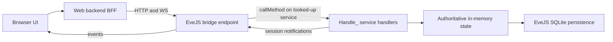

# EveJS Web Client: Scope and Roadmap

**Status:** Active — rewritten 2026-07-18. Supersedes the 2026-07-12 planning baseline and its Goal 0A–0F ladder. The old goal ladder, its execution records, and the deleted `docs/progress.md` live in this repository's git history (through commit `8dccc5d`); do not resurrect their retired decisions (section 11).

**Related repositories:** `eve.js` (game server, sole authority) and `evejs-web-poc` (browser client).

## 1. Goal

Reimplement as much of the EVE Online client as practical in a web browser, by making the browser drive the **same service calls the retail client makes**, dispatched to the **same EveJS handlers** the retail client hits. EveJS remains authoritative for all state, validation, movement, transactions, and persistence. The browser is an alternate client, not another simulation.

The first end-to-end playable milestone is a courier mission completed entirely in the browser (section 7). Combat and the rest of the client surface come later, as practical — deferred, not forbidden.

The UI stays text/data-driven and EVE-styled. Graphical space rendering is not a goal.

## 2. The retail call surface (the spec)

The decompiled retail client at `eve.js/tools/ClientCodeGrabber/Latest` (EVE release V24.01; ~12,500 Python modules present as `.py`/`.pyc`/`.pyj` triplets, ~269 MB) is the specification for what the browser should call. It is client source only — no server implementations and no captured network traffic.

Every server interaction in that client takes one of three forms:

- `sm.RemoteSvc('<service>').Method(*args, **kwargs)` — server-tier call. 157 distinct service names, ~884 literal call sites (e.g. `sm.RemoteSvc('charMgr').GetPublicInfo(charID)`, `sm.RemoteSvc('agentMgr')...`).
- `sm.ProxySvc('<service>').Method(...)` — proxy/session-tier call. 14 names (e.g. `machoNet`, `marketProxy`, `fleetProxy`).
- `sm.GetService('<name>')` — client-local service; never crosses the wire and is out of scope for the bridge.

The unit the bridge mirrors is the tuple **(service name, method name, positional args, keyword args)**.

There is no manifest file in the dump. The call surface is mined by grepping the `.py` sources for `sm\.RemoteSvc\('...'\)` / `sm\.ProxySvc\('...'\)` and reading the surrounding call sites. The transport internals (`carbon/common/script/sys/serviceManager.py`, `basesession.py`, `carbon/common/script/net/machoNet.py`, machoVersion 496) are background only — the browser does **not** speak machoNet.

## 3. How EveJS receives those calls

The retail path in `eve.js` (all under `server/src/`):

- TCP listener `network/tcp/index.js` (default port 26000) → machoNet handshake (`network/tcp/handshake.js`) → `ClientSession` → `network/packetDispatcher.js`.
- `CALL_REQ` packets resolve the service via `serviceManager.lookup(serviceName)` and run `service.callMethod(method, args, session, kwargs)` (`services/baseService.js`), which reflectively invokes **`Handle_<method>(args, session, kwargs)`**.
- ~1,500 unique `Handle_*` methods across ~200 service files under `services/` implement the game.

Two facts make a thin browser bridge practical:

1. **Sessions are duck-typed.** Handlers accept any object with the right fields (`characterID`/`charid`, `shipid`, location fields, `sendServiceNotification`, ...). The 500+ parity tests under `server/tests/` already invoke `Handle_*` directly with hand-built plain-object sessions and no socket.
2. **The dispatch seam is one call.** `serviceManager.lookup(service).callMethod(method, args, session, kwargs)` is the entire retail dispatch below the wire protocol. A bridge that packages browser requests into that call, with a browser-backed session object, exercises the same code path as a retail client.

Login and character selection on the retail path: `handshake.js` `_handleAuthentication` supports `config.devAutoCreateAccounts` (unknown accounts auto-created) and `config.devSkipPasswordValidation` (any password accepted) — the emulator's "who cares" login. A character comes online via `charService.js` `Handle_SelectCharacterID` → `applyCharacterToSession` (`characterState.js`) plus the character-control runtime, which also rejects retail login while a browser controls the character.

## 4. Architecture

Browser → web BFF (this repo) → thin EveJS bridge → the same `Handle_*` handlers the retail client hits.

The bridge is **not new server infrastructure**: it is the **existing** web gateway (`server/src/_secondary/express/evejsWebGateway.js`, HTTP/WS on :26002, already separate from the machoNet game listener on :26000) extended with a whitelisted `callMethod` invocation path — the only eve.js edit in the entire plan (landed in Goal R1).

Rules:

- **The bridge translates transport only.** It turns a browser request into `serviceManager.lookup(service).callMethod(method, args, session, kwargs)` against a browser-backed session, and turns handler results and `sendServiceNotification` traffic back into browser responses/events. It must not reimplement, fork, or "improve" game mechanics.
- **eve.js changes are restricted to bridge/interface endpoints** — concretely, the `_secondary/express` gateway files (plus their tests under `server/tests/`). Never modify game-mechanics code — the same server concurrently serves real retail clients, and their behavior must stay untouched.
- **A browser session is a real client session.** It carries the same duck-typed fields the parity tests use, participates in the same online-character and duplicate-login rules as a retail session, and receives handler notifications for forwarding. Long-term, EveJS's own session registry arbitrates control; the web-side lease machinery is stripped as that takes over (section 5).
- **The web process never reads or writes gameplay SQLite.** Read-only static reference data (names, icons, SDE JSON) may stay local to the web app.
- Retail `Handle_*` handlers expect retail argument shapes (positional tuples, kwargs, occasionally typed/coerced values) and may emit retail-shaped notifications. That is now the point, not a prohibition: the browser mirrors the retail call sites mined from the decompiled client, and the parity tests are the oracle for argument shapes.

## 5. Transitional state — today's app and the strip-down direction

What exists today (built under the previous roadmap, working, tested last on 2026-07-15):

- Eve-dark UI with four faction themes; web login (separate ignored password store); character list.
- Pages: overview, skill browser + drag/drop queue planner with save/save-paused, inventory grouped by location, read-only Jita 4-4 market, read-only industry jobs/blueprints, PI colony/extractor timers with extractor restart. Manual local icon scraper with manifest and rate limiting.
- Plumbing: versioned `/_evejs-web/v1` gateway (broad `/snapshot` route + `src/eveStore.js` table emulation), browser character-control leases, per-character idempotent commands with expected state versions, sequenced WebSocket events with replay/reconnect snapshots. All of that state is process-memory; a restart starts a new event epoch.

Direction: **strip toward the thin bridge.** Pages migrate one at a time to retail calls. As each migrates, delete its `eveStore` emulation path and its dependence on the broad snapshot. Retire the lease/idempotency/event machinery when the session-based bridge covers the same guarantees the way retail does. The v1 gateway remains until its last consumer is gone — but no new feature should be built on it.

**Status (goal R9b, 2026-07-19): that strip is done.** The client is bridge-only, and the emulation dashboards, the `/api/characters/*` route family, `/api/me`, the lease store, the character-event WebSocket proxy, the market client, and the per-character command path are all deleted. What survives of the v1 gateway is four reads the auth/health surface needs — `/account` and `/characters` (login), `/snapshot` (the character-ownership check in `POST /api/bridge/select`), and `/status` + `/health` (`GET /api/health`) — with `src/eveStore.js` slimmed to the normalizer over them. The one remaining consumer of the retired routes is the old vanilla `public/` app, which is superseded by the Svelte client at `/dist/` and is a candidate for removal.

### Web app tech stack (decided 2026-07-18)

The web app began as a slim read-only companion — a single ~2,600-line vanilla `public/app.js` plus hand-rolled WS/event/command layers, no types, no build. That fit the original scope; the client-surface ambition makes the browser a genuinely stateful client (a live session/space/inventory/journal mirror plus the client-side autopilot loop), so the stack moves. **This is web-app-only; eve.js is unaffected, and the Node + Express 5 + `ws` backend stays.**

- **TypeScript** — the project reproduces *typed* retail call/row contracts (`(service, method, args, kwargs)`, marshaled rowsets, flag constants, positional tuples). Types make the bridge compiler-checked; this is the highest-ROI change and the reason to move at all.
- **Vite** — a light build for TS + ES modules + the view layer.
- **A small reactive view layer** — Svelte 5 (recommended) or SolidJS; deliberately not a heavy SPA, to keep the UI text/data-driven and EVE-styled. The exact library is finalized by a spike on the first migrated page.
- **One client-state store** — a single source of truth mirroring the relevant EveJS session/space/inventory/journal state, with the UI **and** the browser autopilot loop as pure readers. It is fed by whatever event transport exists at the time: initially the legacy sequenced WS event stream, transitioning to bridge-forwarded session notifications (§9/G6) as the legacy machinery retires — the store's interface hides which. Keep it framework-agnostic (plain signals) so the view lib isn't load-bearing. This replaces the ad-hoc `eventClient`/`mutationScope` sprawl as pages migrate.

Applied **page-by-page on the R2–R6 rail** — each page rewrite to retail calls also moves it onto the new stack; no big-bang migration. R2 (re-scoped to the login → character select → station-entry spot test) was the proving ground and locked the view library: **Svelte 5** (the plain-signal store deliberately implements the Svelte store contract, so the view lib stays non-load-bearing).

## 6. Security posture (deliberate — do not "fix")

This is an emulator run in a trusted development environment.

- WAN hosting is expected: `0.0.0.0` binding is fine. EveJS already runs this way; **PlayerConnect** handles the WAN side and is out of scope for the web client.
- Login is emulator-style "who cares": the retail path already accepts any password via `devSkipPasswordValidation` / `devAutoCreateAccounts`. The web client should match — take a username and any password, log the character in. No real credential storage, no EveJS-backed auth project.
- Do not add auth hardening, token schemes, session-revocation work, or security-review gates, and do not block work on previously catalogued gaps (token-less loopback fallback, cookie flags, HMAC session lifetime). They are accepted by policy.

## 7. Milestone: courier mission in the browser

The milestone is complete only when a player can do all of this without opening the retail client:

1. Log in with an EveJS account and select an offline character.
2. View available agents and open an agent conversation.
3. Request and accept a courier mission.
4. See the mission briefing, cargo, pickup, destination, reward, and time bonus.
5. Move mission cargo into the active ship when required.
6. Verify the active ship has sufficient cargo capacity.
7. Take browser control of the character and start the route.
8. Undock and travel through every required gate using the browser-run (client-side) autopilot.
9. Dock at the destination station.
10. Deliver the required cargo.
11. Complete the mission through the agent interface.
12. Observe updated wallet, loyalty points, standings, inventory, and journal state.

The browser shows a compact live travel panel (current system, next system, target gate/station, travel state, remaining jumps, elapsed time, failure reason). No map or rendered scene.

Autopilot stays **client-side, in the browser** (decided 2026-07-18): retail autopilot is a client loop (`eve/client/script/parklife/autopilot.py` in the dump), and we keep it exactly that — the ~2-second decide-loop runs in the browser (the client surface) and issues the same atomic movement calls the retail client does (`beyonce.CmdWarpToStuffAutopilot` / `CmdFollowBall` / `CmdStargateJump` / `CmdDock`, `structureJumpBridgeMgr.CmdJumpThroughStructureStargate`). **EveJS gains no travel-job code**; its existing handlers stay authoritative for each atomic move, and route/pathfinding are client-side too (retail's `clientPathfinderService`). **Closing the browser tab is closing the client:** the loop stops, the ship completes whatever server-side command was last issued (a warp or approach in flight) and then sits — no further jumps — and browser control releases as its lease lapses. That is faithful retail behavior (identical to closing the real client mid-autopilot), not a failure mode; on tab close we issue no "stop", the ship simply stops receiving commands. The BFF is a **thin transport relay + session/lease holder; it must never autonomously drive movement when no client is connected** — doing so would make it a server-side bot, not a client. Movement authority stays server-side: the browser never simulates or predicts position, it only *sequences* the authoritative atomic calls, exactly as `autopilot.py` does (this supersedes the earlier "browser timers must never drive movement" phrasing — the browser sequences movement like retail, it just never simulates it). The browser may start, pause, resume, or abort the loop; travel pauses instead of guessing on any unsafe condition (invalid route, failed transition, lost control).

## 8. Roadmap

### Orchestrated execution

This project runs with a **master orchestrator session** and **worker sessions**:

1. The orchestrator writes each goal prompt and checks it into `docs/goal-prompts/`.
2. The operator hands the prompt to a fresh worker session.
3. The worker implements exactly that goal, leaves both repositories working, updates this table with status and evidence, and commits.
4. The operator returns to the orchestrator, which reviews the committed work against the prompt's definition of done before issuing the next goal.

**Every iteration commits its work** — including documentation-only iterations. No iteration ends with uncommitted changes. eve.js and web commits stay separate, both hashes are reported, and nothing is pushed unless separately requested.

| Goal | Status | Scope | Exit condition |
| --- | --- | --- | --- |
| R0 | Complete | Courier-path call inventory: mine the decompiled client for the (service, method, args) sequences behind login, character select, station UI, agent/courier flow, and travel | Done — [retail-call-inventory.md](retail-call-inventory.md) maps all 12 milestone steps to their retail calls with client file refs and EveJS coverage verdicts; key findings: autopilot/route are client-side browser work by design (G1/G2, reframed in the inventory's Direction section) and the courier remote-acceptance parity oracle fails 4 test-side assertions (G3 — own goal prompt; fix before R4) |
| R1 | Complete | Thin bridge endpoint (extend the existing `server/src/_secondary/express/evejsWebGateway.js` web interface; no game-mechanics change) + who-cares web login: browser-backed session creation and a whitelisted `(service, method, args, kwargs)` invocation path through `callMethod`. This is the only eve.js edit in the plan. | Done — gateway `POST /_evejs-web/v1/call` (eve.js `6de856fc`, gateway files + tests only): deny-by-default (service, method)-pair allowlist seeded with `charUnboundMgr.GetCharacterSelectionData` + `map.GetStationInfo`, gateway-materialized browser-backed session (JSON scalars in, `sendServiceNotification` captured into the response), refusals before any service lookup; web side: who-cares login (any/empty password; unknown username → 401 `UNKNOWN_EVEJS_ACCOUNT`), BFF `POST /api/bridge/call` + `eveGatewayClient.callMethod`, live character-selection bridge panel; contract documented in [bridge-wire-contract.md](bridge-wire-contract.md). Evidence: in-process end-to-end test (`eve.js server/tests/webGatewayServiceCall.test.js`, 8/8, drives the reference call and asserts off-allowlist/unknown refusals); live browser round-trip not available this session (no EveJS/web server was running; none started per policy) |
| R1b | Complete | Web stack scaffold (web repo only): TS + Vite build alongside the existing app, the framework-agnostic client-state store skeleton, and a browser-side TS `callMethod` client consuming R1's bridge route through a thin BFF proxy. No page migration, no view library. | Done — TS + Vite scaffold under `web/` (web repo only): `npm run build:web` (tsc typecheck + Vite build into git-ignored `public/dist/`, served at `/dist/` by the existing Express static setup; vanilla app untouched) and `npm run dev:web` (Vite dev server proxying `/api` to the BFF); plain-signal client-state store skeleton (`web/src/store/`: typed session/character/feed slices, subscribe/read API for pure readers, `FeedAdapter` seam hiding the event transport, in-memory adapter as the minimal proof); typed browser `callMethod` client (`web/src/bridge/`) with the reference call `charUnboundMgr.GetCharacterSelectionData` typed end to end incl. long/KeyVal decoding; 28 TS unit tests run natively by the same `npm test` (142/142, was 114/114; Node >= 22.18 for type stripping); scaffold smoke page at `/dist/`; TS-consumer + "how to add a page" notes appended to [bridge-wire-contract.md](bridge-wire-contract.md). View library deliberately not chosen (R2 spike) |
| R2 | Complete | **Spot-test milestone** (re-scoped 2026-07-18; character sheet/skills moved to a later goal): persistent browser-backed session in the gateway + `SelectCharacterID`, and the first page on the new stack (view-lib spike): login → character-selection UI → docked station panel (`GetStationInfo`/`GetStationItemBits`/`GetGuests`) | Done — **in-process end-to-end; live spot test pending operator** (README "Spot test (R2)"). eve.js `14e775aa` (gateway files + tests only): persistent-session store in the gateway runtime — `session/select` mints a live **registered** session (parity-test duck shape, all three notification surfaces captured) and dispatches the retail `SelectCharacterID` tuple through the allowlisted `callMethod` seam; `/call` takes an optional server-held `bridgeSessionID`; release + 30-min idle TTL run the same `sessionDisconnect` path as a retail socket close; refusals surface as typed `CALL_REFUSED` with the handler's own message; allowlist = exactly 5 pairs (R1's two + `charUnboundMgr.SelectCharacterID`, `stationSvc.GetStationItemBits`, `station.GetGuests`), deny-by-default proven still refusing before lookup. `server/tests/webGatewayPersistentSession.test.js` (8/8) proves fixture char online on a persistent session → docked reads + cross-session notification drain → refused-when-controlled → release/TTL → character offline. Web side: BFF `/api/bridge/select`/`release` keep the `bridgeSessionID` server-side in the cookie-session store (never in browser JS); **view lib locked: Svelte 5** (signal store doubles as Svelte stores); `/dist/` page = login → character list (typed `GetCharacterSelectionData`) → station panel (static station identity + `GetStationItemBits` + `GetGuests`; `GetStationInfo` issued faithfully, answers the retail cached-object envelope). Wire contract updated ("Persistent browser-backed sessions"); web tests 168/168 (was 142) |
| R3 | Complete | Station inventory and ship operations via the same services retail uses (`invbroker`, ship/station services) | Done — **in-process end-to-end; live spot test pending orchestrator** (README "Spot test (R3)"). Introduces the retail **bound-object (moniker/`MachoBindObject`) two-step** that R4/R5 reuse. eve.js `0682492e` (bound-object bridge) + `7f22a89d` (echo active shipID in select), gateway files + tests only: `POST /_evejs-web/v1/bound/bind` mints an opaque `boundHandle` (dispatches an allowlisted bind — `invbroker.GetInventory`/`GetInventoryFromId`/`MachoBindObject`, `ship.MachoBindObject` — registers the bound OID on the shared service manager as `packetDispatcher` does, and holds it on the persistent session); `POST /_evejs-web/v1/bound/call` resolves the handle on that session only, enforces deny-by-default on the bound `(service, method)` **before** resolving the OID, sets `currentBoundObjectID`, and dispatches through `callMethod`. Handles are confined to their session and never cross to the browser; released on session teardown. R3 allowlist adds 10 pairs (invbroker `MachoBindObject`/`GetInventory`/`GetInventoryFromId`/`List`/`Add`/`MultiMerge`/`StackAll`/`GetCapacity`, ship `MachoBindObject`/`Board`). `server/tests/webGatewayBoundObject.test.js` (7/7) proves bind→`List` returns the seeded items, `Add` relocates an item hangar→cargo (verified by a follow-up `List`), `GetCapacity` answers a real number, `StackAll` merges, `Board` makes a hangar ship active, a non-allowlisted bound method is refused before any dispatch, and foreign/unknown handles are typed errors. Web side: BFF holds the handles server-side keyed by web session (`/api/bridge/inventory` + `/inventory/move`/`/inventory/stack`/`/ship/board`), the browser addresses items/ships by game IDs only; Svelte **Inventory & Ship** page at `/dist/` (typed `inventoryShip` decoders + `inventory` store slice + flow), `Promise.allSettled` per-container reads. Wire contract + README updated; web tests 198/198 (was 170). |
| R4 | Complete | Agents and courier missions (`agentMgr` and mission services) | Done — **in-process end-to-end; live spot test pending orchestrator** (README "Spot test (R4)"). Reuses R3's bound-object bridge for `agentMgr` and adds the two gateway pieces the R3 de-risk found missing. eve.js `c803ce45` (gateway files + tests only): agentMgr allowlist (top-level `GetAgents`/`GetMyJournalDetails` + the bound two-step `MachoBindObject`/`DoAction`/`GetMissionBriefingInfo`/`GetMissionObjectiveInfo`/`GetMissionKeywords`/`GetAgentLocationWrap`/`GetStandingGainsForMission`); **deferred call responses** handled in BOTH dispatch seams — a gateway adapter drives `DoAction(decline)`'s `buildDeferredCallResponse` to completion (the browser session has no `sendClientCallRequest`, so it degrades to the handler's own no-client fallback) and returns the real result, or refuses a genuinely-blocking deferred with typed `CALL_DEFERRED_UNSUPPORTED` (501) instead of a broken object; **`afterCallResponse`** invoked after every successful non-deferred dispatch (try/catch, mirroring `packetDispatcher.js` — docked-fitting bootstrap / session-change flush / safe-logoff; no-op on R3/R4 methods). `server/tests/webGatewayAgentMgr.test.js` (6/6) proves bind-agent → `DoAction(None)` opens a conversation → **in-person accept CREATES the courier mission** (runtime record + bridged `GetMyJournalDetails`), bound briefing reads return the courier cargo, deny-by-default refuses a non-allowlisted agentMgr bound method before OID resolution, the decline deferred is driven to completion (real result + side effect), and the still-pending deferred is a typed refusal. Web side: BFF holds the agent bound handle server-side (`/api/bridge/agents`, `/api/bridge/agents/:id/action`, `/api/bridge/agents/:id/briefing`, `/api/bridge/journal`), the browser addresses agents by game ID; Svelte **Agents & Missions** page at `/dist/` (typed `agents.ts` decoders with `unwrapLong`/decimal-string ISK+FILETIME + `agents` store slice + flow), `Promise.allSettled` briefing reads + session-loss unwind. Wire contract + README updated; web tests 214/214 (was 201). |
| R5a | Complete | **Space bridge + manually-stepped movement** (the R5 foundation): bridge the atomic space calls on the persistent session and make the browser-backed session participate in space across undock; a Flight page that undocks, warps to a chosen gate, jumps, and docks by explicit buttons (no decide-loop). | Done — **in-process end-to-end; live spot test pending orchestrator** (README "Spot test (R5a)"). eve.js `de8bab1e` (gateway files + tests only): allowlist adds nine deny-by-default pairs — `ship.Undock`, the beyonce remote-park bound two-step (`MachoBindObject` + `CmdWarpToStuffAutopilot`/`CmdWarpToStuff`/`CmdSetSpeedFraction`/`CmdFollowBall`/`CmdStargateJump`/`CmdDock`), and `structureJumpBridgeMgr.CmdJumpThroughStructureStargate`; new read-only `POST /session/flight-status` snapshots the held session's location + ship movement mode and drains the notification backlog. **The persistent browser-backed session participates in space across undock with no new session-carry code** — `Handle_Undock`→`undockSession(session)` attaches it to a scene exactly like the space parity tests' plain-object session (same duck-typed fields + notification surfaces + duck socket); destiny/graphics traffic is gated on a live socket + `initialStateSent`, so it silently no-ops while location/movement still transition authoritatively. `server/tests/webGatewaySpaceBridge.test.js` (5/5) proves — against real world data — undock enters space, a warp advances ship state, a stargate jump transitions the solar system, `CmdDock` returns to a station, and deny-by-default refuses a non-allowlisted beyonce/ship method before dispatch. Web side (web `21c3fc0`): BFF holds the beyonce bound park handle server-side keyed by system (`/api/bridge/flight/status`+`/undock`/`/warp`/`/jump`/`/dock`), `eveGatewayClient.readFlightStatus`; Svelte **Flight** page at `/dist/` (typed `flight.ts` `unwrapLong`-aware decoder + `flight` store slice + flow), movement refusals surfaced as the handler's own reason. Wire contract + README updated; web tests 235/235 (was 214). Footprint = `_secondary/express` + gateway tests; baselines non-regressed (manifest 3/3, agent-parity 6/6, all six gateway files green). |
| R5b | Complete | The **client-side (browser) autopilot decide-loop** on top of R5a: the browser runs `autopilot.py`'s ~2-second loop, sequencing the R5a atomic calls; browser owns route + pathfinding (client-side `clientPathfinderService`); a multi-jump travel panel. Closing the tab stops autopilot (client closed), like retail. | Done — **in-process/simulated end-to-end; live spot test pending orchestrator** (README "Spot test (R5b)"). **Web-only; eve.js untouched** (R5a's allowlist + flight-status already cover every atomic move). Client-side **route solver** (`web/src/nav/routeSolver.ts`): BFS-shortest route over a system-adjacency graph built from the gameStore `stargates` table — each stargate is one directed edge `[fromSystemID, toSystemID, fromGateID (warp+jump source = itemID), toGateID (destinationID)]`, exactly the pair `CmdStargateJump` wants; served as read-only static reference data by `src/staticData.js` (`getSolarSystemGraph`, 5268 gate-connected systems / 13978 edges) via new BFF routes `GET /api/map/graph` + `/api/map/resolve/:id` (station/system→system) — NOT a gateway call, NOT a server travel job (G2). Browser **decide-loop** (`web/src/nav/autopilotLoop.ts`): a port of `autopilot.py Update` that reads flight-status each ~2 s tick and issues one atomic move (undock/warp/jump/dock), replicating the verified **approach-then-redock** (re-issue `CmdDock` through the FOLLOW approach until docked), pausing (not guessing) on any unsafe refusal, and issuing **nothing to the bridge after abort/tab-close**. Travel panel `web/src/ui/Travel.svelte` (Start/Pause/Resume/Abort + live current/next system, target, remaining jumps, elapsed time, failure) on the new `travel` store slice, served at `/dist/`. Tests 236→264: route solver (8; fixture multi-hop + same-system/unreachable/adjacent), decide-loop simulation (10; docked→undock→warp→jump→approach→dock timeline, approach-then-redock, pause-on-scramble, abort issues nothing after, session-loss), travel flow (5), BFF map routes (5). Wire contract + README updated; not pushed. |
| R6 | Complete | Courier milestone end to end: deliver + Complete (the last new gameplay) + the Step-12 reward readout, plus the agent-list usability fix (re-scoped 2026-07-19 — legacy cleanup moved to R7) | Done — **in-process end-to-end; live spot test pending orchestrator** (README "Spot test (R6)"). eve.js `fdc210ea` (gateway files + tests only): the allowlist adds exactly the three Step-12 read pairs `account.GetCashBalance` / `LPSvc.GetAllMyCharacterWalletLPBalances` / `standingMgr.GetCharStandings` (the fourth Step-12 read `agentMgr.GetMyJournalDetails` and Complete itself `agentMgr.DoAction` were already allowlisted, so R6 adds **no** completion pair); `server/tests/webGatewayCourierComplete.test.js` (2/2) proves the capstone through the gateway — in-person accept → deliver the package to the dropoff → `DoAction(Complete)` actually completes (runtime record cleared, package consumed) and the Step-12 reads reflect the payout (wallet grows, an LP balance for the agent corp appears, standing toward the corp grows, the mission leaves the journal), plus deny-by-default re-proven for non-allowlisted account/LPSvc/standingMgr siblings. Web side (web `8ab4b2b`): the **agent-list usability fix** — a courier-only toggle + level + text filter with a capped render (default courier-only, first 60 shown with a match count) so Jita 4-4's ~1,700 agents (882 couriers) stay responsive (pure store/view change); the mission briefing's **Load package into ship** (R3 inventory move) + **Set autopilot to dropoff** (R5b `startRoute`) controls; **Complete** (the existing conversation action) now also pulls the reward readout; the Step-12 wallet/LP/standings decoder (`web/src/bridge/rewards.ts`), `rewards` slice, `app/flow.ts` `loadRewards`/`loadPackageIntoShip`/`setAutopilotToDropoff`, and the BFF `GET /api/bridge/rewards` (independent `Promise.allSettled` reads, deny-by-default). Wire contract + README updated; web tests 280/280 (was 267); eve.js baselines non-regressed (manifest 3/3, agent-parity 6/6, seven gateway files green). Footprint = `_secondary/express` + gateway tests. **The 12-step milestone is now buildable end to end in the browser.** Legacy cleanup (broad snapshot, eveStore emulation, redundant lease/command machinery) is R7. |
| R6a | Complete | Agent Finder: list agents from static reference data, sort by jumps from the current system, and set the R5b autopilot to a chosen agent's station — so a courier agent can be found and traveled to when the per-station roster is empty (`GetAgents` returns 0 for a re-selected docked character). Web-only. | Done — **in-process/simulated; live spot test pending orchestrator** (README "Spot test (R6a)"). **Web-only; eve.js untouched** (static reference data + UI reusing existing bridge routes). `src/staticData.js` `findAgents({kind,level,limit})` reads `agentAuthority/data.json` (`agentsByID`, 10,941 agents) — filters by kind (default courier) + optional level, sorts `(level, agentID)`, caps (default 500 / max 5000), resolves station/system **names** server-side. New read-only BFF route `GET /api/agents/find` (web-login only, like `/api/map/graph` — NOT a gateway call) → `{ ok, source:"static-data", kind, level, total, capped, limit, count, agents }`. Client-side `distancesFrom(graph, originSystemID)` (`web/src/nav/routeSolver.ts`): a **single BFS** over the already-loaded gate graph → jumps to every system (origin=0, unreachable omitted, invalid origin → empty map) — never a `solveRoute` per agent. New `finder` store slice + Svelte **Agent Finder** tab (`web/src/ui/AgentFinder.svelte`): kind/level server-side filters, client-side text search + nearest-first sort + capped render (60 rows; name/level/kind/station/system/jumps columns), a per-row **Set destination** → R5b `startRoute(agent.stationID)` + the current-target readout, then points the user at the Travel tab. Tests 280→297: `distancesFrom` (4), staticData read/filter + `/api/agents/find` route (7, `test/agentFinder.test.js`), finder flow + sort (6, `web/src/app/finderFlow.test.ts`). `build:web` clean; wire contract + README updated; not pushed. **R6b corrects the finder classification + adds the dock refresh (see below).** |
| R6b | Complete | Two live-test fixes on top of R6a, web-only. **(1)** The finder mislabeled Paragon/special agents as courier (IRIS - Jita 3020034 showed as an L1 courier). **(2)** The Agents & Missions / Station / Inventory panels went stale after the autopilot docked at a new station until a full page reload. | Done — **in-process/simulated; live spot test pending orchestrator**. **Web-only; eve.js untouched.** **Fix 1 (classification):** `staticData.findAgents` now classifies by `(divisionID, agentTypeID)` — the retail agent-division scheme — not the raw `missionKind` the static export also stamps on special agents. courier = Distribution div 22 + basic type 2 (3,725 real agents, down from 4,421 by raw missionKind); encounter = Security div 24 / type 2; mining = Mining div 23 / type 2; research = R&D div 18 / type 4. `all` is the union of these; an unclassified kind matches nothing. Paragon (div 37 / type 13, incl. IRIS - Jita 3020034), off-division epic (div 25 / type 12), and career/storyline/event placeholders are all excluded from courier (verified against the 10,941-agent export). `divisionID`/`agentTypeID` are carried through the summary. **Fix 2 (dock refresh):** every flight-status snapshot (manual step / autopilot tick / route-origin read) funnels through one `observeFlightStatus` in `web/src/app/flow.ts`; on a docked-**station** change it applies a new `station/relocated` store event (re-points online `stationID`/`solarSystemID` + static station identity), then re-runs `refreshStationPanel` (always) and `loadAgents`/`loadInventory` (if their tab loaded) — guarded against redundant same-station refetches; a lost session still unwinds. New read-only BFF route `GET /api/map/station/:id` (→ `StationStatic`, like `/api/map/resolve`) supplies the new station's identity. AgentsMissions `onMount` already re-fetches on tab open. Tests 297→307: `test/agentFinder.test.js` +2 (courier lists only div-22/type-2, IRIS - Jita 3020034 excluded; encounter/mining/research by division+type), `test/bridgeMapGraph.test.js` +3 (`/api/map/station/:id`), new `web/src/app/dockRefreshFlow.test.ts` (5: manual dock re-points identity, re-fetches loaded agents/inventory, leaves unopened tabs alone, tab-open re-fetch, same-station guard). `build:web` clean; wire contract + README updated; not pushed. **Known live gap flagged to the orchestrator: the BFF's held-session `stationID` (used to filter `GetAgents` and bind the hangar) is not updated on dock, so live Agents/Inventory re-fetches would still target the select-time station until that is synced — folds into the separate `GetAgents` investigation.** |
| R7 | Complete | Full **Local + Corp chat** for the browser client (presence + read + send): the character appears in Local and Corp member lists, and can read and send in both from a Chat panel. The one goal with an operator-authorized broader eve.js footprint (gateway + a corp chat-gateway helper), core chat mechanics untouched. | Done — **in-process end-to-end; live spot test pending orchestrator** (README "Spot test (R7)"). eve.js `9cd26808` (Local: gateway + helper + local test) + `edec6af4` (Corp: in-process proof): a new **chat-gateway helper** `server/src/_secondary/express/gatewayServices/webChatGatewayService.js` (a plain helper the web runtime calls — NOT a protobuf gateway service, not in the gatewayServices index) gives the persistent browser-backed session Local + Corp presence/read/send by only *calling* existing chat surfaces. Chat delivery bypasses the notification drain, so **READ is a backlog poll** (`chatRuntime.getChannelBacklog`), not an RPC. **Local:** the gateway joins Local on select (`chatHub.joinLocalChannel`) and moves the room on a system change (`chatHub.moveLocalSession`) — the browser session's `sendSessionChange` is a capture stub, so retail auto-sync never fires; presence is derived live from the session registry (`getVisibleLocalSessions`), send is `broadcastLocalMessage`. **Corp** is XMPP-only in retail, so R7 adds a **session-derived corp path mirroring Local**: the roster is enumerated from `sessionRegistry.getSessions()` by `corporationID`, and a corp broadcast writes to the `corp_<id>` backlog (the same core append Local uses) — NOT an XMPP send; `ensureCorpChannel` only ensures the record. Gateway runtime `readChat`/`sendChat` + routes `POST /_evejs-web/v1/chat/read` + `/chat/send` (drain-on-read, typed CALL_INVALID/CALL_REFUSED). `server/tests/webGatewayLocalChat.test.js` (5) + `webGatewayCorpChat.test.js` (4) prove presence in `getVisibleLocalSessions` + the corp roster (session-derived by corporationID: corp-mate in, outsider out), send→backlog→read for both, a same-system pilot seeing the char, a system change moving the room, and a corp-less character refused. Web side (web `ec3c072`): BFF `GET /api/bridge/chat/:channel` + `POST /api/bridge/chat/:channel/send` (held-session gated, drop on SESSION_NOT_FOUND); a `chat` store slice (Local/Corp channel state + active tab), decoder `web/src/bridge/chat.ts`, flow `loadChat`/`sendChatMessage`/`setChatChannel`, and a **Chat** Svelte tab (Local/Corp sub-channels, roster, message list, send box) that polls the open channel every 4s and stops on close. Tests: web 308→329 (`test/bridgeChat.test.js` 8, `web/src/bridge/chat.test.ts` 7, `web/src/app/chatFlow.test.ts` 6); `build:web` clean. eve.js baselines non-regressed (manifest 3/3, agent-parity 6/6, gateway suites 7→9 green). Footprint = `_secondary/express` (gateway runtime/routes + the corp chat-gateway helper) + gateway tests; core chat mechanics untouched. Wire contract + README updated; not pushed. |

| R7b | Complete | **Bridge session-derived chat presence into XMPP (retail sees the web player)** — the one goal with an operator-authorized **core-chat** eve.js footprint (`xmppStubServer` + a minimal `chatHub`/gateway-helper hook), core delivery internals untouched. Retail renders its Local/Corp roster from XMPP MUC presence, which only exists for a live XMPP socket; the socketless browser session emits none, so retail never saw it (Local or Corp), though the web player saw everyone. | Done — **in-process proof; live retail-sees-web spot test pending an operator EveJS restart.** eve.js `0d60477a` (xmppStubServer + webChatGatewayService + a focused in-process test; core chat delivery untouched; parity agents' work untouched): `xmppStubServer` now subscribes to `chatRuntime.runtimeEmitter` `local-join/leave/message` and, for a **socketless** member/author (no `connectedClient`), injects the synthetic MUC presence/message to the room's XMPP occupants (reusing `buildRoomPresenceXml`/`deliverRoomMessage`) — so joins/leaves/**moves** all propagate; a **retail-join roster seam** in `handleJoinPresence` seeds a joining retail client's opening Local/Corp roster with socketless members. **Corp** reconciles the gateway helper's private `corpChatEmitter` (`syncPresence` emits `corp-join`/`corp-leave` on a corp transition, `broadcastCorpMessage` emits `corp-message`; `xmppStubServer.subscribeCorpChatBridge` observes it — cycle-free). **Guardrails:** every handler dedups by characterID and returns before any side effect for a character that holds a live XMPP client (retail machinery covers those), so **retail↔retail rooms are byte-for-byte unchanged**; delayed-local (wormhole/Pochven/nolocal) stays hidden-until-you-speak (the runtime only emits a presence event for them on a speak). `server/tests/xmppSessionDerivedPresenceBridge.test.js` (11) proves — against a simulated retail XMPP occupant — Local join presence + roster seam + message + disconnect (unavailable + admin-leave) + system-change move, the same four for Corp, a **retail-only regression** (exactly one presence, exactly one message copy — no double), and the delayed-room guardrail. eve.js baselines non-regressed (manifest 3/3, agent-parity 6/6, the 9 gateway suites + xmppStubServerParity/chatHubLocalPresence/presenceReconciler/localChatGateway/fleetChat/chatHubSystemMessageRouting/xmppChatMgr all green). Web repo unchanged except **docs** (this roadmap row + the bridge-wire-contract presence-bridge note); no web client/test change, so web tests are unaffected (341/341). eve.js footprint = `xmppStubServer.js` + `webChatGatewayService.js` (the gateway helper) + the new test; `chatHub.js`/`chatRuntime.js` delivery internals untouched. Committed separately (eve.js `0d60477a`, web docs commit); not pushed. |

| R7a | Complete | Two Travel/Flight usability fixes from live testing, web-only. **(1)** The Flight tab showed bare numeric IDs (`In space · system 30000140`, `Docked · station 60003760`, `Solar system: 30000140`) a player can't read. **(2)** You could only set a destination through the Agent Finder / courier flow (Travel's "Start route" was a raw numeric-ID input), so a player who doesn't know EVE IDs couldn't pilot anywhere on their own. | Done — **in-process/simulated end-to-end; live spot test pending orchestrator** (README "Spot test (R7a)"). **Web-only; eve.js untouched.** **Fix 1 (names not IDs):** the Flight readout resolves the current system / station / structure ID → **name** through the existing read-only `/api/map/resolve/:id`, cached client-side in `app/flow.ts` (a `Map` seeded once per unique ID; a definitive `kind:"unknown"` like a player structure is cached too, a transient failure is not) so the flight-status poll doesn't refetch. Resolution funnels through the single `observeFlightStatus` choke point (fire-and-forget, never blocks the autopilot loop) and pushes a new `flight/location` store event tagged with the IDs it resolved for; the reducer applies each name only while the current status still carries that ID (a stale resolve can't mislabel a moved ship) and clears a name on any ID change (falls back to the raw ID). `Flight.svelte` now shows `Docked · Jita IV - ...` and `Solar system: Jita (30000142)`. **Fix 2 (set a destination by name):** new read-only BFF route `GET /api/map/find?q=<text>[&kind=system|station][&limit=N]` (`src/staticData.js` `findMapLocations`) searches the static solar-system + station tables by name, ranks by match quality (exact → prefix → substring, then shorter/alphabetical) so "Jita" surfaces the **Jita system (30000142)** ahead of "Jita IV - ..." stations, ignores a <2-char query, and caps server-side (default 50 / max 200) — mirroring `/api/agents/find`, NOT a gateway call. `Travel.svelte` gains a **Set destination** name search (`flow.searchDestinations` → `api.findMapLocations`, annotating each match with jumps-away via the already-loaded graph `distancesFrom`, like the finder) → a results list → **Set destination** reuses the R5b autopilot `startRoute(id)`; the raw-ID input stays as a **Start route by ID** fallback. Tests 329→341: `test/bridgeMapFind.test.js` (8: real-data name search + rank/cap/kind + the `/api/map/find` route shape/cap/auth against a fixture), `web/src/app/flightFlow.test.ts` +1 (status resolves system+station names, cached — no refetch on a second poll), `web/src/app/travelFlow.test.ts` +3 (search → jumps annotation, too-short query no-request, Set-destination via startRoute). In-process proof against the real gameStore tables (search "Jita" → system 30000142 first + 18 Jita stations; `/api/map/resolve` returns "Jita" / "Jita IV - Moon 4 - Caldari Navy Assembly Plant"; auth-gated). `build:web` clean; wire contract + README updated; not pushed. Live end-to-end deferred: the orchestrator's running :26500 web app predates this route (plain `node`, not watching), and per policy no server was restarted. |

| R7c | Complete | **Names everywhere** — replace raw numeric IDs with resolved names across the whole UI (ships/items → type names, agents → agent names, corps/alliances/factions/characters → names, locations → station/system names), keeping the ID only as a secondary detail or unresolved-fallback. High-value display pass from operator feedback. Web-only. | Done — **in-process/unit end-to-end; live spot test pending orchestrator** (README "Spot test (R7c)"). **Web-only; eve.js untouched** (the resolvers read the existing read-only gameStore reference tables). **Resolution mechanism:** a new batch BFF route `POST /api/names` (`src/staticData.js` `resolveNames`) takes `{ items:[{kind,id}] }` — `kind ∈ type|typeGroup|typeCategory|category|corporation|alliance|faction|character|agent|station|system|region|owner` — and returns `{ names:{ "kind:id": name|null } }` over the existing getters plus three new ones (`getFactionName` from `factions.records`, `getCharacterName` from the characterID-keyed characters table, `getAgentName` from the agentAuthority `ownerName`); `owner` resolves an unknown-entity-type id (a station owner / standings `fromID`) by trying corp→faction→character→alliance. Every item is echoed (a name, or **null** for a definitive "unknown") and the batch is capped at 500 — read-only static reference data mirroring `/api/map/find` and `/api/agents/find`, NOT a gateway/bridge call. A generalized **client name cache** in `web/src/app/flow.ts` (`requestNames`, extending R7a's flight-name `Map`): components ask for names by `(kind,id)`; the cache batches every unresolved ref raised in one microtask into a single POST, caches each result (including definitive nulls, so no refetch), pushes them into a new `names` store slice (`names/resolved` event) for pure-reader components, and does **not** cache a transient failure (so it can retry). Fire-and-forget — never throws, never blocks interaction; the UI shows the raw ID until the name lands (`web/src/store/names.ts` `displayName`/`nameKey`). **Fixed sites:** InventoryShip (row typeID → type name, categoryID → category name, active-ship line → ship type name); Flight (Active ship → ship type name via inventory cross-ref); AgentsMissions (agent lists/conversation/journal → agent names, briefing cargo type → type name, pickup/destination → station + system names, LP corp → corp name, standings `fromID` → owner name); StationPanel (services owner/type → corp-or-faction/type names, guests → character/corp/alliance names); Travel & AgentFinder (remaining `System {id}`/`station {id}` fallbacks now attempt the name cache first, origin-system note resolved). Chat already shows live-roster names (the preferred source — no static lookup wired). Tests 341→355: `test/bridgeNames.test.js` (8: real-data `resolveNames` across kinds/dedup/unknown-null/cap + the `/api/names` route shape/unknown/empty/auth against a fixture), `web/src/app/namesFlow.test.ts` (6: one-round-trip batching, cache-no-refetch, definitive-unknown-no-refetch, transient-failure-retry, never-throws, and a previously-ID Type/Cat cell now rendering the name through the flow→store→`displayName` pipeline). In-process proof against the real gameStore tables (`POST /api/names` batch-resolves type 34→"Tritanium", station 60003760, faction 500001→"Caldari State", unknown→null; auth-gated). `build:web` clean; wire contract + README updated; not pushed. Completeness sweep clean: remaining ID-only fields are justified (mission `title` = a localization message id with no name table; route-hop warp/jump **gate** IDs = a movement-mechanic detail with no friendly name; services **operationID** = raw retail tuple, no operation-name resolver; the labeled **Station ID** reference row, whose name is already the panel header). Live end-to-end deferred: the running :26500 web app predates the `/api/names` route (plain `node`, not watching), and per policy no server was restarted. |

| R7d | Complete | **Zero visible IDs** — the strict follow-up to R7c: a player never sees a raw numeric game ID rendered as data. R7c had kept IDs as a "secondary detail"; the operator wants names only. Every station/type/corp/alliance/character/agent/ship/item/system reads as a **name**; a nameless ID with no player value is **removed** (field/row/column). Web-only. | Done — **in-process/unit end-to-end; live spot test pending orchestrator**. **Web-only; eve.js untouched.** New pure reader `resolvedName(resolved, kind, id, fallback="—")` in `web/src/store/names.ts` — like `displayName` but it **never** falls back to the raw ID (returns the non-ID `fallback` until the name lands or when it is a definitive unknown); every rendered name cell moved onto it. **Per-component:** StationPanel — removed the `Station ID`, `Station item ID`, and `Operation ID` rows (nameless, no player value); dropped the `(typeID …)` / `(ID …)` tails on the identity Station type + Solar system; Owner and services Station type now name-only (`1000002 · CBD…` → `CBD Corporation`); guests show character/corp/alliance names only. InventoryShip — **removed the `Item` column** (the raw itemID; columns now Type / Cat / Qty / Action) and the active-ship line reads `Algos` not `Algos (ship 9988…)`; Type/Cat via `resolvedName`. Flight — Active ship `Algos` (no `(9988…)`), Solar system `Muvolailen` (no `(30002780)`), location fallbacks name-only. Chat — channel header resolves `local_<systemID>`/`corp_<corpID>` to the **system/corp name** (`Local · Muvolailen`, `Corp · <name>`), falling back to bare `Local`/`Corp` (never the raw room string). Travel — current/next/destination/route-hop systems name-only (dropped the `(id)` tails and the `· station <id>`); **removed the raw warp/jump gate-ID detail** on each route hop (movement internal, no player value). AgentFinder/AgentsMissions — station/system/agent/corp/owner fallbacks name-only; **dropped the mission `title <id>`** (a localization message id with no name and no player value). Also removed every `title={String(id)}` hover tooltip (they exposed the raw ID on hover). IDs remain ONLY in interactive inputs/placeholders, `{#each}` keys, onclick args, and client-side search haystacks — never rendered as data. Exhaustive grep sweep of all `web/src/ui/*.svelte` for `(ID`/`(typeID`/`(ship`/`system ${`/`station ${`/`corp ${`/`agent ${`/`type ${`/`local_`/`corp_`/`title=`/`<td>{…ID}` returns zero rendered IDs (only comments, onclick args, and logic comparisons remain). Tests 355→358: `web/src/app/namesFlow.test.ts` +3 R7d guards (`resolvedName` renders the name once resolved and never the raw ID; stays on the fallback for a definitive unknown; returns the fallback for null/zero/invalid ids). `build:web` clean; not pushed. Left the developer-facing method-name blurbs at the top of each tab alone (a separate decision, per the goal). |

| R8 | Complete | **Adopt Tailwind CSS + make every tab responsive (phone → desktop)** — the desktop-shaped UI broke on phones (wide tables, a fixed tab row, small touch targets). Adopt Tailwind and make every current tab mobile-first responsive from ~360px up to desktop, without changing behavior/data or reintroducing any visible numeric ID (R7d must hold). Web-only. | Done — **build + browser-verified at 360/768/1280px; presentation only**. **Web-only; eve.js untouched** (no `flow.ts`/`api.ts`/store/decoder/bridge change — markup + CSS + build wiring only). **Tailwind v4.3.3 via the first-party `@tailwindcss/vite` plugin (4.3.3), CSS-first:** `web/src/styles.css` does `@import "tailwindcss"` and is imported from `main.ts`, so `npm run build:web` emits the compiled bundle (`public/dist/assets/index-*.css`, 0.64 kB → 12.63 kB) and the built `index.html` links it; chose v4 + the Vite plugin over v3 + PostCSS as the lower-config modern path (no `tailwind.config.js`/`postcss.config.js`; palette tokens in an `@theme` block). The app's Eve-dark palette was lifted out of the old inline `<style>` in `web/index.html` into `@theme` tokens + `@layer base`/`@layer components` (so they win over preflight); the inline style is trimmed to a minimal anti-flash background; a `*.css` module shim keeps `tsc` green; viewport meta already present. **Responsive patterns:** (1) tab nav wraps to multiple rows on a phone (`flex-wrap`), each tab a ≥40px touch target, active tab highlighted; (2) **tables → cards**: every record table (Station guests, Inventory hangar/cargo, Agent Finder agents, Travel search results) gets class `reflow` + a `data-label` on each `<td>` and reflows to stacked labelled cards at ≤640px (`td::before { content: attr(data-label) }`, thead clipped) while staying a table on wider screens, each wrapped in an `overflow-x-auto` box so a wide table scrolls in its own container and the page never scrolls sideways; key/value status tables stay as-is; (3) control rows (Flight warp/jump/dock, Travel search/start-route/route, Inventory quantity, Agents conversation + briefing actions, Station actions) get class `controls` — labelled fields stack and inputs/buttons go full-width on mobile; (4) fluid `#app` container capped at 64rem and centred on desktop for readable line length. **Width checks (a static harness of the compiled CSS + representative markup, driven in a browser at each viewport):** 360px — `documentScrollWidth == 360`, zero elements wider than viewport, nav wrapped (40px buttons), reflow rows `display:block` cards with `data-label` shown, action buttons + control inputs full-width; 768px — reflow rows back to `table-row`, thead visible, card labels `none`, no overflow; 1280px — `#app` capped at 1024px + centred, nav single row, no overflow. **ID sweep re-proof (R7d holds):** re-ran the exhaustive grep over `web/src/ui/*.svelte` for `(ID`/`(typeID`/`(ship`/`system ${`/`station ${`/`corp ${`/`agent ${`/`type ${`/`local_`/`corp_`/`title=`/`<td>{…ID}` — every hit is JS logic (`if (id === null)`), a key/onclick arg, a name-resolver argument, or a comment; **zero raw numeric IDs render as data**; the 22 added `data-label` values are words or empty, none numeric. Baseline → final `npm test` unchanged at **358/358**; `tsc` + `build:web` clean. Committed `8c777ce` (Tailwind setup: `package.json`/`package-lock.json`/`vite.config.ts`/`styles.css`/`main.ts`/`svelte-files.d.ts`/`index.html`) + the responsive restyle commit (the 6 tab components) + this docs update; not pushed. |

| R9a | Complete | **Remove the developer-facing blurbs from the player UI** (Phase 1 cleanup, half A) — every tab opened with a paragraph describing the *bridge implementation* to a **player** (bound-object handles, Monikers, the BFF, the notification drain, goal codenames, and named retail service methods). Delete that prose, leaving each tab with either nothing or one short plain-language sentence. Web-only; presentation text only. | Done — **`web/src/ui/*.svelte` only; no `src/`, no eve.js, no behavior/data-flow change** (no handler, store, decoder or bridge call touched; markup structure preserved so R8 responsiveness holds). **Blurbs deleted outright** (tab is self-evident): Inventory & Ship (the "Bound-object bridge … invbroker (GetInventory / GetInventoryFromId); List / Add / StackAll / Board dispatch on those handles" paragraph) and Chat (the "runs on the BFF … chat delivery bypasses the notification drain, so this panel polls" paragraph). **Blurbs replaced with one player-facing sentence:** Travel — "Set a destination and the autopilot flies you there. Closing this tab stops the autopilot — the ship finishes its last move and waits." (was the R5b decide-loop / R5a atomic-move / retail-client paragraph); Agent Finder — "Find an agent and set your destination." (was the agentAuthority-table / per-station-roster paragraph); Agents & Missions — "Talk to an agent, accept a courier, deliver the package, then complete the mission to collect the reward." (was the `agentMgr` / `Moniker('agentMgr', agentID)` / DoAction paragraph); Flight — "Fly manually, one step at a time: undock, warp, jump, and dock. Use the Travel tab to let the autopilot do it for you." (was the R5a / `beyonce` remote-park / `Moniker('beyonce', solarSystemID)` / Cmd\* paragraph). **Headings cleaned of retail method names:** "Station services — stationSvc.GetStationItemBits" → "Station services"; "Guests — station.GetGuests" → "Guests"; "Reward & wallet (post-completion)" → "Reward & wallet". **Embedded asides removed/reworded:** the `map.GetStationInfo` note ("answered with the retail cached-object envelope (rowset rides the object cache)") deleted entirely; Flight "The system transition completes after a short handoff…" → "Refresh flight status to see the new system."; Flight docking "…the handler refuses with a docking-approach reason" → "Docking needs the ship to be in range — warp closer first if it is too far."; character-select "…on a live EveJS session (the same rules as the retail client…)" → "Select a character to bring it online — a character already in use elsewhere cannot be selected."; login "the password is not checked (dev emulator)" → "Sign in with your EveJS account name — any password works."; Station "— live EveJS session." dropped; Agent Finder "The dataset was capped server-side" → "Pick a level to narrow the list."; error strings de-jargoned ("Hangar read failed" → "The hangar could not be loaded", "Some docked reads failed (panel shows what loaded)" → "Some station details could not be loaded", "Some reward reads failed" → "Some reward details could not be loaded", "Loading services row…" → "Loading station services…"); the agent-roster search placeholder "agent id / type" → "mission type or level". Code comments left as-is (explicitly allowed — this pass is about **rendered** text). **Jargon proof:** a template-only sweep (script/style blocks + HTML comments blanked out, so only rendered markup is searched) of all ten `web/src/ui/*.svelte` for `Moniker|BFF|bound|bridge|gateway|invbroker|agentMgr|beyonce|stationSvc|GetStationItemBits|GetGuests|rowset|notification drain|R5a|R5b|R7|decide-loop|retail client` returns **0 hits in every component**; the only remaining source hits are `//` comments and code identifiers (`BridgeCallError`, the `../bridge/*.ts` imports, `isBoardableShip`). **R7d re-proof:** the same sweep re-ran the zero-visible-ID patterns (`(ID`/`(typeID`/`ID {`/`{…ID}`/`system ${`/`station ${`/`corp ${`/`agent ${`/`type ${`/`local_`/`corp_`/`<td>{…ID}`/`<dd>{…ID}`) over rendered text positions only (attribute values and `{#…}` block directives excluded, since neither emits a value) — **0 rendered numeric IDs in every component**; IDs survive only in `{#each}` keys, onclick args, `bind:value` inputs, and logic comparisons, exactly as R7d left them. Baseline → final `npm test` unchanged at **358/358**; `tsc` + `build:web` clean. Committed; not pushed. |

| R9b | Complete | **Retire the legacy v1-gateway / eveStore / lease machinery** (Phase 1 cleanup, half B) — the roadmap had carried this since the migration began. The bridge migration is complete, so the whole `/api/characters/:characterID/*` snapshot-dashboard family, `GET /api/characters`, `GET /api/me`, and their backing modules were dead code the client never called. Web-only. | Done — **`src/` + `test/` (plus two collateral `scripts/` files and docs); no `web/src/**`, no eve.js.** **Split verified independently before deleting:** every `fetch`/`getJson`/`postJson` call site in `web/src/` was grepped — the Svelte client (`web/src/app/api.ts` is the only network module) calls **only** `/api/login`, `/api/logout`, `/api/bridge/*`, `/api/map/*`, `/api/names`, `/api/agents/find`; **zero** references to `/api/characters`, `/api/me`, or any lease/control/event path anywhere under `web/`. The orchestrator's live/legacy list was correct with **no corrections**. **Routes deleted (14):** `GET /api/me`, `GET /api/characters`, the `app.use("/api/characters/:characterID", requireAuth)` guard, and `…/events`, `…/skills`, `…/skills/queue`, `…/overview`, `…/inventory`, `…/industry`, `…/status`, `…/market`, `…/pi`, `…/pi/restart`, `…/control/claim|renew|release`. **Modules deleted:** `src/browserLeaseStore.js`, `src/characterEventProxy.js`, `src/marketClient.js`, plus the dead smoke script `scripts/smoke-character-events.js` (it smoke-tested only the removed WebSocket event proxy and could no longer even `require`). **Modules slimmed:** `src/eveStore.js` 1,436 → 128 lines — all snapshot/emulation reads (`getSkillDashboard`, `getInventoryDashboard`, `getIndustryDashboard`, `getPlanetDashboard`, `getCharacterOverview`, `getCharacterStatus`, `saveSkillQueue`, `restartExtractors`, `claim/renew/releaseCharacterControl`, `listAccounts`, the `withDb`/`RUNTIME_TABLES` snapshot-table machinery and every normalizer they needed) gone, leaving exactly the four the live surface calls; `src/eveGatewayClient.js` drops `buildEventStreamRequest`, `normalizeQueueEntries`, `isUncertainCommandError`/`postCommandJson` (the command retry-once path), `getCharacterStatus`, `claim/renew/releaseCharacterControl`, `getStationAsks`, `listAccounts`, `saveSkillQueue`, `restartExtractors`; `src/server.js` 1,985 → 1,459 lines, also dropping the now-unreachable `publicControlStatus`, `controlUnavailableError`/`invalidLeaseError`/`expiredLeaseError`/`missingLocalLeaseError`/`normalizeControlError`, the whole `COMMAND_ERROR_DETAILS` + `commandError`/`normalizeCommandError`/`readClientCommandMetadata`/`readSkillQueuePayload`/`readPlanetRestartPayload` command-DTO block, the `characterEventProxy` attach in `startServer`, and the `/api/logout` lease-release loop (leases could only ever be minted by the deleted `control/claim`, so the loop was provably dead). `scripts/check.js` was trimmed to the surviving reads (it called the removed `listAccounts`/`getSkillDashboard`, so `npm run check` would have broken). **Auth preserved:** `eveStore` keeps `getAccount` (used by `requireAuth` **and** `POST /api/login`), `listCharactersForAccount` (the login response), `getCharacterForAccount` (the ownership check in `POST /api/bridge/select` — rewritten to read the one `characters` row straight from the gateway snapshot instead of the deleted `withDb` machinery, same semantics), and `getStatus` (`GET /api/health`); correspondingly `eveGatewayClient` keeps exactly four v1 reads — `/account`, `/characters`, `/snapshot`, `/status`+`/health`. Proven by `test/bridgeLoginAndCall.test.js` + `test/webAuthSession.test.js` + `test/bridgeSession.test.js` (22/22: wrong/empty/missing password sign-in, unknown-username 401, banned 403, session-ID signature tamper, select ownership validation, logout release). **Tests: 358 → 319, delta −39, all legacy-only:** whole files removed — `browserLeaseStore.test.js` (3), `characterEventProxy.test.js` (15), `eveStoreCommandDtos.test.js` (3), `eveStoreControl.test.js` (4), `serverCharacterControl.test.js` (11) = 36; plus 3 cases in `test/eveGatewayClient.test.js` (14 → 11): "character-control calls fail closed when the gateway runtime is not ready" (the same 503-propagates-typed behavior stays covered by "runtime-not-ready is propagated without retry or fallback") and the two "command POST retries…" cases (the retry-once `postCommandJson` path no longer exists). **No live coverage weakened:** the three surviving cases that merely *used* removed helpers as vehicles were rewritten onto live ones rather than deleted — the non-gateway-source and unsupported-API-version guards now ride `listCharacters` (GET) + `callMethod` (POST, the bridge), the unversioned-URL guard rides `listCharacters`, and "every gameplay operation uses only the v1 gateway" became "every surviving v1 read uses only the v1 gateway" (asserts the three reads are GET-only, v1-namespaced, and token-carrying). **LIVE surface still registered and green:** `/api/health`, `/api/login`, `/api/logout`, `/api/bridge/` `call`·`select`·`release`·`inventory`(+`/move`,`/stack`)·`ship/board`·`agents`(+`:agentID/action`,`:agentID/briefing`)·`journal`·`rewards`·`chat/:channel`(+`/send`)·`flight/`(`status`,`undock`,`warp`,`jump`,`dock`,`approach`), `/api/map/` `graph`·`resolve/:id`·`station/:id`·`find`, `POST /api/names`, `GET /api/agents/find`, the icon-cache + `public/` static mounts and the SPA fallback. `npm test` 319/319, `tsc` clean, `build:web` clean. **Flagged, not touched (out of my `src/`+`test/` ownership):** the vanilla `public/` app (`app.js`, `eventClient.js`, `commandClient.js`, `mutationScope.js`, `index.html`) is the *old* client and is the only remaining caller of the deleted routes — it is now non-functional and should be removed in a follow-up; its four isolation tests (`commandClient` 11, `eventClient` 11, `mutationScope` 14, `frontendCommandUi` 12 = 48 cases) still pass because they exercise those files directly and were therefore kept. Committed; not pushed. |
| R10 | Complete | **Live event channel (G6 push) — stop polling, start pushing.** Every server→browser signal was pull-based: handler notifications were captured into a per-session array and `splice(0)`-drained onto the next response (and the browser threw them away — `flow.ts` never read `.notifications`), and chat polled a backlog every 4s. eve.js changes **gateway/interface only**. | Done — **eve.js: `server/src/_secondary/express/*` + `server/tests/*` only** (new `sessionEventStream.js`; edits to `evejsWebGateway.js` + `evejsWebGatewayRuntime.js`; new `webGatewaySessionEvents.test.js` plus one frozen-capabilities expectation in `webGatewayV1.test.js`). `chatRuntime`, `characterEventRuntime`, `webChatGatewayService` and all game mechanics **untouched — subscribed to, never modified**. **Gateway push path:** a second WS path `/_evejs-web/v1/session-events` on the existing `onUpgrade` seam, keyed by `bridgeSessionID` + `userid`, reusing the existing `WebSocketServer`, the 2 MB frame / 4 MB buffer guards, the ping/pong heartbeat and the graceful shutdown. Authorization resolves **before** the handshake (new `runtime.authorizeSessionEvents`), so an unknown **or foreign** handle is an opaque 404 `SESSION_NOT_FOUND` rather than an opened-then-closed socket. It carries `event.kind:"notification"` (all three capture stubs, tee'd through a late-bound sink because the `bridgeSessionID` is only minted after `SelectCharacterID` succeeds) and `event.kind:"chat"` (one read-only subscription to `chatRuntime`'s module-level `channel-message`, routed by room name to each live session's Local + Corp rooms — the pushed `entry` is the same backlog shape the READ returns, so push and poll decode identically). **Replay-or-snapshot** copied from `characterEventRuntime`: per-process epoch, per-session monotonic sequence, 256-frame bounded history, subscriber registered **before** the replay batch drains (atomic replay→live handoff), `onFrame()===false` treated as `consumer_rejected`; an unreplayable cursor gets a `snapshot` frame carrying the high-water cursor and a `reason` (`no_cursor` vs `cursor_not_replayable`) instead of silently skipping frames. Frames are retained with no subscriber attached, so a brief drop is lossless. **The token gap is fixed:** `authorizeGatewayUpgrade` returned `false` whenever no `EVEJS_WEB_GATEWAY_TOKEN` was configured — unlike `authorizeGatewayRequest`, which falls back to loopback-allow — which made the entire channel unreachable in the operator's token-less local setup. Both now share one rule (token if configured, else **loopback only**). **Proven, not assumed:** `webGatewaySessionEvents.test.js` deletes the env var, stands up a **real** `http.Server` + real `ws` client, and asserts the socket reaches `OPEN` and receives its snapshot frame; a companion case asserts `10.0.0.4` is still refused. **The drain is untouched (the push is additive):** one case pushes a notification over the socket **and then** asserts the same notification still arrives on the next `/call` response. **BFF:** `openSessionEventStream` in `src/eveGatewayClient.js` (the BFF's only non-request surface) plus `GET /api/bridge/events` SSE in `src/server.js` — same-origin, cookie-authed, routed to the web session's own held session, 409 `NO_LIVE_SESSION` without one. **At most one gateway WS per held session** regardless of how many browsers attach, opened lazily on first attach and closed when the last detaches; the last cursor is remembered so a reconnect resumes and the gateway replays the gap. BFF status frames (`connecting`/`live`/`degraded`/`ended`) tell the page when to lean on its polls; a drop is retried with the cursor, while a gateway 404 ends the channel instead of retrying forever. All eight `bridgeSessions.delete` sites were routed through a new `forgetBridgeSession` so a stream is never orphaned. The `bridgeSessionID` never appears in anything the browser receives (asserted). **Web:** `subscribeBridgeEvents` (injectable EventSource) in `app/api.ts`; `flow.ts` opens the channel on select and closes it on release/logout/every session-lost path, and now **reads notifications for the first time** — pushed notifications land in a new bounded `live` store slice (50-entry tail) with their cursor, pushed chat messages append to the right channel slice **deduplicated** against what a poll already delivered (author + text + timestamp), and a `cursor_not_replayable` snapshot triggers a chat re-read rather than assuming continuity. **Chat is live:** the 4s poll became a safety net via the testable `app/chatPoll.ts` — 30s while the channel delivers, snapping back to 4s the moment it does not. It is deliberately **not** removed: it covers the roster (which the channel does not carry), it covers a browser with no EventSource or a dropped stream, and it keeps the held session warm against its idle TTL for a player who only watches chat. **UI invariants hold:** nothing new is rendered, so R7d zero-IDs, R8 responsive markup and R9a plain-language text are all unchanged; `Chat.svelte`'s only change is swapping its fixed `setInterval` for the poller. **Baselines → final:** web `npm test` 319 → **353** (+34: 8 BFF SSE, 12 flow live-channel, 6 chat-poll, 8 store live-slice), `tsc` + `build:web` clean; eve.js `test:manifest:check` **3/3**, `test:agent-parity` **6/6**, gateway suites 9/9 → **10/10** (the new suite adds 15 cases). Committed separately in both repos; not pushed. |
| R11 | Complete | **Space overview + ship HUD** — in space the player was blind: they could only warp to IDs something else handed them (a route gate, a station, an agent’s location). Give them an **overview of what is actually around the ship** — by name, with distances, sortable/filterable, with **Warp to / Approach on any entry** — and a real **shield / armor / hull / capacitor** HUD. eve.js changes **gateway/interface only** (`_secondary/express/*` + tests). | Done — **in-process/unit end-to-end; live spot test pending orchestrator**. **The research that shaped it:** retail’s overview is a *client-side view over one server structure* — the client enumerates the destiny Ballpark balls paired with their slimItems and re-renders every 0.5-1.0s, computing distance/sorting/filtering/naming locally. So this goal did **not** need R10’s push channel: a **~1s snapshot poll IS retail’s own cadence**, not a compromise, and distance math stays in the browser exactly as it does in the real client. The HUD is a *different source*: shield/armor/hull/cap for the **active ship** come from the ship item’s dogma-backed state (retail `godma.GetItem(shipID)`), not the ballpark; other objects carry only their `damageState`-equivalent fractions. **eve.js (gateway only, `_secondary/express/*` + tests):** new read-only `POST /_evejs-web/v1/space/snapshot` + `readSpaceSnapshot(request)` on the gateway runtime, modelled exactly on `readFlightStatus` (hold the session → reach into the space runtime → return JSON → drain the notification backlog). It **calls** `space/runtime.js` and `space/combat/damage.js` and modifies neither: `getSceneForSession(session)` → `scene.getVisibleEntitiesForSession(session)` (statics + dynamics, already cloak-filtered) and `scene.getShipEntityForSession(session)` for the ego ball, with presentation fields refreshed before projecting (the same refresh `ensureInitialBallpark` runs before a slim payload — reached through the runtime’s only exported handles, `_testing.refreshShipPresentationFieldsForTesting` / `refreshEntitiesForSlimPayloadForTesting`, guarded and optional, since the gateway may not modify `runtime.js` to add public ones), and ship capacities from `getEntityMaxHealthLayers(entity)`. Positions are integrated server-side every tick (`RUNTIME_TICK_INTERVAL_MS = 100`), so each poll sees a freshly integrated scene without the gateway stepping it. Ownership is checked **before** any space read (unknown handle or foreign `userid` → `SESSION_NOT_FOUND` 404); docked answers cleanly with an empty overview; a proxy-only process degrades to an empty overview rather than failing. **No allowlist entry is needed** — like flight-status this is a gateway read, not a `callMethod` dispatch. **Projection per row:** `kind, itemID, typeID, groupID, categoryID, name, ownerID, radius, position{x,y,z}, velocity{x,y,z}, isSelf, shieldRatio/armorRatio/hullRatio` (remaining fractions, null where an object has no damageable health), plus for ship/structure rows `characterID, corporationID, allianceID, securityStatus, maxVelocity, mode, targetEntityID, capacitorRatio`; **`ship`** carries the HUD (`shieldRatio/armorRatio/hullRatio/capacitorRatio` + the `shieldCapacity/armorCapacity/hullCapacity` behind them). **The server never precomputes distance.** **BFF:** `GET /api/bridge/space/snapshot` — a read-only relay on the held session (typed errors, `SESSION_NOT_FOUND` unwinds to character select); it interprets nothing. **Web:** new **Around Your Ship** tab (`web/src/ui/Overview.svelte`) = ship-condition HUD (labelled Shield/Armor/Hull/Capacitor percentage bars, `role="meter"`) + an overview table of **Name / Type / Group / Distance** with **Warp to** and **Approach** on every row. Distance/sorting/filtering/capping are pure and unit-tested in `web/src/space/overview.ts` (metres → km → AU formatting; nearest-first, name sort tie-broken by distance; category + group + free-text filters that compose; a 200-row cap applied *after* sorting so it always keeps the nearest; the player’s own ship is never listed). Decoder `web/src/bridge/space.ts` (long-aware IDs, clamped ratios, `egoPosition` fallback ship → self-row → origin); store slice `space` (`space/snapshot|error|cleared`); flow `loadSpaceSnapshot` / `approach` / `startSpacePolling` / `stopSpacePolling`. **Polling (`web/src/app/spacePoll.ts`):** 1s while in space AND the panel is open; the panel starts it on mount and stops it on unmount; the first beat after the ship docks stops it; a read still in flight when the next beat lands is **skipped, never queued**, and a failed read never tears the poller down — so it cannot pile work behind the autopilot’s own flight-status reads, and it issues no movement call. **Row actions reuse the existing R5a atomic moves unchanged** — *Warp to* → `/api/bridge/flight/warp`, *Approach* → `/api/bridge/flight/approach` (`CmdSetSpeedFraction(1)` + `CmdFollowBall`) — so a player can now warp to anything they can see, through the same server-authoritative handlers; a refusal still surfaces as the handler’s own reason. **Invariants re-proved. R7d:** the rendered-markup sweep (script/style/comments blanked, attribute values + `{#…}` directives excluded) over all **11** `web/src/ui/*.svelte` → **Overview.svelte has zero hits**; the 7 remaining hits are pre-existing name-*resolver arguments* (`resolvedName(..., someID, "—")`, which render the name). Every Overview cell resolves through the name cache — object name → else type name → else "Unknown object"; Type via `type`, Group via `typeGroup`, and the **category/group filter dropdowns are labelled by resolved NAME** (each id labelled from a representative object’s typeID; an unresolved choice is simply not offered yet). IDs survive only in `{#each}` keys, `<option value>`, and onclick args. **R8:** the overview is a record table with the same contract as the already-browser-verified ones — `class="guests overview reflow"` inside `class="table-wrap overflow-x-auto"`, `data-label` on **all 5** `<td>`s (structural parity check across every table component: 1 reflow table, 0 unlabelled cells, 1 wrap), buttons `min-height: 2.5rem` (40px) going full-width in the reflow, and a new `.row-actions` rule that stacks the two row actions on a phone; the HUD is an auto-fit grid. **R9a:** the same sweep’s jargon pattern (`Moniker|BFF|bound|bridge|gateway|ballpark|slimItem|destiny|dogma|godma|R5a|R11|allowlist|…`) returns **0 hits in all 11 components**; the tab reads "Around Your Ship", the blurb "Everything your ship can see, nearest first…", and docked reads "You are docked. Undock on the Flight tab to see what is around your ship." **Baselines → final:** web `npm test` **353 → 381** (+28: `test/bridgeSpace.test.js` 3 BFF-route, `web/src/space/overview.test.ts` 10, `web/src/bridge/space.test.ts` 5, `web/src/app/spaceFlow.test.ts` 10); eve.js `test:manifest:check` 3/3 and `test:agent-parity` 6/6 unchanged, gateway isolated suites **10/10 → 11/11** with the new `server/tests/webGatewaySpaceSnapshot.test.js` (4 tests, against the real space runtime in Jita: the session’s visible entities with finite positions/velocities/radii and a flagged self row, the ship’s dogma-backed capacities + live ratios, a docked empty overview, and refusal of both an unknown handle and a foreign userid). `webGatewayV1.test.js`’s route-inventory guard gained the new path. `tsc` + `build:web` clean. **Live pixel-level responsive check deferred** — the browser pane was unavailable this session; the reflow is proven structurally identical to the R8-verified tables. Committed eve.js and web separately; not pushed. |

| R12 | Complete | **Ship fitting — view the fit, fit/unfit modules, CPU / powergrid / capacitor** — fitting gates almost every other activity (you cannot meaningfully mine, fight, or run harder missions unfitted). Make the browser able to see a ship’s fitting, fit and unfit modules, bring them online/offline, and read CPU / powergrid / capacitor / calibration. eve.js changes **gateway/interface only** (`_secondary/express/*` + tests). | Done — **in-process/unit end-to-end; live spot test pending orchestrator**. **The insight the goal turned on:** *fitting is not a dedicated service.* It is the **same `invbroker` bound-object two-step R3 already built**, with a **slot flag** instead of hangar (4) / cargo (5) — so fit/unfit are literally `invbroker.Add` through the existing `boundCall` + semantic handle cache (`cargo:<shipID>` is reused verbatim for the slot read: one cached handle, not two), and **no new bind machinery exists anywhere in this goal**. (`fittingMgr` is saved fitting *templates* — correctly ruled out of scope.) **eve.js (gateway only — `evejsWebGatewayRuntime.js` + `server/tests/*`; dogma, `liveFittingState.js` and invbroker CALLED, never modified):** six new deny-by-default **pairs** — `invbroker.ListByFlags` (read the fit, one call over every slot flag), `invbroker.DestroyFitting` (the rig path), `dogmaIM.ShipGetInfo` / `ShipOnlineModules` / `SetModuleOnline` / `TakeModuleOffline`. **Zero fit/unfit pairs added** (they ride R3’s `Add`). **`dogmaIM.GetAllInfo` deliberately NOT allowlisted** although the research named it: it serves the same read but is the *session bootstrap* call and fires post-response side effects (`afterCallResponse` → post-GetAllInfo charge refresh, post-undock dogma multi-event, `syncCharacterDogmaState`), and a panel refresh must not replay a bootstrap — `ShipGetInfo` + `ShipOnlineModules` cover it with none. The four `dogmaIM` calls are **top-level** (each handler resolves the active ship from the session), so only the invbroker half binds. **Two corrections to the goal’s stated research, both found empirically and pinned by tests:** (1) **a docked ship reports capacitor capacity (482) and recharge (55) as `null`**, carrying its effective capacitor in **18** (`charge`) — the panel reads capacity-**or**-charge, which is the difference between a working bar and a blank one in station; (2) **calibration used is attribute 1152** (`upgradeLoad`) with capacity **1132**, while **1154 is Rig Slots** (not 1153 = `Calibration cost`) — every attribute ID was cross-checked against this build’s `TYPE_DOGMA.attributeTypesByID` **names** rather than assumed. On the noted rig/subsystem divergence: the **server** ranges (92–99 / 125–132) are used, and the server clamps each family to the ship’s real slot count anyway (`getSlotFlagsForFamily("rig", 597, …)` → `[92,93,94]`), so the wider range never invents or misses a slot. **⚠ The finding that shaped the whole action path:** `invbroker`’s fit validation **can refuse SILENTLY** — the `SKILL_REQUIRED` branch (among others) has no case in `_throwFittingMoveUserError`, so `Add` returns `null` without raising and the bridge answers **200 with nothing moved**. A successful response is therefore **not proof a fit happened**, so every mutating BFF route **re-reads the slots** and returns `applied` — what actually changed. A silent decline reaches the player as *"The server did not apply that change, and gave no reason"*: honest, where naming a cause would be a guess (asserted by test — the message must not mention CPU/skill/slot). A **thrown** refusal is the good case and passes through verbatim as the handler’s OWN reason (*"You do not have enough CPU to online that module."* → typed `CALL_REFUSED` 409). **BFF:** `GET /api/bridge/fitting` (slots + `ShipGetInfo` + `ShipOnlineModules`, three **independent** `Promise.allSettled` reads so a failed resource read still shows the fit and vice versa) plus `fit` / `unfit` / `state` / `destroy-rig`. **The browser never sends a slot flagID** — it addresses a slot by **family + index** ("the third high slot") and the BFF is the only place that maps it, with `family:"auto"` → flag 0 (`flagAutoFit`) letting the **server** choose. **`destroy-rig` refuses with 400 `CONFIRMATION_REQUIRED` unless `confirm===true`, and 400 `NOT_A_RIG` for anything not in a rig slot on the active ship** — a second gate behind the UI’s own two-step confirm, so neither a stray click nor a stray POST can lose a rig. **Web:** new **Fitting** tab — every slot of every family drawn from the ship’s own slot-count attributes with **empty slots visibly empty**, each fitted module by **name**, Online/Offline state, CPU / Powergrid / Capacitor / Calibration as used-vs-total `role="meter"` bars (an absent reading renders **unknown**, never a misleading `0 / 0`), a pick-up/put-down flow over the existing hangar + cargo reads for "what can I fit", **Fit here** per empty slot, **Fit in the first free slot**, **Unfit**, **Bring online / Take offline**, and a rig **Destroy rig… → Yes, destroy it / Keep it** two-step. A module fitted **beyond** the reported slot count is still shown (the server is authoritative about what is fitted; the count only decides how many *empty* slots to draw), and a charge’s tuple `itemID` is never mistaken for a module. **Invariants re-proved by script. R7d:** the rendered-markup sweep (script/style/comments blanked; attribute values and `{#…}` directives excluded) over all **12** `web/src/ui/*.svelte`, with every hit then classified — **0 violations**; all 13 hits are name-*resolver* arguments (which render the name) or equality comparisons (which render a word), and Fitting’s 3 are exactly that. No slot flagID, typeID or itemID renders anywhere. **R8:** structural parity check across all 8 table components — Fitting’s 2 record tables are `.reflow` inside `overflow-x-auto` wraps with `data-label` on **all 7** `<td>`s (0 unlabelled repo-wide), row actions use the `.row-actions` stack class, buttons inherit the 40px touch minimum. **R9a:** the jargon sweep (`Moniker|BFF|bound-object|bridge|gateway|invbroker|dogmaIM|ListByFlags|ShipGetInfo|flagID|…`) returns **0 hits in all 12 components**; the panel says "Powergrid", "Calibration", "High slot 3", "Bring online". **Baselines → final:** web `npm test` **381 → 422** (+41: `test/bridgeFitting.test.js` 16 BFF-route, `web/src/bridge/fitting.test.ts` 13 decoder, `web/src/app/fittingFlow.test.ts` 12 flow); eve.js `test:manifest:check` **3/3** and `test:agent-parity` **6/6** unchanged, gateway isolated suites **11/11 → 12/12** with the new `server/tests/webGatewayFitting.test.js` (10 tests against the real invbroker + dogma services on a seeded docked Punisher: the per-slot read, the CPU/PG/capacitor/calibration/slot-count attributes, the online-module read, a real fit→unfit round trip, online→offline, the silent decline, a refusal carrying its own reason, the destructive rig path, and deny-by-default still refusing 10 non-allowlisted `dogmaIM`/`invbroker` siblings on **both** the top-level and bound seams). `webGatewayServiceCall.test.js`’s exact-allowlist guard updated (it caught the addition, as designed). `tsc` + `build:web` clean. **Live pixel-level responsive check deferred** — the reflow is proven structurally identical to the R8-browser-verified tables. Committed eve.js `b427b5b0` and web separately; not pushed. |
| R13 | Complete | **Flight fidelity — distance-driven autopilot + the missing flight verbs** — browser flight worked but was *unlike* the retail client twice over: it had no align / orbit / keep-at-range / stop / warp-at-range, and its autopilot **guessed and reacted to refusals** instead of measuring distance. Give the player the rest of the in-space verb set, and make the autopilot decide the way retail does. eve.js changes **gateway/interface only** (`_secondary/express/*` + tests). | Done — **in-process/unit end-to-end; live spot test pending orchestrator**. **The insight the goal turned on:** *four of the six “missing” verbs were already bridged.* R5a had been calling the right server methods all along and simply hardcoding the interesting argument away — **keep at range IS `CmdFollowBall(target, range)`** (the autopilot’s approach is the same method at range `0.0`; the BFF hardcoded `0.0` for both), and **warp at range IS `CmdWarpToStuff("item", id, minRange=…)`** (already allowlisted; the kwarg was simply never passed). So R13 adds **exactly three** deny-by-default pairs — `beyonce.CmdOrbit`, `beyonce.CmdAlignTo`, `beyonce.CmdStop` — and nothing else. **`CmdAlignTo` takes KWARGS only** (`dstID` / `bookmarkID`, exactly one non-null), never a positional target; `CmdStop` takes no arguments. **eve.js (gateway only — `evejsWebGatewayRuntime.js` + `server/tests/*`; `beyonceService.js` and the space runtime CALLED, never modified):** the three pairs, plus one additive projection field — `ship.radius` on the space snapshot, because **surface distance needs the ego radius** and the browser had no way to get it. **BFF:** the range stopped being hardcoded. `/flight/approach` takes a range defaulting to **50 m** (retail’s *menu* range; the autopilot now passes **0** explicitly), new `/flight/keep-at-range` (default 1000 m, floored at 50 m), `/flight/orbit` (default 1000 m, range coerced float-under-10 / int-at-or-above as the retail client coerces it), `/flight/align` (kwargs only), `/flight/stop` (no args), and `/flight/warp` gained an optional `minRange` that switches it from `CmdWarpToStuffAutopilot` to `CmdWarpToStuff(["item", id], {minRange})`, validated against retail’s ladder `[0, 10, 20, 30, 50, 70, 100] km` (**retail’s own default is 0**, not 10 km). **The headline change — the autopilot MEASURES instead of guessing.** `web/src/nav/autopilotLoop.ts` carried a comment disclaiming distance awareness (“flight-status has no range readout”); R11’s snapshot had since made that false. Each tick now reads the snapshot, computes **surface distance** `max(0, dist(a,b) - aRadius - bRadius)` — matching `services/drone/droneRuntime.js:1600` exactly — and runs retail’s ladder (`autopilot.py:274-404`) in retail’s evaluation order: **< 2500 m + gate → jump; < 50000 m + station → dock; < 150000 m → approach; else warp**, thresholds strict `<`, and the close-range rule **per target kind** (a gate is never docked at, a station never jumped to). **All three safety behaviours survive:** mid-warp returns *before* any measurement is consulted (a target measured inside jump range still issues nothing while in warp); a **running approach is never re-issued** (the loop remembers what it told the ship to approach and waits while the snapshot agrees it is following that target, bounded so a ship that never closes stops rather than waiting forever); and an unexpected refusal still **pauses rather than guessing**. **Measurement is primary, refusals are the backstop:** when the snapshot cannot be read or cannot see the target, the tick falls back to the original R5b mode-and-refusal path, including approach-then-redock — so the loop never stalls for want of a measurement, and the snapshot read (a READ, which starts nothing) can never fail a tick. **Web UI:** every Overview row now offers **Warp to / Approach / Orbit / Keep at range / Align to**, plus **Stop the ship** at panel level and on the Flight tab — and Stop **aborts the browser autopilot before issuing `CmdStop`**, matching retail’s `CancelSystemNavigation`-then-`SetOff`, so stopping the ship cannot leave something still flying it. **Ranges are picked once at panel level, not per row** (*Warp to within* / *Orbit at* / *Hold at*): a busy grid holds hundreds of rows and hanging three pickers off each would be unusable. **Invariants re-proved by script. R7d: 0 rendered numeric IDs across all 12 components**; every range renders as a distance a player reads — `500 m`, `2.5 km`, `100 km` — never a raw metre count (the 5 remaining jargon-pattern hits are pre-existing name-*resolver arguments* and an equality comparison, both of which render a word, in files this goal did not touch). **R8:** Overview stays 1 reflow table in an `overflow-x-auto` wrap with **0 unlabelled `<td>`s**; the five row actions reuse the existing `.row-actions` flex-wrap that stacks them full-width at 40px touch height on a phone, and the three range pickers use the existing `.controls` pattern (full-width selects on mobile); the 23 unlabelled cells elsewhere in the repo are byte-identical to the baseline. **R9a: 0 jargon hits** in the changed components — the panel says “Warp to within”, “Hold at”, “Stop the ship”, “Cuts the engines and switches the autopilot off”. **Baselines → final:** web `npm test` **422 → 453** (+31: `test/bridgeFlightVerbs.test.js` 16 BFF-route incl. the `CmdAlignTo` kwargs shape and every warp-range pass-through, and 15 new `autopilotLoop` tests driving the ladder off **synthetic distances** — each threshold boundary, the per-kind close-range split, no-re-issue, mid-warp-does-nothing, unmeasurable-falls-back, plus a full measured route that flies warp→approach→jump→warp→approach→dock **with no refusal injected at all**); eve.js `test:manifest:check` **3/3** and `test:agent-parity` **6/6** unchanged, gateway isolated suites **12/12 → 13/13** with the new `server/tests/webGatewayFlightVerbs.test.js` (8 tests against the real beyonce service + space runtime: the exact three-pair delta, each verb’s observable effect on ship mode, `CmdFollowBall` at non-zero ranges, `CmdWarpToStuff` with `minRange`, the ship radius on the snapshot, and deny-by-default still refusing **8** non-allowlisted `beyonce` siblings before OID resolution while an allowlisted sibling on the same handle dispatches). `webGatewayServiceCall.test.js`’s exact-allowlist guard and `webGatewaySpaceBridge.test.js`’s deny-by-default siblings were both updated (the former caught the addition, as designed; the latter had been using `CmdStop`/`CmdOrbit` as its off-list examples and now uses `CmdGotoPoint`/`CmdAbandonLoot`). `tsc` + `build:web` clean. **Live pixel-level responsive check deferred** — the reflow is proven structurally identical to the R8-browser-verified tables. Committed eve.js and web separately; not pushed. |
| R14 | Complete | **Inventory depth + corporation hangars** — the Inventory tab could only move one item at a time between the hangar and the ship, with no way to split a stack, re-merge one, look inside a container, throw anything away, or touch the corporation's hangar at all. Give the player the rest of the station inventory: multi-select moves, split/merge, container browsing, a confirmed destroy, and the corp hangar's divisions **by name** with role-gated actions. eve.js changes **gateway/interface only** (`_secondary/express/*` + tests). | Done — **in-process/unit end-to-end; live spot test pending orchestrator**. **The insight the goal turned on:** *almost none of this is new server surface.* Split, re-merge and container browsing are the **R3 `invbroker` two-step** called with arguments R3 hardcoded away — **a split IS `Add(itemID, source, qty=<partial>)`** (the same `Add` the R3 move already used, with a `qty` short of the whole stack), **re-merge IS `MultiMerge`** (allowlisted since R3 and never called), and **a container IS the ship-cargo bind** (`GetInventoryFromId`, byte for byte). A corp hangar is likewise the *station* hangar with two differences — bind the corporation's **office** instead of the stationID, and scope by a **division flag** instead of flag 4 — so `List`/`Add`/`MultiAdd`/`GetCapacity` carry it unchanged. So R14 adds **exactly four** deny-by-default pairs: `invbroker.MultiAdd` (the batch sibling of `Add`), `invbroker.TrashItems` (destroy), `officeManager.GetMyCorporationsOffices` (which office to bind) and `corpRegistry.GetCorporation` (the seven free-text division **names**) — the last two both plain reads. **eve.js (gateway only — `evejsWebGatewayRuntime.js` + `server/tests/*`; `invBrokerService.js`, `officeManagerService.js` and `corpRegistry` CALLED, never modified).** **Two rules the suites pin because both are silent when you get them wrong.** (1) **A container is listed with NO flag.** Container contents carry `flagID` **0**, not 4/5, so a flag-scoped `List` answers **EMPTY** — a caller reusing the hangar `List` would report a full container as empty. The reverse bites too, and was found by a failing test rather than by reading: filing an item **into** a container needs `flag: 0` **explicitly**, because a container binding carries a *null* flag context and a null flag falls back to the **hangar** flag — the item lands inside the container but stamped `flagID` 4, and the no-flag `List` still shows it, which is exactly how that bug hides. Container-ness itself is a purely **client-side static-data test** (`groupID` in {12, 340, 448, 649} + `singleton`); the protocol has no notion of it. (2) **Office identity.** An office record carries **three separately allocated ids** — `officeID` (where the contents actually sit), `officeFolderID`, and `itemID` — and `GetMyCorporationsOffices` publishes **`office.itemID`** in its `officeID` column. `GetInventoryFromId` accepts any of the three and normalizes the bound context to `office.officeID`, so **binding with the published value is correct** (and it is the only value a client can see) — but it is **not** the items' `locationID`, and quoting it as a move-out's **source location** is declined **silently**: a 200 with nothing moved. The bridge therefore takes the source location from each **listed row's own `locationID`**, never from an office identifier. In a freshly seeded world the three counters happen to run in lockstep, which would have hidden the trap entirely, so `webGatewayCorpHangar.test.js` seeds an office whose three ids **deliberately differ** and pins the whole contract — including a test that performs the wrong move on purpose and asserts the item never moved. **BFF:** one general `POST /api/bridge/inventory/transfer` carries split, multi-move and every hangar/cargo/container/division combination (one `Add`, optionally partial-`qty`; or one `MultiAdd` for a selection — never N round-trips), plus `/inventory/merge`, `/inventory/trash`, `GET /inventory/container/:itemID` and `GET /inventory/corp`. The browser names a **place** — `{kind:"hangar"|"cargo"|"container"|"corp", …}` — and every retail flag (4, 5, 0, 115-121) is mapped **on the BFF**; a division crosses the wire as an **ordinal**, never a flag. All of it reuses the R3 `boundCall` bind/handle cache (new keys `container:<itemID>`, `corpOffice:<officeID>`, `invManager:<stationID>`); no parallel path was forked. **Trash is fenced exactly as R12 fenced the rig destroy** — 400 `CONFIRMATION_REQUIRED` unless `confirm === true`, behind a two-step UI confirm. **The R12 lesson applied throughout:** `invbroker` declines silently in several branches (source-location mismatch, no room, a rig, a corp division the character cannot take from) — it returns `null` **without raising** — so every mutating route **re-reads** and reports `applied` / `moved` / `declined` / `declinedSilently`, and a refusal with no reason surfaces as *"The server did not move anything, and gave no reason"* rather than an invented cause. A **split** is judged differently on purpose: it mints a **new** stack and leaves the source itemID in place, so `applied` comes from the **source stack shrinking**. A *thrown* refusal is better and is passed through verbatim — the corp-hangar `CrpAccessDenied` reaches the player as the handler's own sentence (a dedicated `readRefusalReason` keeps the message the shared code-only reader would have dropped). **Web — the Inventory tab (not a new panel):** tick-boxes on every row with a bulk bar (*Move to …* for each other place, *Merge the two stacks* when exactly two same-type loose stacks are ticked, and a two-step *Trash…* → *Destroy N permanently — confirm*); an *Open* action on containers with a *← Back to the hangar* way out; and a **Corporation hangar** section with a division picker. A selection is scoped to **one place** — ticking somewhere else starts fresh, and opening a container or switching division clears it — so a tick made in the hangar can never be applied to a corp division; a reload also drops ticks whose row has vanished. After any mutation **every open view is re-read** (hangar, container and corp), because one move can change all three. **Role gating is cosmetic by construction:** a division the character cannot query reads **empty**, which is indistinguishable from a genuinely empty division, so the UI only *dims* the label and never blocks the action — if the player tries anyway, the **server's** refusal is what they see. **Invariants re-proved by script. R7d: 0 rendered numeric IDs across all 12 components** — the 10 sweep hits are the known pre-existing name-*resolver argument* pattern (`resolvedName(…, row.typeID)`, which renders a name); divisions render as their corporation-authored name (`Ore Bay`) falling back to `Division 3` — **never `flagCorpSAG3`, never 117** — and a BFF test asserts a division descriptor exposes an ordinal and a name and **no flag**. **R8:** the four tables are `class="guests reflow"` inside `table-wrap overflow-x-auto` with **0 unlabelled `<td>`s** (20/20 labelled, 0 numeric labels), row actions reuse the existing `.row-actions` flex-wrap that stacks full-width at 40px touch height on a phone, and each checkbox carries an `aria-label`; two new rules were added — `button.danger` (the armed half of the destroy) and `section.bulk`. **R9a: 0 jargon hits** — the section reads "Corporation hangar", the picker "Division", and no `invbroker` / `MultiAdd` / `flagID` / goal codename appears in rendered text. **Baselines → final:** web `npm test` **453 → 504** (+51: `test/bridgeInventoryDepth.test.js` 20 BFF-route against a fake gateway holding a **real mutable item world** so every re-read sees the real consequence — including a `declineAll` mode that makes every mutation a silent no-op, and a corp fake whose published office id differs from its content location; `web/src/app/inventoryDepthFlow.test.ts` 20; `web/src/store/inventorySlice.test.ts` +8; `web/src/bridge/inventoryShip.test.ts` +3); eve.js `test:manifest:check` **3/3** and `test:agent-parity` **6/6** unchanged, gateway isolated suites **13/13 → 15/15** with `server/tests/webGatewayInventoryDepth.test.js` (10) and `server/tests/webGatewayCorpHangar.test.js` (12) against the real invbroker/officeManager/corpRegistry — split/multi-move/merge/trash, the container no-flag rule both directions, the office identity contract, division-scoped reads, moves both ways, and deny-by-default refusing **13** non-allowlisted `invbroker`/`officeManager`/`corpRegistry` siblings on both the top-level and bound seams. `webGatewayServiceCall.test.js`'s exact-allowlist guard caught the four additions as designed, and `webGatewayFitting.test.js`'s refusal set was updated (it had been using `TrashItems`/`MultiAdd` as off-list examples). `tsc` + `build:web` clean. **Live pixel-level responsive check deferred** — the reflow is proven structurally identical to the R8-browser-verified tables. Committed eve.js (`d31e3578`) and web separately; not pushed. |
| R15 | Complete | **Industry — blueprints, jobs, facilities** — EveJS implements industry for real (~7,200 lines across four registered services) and `industryManager` genuinely installs jobs, delivers products and cancels, but the browser could not see or touch any of it. Give the player their blueprints, their jobs, the facilities in range, and the ability to install, deliver and cancel — all by name, with installation behind an informed confirmation. eve.js changes **gateway/interface only** (`_secondary/express/*` + tests). | Done — **in-process/unit end-to-end; live spot test pending orchestrator**. **The insight the goal turned on:** *industry needs no bridge machinery at all.* The entire retail industry surface is **TOP-LEVEL** `sm.RemoteSvc(...)` — there is **no `MachoBindObject` anywhere in it**, unlike invbroker / ship / agentMgr / beyonce, which all need the bound-object two-step. So the plain `callMethod` seam that has existed since R1 carries every industry call, and the only gateway change is the allowlist pairs themselves. **Thirteen new deny-by-default pairs across two commits.** Slice A (reads): `blueprintManager.GetBlueprintDataByOwner` / `GetBlueprintData`, `industryManager.GetJobsByOwner` / `GetJob` / `GetJobCounts`, `facilityManager.GetFacilities` / `GetMaxActivityModifiers` / `GetFacilityLocations`. Slice B (mutations): `industryManager.InstallJob` / `CompleteJob` / `CancelJob` and `industryMonitor.ConnectJob` / `DisconnectJob`. **Two siblings deliberately absent:** `facilityManager.SetFacilityTaxes` (a corp-admin mutator rewriting what every member of a corporation pays to use a structure — and it sits on the **same service** as three of the listed reads, so a service-granular allowlist would have exposed it) and `industryManager.CompleteManyJobs` (batch delivery across a whole job list is not something a stray click should fire; the panel delivers one job at a time). **eve.js (gateway only — `evejsWebGatewayRuntime.js` + `server/tests/*`; blueprintManagerService / industryManagerService / facilityManagerService / industryMonitorService CALLED, never modified).** **⚠ THE PAYLOAD, pinned by test because a malformed one was the likeliest failure:** `InstallJob` takes **ONE POSITIONAL DICT** (`args.length === 1`, `kwargs: null`) — the `industry.Job.dump()` shape — and a **plain JSON object IS that dict** (`marshalObjectToObject` accepts it directly; no marshal wrapper). The server **recomputes** materials, time and cost from the blueprint definition plus facility modifiers, so `cost`/`tax`/`time`/`materials` are **advisory**: the suite installs with `cost: 0` and asserts the wallet is charged the server's own figure. What genuinely decides the outcome is `blueprintID` / `activityID` / `facilityID` / `runs` (plus `licensedRuns` for copying, `productTypeID` for invention, and the two locations; a **null** location means "the server picks the default hangar"). **Three shape traps, each pinned because each fails SILENTLY:** (1) `GetBlueprintDataByOwner` answers a **2-TUPLE** `[list<instance>, dict<facilityID→count>]`, not a list — read as a list it yields nothing, and a test asserts exactly that; (2) `materialEfficiency` and `timeEfficiency` are **distinct fields** and a transposition looks plausible, so the fixture seeds them to 10 and 20; (3) `industry.Location` puts its fields in **`header[2]`** as `{type:"dict",entries}` while the top-level `dict` is **empty** — a decoder reading `value.dict` silently leaves the player with nowhere to draw materials from. **⚠ Job status is COMPUTED at read time, not stored** — `getJobStatus()` promotes an `INSTALLED` job whose `endDate` has passed to `READY` on every read — so the browser **never** compares an end date to the clock to decide whether a job is done; it shows the server's status and uses `endDate` only for a cosmetic countdown. **TWO REFUSAL-PATH BUGS found by the new tests, both general rather than industry-specific.** `readWrappedUserErrorRefusal` read only the `info` key, so it was **throwing the reason away** in both shapes industry refuses with: (1) **`notify`** — `throwWrappedUserError("CustomNotify", {notify: "<sentence>"})` is used by **132 call sites across the services**, industry's deliver and cancel among them, and every one of them was surfacing to the player as the literal string `"CustomNotify"`; (2) **structured** — `throwIndustryValidationError` raises a bare `IndustryValidationError` code whose real content is an `errors` list of `(KeyVal{value,name}, args)` tuples, so a client learned THAT an install was refused but not WHY and would have had to invent a cause. Both are read now; the gateway appends the server's **OWN** error names unreworded (`"IndustryValidationError: MISSING_MATERIAL, ACCOUNT_FUNDS"`, capped at 8), and turning a name into a sentence is the client's presentation job — an **unmapped** name falls back to a generic sentence rather than leaking the code. **BFF:** `GET /api/bridge/industry` (five **independent** `Promise.allSettled` reads, so a player whose region answers no facilities still sees their blueprints and jobs) plus `preview` / `install` / `deliver` / `cancel`. Every owner-scoped read passes the **HELD session's own characterID** — the browser never supplies an owner — and `GetFacilities` takes no arguments at all (it scopes off `session.regionid`), so neither can be pointed at another character or region. **The browser names an ACTIVITY, never an activityID**, exactly as R14 named a place and R12 a slot family. **`install` refuses with 400 `CONFIRMATION_REQUIRED` unless `confirm === true`** (it consumes materials and charges the wallet) and **so does `cancel`** — cancelling returns the blueprint but refunds **neither the materials nor the fee**, which the suite asserts explicitly because it is what a player must be told before clicking. **The R12/R14 lesson applied:** `applied` always comes from the **RE-READ**, never the response — install re-reads both the job (carrying the cost actually charged) and the blueprint (now locked into that job), and an `InstallJob` answering a null jobID or a `CompleteJob` leaving the status unmoved are reported as `declinedSilently: true`, reaching the player as *"The server did not apply that change, and gave no reason."* **Live vs static:** the live calls answer what is true of **this player** (which blueprints, at what efficiencies, with how many runs left, whether one is busy; which jobs; which facilities), static data answers what is true of **the game** (every name via the existing `/api/names` cache — a blueprint and its product are types, a facility is a station in a system — and every **recipe** via the new `POST /api/industry/blueprints`, which is pure reference data needing no live session and echoes an unknown type as an explicit `null` so the client caches the miss). **⚠ The one thing the confirm step genuinely cannot show is the ISK fee:** no allowlisted retail call quotes a cost without also installing the job, so rather than invent an estimate the panel says the server works it out on confirm and reports what was actually charged straight afterwards. The material half **is** informed: `ConnectJob` (always paired with `DisconnectJob` — it persists a monitor row, so the route always releases what it opened) answers what the player **has**, shown against a static-data estimate of what the job will use, with material efficiency applied to **manufacturing only** because the server sets the blueprint modifier to 1.0 for every other activity and discounting a copy job would under-quote. **Web:** new **Industry** tab — jobs in progress (what they are making, the work, runs, where, status, time left, **Collect the results** when ready, and a **Stop this job… → Yes, stop it and lose the materials / Keep it running** two-step), finished jobs, the player's blueprints (material efficiency and time efficiency **spelled out**, runs as *"Unlimited (original)"* or *"N left"*, a **Busy** marker for one locked into a job, and **Start a job…**), a three-step install (pick a blueprint → choose work / where / runs → *See what this will take* → *Yes, start the job*), and the facilities in range with their fee as a percentage. **Invariants re-proved by script. R7d:** the rendered-markup sweep over all **13** `web/src/ui/*.svelte` (script/style/comments blanked, attribute values and `{#…}` directives excluded) — Industry's **13 hits are all name-resolver arguments**, every one going through `resolvedName`, which by contract **never** falls back to a raw ID; activities and statuses render as names, and an unknown `activityID` decodes to **null** rather than leaking `6`. **0 violations.** **R8:** Industry's **5** tables are all `guests reflow` inside `table-wrap overflow-x-auto` wraps with **26/26 `<td>`s labelled** and 0 numeric labels (the 23 unlabelled cells elsewhere are byte-identical to the baseline); row actions reuse `.row-actions`, the install form reuses `.controls` (full-width stacked selects/inputs on a phone) and `section.bulk`, and the armed halves of both destructive confirms use `button.danger` — every control inherits the 40px touch minimum. **R9a: 0 jargon hits** in rendered text across all 13 components — the panel says "Places you can work", "Ready to deliver", "10% saved", "Collect the results". **Baselines → final:** web `npm test` **504 → 572** (+68: `test/bridgeIndustry.test.js` 25 BFF-route against a fake gateway holding a **real mutable job world** so every re-read sees the real consequence — including a `installAnswersNull` mode for the silent decline and a `deliverDoesNothing` mode for an unmoved status; `web/src/bridge/industry.test.ts` 28 decoder; `web/src/app/industryFlow.test.ts` 15 flow); eve.js `test:manifest:check` **3/3** and `test:agent-parity` **6/6** unchanged, gateway isolated suites **15/15 → 16/16** with the new `server/tests/webGatewayIndustry.test.js` (16 tests against the real industry services on a seeded docked character: the read contract, a real install→deliver round trip, a real install→cancel, the wallet charge, the material consumption, the blueprint lock, the malformed-payload refusal carrying the server's own reasons, and deny-by-default refusing **13** non-allowlisted industry siblings with `SetFacilityTaxes` and `CompleteManyJobs` asserted by name). `webGatewayServiceCall.test.js`'s exact-allowlist guard caught both batches of additions as designed. `tsc` + `build:web` clean. **Live pixel-level responsive check deferred** — the reflow is proven structurally identical to the R8-browser-verified tables. **Note for the orchestrator:** mid-run the shared eve.js tree briefly failed to load at all (`server/src/space/runtime.js` both imported and re-declared `buildOwnerDamageStateSendOptions`) — a transient mid-save state from another agent's in-flight destiny work, which they then committed as `59a9a9af`; it resolved on its own, nothing of theirs was touched, and every suite was re-verified green afterwards. Committed eve.js (`9a8962e8` Slice A, `4989bd2e` Slice B) and web separately; not pushed. |

| R16 | Complete | **Market — browse order books, see your orders/transactions/escrow, place and manage orders** — EveJS's market is real (`marketProxyService.js`, ~4,265 lines): daemon-backed order books, order placement, cancel and modify, backed by real `debitCharacterWallet`/`creditCharacterWallet`, escrow records, broker fees, an SCC surcharge and skill-gated order limits — and the browser could not see or touch any of it. **This is the first feature in the whole ladder that spends the player's ISK.** eve.js changes **gateway/interface only** (`_secondary/express/*` + tests). | Done — **in-process/unit end-to-end; live spot test pending orchestrator**. **THREE TRAPS, each of which fails silently and each now pinned by a test.** *(1) The service is `marketProxy`, NOT `market`.* EveJS registers two market services and the obvious name is the wrong one: `marketService.js` registers as **`market`** and is a **dead stub** whose every method answers an empty rowset; the live implementation is `marketProxyService.js` as **`marketProxy`**. Calling the stub gives a market page that renders perfectly and is **permanently empty** — indistinguishable from a bridge bug, and very hard to trace. Both the gateway suite and the BFF suite assert **by name** that `market` is never called and never allowlisted. *(2) `marketQuote` has no server handler and is not missing.* In retail it is a **client-local** service — order caching, sorting, jump-distance filtering, skill-gated limits and best-bid matching all live in the client. There is nothing to allowlist; the browser implements that logic itself in `web/src/bridge/market.ts`, which is also why re-sorting a book costs no round-trip. Sells sort cheapest-first and buys highest-first (**not symmetric** — backwards puts the worst offer at the top), ties break on distance, and a "no limit" jump filter is an explicit no-op because a filter that hid everything would look exactly like an empty market. *(3) An external daemon on TCP `127.0.0.1:40111` backs all of it.* When it is down the reads **throw** rather than answering empty, and the BFF reports an **outage** — because *"nobody is trading this item"* and *"the market is not answering"* are different facts, and telling a player the first when the second is true is a lie about their own position. An ordinary read failure is **not** reported as an outage. **A FOURTH trap found during the work: the cached envelope.** `GetOrders`/`GetCharOrders`/`GetMarketOrderHistory` answer a retail `CachedMethodCallResult`, not the rowset. Unlike `map.GetStationInfo` (R2), whose cached-**object** reference genuinely cannot be decoded, these use the **inline** form — the payload rides `args[1]` as `{type:"substream"}`. A decoder reading the envelope as a rowset finds nothing; one meeting the reference form answers `null` rather than fabricating an empty book. Two more shape traps alongside it: `GetOrders` answers a **2-TUPLE** `[sells, buys]` whose halves are **not interchangeable** (transposing them shows a player the wrong prices for the direction they are trading in — so each row's own `bid` flag is treated as authoritative and a row disagreeing with its half is **dropped**), and the two rowsets use **different row classes** — the book is `blue.DBRow` (lines are bare arrays), the owner orders are `util.Row` (lines are `{type:"list"}` wrappers), so a decoder assuming one reads zero rows of the other. **Sixteen new deny-by-default pairs across two commits.** Slice A (12 reads): `marketProxy.StartupCheck` / `GetOrders` / `GetCharOrders` / `GetMarketOrderHistory` / `CharGetTransactions` / `GetCharEscrow` / `GetOldPriceHistory` / `GetNewPriceHistory` / `GetHistoryForManyTypeIDs` / `GetStationAsks` / `GetSystemAsks` / `GetRegionBest`. Slice B (4 writes): `PlaceBuyOrder` / `PlaceMultiSellOrder` / `CancelCharOrder` / `ModifyCharOrder`. **Deliberately absent, each for a stated reason:** `GetCorporationOrders` and `CorpGetTransactions` (corp scope — and they sit on the **same service** as eleven listed reads, so a service-granular allowlist would have handed the browser a corporation's whole market position; `GetCorporationOrders` is refused **by name** in a test), the **entire PLEX surface** (a special *global*-market path, not the regional order book this models), and `BuyMultipleItems` (a batch immediate-buy across a shopping list, charging the wallet once per entry — not something a stray click should fire). **eve.js (gateway only — `evejsWebGatewayRuntime.js` + `server/tests/*`; `marketProxyService.js` CALLED, never modified).** **⚠ EXACT POSITIONAL SIGNATURES, every argument read by INDEX** (there are no kwargs anywhere in the market surface, so a mis-ordered list is a *silently different order*, not an error): `PlaceBuyOrder([stationID, typeID, price, quantity, orderRange, minVolume, duration, useCorp, expectedBrokersFee])`; `PlaceMultiSellOrder([itemList, useCorp, duration, expectedBrokersFee])` with each entry `{itemID, typeID, stationID, price, quantity}`; `CancelCharOrder([orderID, regionID])`; `ModifyCharOrder([orderID, newPrice, bid, stationID, solarSystemID, oldPrice, range, volRemaining, issueDate])`. **The server IGNORES `CancelCharOrder`'s `regionID` and reads only `ModifyCharOrder`'s first two arguments**, re-deriving the rest from the order it loads — both pinned by passing **deliberately wrong** trailing arguments and proving the outcome is unaffected, because a client that got one wrong would *not* be corrected by an error. **⚠ Selling is ITEM-based, not type-based:** the handler moves a specific **stack** out of the hangar into escrow, so a sell must name an `itemID` — "10 of Tritanium" is not something the market can act on, and there is no single-sell method in the whole retail surface. The panel therefore offers a sell only against stacks the player is actually holding, read from the existing inventory slice. **⚠ THE MONEY DECISION — `expectedBrokersFee` is a RATE and a CHECK, not a payment.** `validateExpectedBrokerFeePercentage` compares it against the character's real `brokerCommissionRate` and **refuses the whole order** with `MktBrokersFeeUnexpected2` on a mismatch; its purpose is to stop a player being charged a rate other than the one they were shown. The browser **cannot compute that rate** — it is `3% − (Broker Relations × 0.3%) − standings terms`, floored at 100 ISK, and arbitrary at a player-owned structure, and **no allowlisted read answers any of those inputs**. Sending a guess would refuse legitimate orders from any trained trader, so the bridge sends **`null`** (the documented "do not check" value) and the honesty is delivered the other way round: the confirm step labels its 3% figure an **estimate**, says plainly that skills and standings change it and that this app cannot see either, and after the order lands the BFF **re-reads the wallet** and reports what was actually charged. A gateway test places an order with a deliberately wrong 99% rate, proves it is refused, and proves the wallet was **not touched**. *(Deviation from the goal text, which assumed the client would compute and send the fee; the goal's own money-honesty rule is what forced this, and it is documented in the wire contract.)* **Client-side guards applied BEFORE dispatch, as retail does:** price rounded to 2dp (the server rounds whatever it is sent, so an unrounded price is not rejected — it is silently **changed**, and rounding here means the number in the confirm dialog is the number that gets used), `price > MARKET_MAX_ORDER_PRICE` (9 223 372 036 854) rejected with a clear message, duration restricted to the accepted 0/1/3/7/14/30/90, and order range fixed to station-only because a wider one is skill-gated. **BFF:** `GET /api/bridge/market` (seven **independent** `Promise.allSettled` reads, so a failed order book never hides the player's own orders, trades or ISK; `typeID` optional so the own-market half answers before an item is picked), a new `GET /api/market/find` static type search (**the only way the panel ever obtains a typeID**, because a player must never be asked for one — R7d; published + market-group types only, so it cannot offer something no market will list), and `buy` / `sell` / `cancel` / `modify`. **Every write refuses with 400 `CONFIRMATION_REQUIRED` unless `confirm === true`, and the refusal happens BEFORE anything reaches the gateway** — asserted, not merely stated. **⚠ A 200 IS NOT PROOF, and this is where it bites hardest.** The four handlers cannot be told apart by their return values: `PlaceBuyOrder` answers `None` whether it created an order, filled one immediately, or did nothing at all; `CancelCharOrder` and `ModifyCharOrder` answer `None` even when the order was already closed or the price unchanged. So every route reads the **wallet before and after** and the **own orders after**, and `applied` is judged from those: the wallet moved / the open-order count fell / the order now carries the new price. **`charged` is `before − after`, computed through BigInt hundredths** (ISK exceeds 2^53 and a float subtraction at that magnitude loses ISK) — the **only** authoritative statement about what an order cost. The client's estimate never appears in a response and is never compared against it; a refund reads as a **negative** charge. A write that succeeds while nothing moved is `declinedSilently: true`, reaching the player as *"The server did not apply that change, and gave no reason."* — **no cause is ever invented**; a *thrown* refusal keeps the handler's own sentence verbatim, and a named market error becomes a plain sentence (presentation, not diagnosis). **Web:** new **Market** tab — item search by name, an order book split into *On sale (you can buy these)* and *Wanted (you can sell to these)* by **station name** with price/quantity/distance/reach, a client-side distance filter and best-price readout, recent price history, and tabs for **Your orders** / **Your trades** / **What is tied up**. Both writes are two-step: *Offer to buy… → Check this order… → Yes, place this buy order*, with the confirm panel showing the item, price × quantity, *That comes to*, **Broker's fee (estimate)** and **Your ISK right now** — plus a paragraph stating in plain words that the fee is an estimate, that skills and standings change it, and that the real amount is shown afterwards. Cancel and reprice are armed two-step row actions (*Take it down… → Yes, take this order down*), and the actual charge lands as *"That went through. You were actually charged 1,137.50 ISK."* **Invariants re-proved by script. R7d:** the rendered-markup sweep over all **14** `web/src/ui/*.svelte` (script/style/comments blanked, `{…}` runs stripped **brace-balanced before** tags, because arrow functions in attribute expressions contain `>` and break a naive tag regex) — Market's **14 ID expressions are all name-resolver arguments** (`typeName` / `stationName` / `systemName`, every one through `resolvedName`, which by contract never falls back to a raw id), **0 bare numbers** in rendered prose, and the `orderID` is a hidden handle that is never rendered — an order is identified by what it is for, where it is and at what price. Range sentinels decode to words (`-1` → "This station only", `32767` → "Anywhere in the region") rather than printing as numbers. **R8:** Market's **9** tables are all `guests reflow` inside `table-wrap overflow-x-auto` wraps with **48/48 `<td>`s labelled** and **0** numeric labels; row actions reuse `.row-actions`, the order form reuses `.controls` and `section.bulk`, and the armed halves of all three destructive/spending confirms use `button.danger` — every control inherits the 40px touch minimum. **R9a: 0 jargon hits** in rendered prose across all 14 components. **Baselines → final:** web `npm test` **572 → 651** (+79: `test/bridgeMarket.test.js` 29 BFF-route against a fake gateway holding a **real mutable wallet**, so a charge is a real consequence and the silent-decline modes are genuine; `web/src/bridge/market.test.ts` 30 decoder + client-local `marketQuote` + money, several at 2^53+1 where a JS number silently loses a digit; `web/src/app/marketFlow.test.ts` 20 flow); eve.js `test:manifest:check` **3/3** and `test:agent-parity` **6/6** unchanged, gateway isolated suites **16/16 → 17/17** with the new `server/tests/webGatewayMarket.test.js` (20 tests against the real `marketProxyService` on a seeded docked character with a **fake market daemon**, so the contract is proved deterministically and never depends on the daemon being up: the read contract and its column lists, deny-by-default refusing eight marketProxy siblings **plus the `market` stub by name** with **no refusal reaching the daemon**, a daemon outage failing the read rather than answering empty, and — for the writes — a **real wallet debit** proving escrow **plus** a broker's fee the server chose, a real escrow refund on cancel, a real modification charge, the over-ceiling price refused, the mismatched-rate order refused **without touching the wallet**, and another character's order refused by the handler). `webGatewayServiceCall.test.js`'s exact-allowlist guard caught both batches of additions as designed. `tsc` + `build:web` clean. **⚠ The market daemon on 40111 was NOT running during this work** (`ECONNREFUSED`), which is exactly why every suite stubs `marketDaemonClient` — so a live spot test of real order books still needs the operator to start it. **Live pixel-level responsive check deferred** — the reflow is proven structurally identical to the R8-browser-verified tables. Committed eve.js (`34bd10d9` Slice A, `b990e96a` Slice B) and web separately; not pushed. |
| R17 | Complete | **Mail + Contracts — the last two backlog items.** A player could not read or send EVE mail, and could not see the contract board or their own contracts. Both surfaces are implemented deeply in EveJS and both are **top-level calls**, so no bound-object machinery was needed. eve.js changes **gateway/interface only** (`_secondary/express/*` + tests). | Done — **in-process/unit end-to-end; live spot test pending orchestrator**. **SLICE A — MAIL (`mailMgr`), four pairs: `SyncMail` / `GetMailHeaders` / `GetBody` / `SendMail`.** *(1) The inbox is a DELTA SYNC, not a list call.* There is no "give me my mail" method: `SyncMail(firstID,lastID)` takes the min/max messageID the CALLER already holds and answers only what falls **outside** that window — so a caller that invents a window gets a **partial mailbox and no error at all**. The browser caches nothing across a page load, so it is permanently cold and the BFF always sends the cold-start pair **`[null,0]`**; both the cold and the warm shapes are pinned (the warm test proves a message already inside the window is **not** re-sent, which is exactly what would silently truncate an inbox). *(2) ⚠ `GetBody` returns a zlib-DEFLATED buffer, not text* — `zlib.deflateSync(body)`, crossing the JSON bridge as `{type:"Buffer",data:[…]}`. **The BFF inflates it** (`src/server.js` `mailBodyText`) and hands the browser plain text; decompressing in the browser was rejected outright, since it would mean shipping an inflate implementation to every page load to undo something the server did for a wire format the browser never speaks. The gateway suite asserts the payload really is a DEFLATE stream (`0x78` CMF byte) that inflates back to the exact sent body, and the BFF suite builds a **real** deflated buffer and asserts **no `{"type":"Buffer"}` survives into the response**. A body that will not inflate is reported `unreadable` rather than rendered as byte values. *(3) `toCharacterIDs` is ASYMMETRIC* — a comma-joined **STRING** on the way out, a real **list** on the way in; a decoder assuming an array turns two recipients into one character whose id is the whole string. *(4) `GetMailHeaders` takes a list **nested** in `args[0]`* — a flat list silently answers nothing. **⚠ A TRAP FOUND DURING THE WORK, not in the brief: `SendMail` with NO recipients SUCCEEDS.** `mailState.sendMail`'s `NO_RECIPIENTS` guard reads `recipients.length === 0 && !saveSenderCopy`, and `Handle_SendMail` **hardcodes `saveSenderCopy: true`** — so the guard **can never fire through the gateway**: mail addressed to nobody allocates a real messageID, is written, is filed into the *sender's own* mailbox, and **looks sent**. The BFF refuses an empty recipient list itself, because nothing downstream will; a gateway test pins the server's actual behaviour and a BFF test proves the refusal happens **before** the bridge. **Security property, asserted structurally:** not one of the four calls takes an **owner** argument — `resolveSessionCharacterID` derives the mailbox from the session, proven by a third character being blind to a message's header, its body **and** its presence in a sync. **A 200 is not proof:** `markedRead` comes from a **fresh `SyncMail`**, not from the call succeeding, and when that re-read fails it is `null` and **no claim is made**; a send is confirmed by finding the **sender's own copy**; and `SendMail`'s bare `null` — a decline carrying **no reason at all** — is reported as exactly that, with no invented cause. **⚠ R7d runs BACKWARDS for composing:** everything renders by name, but `SendMail` needs a `characterID` and asking the player for one is what R7d forbids — so a new read-only static route `GET /api/characters/find` searches the characters table **by name** (mirroring `/api/map/find`) and the id rides along invisibly; the caller's own character is excluded, since the server treats a self-addressed message as a sender copy with no recipient. **Out of slice, refused before dispatch and named in a test:** the whole `mailingListsMgr` service, and `mailMgr`'s own label/bulk-delete surface. **UI:** a **Mail** tab — inbox by sender name with subject/date/unread, an unread badge, open-a-message (marking read), reply, and compose to a person found by name. **SLICE B — CONTRACTS (`contractProxy`), seven READ pairs.** *(1) The service is `contractProxy`, NOT `contractMgr`* — the same shape as R16's market trap: `contractMgrService.js` is **86 lines of dead stubs** (`GetLoginInfo` → three empty rowsets, `SearchContracts` → empty list, `NumOutstandingContracts` → 0) that the retail client never calls. Naming it gives a contracts page that renders perfectly and is permanently empty — **indistinguishable from trap 2**, which is what makes it expensive. The gateway test registers the dead service **deliberately** and then refuses it **by name**, so the refusal proves the *allowlist* rather than its absence. *(2) ⚠ A PUBLIC BROWSE IS LEGITIMATELY EMPTY, AND THAT IS NOT A BUG* — independently re-confirmed: `createContract` exists only in `contractRuntimeState.js` and its own handler, **nothing calls it at startup**, and there is no seeder anywhere. So `SearchContracts` answers nothing until a player creates a contract, and the panel says so plainly: *"There are no public delivery jobs in this world yet. Jobs appear here once a player creates one — nothing posts them automatically."* **The BFF sets `worldHasNoContracts` ONLY when the browse SUCCEEDED and returned nothing** — a *failed* browse must never set it, and a test pins exactly that, because *"there is nothing to find"* and *"we could not look"* are different facts the panel words differently. *(3) `SearchContracts` is KWARGS-ONLY* — `args` is ignored entirely, so filters sent positionally are **silently dropped** and a courier browse quietly answers every contract type. *(4) `GetContractListForOwner` reads only `args[0..2]`* — its 4th argument and **both** documented kwargs (`num`, `startContractID`) are ignored, so a caller that thinks it is paging gets the first page every time; pinned by passing deliberately-ignored values and proving the result is unchanged. **⚠ A FIFTH TRAP FOUND DURING THE WORK, contradicting the brief's "page size 100 both sides": `maxResults` is NOT the page size.** The envelope reports `MAX_CONTRACTS_PER_SEARCH` (**1000**, `contractProxyService.js:29`) while `searchContracts` slices by `CONTRACTS_PER_PAGE` (**100**, `contractRuntimeState.js:48`) — **the two constants disagree**, so a client paging by `maxResults` (the obvious reading) would advance `startNum` by 1000 and **skip 900 contracts per page**, silently. The BFF pages by 100 and never reads that field; both the gateway and BFF suites pin it. **A sixth shape trap:** a **search entry WRAPS** the contract (`entry.contract`) while a **list bundle** carries rows directly — reading a search entry as a row finds no `contractID` and drops every result, producing an empty browse indistinguishable from trap 2. **Security property:** every contract **mutator** sits on the **same service** as the seven reads (`AcceptContract`, `CompleteContract`, `CreateContract`, `DeleteContract`, `DeleteMultipleContracts`, `SplitStack`, `SetContractExpired`), so a service-granular allowlist would have handed the browser the power to move a player's items and ISK; all are refused before dispatch and named in a test, and a BFF test asserts the panel's own routes issue **no mutator at all**. Auctions/bids are stubbed server-side, so no bidding was built. **Accepting a contract was deliberately NOT implemented** — a stretch goal whose signature is in fact unambiguous (`[contractID, forCorp]`, read positionally, mined and recorded), but it **transfers items and ISK** and with no contract generator there is **nothing in this world to accept**, so the path could not be exercised end to end even once; a two-step confirm gate that has never been run is worse than no gate. **UI:** a **Contracts** tab — the public delivery-job board (with the empty-world note), your own contracts split *Waiting / Taken on / Expired* with plain-language status, and one contract in full: items by name, collect-from and deliver-to **by station and system name**, pay, collateral and cargo size. ISK stays a **decimal string** end to end (it exceeds 2^53) and dates stay **bigints** (FILETIMEs) until rendered. **INVARIANTS RE-PROVED BY SCRIPT. R7d:** a refined rendered-markup sweep over all **16** `web/src/ui/*.svelte` — script/style/comments blanked, attribute values and `{#…}` block directives excluded, then, for each rendered `{expression}`, string literals and **resolver-call arguments** stripped before testing for a surviving `…ID` identifier — reports **zero rendered numeric IDs in every panel including the two new ones**; `messageID`/`contractID` survive only as `{#each}` keys and onclick args. **R8:** structural parity checked programmatically — Mail 2 reflow tables in 2 `overflow-x-auto` wraps with **8/8 `<td>`s labelled**; Contracts 3 reflow tables + 1 key/value table in 4 wraps with **16/16** reflow-table `<td>`s labelled (the 11 unlabelled are exactly the key/value detail rows, which per the R8 convention omit `.reflow`), plus `.row-actions` on every row-action group, so both inherit the 40px touch minimum and the ≤640px card reflow with no new CSS. **R9a: 0 jargon hits** in rendered prose across all 16 components. **Baselines → final:** web `npm test` **651 → 761** (+110: mail — 21 BFF route incl. the zlib inflate and the `[null,0]` cold start, 21 decoder, 18 flow; contracts — 15 BFF route, 20 decoder, 15 flow); eve.js `test:manifest:check` **3/3** and `test:agent-parity` **6/6** unchanged, gateway isolated suites **17/17 → 19/19** with the new `server/tests/webGatewayMail.test.js` (12 tests against the real `mailMgrService` on seeded characters — real mail sent, really synced, really inflated) and `server/tests/webGatewayContracts.test.js` (12 tests against the real `contractProxyService`). `webGatewayServiceCall.test.js`'s exact-allowlist guard caught both batches of additions as designed. `tsc` + `build:web` clean. Committed eve.js and web separately; **not pushed**. |
| R18 | Complete | **Fix the Fitting tab — clicking it did nothing at all.** Every other tab switched correctly; Fitting alone was inert from every origin, `page` never went `active`, and with `window.onerror` + `unhandledrejection` + patched `console.error/warn` installed before the click **nothing was captured**. The BFF was healthy (`ok:true`, all three reads clean), the DOM button was enabled and hit-testable, and every import resolved — so the failure looked like a state bug with no error anywhere. **Web-only; eve.js untouched.** | Done — **root-caused, fixed, regression-tested and verified LIVE.** **ROOT CAUSE: `Fitting.svelte:247` rendered `{activeShipName()}`, invoking a `$derived` STRING as a function.** `activeShipName` is `$derived.by<string>`, so Svelte compiles the read to a getter and the source `()` made it `activeShipName()()` — `TypeError: activeShipName(...) is not a function`, thrown while Svelte was **creating the component**. Because the throw happened inside the render that the `page = "fitting"` assignment scheduled, Svelte abandoned the whole flush: the new panel never mounted **and** the nav's `class:active` update — part of the same aborted flush — was discarded too, so `page` *looked* unchanged. That is why the tab appeared inert rather than broken. **⚠ The orchestrator's leading hypothesis (an `$effect` iterating a non-array `fitting.slots` on first mount) was WRONG and was disproved rather than patched around:** every list-typed slice in `clientStore.ts` starts as `Object.freeze([])`, so no slice is ever non-iterable before its first load. Reproduced the real throw first, with the real stack, before changing a line. **⚠ WHY NOTHING IN THE SUITE COULD HAVE CAUGHT IT: no test had ever executed a component, and `tsc` does not parse `.svelte` files** (`web/src/svelte-files.d.ts` says so explicitly). The typecheck that would have caught `string()` in a `.ts` file is structurally blind to templates — 761 passing tests and a clean `tsc` + `build:web` were all consistent with a panel that dies on sight. **THE FIX:** `{activeShipName()}` → `{activeShipName}`. **A SECOND, REAL BUG FOUND AND FIXED WHILE VERIFYING LIVE:** the header read *"Fitting your ship"* instead of naming the ship whenever Fitting was the **first** panel opened — its R7c name-resolution `$effect` requested names for fitted modules and fittable rows but **not for the active ship's own type**, so the header fell back unless some other panel (Inventory) had already warmed the flow's shared name cache. Added an `activeShipTypeID` derived matching the identical pattern already in `InventoryShip.svelte` and `Flight.svelte`, and put the ship's type in the same batch. Confirmed live on a **cold** cache: header now reads **"Fitting Mammoth"** on a fresh load with Fitting opened first. **REGRESSION TEST — `web/src/ui/panelFirstMount.test.ts` (+18), the first tests in this repo that RENDER a component.** New harness `web/src/ui/svelteSsrHook.ts` registers a `node:module` load hook compiling `.svelte` through Svelte's **server** generator on import — no DOM, no new dependency. Three layers: **(1)** every one of the **16** components renders on first mount against the store's **initial** state; **(2)** `<Fitting>` renders against the **raw BFF read shapes** (`slots:{type:"list",items:[packedrow…]}`, `shipInfo` `dict`→`util.KeyVal`→attribute dict with a **docked** capacitor via attribute 18, `online:{type:"list"}`) decoded through the **real** `createAppFlow`/`loadFitting`, asserting 14 slots, the plain-language family headings, and — R7d — that the ship's itemID is **not** in the markup; **(3)** a static sweep asserting **no `$derived` binding is ever invoked as a function** in any `.svelte` file, which also covers template branches a render does not reach. **Proven to fail without the fix: 3 failures** — two `TypeError: activeShipName(...) is not a function`, one `Fitting.svelte:247 calls the $derived 'activeShipName' as a function`. `$effect`/`onMount` do not run under the server generator, so this pins **render-time** correctness — the half where the bug lived. **SIBLING AUDIT (all 16 components):** the render sweep passes for every panel, and the static sweep found **exactly one** offender repo-wide — Fitting. Manually audited every `$effect` that iterates a store slice (`AgentsMissions`, `Fitting`, `InventoryShip`, `Overview`, `StationPanel`, `Travel`): all are either guarded by an explicit null check (`journal`, `briefing`, `container`, `snapshot?.entities ?? []`) or iterate slices that start as frozen empty arrays. **No other latent instance of either bug.** All other `{name()}` call-sites in templates (`Flight`, `Overview`, `InventoryShip`, `AgentFinder`) are genuine `function` declarations, verified one by one. **LIVE VERIFICATION** (operator's EveJS on :26002, app on :26500, Farmer docked **Jita IV-4 Caldari Navy Assembly Plant**): Fitting opens and renders the **Mammoth** — CPU **0 / 312.5 tf**, Powergrid **0 / 100 MW**, Capacitor **700 GJ**, Calibration **0 / 400**; **2 high** (empty), **4 mid** (empty), **5 low** all **Expanded Cargohold II / Online**, **3 rigs** (empty); *Modules you can fit* lists 8 hangar modules by name (Ice Harvester II ×2, Small Clarity Ward Enduring Shield Booster, 200mm Crystalline Carbonide Restrained Plates, Small Armor Repairer I, Networked Sensor Array, Cynosural Field Generator I, Nanofiber Internal Structure II). **Zero** entries in the persistent `onerror`/`unhandledrejection`/`console.error` trap across the whole session. All **13** tabs re-swept live and switch correctly. **INVARIANTS live on the rendered panel — R7d:** zero 6+-digit numbers anywhere in the rendered text. **R8:** at 375×812 no horizontal page scroll and **zero** elements overflowing the viewport. **R9a:** plain player language throughout (*"Pick a module below, then choose an empty slot to put it in."*, *"Rigs cannot be taken off a ship. Removing one destroys it for good."*). **Baselines → final:** web `npm test` **761 → 779** (+18), `tsc` + `build:web` clean; eve.js **untouched** (read-only, not one file changed). Committed web only; **not pushed**. |
| R19 | Complete | **EVE-like visual identity — a design system, applied to every panel.** The client worked but looked like plain HTML tables and lists, and was drifting: two panels had `.panel`/`.panel-head` markup that **was never styled at all** (dead classes), while thirteen improvised their own headers. Give it one documented EVE-like language and apply it everywhere, so R21's fitting window has something to build on rather than inventing a second look. **Web-only, presentation-only — no behavior, data or bridge change.** | Done — **system + every panel, verified in a headless browser at three widths.** **BUILT ON WHAT EXISTED, not beside it:** Tailwind v4 CSS-first (`@import "tailwindcss"` + `@theme` + `@layer base`/`components`) from R8 was **extended**; no second styling approach was introduced. The whole system is `web/src/styles.css`, documented in `docs/design-system.md`. **PALETTE:** four surface depths (`bg #05080d` → `panel #0d131c` → `panel-2` raised control → `panel-3` inset well, plus a darker `field` so an input reads as a hole not a bump), a cool blue-grey text ramp (`text`/`text-bright`/`cell`/`muted`), one restrained accent, semantic `good`/`warn`/`danger`, and — **first-class, because R21 leans on them** — the **shield `#4a9fd8` / armor `#c8a24a` / hull `#c46a5a`** triad with `capacitor`/`cpu`/`powergrid`/`calibration`. **CHROME:** panel frame with a fading accent hairline (a pseudo-element, so it insets from the rounded corners), `.panel-head` header band, an accent tick on section headers, `.divider`. **TYPOGRAPHY:** condensed uppercase letter-spaced headers (0.14/0.12/0.08em) — the single strongest "EVE" signal — over comfortable mixed-case body copy, and **tabular numerals on every numeric surface**. **DENSITY:** tighter rows, uppercase column headers on a stronger rule, zebra + hover **above 640px only** (below it every row is its own card and striping would fight the card background), `.num` for right-aligned numeric columns, and `.empty` as the one "nothing here" treatment — deliberately **visibly not an error**, because an empty result is a fact and not a fault. **CONTROLS:** primary/secondary/minor/danger, an EVE-style tab strip, one always-visible focus ring. **APPLIED TO ALL 15 COMPONENTS + shell:** every panel now opens `section.panel` > `header.panel-head`; Contracts and Mail's orphaned `.panel-head` became a real component and their `h1` → `h2` so App.svelte's app title stays the page's only `h1`. **98 numeric cells** across 8 panels tagged `.num` (ISK, quantities, distances, jumps, runs, efficiencies, percentages), **every one keeping its `data-label`** so the R8 reflow is untouched; **27 empty states** across 11 panels moved to `.empty`; each panel's most-expected action marked `.primary`. Overview's gauges (`shield`/`armor`/`hull`/`capacitor`) and Fitting's (`cpu`/`powergrid`/`capacitor`/`calibration`) pick up the new tokens with **no markup change** — the key names already matched. **VERIFICATION — a seeded SSR harness, not the live app.** Panels are pure readers of Svelte-store-contract signals, so a stub store with **realistic seeded state** (including real-shaped IDs) renders exactly what the real one would; all 15 were server-rendered to static pages and driven in **headless Chrome via CDP on port 26591/26592** — the orchestrator's app (:26500), EveJS (:26002) and the market daemon (:40111) were **never touched**. **45 audits (15 panels × 360/768/1280).** ⚠ **Screenshots were unavailable in this environment** (the capture channel timed out; DOM/JS/computed-style reads worked), so verification is **measured layout, not eyeballed** — and stated as such. **R8 PROVEN:** no horizontal page scroll at **any** width on **any** panel (measured `scrollWidth` vs `clientWidth`, plus a per-element sweep for anything crossing the viewport edge — zero); **122 interactive targets, none under 40px**; **19 reflow tables** measured `display:block` with `thead` visually hidden and `td::before` emitting the `data-label` ("Character", "Select", "Module") at 360, and real `table` layout above; **0 `<td>` missing a `data-label`**, **0 reflow tables outside a `.table-wrap`**. **R7d PROVEN:** the harness deliberately seeded **57 real-shaped IDs** (station 60003760, ship 9001, system 30000142, agent 3018886, …) and swept the rendered text of all 16 pages — **zero appear**. The only 7+-digit numbers on screen are genuine **quantities** (1,250,000 Tritanium; 5,482,000 SP; market volumes). **R9a PROVEN:** a 40-pattern jargon sweep over rendered text — clean. *(It first flagged `speed NaN%` on Flight; traced to the **harness's own** incomplete seed, not the app — `bridge/flight.ts:51` always sets `shipSpeedFraction` via `floatOrNull`. Seed corrected, re-swept clean. No app change made for it.)* **`panelFirstMount.test.ts` green throughout** — all 16 render on first mount. **ACCESSIBILITY:** every palette colour measured against all three surfaces — floor is `hull` at **4.93:1** on panel, everything else ≥5:1 and most AAA; filled controls measured ink-on-fill (`.primary` 8.42:1, `.danger` 7.67:1). **Nothing critical is colour alone:** `.error` carries a leading marker, `tr.unread` and `tr.self` use weight, badges carry text, every gauge prints its value. **Baselines → final:** web `npm test` **779 → 779** (presentation-only: no behavior to add tests for), `tsc` + `build:web` clean, CSS bundle 15.0 → 21.0 kB (4.1 → 5.2 kB gzipped). eve.js **untouched**. Committed web only, in two increments (system, then panels); **not pushed**. |
| R21 | Complete | **The fitting window — radial slot layout + real ship statistics.** The Fitting tab worked but was a stack of tables; the operator asked for a real fitting tool like EVE Workbench: the ship centred with its slots as clickable sockets on arcs around it, and honest statistics alongside. | Done — **in-process/unit end-to-end; NOT visually inspected** (the screenshot channel has been unavailable for three workers running, so every claim below is by measurement, not by looking). **Slice A — the ring.** New pure module `web/src/ui/fittingGeometry.ts` turns "the server says this hull has N high slots" into where each socket sits, and nothing else. A family arc never moves (high top, mid right, low left, rigs beneath, subsystems inner-top) and sockets sit a fixed **arc length** apart until the arc fills, then compress. **Nothing assumes 8/8/8** — a Rifter (4/3/3/3) draws 13 sockets and a Drake (8/6/5/3) draws 22 from the same code, pinned by a render test against the raw BFF read. Measuring rather than eyeballing caught two real defects before they shipped: the gap *between* two arcs was tighter than the spacing *within* one (arcs are now 100° with 20° of clear air between them), and holding the socket step constant in **degrees** overlapped the inner ring, which has less circumference to spend — the step is now scaled by 1/radiusFraction, holding arc length constant, so both rings match on screen. Sockets are proven non-overlapping and in-bounds at both ends of the responsive range (416px ring / 40px sockets and 544px / 52px) against a worst-case hull. Sockets **drive R12's actions, they do not reimplement them**: one call site each for unfit / online / destroy-rig shared by the ring and the list, rig two-step destroy intact, pinned by test. Icons come from the **local** cache the icon-manifest work already filled (536 types, served at `/icon-cache`) — no external image host is contacted — falling back to a shortened name that keeps the tier marker so "Hardener I" and "Hardener II" never look alike. List view below the R8 breakpoint, ring above it, a visible toggle either way, and the choice is remembered. **Slice B — the statistics.** New `web/src/bridge/shipStats.ts`. **No new wire read**: resistances (`1 − resonance`), per-layer and total EHP, align time (the server's own `ln(4)·mass·inertia/1e6` helper), speed, warp speed, signature, mass, targeting range / targets / scan resolution / named sensor, cargo, drone bay / bandwidth / control range, and capacitor capacity + recharge are all derived from the **`shipInfo` attribute map `GET /api/bridge/fitting` already returns**. Validated against R20: **all 8 corpus fits reproduce the divergence report's reference table exactly** (Drake EHP 75 982 and resists 61.3/80.6/76.8/69.0, align 8.21 s; Rifter, Mammoth and Skiff likewise). **The R20 trap does not apply to this route** — traced `Handle_ShipGetInfo` → `_buildShipAttributeDict` → `getShipFittingSnapshot` → `buildFittingSnapshot` → `buildSnapshotResourceState`, which re-solves through `collectAssumedActiveFittingEffects` with `assumeActiveShipModules` defaulting true, so hardeners are already applied in what the browser receives; pinned by a **Drake EM ≈ 61.25%** regression test plus a companion that feeds the passive-only map through the same code to show exactly what a regression would look like on screen. **Correction to the R20 report:** its "~38 000" trapped-Drake EHP is an approximation — computed exactly it is **43 512** against 75 982 (1.75×). The report's "factor of two" is exactly right about the **shield layer**, which is what the vanished hardeners act on (62 967 → 30 497, 2.065×); armor and structure are untouched by the trap, which dilutes the total. **Shown as UNAVAILABLE with the reason, never as zero:** DPS, volley, drone DPS, mining yield, all three repair rates, and capacitor delta / stability / "lasts for". The cause is the **wire, not the export**: the gateway allowlist exposes only `ShipGetInfo` and `ShipOnlineModules`, and **nothing returns per-module effective attributes** — so exporting `buildEffectiveFittedModuleAttributeMap` (the one permitted eve.js change, done) is **necessary but not sufficient**, and a new allowlisted per-module read is a separate goal. Capacitor stability is a further gap again: no solver in EveJS and none usable from R20's oracle. A `Stat` is `{known,value}` or `{known,why}` at the type level, so a missing value **cannot** be rendered as 0. Invariants re-proven: **R7d** (no itemID / typeID / flagID as visible text; typeIDs appear only inside icon `src` asset paths), **R8** (page never scrolls sideways at 360/768/1280 — the ring's own wrapper scrolls instead; targets ≥40px at every width; record tables keep `.reflow` + `data-label`), **R9a** (plain language; the implementation word "socket" replaced with "slot" throughout player-facing copy), and `panelFirstMount` green. web `npm test` **779 → 834** (+55), `tsc` clean. eve.js: **one export + 4 new tests**, all fitting/dogma suites green, 20 web-gateway suites / 187 tests with **1 pre-existing failure** (`webGatewayEvents` upgrade-rejection timeout, reproduced identically at HEAD with the change reverted). Committed separately, **not pushed**. |
| R23 | Complete | **The mining loop — and the targeting/activation keystone.** The ship could MOVE but not ACT: warp/orbit/approach/align/stop and a HUD existed, but there was no way to lock a target or turn a module on, so space was inert. **Slice A** fixes that with a **generic** targeting + module-activation layer, and **slice B** lands the first complete economic loop on top of it (mine → haul → refine → sell). | Done — **in-process/unit end-to-end; NOT visually inspected (screenshots unavailable), verified by measurement and by rendered-output assertions**. **The insight the goal turned on:** *locking a ball and switching a module on are the two verbs behind EVERY in-space action in the game.* A mining laser, a turret, a launcher, a salvager, a remote repper and an ewar module are the **same two calls** with a different module `itemID` and a different effect name — so slice A was built once, as a primitive, and **slice B added no mining action pair at all**: mining a rock IS `AddTarget` + `Activate`. A later combat goal adds **no gateway pairs, no BFF routes, no store slice and no UI**. **eve.js (gateway only — `evejsWebGatewayRuntime.js` + `server/tests/*`; dogma, the mining runtime, the reprocessing runtime and the space runtime CALLED, never modified):** slice A adds six `dogmaIM` pairs (`AddTarget` / `CancelAddTarget` / `RemoveTarget` / `GetTargets` / `Activate` / `Deactivate`) and slice B adds four (`miningScanMgr.perform_scan`, `reprocessingSvc.MachoBindObject` / `GetQuotes` / `Reprocess`) — **ten pairs for two whole systems**. **Deliberately still closed on the same services:** `RemoveTargets` and `ClearTargets` (a one-call "drop every lock"), `GetTargeters` (who is locking YOU), `GetAllInfo`, and `GetQuote` / `GetOptionsForItemTypes` / `GetReprocessingInfo` — a service-granular allowlist would have handed over all seven, and tests name them. **The effect name is an OPTIONAL argument**, and that is what makes the layer generic: leave it out and the SERVER resolves the module's own default activation effect from its `typeID`, so the browser never guesses what kind of module it is holding. **Snapshot additions:** `ship.activeModuleIDs` (read off the ship entity's own active-effect map, so module state is SERVER state and not the page's memory of what it clicked) and, on asteroid rows only, `miningYieldTypeID` / `beltID` / `remainingQuantity`. **"A 200 is not proof" bit three times here and is handled three ways:** `AddTarget` answers 200 while the lock is still being ACQUIRED (so `locked` and `acquiring` are reported separately, and the page shows "Locking…"); `RemoveTarget` returns `null` either way (so unlock re-reads `GetTargets`); and `Activate` can be accepted and then quietly not run (so it is verified against the snapshot's cycling list). Where a call succeeded, changed nothing and gave **no reason**, that is surfaced as a **silent decline** — its own store field, its own message, and **no invented cause**. Where the verification read itself failed, the answer is **"not known"**, which is neither success nor decline. **The honesty rule that did the most work: `null` is not `0`.** An unknown `remainingQuantity` would read as a mined-out rock and send a player past a full belt; an unknown `activeModuleIDs` would read as "Idle" and invite a double activation; an unknown reprocessing **tax rate** would tell the player the refinery is free. All three render as "not known". **Two real bugs the tests caught before they shipped:** the ore-hold rows were leaking `flagID` to the browser (a straight R7d violation, since the shared row decoder carries it), and `recoverables` had been decoded as a dict of typeID → amount when the handler actually returns a **LIST of `util.KeyVal`s whose `client` field is the player's share** (`unrecoverable` is the station's) — reading the wrong field would have put a confidently wrong mineral count in front of the player. **Ore-hold flag ladder (134 ore / 135 gas / 181 ice / 182 asteroid → 5 cargo) never leaves the BFF:** each rung is handed over as a NAME, and a test asserts the string `flag` and every flagID appear nowhere in the response body (R9a: "ore hold", not "flag 134"). **Reprocessing** is behind the R12 destroy-rig gate with the server's numbers in between — a pure `GetQuotes` read showing the ISK tax first, then an arm keyed to **the exact stacks it was armed for** (changing the pick disarms it), then a BFF that refuses without `confirm: true`. **Invariants re-proven by test on the new markup:** R7d (no `itemID`/`typeID`/`flagID` in visible text), R8 (3+ reflow tables in scroll wrappers, `data-label` on every `<td>`, real buttons in `.row-actions`), R9a (no API vocabulary on screen), R18 (`panelFirstMount` green, now 17 panels with the new Mining tab). Web tests **834 → 955**; eve.js gateway suites green (`webGatewayTargetingActivation` 8/8 and `webGatewayMiningLoop` 7/7 new). |
| R24 | Complete | **The in-space cockpit — smart Dock, live hold, cycle times, and a warp-loop BUGFIX.** The operator asked for a Dock that closes the distance itself, a compact in-space screen with a LIVE ship inventory, module cycle times, and proof the mining loop works end to end. Combat explicitly out of scope. eve.js **gateway/tests only**. | Done — **in-process/unit end-to-end; NOT visually inspected (screenshots have been unavailable to every worker), verified by measurement and by rendered-output assertions**. **Slice A shipped a LIVE BUG FIX, and it is the lesson of the goal: R13's autopilot warped at 150 km measured surface distance, which is not the gate the server applies and the server never says so.** `warpState.js:236` refuses when the distance to the WARP-IN POINT is under `MIN_WARP_DISTANCE_METERS`; that refusal is `WARP_DISTANCE_TOO_CLOSE` (`warpCommands.js:250-255`), and `_throwWarpFailureUserError` (`beyonceService.js:1693`) translates only criminal / bubble / scramble / immobile — everything else hits `default: break` (`:1713`) and **throws nothing**. So the browser saw `ok:true, result:null`, re-measured the same distance, decided "warp" again, and **span forever**, because the warp branch had no attempt bound (the jump branch has had one since R5b). Three corrections, all needed: **stop paying the autopilot call's built-in 10 km** (`CmdWarpToStuffAutopilot` hardcodes `minimumRange: 10000` at `:2983`; the loop now sends retail's own `WarpToItem(warpRange=0)` shape via `CmdWarpToStuff("item", id, minRange=0)`, which reaches the identical `warpToEntity` without that term); **measure against the gate the server really applies** (a station warp is accepted at `surfaceDist >= 150000 + minRange + shipRadius`, a stargate warp at `150000 + minRange - shipRadius ± 2500` because `resolveStargateWarpTarget` jitters the warp-in point by a RANDOM offset inside `WARP_EXIT_VARIANCE_RADIUS_METERS` — **so no client can reproduce it exactly, and the right answer is to take the worst case of both kinds and never ask for a warp the server might refuse**); and **bound the branch**, because a decision that cannot make progress must pause with a reason. In the residual band the ladder APPROACHES, which is what retail does under minWarpDistance anyway and which actually closes the gap. **Slice B found the SAME class of bug twice more.** The dock gate was 50,000 — that is `maxDockingDistance`, retail's OUTER hand-off trigger; a station actually takes you at **`DEFAULT_STATION_DOCKING_RADIUS` = 2,500 m SURFACE** (`runtime.js:700`, tested by `canShipDockAtStation` `:7563` against `distance - shipRadius - stationInteractionRadius`, and `getStationInteractionRadius` `:7453` returns the station's own radius, so that expression IS our surface distance). And writing the test for "CmdDock can return 200/null without docking" (`:3031-3042` — `WARP_LANDING_PENDING`, `STATION_NOT_FOUND`, `SHIP_IMMOBILE`, `DOCKING_APPROACH_REQUIRED` all arrive as `ok:true`) exposed that `MAX_DOCK_ATTEMPTS` only ever counted **refusals**, so a Dock that answered 200 and seated nobody looped forever too — now bounded separately, and explicitly reset when the server DOES refuse with a reason, so the two failure modes are never conflated. **Dock does not fork a second autopilot**: retail's `Dock` is `GetCloseAndTryCommand(itemID, RealDock, interactionRange=2500)` driven by `__NavigateSystemTo` at 2000 ms, which IS this app's decide-loop, so it gets a **zero-hop plan** handed to the same controller. Arrival is `isAtDestination` reading `docked` back out of **flight status** — never the Dock call's 200. **Slices C+D turned on the most interesting finding: the R10 push channel already carried everything, and the page was throwing it away.** R10 kept only a notification's METADATA, but the gateway has always pushed the whole thing (`encodeJsonSafeCallValue`, `evejsWebGatewayRuntime.js:2672`). **`OnItemsChanged` DOES arrive** (verified end to end in `webGatewaySessionEvents.test.js`), so the live hold needs **no polling fallback** — and the browser deliberately does **not** apply the delta: the frame is a TRIGGER and the ship is RE-READ, because a hold derived from a stream of deltas drifts the first time a frame is missed and this channel is explicitly allowed to drop and resynchronise. **`OnGodmaShipEffect` also arrives, carrying the server's EFFECTIVE cycle duration** (`runtime.js:13012`) — the one number no allowlisted call returns, the same wall that blocks DPS — so cycle times have TWO sources that are never conflated: the server's figure where it has arrived, and otherwise **attribute 73** off static data through `staticData.getTypeDogmaAttribute`, **exported since it was written and with no caller until now**, behind a new zero-bridge-call `GET /api/types/cycle-times`. The base one is labelled *" before skills"* on screen and **never displaces** a server one; a `-1` duration yields NO cycle rather than a 0 ms one. Specialty holds are detected by **whether the capacity attribute is populated**, so a Venture and a Mammoth differ by DATA and neither is special-cased. **Slice E states each step's OBSERVABILITY instead of assuming it**, including the one that is not observable at all: a full hold stopping the cycle. `stopReason: "cargo"` is a return value INSIDE the server (`miningRuntime.js:990`), **not** a notification — a client sees a stop event and a full hold and must not claim one caused the other. Depletion is likewise observable only as an ABSENCE. **Invariants re-proven by test on the new markup:** R7d, R8 (`data-label` on every new `<td>`, real buttons), R9a, R18 `panelFirstMount` green. Web tests **962 → 992**; eve.js gateway suites green. |

### Next-phase backlog (recorded 2026-07-19)

The R0–R8 ladder is complete and the §7 courier milestone is achieved live. This is the candidate backlog for what follows — the operator's list plus the earlier "after R7" note (mail, market, fitting, contracts, corp tools). Each area still starts from its **mined retail calls**; nothing here is scheduled until the orchestrator writes a goal prompt for it.

**Space — the "being in space" client surface**

- ~~**Overview** — what is actually around the ship (entities, names/types, distances), sortable/filterable, with **warp-to / approach on any entry**, not just route gates and the station we already know the ID of.~~ **Delivered by R11.**
- ~~**HUD** — real shield / armor / hull (and capacitor) for the active ship.~~ **Delivered by R11.**
- **Autopilot / warp / approach fidelity** — closer to the retail client loop: align, approach thresholds, warp-to-at-range, orbit / keep-at-range, stop.
- Deferred behind the above: mining, combat, salvage, exploration.
- **Architectural note (the real cost):** the overview and HUD need **live space state** (destiny/ballpark entity + ship state), which retail delivers by push. Our bridge is request/response plus a drained notification backlog, so this phase forces the deferred delivery decision — poll a space-state read, or finally build the event channel (**G6 push**). Chat (R7) hit the same wall and settled on polling a backlog; space state is higher-frequency and may not tolerate that.
- **How it resolved (R11):** the research settled it — retail's overview is itself a client-side view that re-renders every 0.5-1.0s off locally dead-reckoned ball state, so a **~1s snapshot poll is the faithful cadence**, not a fallback. R11 shipped on request/response (a gateway space-snapshot read modelled on flight-status); R10's push channel exists but was **not** required, and the poll is documented as the contract rather than a stopgap.

**Non-space — "spinning in station"**

- ~~**Ship fitting** — fit/unfit modules, view the fitting, CPU / powergrid / capacitor. Gates almost every other activity (you cannot meaningfully mine, fight, or run harder missions unfitted).~~ **Delivered by R12.**
- ~~**Inventory management beyond the basics** — multi-select, stacks/splits, containers, trash.~~ **Delivered by R14.**
- ~~**Corp hangars** — division access, moving items in and out.~~ **Delivered by R14.**
- ~~**Industry panels** — blueprints, jobs, facilities.~~ **Delivered by R15** (reads *and* install / deliver / cancel).
- ~~**Market transactions, contracts, mail** — from the earlier "after R7" note.~~ **Delivered by R16** (market) **and R17** (mail + contracts). This was the last open backlog item; the next-phase backlog is now complete apart from the cross-cutting cleanups below.

**Cross-cutting / cleanup**

- **Live event channel (G6 push)** — see the space note; likely a prerequisite for a good overview/HUD.
- ~~**Retire the legacy v1-gateway / eveStore machinery**~~ — **done in R9b.** Follow-up left behind: delete the superseded vanilla `public/` app (`app.js`, `eventClient.js`, `commandClient.js`, `mutationScope.js`, `index.html`, `styles.css`) and its four isolation test files, and repoint the SPA fallback at `public/dist/index.html`. It is the only remaining caller of the routes R9b deleted, so it no longer works.
- ~~**Remove the developer-facing method-name blurbs** from the player-facing UI~~ — **done in R9a.**
- Optional: bind the web app to the LAN so a real phone can reach it for responsive testing.

**Orchestrator's recommended order:** space awareness first (**overview + HUD**, which forces the state-delivery decision — **done, R11**), then **ship fitting** (**done, R12**), then the deeper station systems (corp hangars — **done, R14**; industry — **done, R15**; market — **done, R16**; contracts — **done, R17**, alongside mail). **The recommended order is fully worked through.**

## 9. Risks and mitigations

| Risk | Mitigation |
| --- | --- |
| Retail handlers expect retail argument shapes | Mine exact call sites from the decompiled client; use the parity tests as the oracle for args and returns |
| Handlers emit session/TCP-style notifications | The browser-backed session captures notifications and the bridge forwards them as browser events |
| Retail client and browser control the same character | EveJS's own duplicate-login/session rules plus the existing control runtime until it is redundant |
| A mechanics change sneaks into eve.js | Bridge-only rule: eve.js diffs may touch bridge/interface files only, and reviews enforce it |
| Retail autopilot logic is client-side | Keep it client-side in the browser: the browser runs the autopilot decide-loop and issues authoritative atomic moves; EveJS handlers are unchanged. Closing the tab = closing the client → autopilot stops (faithful). The BFF only relays; it never drives movement with no client connected, and the browser never simulates movement |
| Mission content coverage is limited | Start with one deterministic courier fixture; expose only missions EveJS can actually issue |
| Legacy gateway and bridge drift apart mid-migration | Migrate page by page, deleting each legacy path as its page moves; no new features on the v1 gateway |

## 10. Operational rules

- Never start or stop processes you did not start. Before server work, check ports 443, 26000, 26001, 26002, 26003, 26500, and 40110.
- Never delete or rewrite `_local` gameplay data, web `data/`, icon caches, manifests, or ignored credential files.
- Preserve all unrelated EveJS parity and emulator work; never reset or revert it. Stay on `main` (eve.js) and `master` (web).
- Commit every iteration's work in the repo it touches — documentation included; no iteration ends with uncommitted changes. Commit eve.js and web changes separately and report both hashes. Never push unless explicitly requested.
- `eve.js/doc/PHASE_0E_ITEM_CUSTODY.md` belongs to EveJS's internal phase numbering and has nothing to do with this roadmap.

## 11. Retired decisions (recorded 2026-07-18 — do not resurrect)

- **"The gateway must not invoke `Handle_*`"** — retired. Invoking the same handlers the retail client hits is now the core architecture. The old rule's concerns (retail arg shapes, TCP-style notifications) are handled by mirroring retail call sites and forwarding session notifications.
- **Goal 0E (narrow versioned query projections)** — retired unimplemented. Broad snapshots are replaced by retail-call responses as pages migrate, not by a bespoke projection layer.
- **Goal 0F (EveJS-backed web authentication)** — retired unimplemented. Login is who-cares by policy (section 6).
- **Localhost-only rule and the security-hardening backlog** — retired. Trusted dev environment, WAN-hosted, PlayerConnect out of scope.
- **"Text-first companion app" framing and the hard combat exclusion** — superseded. The ambition is the client surface, courier first; combat is deferred, not forbidden. The UI remains text/data-driven.
- **The Goal 0A–0D.1 ladder and its execution records** — completed work, preserved in git history (this file at `8dccc5d` and earlier). The machinery it built is transitional (section 5).
- **Server-owned autopilot / server travel-job orchestrator, and the "browser timers must never drive movement" rule** — retired 2026-07-18 (same day it was written, reversed after R0). Autopilot is client surface: the browser runs the decide-loop and sequences the authoritative atomic calls (section 7); EveJS gains no travel-job code; the BFF never drives movement with no client connected. Do not reintroduce a server travel job.
