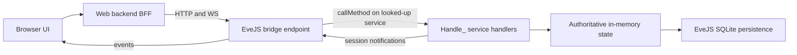

# EveJS Web Client: Scope and Roadmap

**Status:** Active — rewritten 2026-07-18. Supersedes the 2026-07-12 planning baseline and its Goal 0A–0F ladder. The old goal ladder, its execution records, and the deleted `docs/progress.md` live in this repository's git history (through commit `8dccc5d`); do not resurrect their retired decisions (section 11).

**Related repositories:** `eve.js` (game server, sole authority) and `evejs-web-poc` (browser client).

## 1. Goal

Reimplement as much of the EVE Online client as practical in a web browser, by making the browser drive the **same service calls the retail client makes**, dispatched to the **same EveJS handlers** the retail client hits. EveJS remains authoritative for all state, validation, movement, transactions, and persistence. The browser is an alternate client, not another simulation.

The first end-to-end playable milestone is a courier mission completed entirely in the browser (section 7). Combat and the rest of the client surface come later, as practical — deferred, not forbidden.

The UI stays text/data-driven and EVE-styled. Graphical space rendering is not a goal.

## 2. The retail call surface (the spec)

The decompiled retail client at `eve.js/tools/ClientCodeGrabber/Latest` (EVE release V24.01; ~12,500 Python modules present as `.py`/`.pyc`/`.pyj` triplets, ~269 MB) is the specification for what the browser should call. It is client source only — no server implementations and no captured network traffic.

Every server interaction in that client takes one of three forms:

- `sm.RemoteSvc('<service>').Method(*args, **kwargs)` — server-tier call. 157 distinct service names, ~884 literal call sites (e.g. `sm.RemoteSvc('charMgr').GetPublicInfo(charID)`, `sm.RemoteSvc('agentMgr')...`).
- `sm.ProxySvc('<service>').Method(...)` — proxy/session-tier call. 14 names (e.g. `machoNet`, `marketProxy`, `fleetProxy`).
- `sm.GetService('<name>')` — client-local service; never crosses the wire and is out of scope for the bridge.

The unit the bridge mirrors is the tuple **(service name, method name, positional args, keyword args)**.

There is no manifest file in the dump. The call surface is mined by grepping the `.py` sources for `sm\.RemoteSvc\('...'\)` / `sm\.ProxySvc\('...'\)` and reading the surrounding call sites. The transport internals (`carbon/common/script/sys/serviceManager.py`, `basesession.py`, `carbon/common/script/net/machoNet.py`, machoVersion 496) are background only — the browser does **not** speak machoNet.

## 3. How EveJS receives those calls

The retail path in `eve.js` (all under `server/src/`):

- TCP listener `network/tcp/index.js` (default port 26000) → machoNet handshake (`network/tcp/handshake.js`) → `ClientSession` → `network/packetDispatcher.js`.
- `CALL_REQ` packets resolve the service via `serviceManager.lookup(serviceName)` and run `service.callMethod(method, args, session, kwargs)` (`services/baseService.js`), which reflectively invokes **`Handle_<method>(args, session, kwargs)`**.
- ~1,500 unique `Handle_*` methods across ~200 service files under `services/` implement the game.

Two facts make a thin browser bridge practical:

1. **Sessions are duck-typed.** Handlers accept any object with the right fields (`characterID`/`charid`, `shipid`, location fields, `sendServiceNotification`, ...). The 500+ parity tests under `server/tests/` already invoke `Handle_*` directly with hand-built plain-object sessions and no socket.
2. **The dispatch seam is one call.** `serviceManager.lookup(service).callMethod(method, args, session, kwargs)` is the entire retail dispatch below the wire protocol. A bridge that packages browser requests into that call, with a browser-backed session object, exercises the same code path as a retail client.

Login and character selection on the retail path: `handshake.js` `_handleAuthentication` supports `config.devAutoCreateAccounts` (unknown accounts auto-created) and `config.devSkipPasswordValidation` (any password accepted) — the emulator's "who cares" login. A character comes online via `charService.js` `Handle_SelectCharacterID` → `applyCharacterToSession` (`characterState.js`) plus the character-control runtime, which also rejects retail login while a browser controls the character.

## 4. Architecture

Browser → web BFF (this repo) → thin EveJS bridge endpoint → the same `Handle_*` handlers the retail client hits.

Rules:

- **The bridge translates transport only.** It turns a browser request into `serviceManager.lookup(service).callMethod(method, args, session, kwargs)` against a browser-backed session, and turns handler results and `sendServiceNotification` traffic back into browser responses/events. It must not reimplement, fork, or "improve" game mechanics.
- **eve.js changes are restricted to bridge/interface endpoints.** Never modify game-mechanics code — the same server concurrently serves real retail clients, and their behavior must stay untouched.
- **A browser session is a real client session.** It carries the same duck-typed fields the parity tests use, participates in the same online-character and duplicate-login rules as a retail session, and receives handler notifications for forwarding. Long-term, EveJS's own session registry arbitrates control; the web-side lease machinery is stripped as that takes over (section 5).
- **The web process never reads or writes gameplay SQLite.** Read-only static reference data (names, icons, SDE JSON) may stay local to the web app.
- Retail `Handle_*` handlers expect retail argument shapes (positional tuples, kwargs, occasionally typed/coerced values) and may emit retail-shaped notifications. That is now the point, not a prohibition: the browser mirrors the retail call sites mined from the decompiled client, and the parity tests are the oracle for argument shapes.

## 5. Transitional state — today's app and the strip-down direction

What exists today (built under the previous roadmap, working, tested last on 2026-07-15):

- Eve-dark UI with four faction themes; web login (separate ignored password store); character list.
- Pages: overview, skill browser + drag/drop queue planner with save/save-paused, inventory grouped by location, read-only Jita 4-4 market, read-only industry jobs/blueprints, PI colony/extractor timers with extractor restart. Manual local icon scraper with manifest and rate limiting.
- Plumbing: versioned `/_evejs-web/v1` gateway (broad `/snapshot` route + `src/eveStore.js` table emulation), browser character-control leases, per-character idempotent commands with expected state versions, sequenced WebSocket events with replay/reconnect snapshots. All of that state is process-memory; a restart starts a new event epoch.

Direction: **strip toward the thin bridge.** Pages migrate one at a time to retail calls. As each migrates, delete its `eveStore` emulation path and its dependence on the broad snapshot. Retire the lease/idempotency/event machinery when the session-based bridge covers the same guarantees the way retail does. The v1 gateway remains until its last consumer is gone — but no new feature should be built on it.

## 6. Security posture (deliberate — do not "fix")

This is an emulator run in a trusted development environment.

- WAN hosting is expected: `0.0.0.0` binding is fine. EveJS already runs this way; **PlayerConnect** handles the WAN side and is out of scope for the web client.
- Login is emulator-style "who cares": the retail path already accepts any password via `devSkipPasswordValidation` / `devAutoCreateAccounts`. The web client should match — take a username and any password, log the character in. No real credential storage, no EveJS-backed auth project.
- Do not add auth hardening, token schemes, session-revocation work, or security-review gates, and do not block work on previously catalogued gaps (token-less loopback fallback, cookie flags, HMAC session lifetime). They are accepted by policy.

## 7. Milestone: courier mission in the browser

The milestone is complete only when a player can do all of this without opening the retail client:

1. Log in with an EveJS account and select an offline character.
2. View available agents and open an agent conversation.
3. Request and accept a courier mission.
4. See the mission briefing, cargo, pickup, destination, reward, and time bonus.
5. Move mission cargo into the active ship when required.
6. Verify the active ship has sufficient cargo capacity.
7. Take browser control of the character and start the route.
8. Undock and travel through every required gate using server-owned autopilot.
9. Dock at the destination station.
10. Deliver the required cargo.
11. Complete the mission through the agent interface.
12. Observe updated wallet, loyalty points, standings, inventory, and journal state.

The browser shows a compact live travel panel (current system, next system, target gate/station, travel state, remaining jumps, elapsed time, failure reason). No map or rendered scene.

Autopilot remains **server-owned**: retail autopilot is a client-side loop (`eve/client/script/parklife/autopilot.py` in the dump), so EveJS needs an authoritative travel-job orchestrator over its existing `beyonceService.js` / `shipService.js` / space runtime operations. The browser may start, pause, resume, or abort a travel job; browser timers must never drive movement. Travel pauses instead of guessing on any unsafe condition (invalid route, failed transition, lost control, restart without resumable state).

## 8. Roadmap

Goal-mode execution: each run implements one independently verifiable unit, leaves both repositories working, updates this table with status and evidence, commits each repository separately (report both hashes; never push unless separately requested), and stops.

| Goal | Status | Scope | Exit condition |
| --- | --- | --- | --- |
| R0 | Pending | Courier-path call inventory: mine the decompiled client for the (service, method, args) sequences behind login, character select, station UI, agent/courier flow, and travel | A checked-in manifest doc mapping each courier-path UI action to its retail calls, with client file references |
| R1 | Pending | Thin bridge endpoint in eve.js + who-cares web login: browser-backed session creation and a whitelisted `(service, method, args, kwargs)` invocation path through `callMethod` | Browser logs in with any password and drives at least one real `Handle_*` call end to end; retail clients unaffected |
| R2 | Pending | First migrated page (character sheet/skills) served entirely by retail calls | Page works via the bridge; its `eveStore`/snapshot path is deleted |
| R3 | Pending | Station inventory and ship operations via the same services retail uses (`invbroker`, ship/station services) | Move/stack/split cargo and board a ship from the browser |
| R4 | Pending | Agents and courier missions (`agentMgr` and mission services) | Accept a courier mission in the browser |
| R5 | Pending | Undock, server-owned autopilot travel, dock | Full multi-jump route completed from the browser |
| R6 | Pending | Courier milestone end to end + legacy cleanup | The 12-step milestone passes; broad snapshot, eveStore emulation, and redundant lease/command machinery removed |

After R6: expand the client surface as practical — mail, market transactions, fitting, chat, contracts, corp tools — each area starting from its mined retail calls. Mining and combat are reconsidered only after the courier loop is solid.

## 9. Risks and mitigations

| Risk | Mitigation |
| --- | --- |
| Retail handlers expect retail argument shapes | Mine exact call sites from the decompiled client; use the parity tests as the oracle for args and returns |
| Handlers emit session/TCP-style notifications | The browser-backed session captures notifications and the bridge forwards them as browser events |
| Retail client and browser control the same character | EveJS's own duplicate-login/session rules plus the existing control runtime until it is redundant |
| A mechanics change sneaks into eve.js | Bridge-only rule: eve.js diffs may touch bridge/interface files only, and reviews enforce it |
| Retail autopilot logic is client-side | Server-owned travel job orchestrator; browser only starts/pauses/resumes/aborts |
| Mission content coverage is limited | Start with one deterministic courier fixture; expose only missions EveJS can actually issue |
| Legacy gateway and bridge drift apart mid-migration | Migrate page by page, deleting each legacy path as its page moves; no new features on the v1 gateway |

## 10. Operational rules

- Never start or stop processes you did not start. Before server work, check ports 443, 26000, 26001, 26002, 26003, 26500, and 40110.
- Never delete or rewrite `_local` gameplay data, web `data/`, icon caches, manifests, or ignored credential files.
- Preserve all unrelated EveJS parity and emulator work; never reset or revert it. Stay on `main` (eve.js) and `master` (web).
- Commit eve.js and web changes separately and report both hashes. Never push unless explicitly requested.
- `eve.js/doc/PHASE_0E_ITEM_CUSTODY.md` belongs to EveJS's internal phase numbering and has nothing to do with this roadmap.

## 11. Retired decisions (recorded 2026-07-18 — do not resurrect)

- **"The gateway must not invoke `Handle_*`"** — retired. Invoking the same handlers the retail client hits is now the core architecture. The old rule's concerns (retail arg shapes, TCP-style notifications) are handled by mirroring retail call sites and forwarding session notifications.
- **Goal 0E (narrow versioned query projections)** — retired unimplemented. Broad snapshots are replaced by retail-call responses as pages migrate, not by a bespoke projection layer.
- **Goal 0F (EveJS-backed web authentication)** — retired unimplemented. Login is who-cares by policy (section 6).
- **Localhost-only rule and the security-hardening backlog** — retired. Trusted dev environment, WAN-hosted, PlayerConnect out of scope.
- **"Text-first companion app" framing and the hard combat exclusion** — superseded. The ambition is the client surface, courier first; combat is deferred, not forbidden. The UI remains text/data-driven.
- **The Goal 0A–0D.1 ladder and its execution records** — completed work, preserved in git history (this file at `8dccc5d` and earlier). The machinery it built is transitional (section 5).
