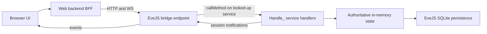

# EveJS Web Client: Scope and Roadmap

**Status:** Active — rewritten 2026-07-18. Supersedes the 2026-07-12 planning baseline and its Goal 0A–0F ladder. The old goal ladder, its execution records, and the deleted `docs/progress.md` live in this repository's git history (through commit `8dccc5d`); do not resurrect their retired decisions (section 11).

**Related repositories:** `eve.js` (game server, sole authority) and `evejs-web-poc` (browser client).

## 1. Goal

Reimplement as much of the EVE Online client as practical in a web browser, by making the browser drive the **same service calls the retail client makes**, dispatched to the **same EveJS handlers** the retail client hits. EveJS remains authoritative for all state, validation, movement, transactions, and persistence. The browser is an alternate client, not another simulation.

The first end-to-end playable milestone is a courier mission completed entirely in the browser (section 7). Combat and the rest of the client surface come later, as practical — deferred, not forbidden.

The UI stays text/data-driven and EVE-styled. Graphical space rendering is not a goal.

## 2. The retail call surface (the spec)

The decompiled retail client at `eve.js/tools/ClientCodeGrabber/Latest` (EVE release V24.01; ~12,500 Python modules present as `.py`/`.pyc`/`.pyj` triplets, ~269 MB) is the specification for what the browser should call. It is client source only — no server implementations and no captured network traffic.

Every server interaction in that client takes one of three forms:

- `sm.RemoteSvc('<service>').Method(*args, **kwargs)` — server-tier call. 157 distinct service names, ~884 literal call sites (e.g. `sm.RemoteSvc('charMgr').GetPublicInfo(charID)`, `sm.RemoteSvc('agentMgr')...`).
- `sm.ProxySvc('<service>').Method(...)` — proxy/session-tier call. 14 names (e.g. `machoNet`, `marketProxy`, `fleetProxy`).
- `sm.GetService('<name>')` — client-local service; never crosses the wire and is out of scope for the bridge.

The unit the bridge mirrors is the tuple **(service name, method name, positional args, keyword args)**.

There is no manifest file in the dump. The call surface is mined by grepping the `.py` sources for `sm\.RemoteSvc\('...'\)` / `sm\.ProxySvc\('...'\)` and reading the surrounding call sites. The transport internals (`carbon/common/script/sys/serviceManager.py`, `basesession.py`, `carbon/common/script/net/machoNet.py`, machoVersion 496) are background only — the browser does **not** speak machoNet.

## 3. How EveJS receives those calls

The retail path in `eve.js` (all under `server/src/`):

- TCP listener `network/tcp/index.js` (default port 26000) → machoNet handshake (`network/tcp/handshake.js`) → `ClientSession` → `network/packetDispatcher.js`.
- `CALL_REQ` packets resolve the service via `serviceManager.lookup(serviceName)` and run `service.callMethod(method, args, session, kwargs)` (`services/baseService.js`), which reflectively invokes **`Handle_<method>(args, session, kwargs)`**.
- ~1,500 unique `Handle_*` methods across ~200 service files under `services/` implement the game.

Two facts make a thin browser bridge practical:

1. **Sessions are duck-typed.** Handlers accept any object with the right fields (`characterID`/`charid`, `shipid`, location fields, `sendServiceNotification`, ...). The 500+ parity tests under `server/tests/` already invoke `Handle_*` directly with hand-built plain-object sessions and no socket.
2. **The dispatch seam is one call.** `serviceManager.lookup(service).callMethod(method, args, session, kwargs)` is the entire retail dispatch below the wire protocol. A bridge that packages browser requests into that call, with a browser-backed session object, exercises the same code path as a retail client.

Login and character selection on the retail path: `handshake.js` `_handleAuthentication` supports `config.devAutoCreateAccounts` (unknown accounts auto-created) and `config.devSkipPasswordValidation` (any password accepted) — the emulator's "who cares" login. A character comes online via `charService.js` `Handle_SelectCharacterID` → `applyCharacterToSession` (`characterState.js`) plus the character-control runtime, which also rejects retail login while a browser controls the character.

## 4. Architecture

Browser → web BFF (this repo) → thin EveJS bridge → the same `Handle_*` handlers the retail client hits.

The bridge is **not new server infrastructure**: it is the **existing** web gateway (`server/src/_secondary/express/evejsWebGateway.js`, HTTP/WS on :26002, already separate from the machoNet game listener on :26000) extended with a whitelisted `callMethod` invocation path — the only eve.js edit in the entire plan (landed in Goal R1).

Rules:

- **The bridge translates transport only.** It turns a browser request into `serviceManager.lookup(service).callMethod(method, args, session, kwargs)` against a browser-backed session, and turns handler results and `sendServiceNotification` traffic back into browser responses/events. It must not reimplement, fork, or "improve" game mechanics.
- **eve.js changes are restricted to bridge/interface endpoints** — concretely, the `_secondary/express` gateway files (plus their tests under `server/tests/`). Never modify game-mechanics code — the same server concurrently serves real retail clients, and their behavior must stay untouched.
- **A browser session is a real client session.** It carries the same duck-typed fields the parity tests use, participates in the same online-character and duplicate-login rules as a retail session, and receives handler notifications for forwarding. Long-term, EveJS's own session registry arbitrates control; the web-side lease machinery is stripped as that takes over (section 5).
- **The web process never reads or writes gameplay SQLite.** Read-only static reference data (names, icons, SDE JSON) may stay local to the web app.
- Retail `Handle_*` handlers expect retail argument shapes (positional tuples, kwargs, occasionally typed/coerced values) and may emit retail-shaped notifications. That is now the point, not a prohibition: the browser mirrors the retail call sites mined from the decompiled client, and the parity tests are the oracle for argument shapes.

## 5. Transitional state — today's app and the strip-down direction

What exists today (built under the previous roadmap, working, tested last on 2026-07-15):

- Eve-dark UI with four faction themes; web login (separate ignored password store); character list.
- Pages: overview, skill browser + drag/drop queue planner with save/save-paused, inventory grouped by location, read-only Jita 4-4 market, read-only industry jobs/blueprints, PI colony/extractor timers with extractor restart. Manual local icon scraper with manifest and rate limiting.
- Plumbing: versioned `/_evejs-web/v1` gateway (broad `/snapshot` route + `src/eveStore.js` table emulation), browser character-control leases, per-character idempotent commands with expected state versions, sequenced WebSocket events with replay/reconnect snapshots. All of that state is process-memory; a restart starts a new event epoch.

Direction: **strip toward the thin bridge.** Pages migrate one at a time to retail calls. As each migrates, delete its `eveStore` emulation path and its dependence on the broad snapshot. Retire the lease/idempotency/event machinery when the session-based bridge covers the same guarantees the way retail does. The v1 gateway remains until its last consumer is gone — but no new feature should be built on it.

**Status (goal R9b, 2026-07-19): that strip is done.** The client is bridge-only, and the emulation dashboards, the `/api/characters/*` route family, `/api/me`, the lease store, the character-event WebSocket proxy, the market client, and the per-character command path are all deleted. What survives of the v1 gateway is four reads the auth/health surface needs — `/account` and `/characters` (login), `/snapshot` (the character-ownership check in `POST /api/bridge/select`), and `/status` + `/health` (`GET /api/health`) — with `src/eveStore.js` slimmed to the normalizer over them. The one remaining consumer of the retired routes is the old vanilla `public/` app, which is superseded by the Svelte client at `/dist/` and is a candidate for removal.

### Web app tech stack (decided 2026-07-18)

The web app began as a slim read-only companion — a single ~2,600-line vanilla `public/app.js` plus hand-rolled WS/event/command layers, no types, no build. That fit the original scope; the client-surface ambition makes the browser a genuinely stateful client (a live session/space/inventory/journal mirror plus the client-side autopilot loop), so the stack moves. **This is web-app-only; eve.js is unaffected, and the Node + Express 5 + `ws` backend stays.**

- **TypeScript** — the project reproduces *typed* retail call/row contracts (`(service, method, args, kwargs)`, marshaled rowsets, flag constants, positional tuples). Types make the bridge compiler-checked; this is the highest-ROI change and the reason to move at all.
- **Vite** — a light build for TS + ES modules + the view layer.
- **A small reactive view layer** — Svelte 5 (recommended) or SolidJS; deliberately not a heavy SPA, to keep the UI text/data-driven and EVE-styled. The exact library is finalized by a spike on the first migrated page.
- **One client-state store** — a single source of truth mirroring the relevant EveJS session/space/inventory/journal state, with the UI **and** the browser autopilot loop as pure readers. It is fed by whatever event transport exists at the time: initially the legacy sequenced WS event stream, transitioning to bridge-forwarded session notifications (§9/G6) as the legacy machinery retires — the store's interface hides which. Keep it framework-agnostic (plain signals) so the view lib isn't load-bearing. This replaces the ad-hoc `eventClient`/`mutationScope` sprawl as pages migrate.

Applied **page-by-page on the R2–R6 rail** — each page rewrite to retail calls also moves it onto the new stack; no big-bang migration. R2 (re-scoped to the login → character select → station-entry spot test) was the proving ground and locked the view library: **Svelte 5** (the plain-signal store deliberately implements the Svelte store contract, so the view lib stays non-load-bearing).

## 6. Security posture (deliberate — do not "fix")

This is an emulator run in a trusted development environment.

- WAN hosting is expected: `0.0.0.0` binding is fine. EveJS already runs this way; **PlayerConnect** handles the WAN side and is out of scope for the web client.
- Login is emulator-style "who cares": the retail path already accepts any password via `devSkipPasswordValidation` / `devAutoCreateAccounts`. The web client should match — take a username and any password, log the character in. No real credential storage, no EveJS-backed auth project.
- Do not add auth hardening, token schemes, session-revocation work, or security-review gates, and do not block work on previously catalogued gaps (token-less loopback fallback, cookie flags, HMAC session lifetime). They are accepted by policy.

## 7. Milestone: courier mission in the browser

The milestone is complete only when a player can do all of this without opening the retail client:

1. Log in with an EveJS account and select an offline character.
2. View available agents and open an agent conversation.
3. Request and accept a courier mission.
4. See the mission briefing, cargo, pickup, destination, reward, and time bonus.
5. Move mission cargo into the active ship when required.
6. Verify the active ship has sufficient cargo capacity.
7. Take browser control of the character and start the route.
8. Undock and travel through every required gate using the browser-run (client-side) autopilot.
9. Dock at the destination station.
10. Deliver the required cargo.
11. Complete the mission through the agent interface.
12. Observe updated wallet, loyalty points, standings, inventory, and journal state.

The browser shows a compact live travel panel (current system, next system, target gate/station, travel state, remaining jumps, elapsed time, failure reason). No map or rendered scene.

Autopilot stays **client-side, in the browser** (decided 2026-07-18): retail autopilot is a client loop (`eve/client/script/parklife/autopilot.py` in the dump), and we keep it exactly that — the ~2-second decide-loop runs in the browser (the client surface) and issues the same atomic movement calls the retail client does (`beyonce.CmdWarpToStuffAutopilot` / `CmdFollowBall` / `CmdStargateJump` / `CmdDock`, `structureJumpBridgeMgr.CmdJumpThroughStructureStargate`). **EveJS gains no travel-job code**; its existing handlers stay authoritative for each atomic move, and route/pathfinding are client-side too (retail's `clientPathfinderService`). **Closing the browser tab is closing the client:** the loop stops, the ship completes whatever server-side command was last issued (a warp or approach in flight) and then sits — no further jumps — and browser control releases as its lease lapses. That is faithful retail behavior (identical to closing the real client mid-autopilot), not a failure mode; on tab close we issue no "stop", the ship simply stops receiving commands. The BFF is a **thin transport relay + session/lease holder; it must never autonomously drive movement when no client is connected** — doing so would make it a server-side bot, not a client. Movement authority stays server-side: the browser never simulates or predicts position, it only *sequences* the authoritative atomic calls, exactly as `autopilot.py` does (this supersedes the earlier "browser timers must never drive movement" phrasing — the browser sequences movement like retail, it just never simulates it). The browser may start, pause, resume, or abort the loop; travel pauses instead of guessing on any unsafe condition (invalid route, failed transition, lost control).

## 8. Roadmap

### Orchestrated execution

This project runs with a **master orchestrator session** and **worker sessions**:

1. The orchestrator writes each goal prompt and checks it into `docs/goal-prompts/`.
2. The operator hands the prompt to a fresh worker session.
3. The worker implements exactly that goal, leaves both repositories working, updates this table with status and evidence, and commits.
4. The operator returns to the orchestrator, which reviews the committed work against the prompt's definition of done before issuing the next goal.

**Every iteration commits its work** — including documentation-only iterations. No iteration ends with uncommitted changes. eve.js and web commits stay separate, both hashes are reported, and nothing is pushed unless separately requested.

| Goal | Status | Scope | Exit condition |
| --- | --- | --- | --- |
| R0 | Complete | Courier-path call inventory: mine the decompiled client for the (service, method, args) sequences behind login, character select, station UI, agent/courier flow, and travel | Done — [retail-call-inventory.md](retail-call-inventory.md) maps all 12 milestone steps to their retail calls with client file refs and EveJS coverage verdicts; key findings: autopilot/route are client-side browser work by design (G1/G2, reframed in the inventory's Direction section) and the courier remote-acceptance parity oracle fails 4 test-side assertions (G3 — own goal prompt; fix before R4) |
| R1 | Complete | Thin bridge endpoint (extend the existing `server/src/_secondary/express/evejsWebGateway.js` web interface; no game-mechanics change) + who-cares web login: browser-backed session creation and a whitelisted `(service, method, args, kwargs)` invocation path through `callMethod`. This is the only eve.js edit in the plan. | Done — gateway `POST /_evejs-web/v1/call` (eve.js `6de856fc`, gateway files + tests only): deny-by-default (service, method)-pair allowlist seeded with `charUnboundMgr.GetCharacterSelectionData` + `map.GetStationInfo`, gateway-materialized browser-backed session (JSON scalars in, `sendServiceNotification` captured into the response), refusals before any service lookup; web side: who-cares login (any/empty password; unknown username → 401 `UNKNOWN_EVEJS_ACCOUNT`), BFF `POST /api/bridge/call` + `eveGatewayClient.callMethod`, live character-selection bridge panel; contract documented in [bridge-wire-contract.md](bridge-wire-contract.md). Evidence: in-process end-to-end test (`eve.js server/tests/webGatewayServiceCall.test.js`, 8/8, drives the reference call and asserts off-allowlist/unknown refusals); live browser round-trip not available this session (no EveJS/web server was running; none started per policy) |
| R1b | Complete | Web stack scaffold (web repo only): TS + Vite build alongside the existing app, the framework-agnostic client-state store skeleton, and a browser-side TS `callMethod` client consuming R1's bridge route through a thin BFF proxy. No page migration, no view library. | Done — TS + Vite scaffold under `web/` (web repo only): `npm run build:web` (tsc typecheck + Vite build into git-ignored `public/dist/`, served at `/dist/` by the existing Express static setup; vanilla app untouched) and `npm run dev:web` (Vite dev server proxying `/api` to the BFF); plain-signal client-state store skeleton (`web/src/store/`: typed session/character/feed slices, subscribe/read API for pure readers, `FeedAdapter` seam hiding the event transport, in-memory adapter as the minimal proof); typed browser `callMethod` client (`web/src/bridge/`) with the reference call `charUnboundMgr.GetCharacterSelectionData` typed end to end incl. long/KeyVal decoding; 28 TS unit tests run natively by the same `npm test` (142/142, was 114/114; Node >= 22.18 for type stripping); scaffold smoke page at `/dist/`; TS-consumer + "how to add a page" notes appended to [bridge-wire-contract.md](bridge-wire-contract.md). View library deliberately not chosen (R2 spike) |
| R2 | Complete | **Spot-test milestone** (re-scoped 2026-07-18; character sheet/skills moved to a later goal): persistent browser-backed session in the gateway + `SelectCharacterID`, and the first page on the new stack (view-lib spike): login → character-selection UI → docked station panel (`GetStationInfo`/`GetStationItemBits`/`GetGuests`) | Done — **in-process end-to-end; live spot test pending operator** (README "Spot test (R2)"). eve.js `14e775aa` (gateway files + tests only): persistent-session store in the gateway runtime — `session/select` mints a live **registered** session (parity-test duck shape, all three notification surfaces captured) and dispatches the retail `SelectCharacterID` tuple through the allowlisted `callMethod` seam; `/call` takes an optional server-held `bridgeSessionID`; release + 30-min idle TTL run the same `sessionDisconnect` path as a retail socket close; refusals surface as typed `CALL_REFUSED` with the handler's own message; allowlist = exactly 5 pairs (R1's two + `charUnboundMgr.SelectCharacterID`, `stationSvc.GetStationItemBits`, `station.GetGuests`), deny-by-default proven still refusing before lookup. `server/tests/webGatewayPersistentSession.test.js` (8/8) proves fixture char online on a persistent session → docked reads + cross-session notification drain → refused-when-controlled → release/TTL → character offline. Web side: BFF `/api/bridge/select`/`release` keep the `bridgeSessionID` server-side in the cookie-session store (never in browser JS); **view lib locked: Svelte 5** (signal store doubles as Svelte stores); `/dist/` page = login → character list (typed `GetCharacterSelectionData`) → station panel (static station identity + `GetStationItemBits` + `GetGuests`; `GetStationInfo` issued faithfully, answers the retail cached-object envelope). Wire contract updated ("Persistent browser-backed sessions"); web tests 168/168 (was 142) |
| R3 | Complete | Station inventory and ship operations via the same services retail uses (`invbroker`, ship/station services) | Done — **in-process end-to-end; live spot test pending orchestrator** (README "Spot test (R3)"). Introduces the retail **bound-object (moniker/`MachoBindObject`) two-step** that R4/R5 reuse. eve.js `0682492e` (bound-object bridge) + `7f22a89d` (echo active shipID in select), gateway files + tests only: `POST /_evejs-web/v1/bound/bind` mints an opaque `boundHandle` (dispatches an allowlisted bind — `invbroker.GetInventory`/`GetInventoryFromId`/`MachoBindObject`, `ship.MachoBindObject` — registers the bound OID on the shared service manager as `packetDispatcher` does, and holds it on the persistent session); `POST /_evejs-web/v1/bound/call` resolves the handle on that session only, enforces deny-by-default on the bound `(service, method)` **before** resolving the OID, sets `currentBoundObjectID`, and dispatches through `callMethod`. Handles are confined to their session and never cross to the browser; released on session teardown. R3 allowlist adds 10 pairs (invbroker `MachoBindObject`/`GetInventory`/`GetInventoryFromId`/`List`/`Add`/`MultiMerge`/`StackAll`/`GetCapacity`, ship `MachoBindObject`/`Board`). `server/tests/webGatewayBoundObject.test.js` (7/7) proves bind→`List` returns the seeded items, `Add` relocates an item hangar→cargo (verified by a follow-up `List`), `GetCapacity` answers a real number, `StackAll` merges, `Board` makes a hangar ship active, a non-allowlisted bound method is refused before any dispatch, and foreign/unknown handles are typed errors. Web side: BFF holds the handles server-side keyed by web session (`/api/bridge/inventory` + `/inventory/move`/`/inventory/stack`/`/ship/board`), the browser addresses items/ships by game IDs only; Svelte **Inventory & Ship** page at `/dist/` (typed `inventoryShip` decoders + `inventory` store slice + flow), `Promise.allSettled` per-container reads. Wire contract + README updated; web tests 198/198 (was 170). |
| R4 | Complete | Agents and courier missions (`agentMgr` and mission services) | Done — **in-process end-to-end; live spot test pending orchestrator** (README "Spot test (R4)"). Reuses R3's bound-object bridge for `agentMgr` and adds the two gateway pieces the R3 de-risk found missing. eve.js `c803ce45` (gateway files + tests only): agentMgr allowlist (top-level `GetAgents`/`GetMyJournalDetails` + the bound two-step `MachoBindObject`/`DoAction`/`GetMissionBriefingInfo`/`GetMissionObjectiveInfo`/`GetMissionKeywords`/`GetAgentLocationWrap`/`GetStandingGainsForMission`); **deferred call responses** handled in BOTH dispatch seams — a gateway adapter drives `DoAction(decline)`'s `buildDeferredCallResponse` to completion (the browser session has no `sendClientCallRequest`, so it degrades to the handler's own no-client fallback) and returns the real result, or refuses a genuinely-blocking deferred with typed `CALL_DEFERRED_UNSUPPORTED` (501) instead of a broken object; **`afterCallResponse`** invoked after every successful non-deferred dispatch (try/catch, mirroring `packetDispatcher.js` — docked-fitting bootstrap / session-change flush / safe-logoff; no-op on R3/R4 methods). `server/tests/webGatewayAgentMgr.test.js` (6/6) proves bind-agent → `DoAction(None)` opens a conversation → **in-person accept CREATES the courier mission** (runtime record + bridged `GetMyJournalDetails`), bound briefing reads return the courier cargo, deny-by-default refuses a non-allowlisted agentMgr bound method before OID resolution, the decline deferred is driven to completion (real result + side effect), and the still-pending deferred is a typed refusal. Web side: BFF holds the agent bound handle server-side (`/api/bridge/agents`, `/api/bridge/agents/:id/action`, `/api/bridge/agents/:id/briefing`, `/api/bridge/journal`), the browser addresses agents by game ID; Svelte **Agents & Missions** page at `/dist/` (typed `agents.ts` decoders with `unwrapLong`/decimal-string ISK+FILETIME + `agents` store slice + flow), `Promise.allSettled` briefing reads + session-loss unwind. Wire contract + README updated; web tests 214/214 (was 201). |
| R5a | Complete | **Space bridge + manually-stepped movement** (the R5 foundation): bridge the atomic space calls on the persistent session and make the browser-backed session participate in space across undock; a Flight page that undocks, warps to a chosen gate, jumps, and docks by explicit buttons (no decide-loop). | Done — **in-process end-to-end; live spot test pending orchestrator** (README "Spot test (R5a)"). eve.js `de8bab1e` (gateway files + tests only): allowlist adds nine deny-by-default pairs — `ship.Undock`, the beyonce remote-park bound two-step (`MachoBindObject` + `CmdWarpToStuffAutopilot`/`CmdWarpToStuff`/`CmdSetSpeedFraction`/`CmdFollowBall`/`CmdStargateJump`/`CmdDock`), and `structureJumpBridgeMgr.CmdJumpThroughStructureStargate`; new read-only `POST /session/flight-status` snapshots the held session's location + ship movement mode and drains the notification backlog. **The persistent browser-backed session participates in space across undock with no new session-carry code** — `Handle_Undock`→`undockSession(session)` attaches it to a scene exactly like the space parity tests' plain-object session (same duck-typed fields + notification surfaces + duck socket); destiny/graphics traffic is gated on a live socket + `initialStateSent`, so it silently no-ops while location/movement still transition authoritatively. `server/tests/webGatewaySpaceBridge.test.js` (5/5) proves — against real world data — undock enters space, a warp advances ship state, a stargate jump transitions the solar system, `CmdDock` returns to a station, and deny-by-default refuses a non-allowlisted beyonce/ship method before dispatch. Web side (web `21c3fc0`): BFF holds the beyonce bound park handle server-side keyed by system (`/api/bridge/flight/status`+`/undock`/`/warp`/`/jump`/`/dock`), `eveGatewayClient.readFlightStatus`; Svelte **Flight** page at `/dist/` (typed `flight.ts` `unwrapLong`-aware decoder + `flight` store slice + flow), movement refusals surfaced as the handler's own reason. Wire contract + README updated; web tests 235/235 (was 214). Footprint = `_secondary/express` + gateway tests; baselines non-regressed (manifest 3/3, agent-parity 6/6, all six gateway files green). |
| R5b | Complete | The **client-side (browser) autopilot decide-loop** on top of R5a: the browser runs `autopilot.py`'s ~2-second loop, sequencing the R5a atomic calls; browser owns route + pathfinding (client-side `clientPathfinderService`); a multi-jump travel panel. Closing the tab stops autopilot (client closed), like retail. | Done — **in-process/simulated end-to-end; live spot test pending orchestrator** (README "Spot test (R5b)"). **Web-only; eve.js untouched** (R5a's allowlist + flight-status already cover every atomic move). Client-side **route solver** (`web/src/nav/routeSolver.ts`): BFS-shortest route over a system-adjacency graph built from the gameStore `stargates` table — each stargate is one directed edge `[fromSystemID, toSystemID, fromGateID (warp+jump source = itemID), toGateID (destinationID)]`, exactly the pair `CmdStargateJump` wants; served as read-only static reference data by `src/staticData.js` (`getSolarSystemGraph`, 5268 gate-connected systems / 13978 edges) via new BFF routes `GET /api/map/graph` + `/api/map/resolve/:id` (station/system→system) — NOT a gateway call, NOT a server travel job (G2). Browser **decide-loop** (`web/src/nav/autopilotLoop.ts`): a port of `autopilot.py Update` that reads flight-status each ~2 s tick and issues one atomic move (undock/warp/jump/dock), replicating the verified **approach-then-redock** (re-issue `CmdDock` through the FOLLOW approach until docked), pausing (not guessing) on any unsafe refusal, and issuing **nothing to the bridge after abort/tab-close**. Travel panel `web/src/ui/Travel.svelte` (Start/Pause/Resume/Abort + live current/next system, target, remaining jumps, elapsed time, failure) on the new `travel` store slice, served at `/dist/`. Tests 236→264: route solver (8; fixture multi-hop + same-system/unreachable/adjacent), decide-loop simulation (10; docked→undock→warp→jump→approach→dock timeline, approach-then-redock, pause-on-scramble, abort issues nothing after, session-loss), travel flow (5), BFF map routes (5). Wire contract + README updated; not pushed. |
| R6 | Complete | Courier milestone end to end: deliver + Complete (the last new gameplay) + the Step-12 reward readout, plus the agent-list usability fix (re-scoped 2026-07-19 — legacy cleanup moved to R7) | Done — **in-process end-to-end; live spot test pending orchestrator** (README "Spot test (R6)"). eve.js `fdc210ea` (gateway files + tests only): the allowlist adds exactly the three Step-12 read pairs `account.GetCashBalance` / `LPSvc.GetAllMyCharacterWalletLPBalances` / `standingMgr.GetCharStandings` (the fourth Step-12 read `agentMgr.GetMyJournalDetails` and Complete itself `agentMgr.DoAction` were already allowlisted, so R6 adds **no** completion pair); `server/tests/webGatewayCourierComplete.test.js` (2/2) proves the capstone through the gateway — in-person accept → deliver the package to the dropoff → `DoAction(Complete)` actually completes (runtime record cleared, package consumed) and the Step-12 reads reflect the payout (wallet grows, an LP balance for the agent corp appears, standing toward the corp grows, the mission leaves the journal), plus deny-by-default re-proven for non-allowlisted account/LPSvc/standingMgr siblings. Web side (web `8ab4b2b`): the **agent-list usability fix** — a courier-only toggle + level + text filter with a capped render (default courier-only, first 60 shown with a match count) so Jita 4-4's ~1,700 agents (882 couriers) stay responsive (pure store/view change); the mission briefing's **Load package into ship** (R3 inventory move) + **Set autopilot to dropoff** (R5b `startRoute`) controls; **Complete** (the existing conversation action) now also pulls the reward readout; the Step-12 wallet/LP/standings decoder (`web/src/bridge/rewards.ts`), `rewards` slice, `app/flow.ts` `loadRewards`/`loadPackageIntoShip`/`setAutopilotToDropoff`, and the BFF `GET /api/bridge/rewards` (independent `Promise.allSettled` reads, deny-by-default). Wire contract + README updated; web tests 280/280 (was 267); eve.js baselines non-regressed (manifest 3/3, agent-parity 6/6, seven gateway files green). Footprint = `_secondary/express` + gateway tests. **The 12-step milestone is now buildable end to end in the browser.** Legacy cleanup (broad snapshot, eveStore emulation, redundant lease/command machinery) is R7. |
| R6a | Complete | Agent Finder: list agents from static reference data, sort by jumps from the current system, and set the R5b autopilot to a chosen agent's station — so a courier agent can be found and traveled to when the per-station roster is empty (`GetAgents` returns 0 for a re-selected docked character). Web-only. | Done — **in-process/simulated; live spot test pending orchestrator** (README "Spot test (R6a)"). **Web-only; eve.js untouched** (static reference data + UI reusing existing bridge routes). `src/staticData.js` `findAgents({kind,level,limit})` reads `agentAuthority/data.json` (`agentsByID`, 10,941 agents) — filters by kind (default courier) + optional level, sorts `(level, agentID)`, caps (default 500 / max 5000), resolves station/system **names** server-side. New read-only BFF route `GET /api/agents/find` (web-login only, like `/api/map/graph` — NOT a gateway call) → `{ ok, source:"static-data", kind, level, total, capped, limit, count, agents }`. Client-side `distancesFrom(graph, originSystemID)` (`web/src/nav/routeSolver.ts`): a **single BFS** over the already-loaded gate graph → jumps to every system (origin=0, unreachable omitted, invalid origin → empty map) — never a `solveRoute` per agent. New `finder` store slice + Svelte **Agent Finder** tab (`web/src/ui/AgentFinder.svelte`): kind/level server-side filters, client-side text search + nearest-first sort + capped render (60 rows; name/level/kind/station/system/jumps columns), a per-row **Set destination** → R5b `startRoute(agent.stationID)` + the current-target readout, then points the user at the Travel tab. Tests 280→297: `distancesFrom` (4), staticData read/filter + `/api/agents/find` route (7, `test/agentFinder.test.js`), finder flow + sort (6, `web/src/app/finderFlow.test.ts`). `build:web` clean; wire contract + README updated; not pushed. **R6b corrects the finder classification + adds the dock refresh (see below).** |
| R6b | Complete | Two live-test fixes on top of R6a, web-only. **(1)** The finder mislabeled Paragon/special agents as courier (IRIS - Jita 3020034 showed as an L1 courier). **(2)** The Agents & Missions / Station / Inventory panels went stale after the autopilot docked at a new station until a full page reload. | Done — **in-process/simulated; live spot test pending orchestrator**. **Web-only; eve.js untouched.** **Fix 1 (classification):** `staticData.findAgents` now classifies by `(divisionID, agentTypeID)` — the retail agent-division scheme — not the raw `missionKind` the static export also stamps on special agents. courier = Distribution div 22 + basic type 2 (3,725 real agents, down from 4,421 by raw missionKind); encounter = Security div 24 / type 2; mining = Mining div 23 / type 2; research = R&D div 18 / type 4. `all` is the union of these; an unclassified kind matches nothing. Paragon (div 37 / type 13, incl. IRIS - Jita 3020034), off-division epic (div 25 / type 12), and career/storyline/event placeholders are all excluded from courier (verified against the 10,941-agent export). `divisionID`/`agentTypeID` are carried through the summary. **Fix 2 (dock refresh):** every flight-status snapshot (manual step / autopilot tick / route-origin read) funnels through one `observeFlightStatus` in `web/src/app/flow.ts`; on a docked-**station** change it applies a new `station/relocated` store event (re-points online `stationID`/`solarSystemID` + static station identity), then re-runs `refreshStationPanel` (always) and `loadAgents`/`loadInventory` (if their tab loaded) — guarded against redundant same-station refetches; a lost session still unwinds. New read-only BFF route `GET /api/map/station/:id` (→ `StationStatic`, like `/api/map/resolve`) supplies the new station's identity. AgentsMissions `onMount` already re-fetches on tab open. Tests 297→307: `test/agentFinder.test.js` +2 (courier lists only div-22/type-2, IRIS - Jita 3020034 excluded; encounter/mining/research by division+type), `test/bridgeMapGraph.test.js` +3 (`/api/map/station/:id`), new `web/src/app/dockRefreshFlow.test.ts` (5: manual dock re-points identity, re-fetches loaded agents/inventory, leaves unopened tabs alone, tab-open re-fetch, same-station guard). `build:web` clean; wire contract + README updated; not pushed. **Known live gap flagged to the orchestrator: the BFF's held-session `stationID` (used to filter `GetAgents` and bind the hangar) is not updated on dock, so live Agents/Inventory re-fetches would still target the select-time station until that is synced — folds into the separate `GetAgents` investigation.** |
| R7 | Complete | Full **Local + Corp chat** for the browser client (presence + read + send): the character appears in Local and Corp member lists, and can read and send in both from a Chat panel. The one goal with an operator-authorized broader eve.js footprint (gateway + a corp chat-gateway helper), core chat mechanics untouched. | Done — **in-process end-to-end; live spot test pending orchestrator** (README "Spot test (R7)"). eve.js `9cd26808` (Local: gateway + helper + local test) + `edec6af4` (Corp: in-process proof): a new **chat-gateway helper** `server/src/_secondary/express/gatewayServices/webChatGatewayService.js` (a plain helper the web runtime calls — NOT a protobuf gateway service, not in the gatewayServices index) gives the persistent browser-backed session Local + Corp presence/read/send by only *calling* existing chat surfaces. Chat delivery bypasses the notification drain, so **READ is a backlog poll** (`chatRuntime.getChannelBacklog`), not an RPC. **Local:** the gateway joins Local on select (`chatHub.joinLocalChannel`) and moves the room on a system change (`chatHub.moveLocalSession`) — the browser session's `sendSessionChange` is a capture stub, so retail auto-sync never fires; presence is derived live from the session registry (`getVisibleLocalSessions`), send is `broadcastLocalMessage`. **Corp** is XMPP-only in retail, so R7 adds a **session-derived corp path mirroring Local**: the roster is enumerated from `sessionRegistry.getSessions()` by `corporationID`, and a corp broadcast writes to the `corp_<id>` backlog (the same core append Local uses) — NOT an XMPP send; `ensureCorpChannel` only ensures the record. Gateway runtime `readChat`/`sendChat` + routes `POST /_evejs-web/v1/chat/read` + `/chat/send` (drain-on-read, typed CALL_INVALID/CALL_REFUSED). `server/tests/webGatewayLocalChat.test.js` (5) + `webGatewayCorpChat.test.js` (4) prove presence in `getVisibleLocalSessions` + the corp roster (session-derived by corporationID: corp-mate in, outsider out), send→backlog→read for both, a same-system pilot seeing the char, a system change moving the room, and a corp-less character refused. Web side (web `ec3c072`): BFF `GET /api/bridge/chat/:channel` + `POST /api/bridge/chat/:channel/send` (held-session gated, drop on SESSION_NOT_FOUND); a `chat` store slice (Local/Corp channel state + active tab), decoder `web/src/bridge/chat.ts`, flow `loadChat`/`sendChatMessage`/`setChatChannel`, and a **Chat** Svelte tab (Local/Corp sub-channels, roster, message list, send box) that polls the open channel every 4s and stops on close. Tests: web 308→329 (`test/bridgeChat.test.js` 8, `web/src/bridge/chat.test.ts` 7, `web/src/app/chatFlow.test.ts` 6); `build:web` clean. eve.js baselines non-regressed (manifest 3/3, agent-parity 6/6, gateway suites 7→9 green). Footprint = `_secondary/express` (gateway runtime/routes + the corp chat-gateway helper) + gateway tests; core chat mechanics untouched. Wire contract + README updated; not pushed. |

| R7b | Complete | **Bridge session-derived chat presence into XMPP (retail sees the web player)** — the one goal with an operator-authorized **core-chat** eve.js footprint (`xmppStubServer` + a minimal `chatHub`/gateway-helper hook), core delivery internals untouched. Retail renders its Local/Corp roster from XMPP MUC presence, which only exists for a live XMPP socket; the socketless browser session emits none, so retail never saw it (Local or Corp), though the web player saw everyone. | Done — **in-process proof; live retail-sees-web spot test pending an operator EveJS restart.** eve.js `0d60477a` (xmppStubServer + webChatGatewayService + a focused in-process test; core chat delivery untouched; parity agents' work untouched): `xmppStubServer` now subscribes to `chatRuntime.runtimeEmitter` `local-join/leave/message` and, for a **socketless** member/author (no `connectedClient`), injects the synthetic MUC presence/message to the room's XMPP occupants (reusing `buildRoomPresenceXml`/`deliverRoomMessage`) — so joins/leaves/**moves** all propagate; a **retail-join roster seam** in `handleJoinPresence` seeds a joining retail client's opening Local/Corp roster with socketless members. **Corp** reconciles the gateway helper's private `corpChatEmitter` (`syncPresence` emits `corp-join`/`corp-leave` on a corp transition, `broadcastCorpMessage` emits `corp-message`; `xmppStubServer.subscribeCorpChatBridge` observes it — cycle-free). **Guardrails:** every handler dedups by characterID and returns before any side effect for a character that holds a live XMPP client (retail machinery covers those), so **retail↔retail rooms are byte-for-byte unchanged**; delayed-local (wormhole/Pochven/nolocal) stays hidden-until-you-speak (the runtime only emits a presence event for them on a speak). `server/tests/xmppSessionDerivedPresenceBridge.test.js` (11) proves — against a simulated retail XMPP occupant — Local join presence + roster seam + message + disconnect (unavailable + admin-leave) + system-change move, the same four for Corp, a **retail-only regression** (exactly one presence, exactly one message copy — no double), and the delayed-room guardrail. eve.js baselines non-regressed (manifest 3/3, agent-parity 6/6, the 9 gateway suites + xmppStubServerParity/chatHubLocalPresence/presenceReconciler/localChatGateway/fleetChat/chatHubSystemMessageRouting/xmppChatMgr all green). Web repo unchanged except **docs** (this roadmap row + the bridge-wire-contract presence-bridge note); no web client/test change, so web tests are unaffected (341/341). eve.js footprint = `xmppStubServer.js` + `webChatGatewayService.js` (the gateway helper) + the new test; `chatHub.js`/`chatRuntime.js` delivery internals untouched. Committed separately (eve.js `0d60477a`, web docs commit); not pushed. |

| R7a | Complete | Two Travel/Flight usability fixes from live testing, web-only. **(1)** The Flight tab showed bare numeric IDs (`In space · system 30000140`, `Docked · station 60003760`, `Solar system: 30000140`) a player can't read. **(2)** You could only set a destination through the Agent Finder / courier flow (Travel's "Start route" was a raw numeric-ID input), so a player who doesn't know EVE IDs couldn't pilot anywhere on their own. | Done — **in-process/simulated end-to-end; live spot test pending orchestrator** (README "Spot test (R7a)"). **Web-only; eve.js untouched.** **Fix 1 (names not IDs):** the Flight readout resolves the current system / station / structure ID → **name** through the existing read-only `/api/map/resolve/:id`, cached client-side in `app/flow.ts` (a `Map` seeded once per unique ID; a definitive `kind:"unknown"` like a player structure is cached too, a transient failure is not) so the flight-status poll doesn't refetch. Resolution funnels through the single `observeFlightStatus` choke point (fire-and-forget, never blocks the autopilot loop) and pushes a new `flight/location` store event tagged with the IDs it resolved for; the reducer applies each name only while the current status still carries that ID (a stale resolve can't mislabel a moved ship) and clears a name on any ID change (falls back to the raw ID). `Flight.svelte` now shows `Docked · Jita IV - ...` and `Solar system: Jita (30000142)`. **Fix 2 (set a destination by name):** new read-only BFF route `GET /api/map/find?q=<text>[&kind=system|station][&limit=N]` (`src/staticData.js` `findMapLocations`) searches the static solar-system + station tables by name, ranks by match quality (exact → prefix → substring, then shorter/alphabetical) so "Jita" surfaces the **Jita system (30000142)** ahead of "Jita IV - ..." stations, ignores a <2-char query, and caps server-side (default 50 / max 200) — mirroring `/api/agents/find`, NOT a gateway call. `Travel.svelte` gains a **Set destination** name search (`flow.searchDestinations` → `api.findMapLocations`, annotating each match with jumps-away via the already-loaded graph `distancesFrom`, like the finder) → a results list → **Set destination** reuses the R5b autopilot `startRoute(id)`; the raw-ID input stays as a **Start route by ID** fallback. Tests 329→341: `test/bridgeMapFind.test.js` (8: real-data name search + rank/cap/kind + the `/api/map/find` route shape/cap/auth against a fixture), `web/src/app/flightFlow.test.ts` +1 (status resolves system+station names, cached — no refetch on a second poll), `web/src/app/travelFlow.test.ts` +3 (search → jumps annotation, too-short query no-request, Set-destination via startRoute). In-process proof against the real gameStore tables (search "Jita" → system 30000142 first + 18 Jita stations; `/api/map/resolve` returns "Jita" / "Jita IV - Moon 4 - Caldari Navy Assembly Plant"; auth-gated). `build:web` clean; wire contract + README updated; not pushed. Live end-to-end deferred: the orchestrator's running :26500 web app predates this route (plain `node`, not watching), and per policy no server was restarted. |

| R7c | Complete | **Names everywhere** — replace raw numeric IDs with resolved names across the whole UI (ships/items → type names, agents → agent names, corps/alliances/factions/characters → names, locations → station/system names), keeping the ID only as a secondary detail or unresolved-fallback. High-value display pass from operator feedback. Web-only. | Done — **in-process/unit end-to-end; live spot test pending orchestrator** (README "Spot test (R7c)"). **Web-only; eve.js untouched** (the resolvers read the existing read-only gameStore reference tables). **Resolution mechanism:** a new batch BFF route `POST /api/names` (`src/staticData.js` `resolveNames`) takes `{ items:[{kind,id}] }` — `kind ∈ type|typeGroup|typeCategory|category|corporation|alliance|faction|character|agent|station|system|region|owner` — and returns `{ names:{ "kind:id": name|null } }` over the existing getters plus three new ones (`getFactionName` from `factions.records`, `getCharacterName` from the characterID-keyed characters table, `getAgentName` from the agentAuthority `ownerName`); `owner` resolves an unknown-entity-type id (a station owner / standings `fromID`) by trying corp→faction→character→alliance. Every item is echoed (a name, or **null** for a definitive "unknown") and the batch is capped at 500 — read-only static reference data mirroring `/api/map/find` and `/api/agents/find`, NOT a gateway/bridge call. A generalized **client name cache** in `web/src/app/flow.ts` (`requestNames`, extending R7a's flight-name `Map`): components ask for names by `(kind,id)`; the cache batches every unresolved ref raised in one microtask into a single POST, caches each result (including definitive nulls, so no refetch), pushes them into a new `names` store slice (`names/resolved` event) for pure-reader components, and does **not** cache a transient failure (so it can retry). Fire-and-forget — never throws, never blocks interaction; the UI shows the raw ID until the name lands (`web/src/store/names.ts` `displayName`/`nameKey`). **Fixed sites:** InventoryShip (row typeID → type name, categoryID → category name, active-ship line → ship type name); Flight (Active ship → ship type name via inventory cross-ref); AgentsMissions (agent lists/conversation/journal → agent names, briefing cargo type → type name, pickup/destination → station + system names, LP corp → corp name, standings `fromID` → owner name); StationPanel (services owner/type → corp-or-faction/type names, guests → character/corp/alliance names); Travel & AgentFinder (remaining `System {id}`/`station {id}` fallbacks now attempt the name cache first, origin-system note resolved). Chat already shows live-roster names (the preferred source — no static lookup wired). Tests 341→355: `test/bridgeNames.test.js` (8: real-data `resolveNames` across kinds/dedup/unknown-null/cap + the `/api/names` route shape/unknown/empty/auth against a fixture), `web/src/app/namesFlow.test.ts` (6: one-round-trip batching, cache-no-refetch, definitive-unknown-no-refetch, transient-failure-retry, never-throws, and a previously-ID Type/Cat cell now rendering the name through the flow→store→`displayName` pipeline). In-process proof against the real gameStore tables (`POST /api/names` batch-resolves type 34→"Tritanium", station 60003760, faction 500001→"Caldari State", unknown→null; auth-gated). `build:web` clean; wire contract + README updated; not pushed. Completeness sweep clean: remaining ID-only fields are justified (mission `title` = a localization message id with no name table; route-hop warp/jump **gate** IDs = a movement-mechanic detail with no friendly name; services **operationID** = raw retail tuple, no operation-name resolver; the labeled **Station ID** reference row, whose name is already the panel header). Live end-to-end deferred: the running :26500 web app predates the `/api/names` route (plain `node`, not watching), and per policy no server was restarted. |

| R7d | Complete | **Zero visible IDs** — the strict follow-up to R7c: a player never sees a raw numeric game ID rendered as data. R7c had kept IDs as a "secondary detail"; the operator wants names only. Every station/type/corp/alliance/character/agent/ship/item/system reads as a **name**; a nameless ID with no player value is **removed** (field/row/column). Web-only. | Done — **in-process/unit end-to-end; live spot test pending orchestrator**. **Web-only; eve.js untouched.** New pure reader `resolvedName(resolved, kind, id, fallback="—")` in `web/src/store/names.ts` — like `displayName` but it **never** falls back to the raw ID (returns the non-ID `fallback` until the name lands or when it is a definitive unknown); every rendered name cell moved onto it. **Per-component:** StationPanel — removed the `Station ID`, `Station item ID`, and `Operation ID` rows (nameless, no player value); dropped the `(typeID …)` / `(ID …)` tails on the identity Station type + Solar system; Owner and services Station type now name-only (`1000002 · CBD…` → `CBD Corporation`); guests show character/corp/alliance names only. InventoryShip — **removed the `Item` column** (the raw itemID; columns now Type / Cat / Qty / Action) and the active-ship line reads `Algos` not `Algos (ship 9988…)`; Type/Cat via `resolvedName`. Flight — Active ship `Algos` (no `(9988…)`), Solar system `Muvolailen` (no `(30002780)`), location fallbacks name-only. Chat — channel header resolves `local_<systemID>`/`corp_<corpID>` to the **system/corp name** (`Local · Muvolailen`, `Corp · <name>`), falling back to bare `Local`/`Corp` (never the raw room string). Travel — current/next/destination/route-hop systems name-only (dropped the `(id)` tails and the `· station <id>`); **removed the raw warp/jump gate-ID detail** on each route hop (movement internal, no player value). AgentFinder/AgentsMissions — station/system/agent/corp/owner fallbacks name-only; **dropped the mission `title <id>`** (a localization message id with no name and no player value). Also removed every `title={String(id)}` hover tooltip (they exposed the raw ID on hover). IDs remain ONLY in interactive inputs/placeholders, `{#each}` keys, onclick args, and client-side search haystacks — never rendered as data. Exhaustive grep sweep of all `web/src/ui/*.svelte` for `(ID`/`(typeID`/`(ship`/`system ${`/`station ${`/`corp ${`/`agent ${`/`type ${`/`local_`/`corp_`/`title=`/`<td>{…ID}` returns zero rendered IDs (only comments, onclick args, and logic comparisons remain). Tests 355→358: `web/src/app/namesFlow.test.ts` +3 R7d guards (`resolvedName` renders the name once resolved and never the raw ID; stays on the fallback for a definitive unknown; returns the fallback for null/zero/invalid ids). `build:web` clean; not pushed. Left the developer-facing method-name blurbs at the top of each tab alone (a separate decision, per the goal). |

| R8 | Complete | **Adopt Tailwind CSS + make every tab responsive (phone → desktop)** — the desktop-shaped UI broke on phones (wide tables, a fixed tab row, small touch targets). Adopt Tailwind and make every current tab mobile-first responsive from ~360px up to desktop, without changing behavior/data or reintroducing any visible numeric ID (R7d must hold). Web-only. | Done — **build + browser-verified at 360/768/1280px; presentation only**. **Web-only; eve.js untouched** (no `flow.ts`/`api.ts`/store/decoder/bridge change — markup + CSS + build wiring only). **Tailwind v4.3.3 via the first-party `@tailwindcss/vite` plugin (4.3.3), CSS-first:** `web/src/styles.css` does `@import "tailwindcss"` and is imported from `main.ts`, so `npm run build:web` emits the compiled bundle (`public/dist/assets/index-*.css`, 0.64 kB → 12.63 kB) and the built `index.html` links it; chose v4 + the Vite plugin over v3 + PostCSS as the lower-config modern path (no `tailwind.config.js`/`postcss.config.js`; palette tokens in an `@theme` block). The app's Eve-dark palette was lifted out of the old inline `<style>` in `web/index.html` into `@theme` tokens + `@layer base`/`@layer components` (so they win over preflight); the inline style is trimmed to a minimal anti-flash background; a `*.css` module shim keeps `tsc` green; viewport meta already present. **Responsive patterns:** (1) tab nav wraps to multiple rows on a phone (`flex-wrap`), each tab a ≥40px touch target, active tab highlighted; (2) **tables → cards**: every record table (Station guests, Inventory hangar/cargo, Agent Finder agents, Travel search results) gets class `reflow` + a `data-label` on each `<td>` and reflows to stacked labelled cards at ≤640px (`td::before { content: attr(data-label) }`, thead clipped) while staying a table on wider screens, each wrapped in an `overflow-x-auto` box so a wide table scrolls in its own container and the page never scrolls sideways; key/value status tables stay as-is; (3) control rows (Flight warp/jump/dock, Travel search/start-route/route, Inventory quantity, Agents conversation + briefing actions, Station actions) get class `controls` — labelled fields stack and inputs/buttons go full-width on mobile; (4) fluid `#app` container capped at 64rem and centred on desktop for readable line length. **Width checks (a static harness of the compiled CSS + representative markup, driven in a browser at each viewport):** 360px — `documentScrollWidth == 360`, zero elements wider than viewport, nav wrapped (40px buttons), reflow rows `display:block` cards with `data-label` shown, action buttons + control inputs full-width; 768px — reflow rows back to `table-row`, thead visible, card labels `none`, no overflow; 1280px — `#app` capped at 1024px + centred, nav single row, no overflow. **ID sweep re-proof (R7d holds):** re-ran the exhaustive grep over `web/src/ui/*.svelte` for `(ID`/`(typeID`/`(ship`/`system ${`/`station ${`/`corp ${`/`agent ${`/`type ${`/`local_`/`corp_`/`title=`/`<td>{…ID}` — every hit is JS logic (`if (id === null)`), a key/onclick arg, a name-resolver argument, or a comment; **zero raw numeric IDs render as data**; the 22 added `data-label` values are words or empty, none numeric. Baseline → final `npm test` unchanged at **358/358**; `tsc` + `build:web` clean. Committed `8c777ce` (Tailwind setup: `package.json`/`package-lock.json`/`vite.config.ts`/`styles.css`/`main.ts`/`svelte-files.d.ts`/`index.html`) + the responsive restyle commit (the 6 tab components) + this docs update; not pushed. |

| R9a | Complete | **Remove the developer-facing blurbs from the player UI** (Phase 1 cleanup, half A) — every tab opened with a paragraph describing the *bridge implementation* to a **player** (bound-object handles, Monikers, the BFF, the notification drain, goal codenames, and named retail service methods). Delete that prose, leaving each tab with either nothing or one short plain-language sentence. Web-only; presentation text only. | Done — **`web/src/ui/*.svelte` only; no `src/`, no eve.js, no behavior/data-flow change** (no handler, store, decoder or bridge call touched; markup structure preserved so R8 responsiveness holds). **Blurbs deleted outright** (tab is self-evident): Inventory & Ship (the "Bound-object bridge … invbroker (GetInventory / GetInventoryFromId); List / Add / StackAll / Board dispatch on those handles" paragraph) and Chat (the "runs on the BFF … chat delivery bypasses the notification drain, so this panel polls" paragraph). **Blurbs replaced with one player-facing sentence:** Travel — "Set a destination and the autopilot flies you there. Closing this tab stops the autopilot — the ship finishes its last move and waits." (was the R5b decide-loop / R5a atomic-move / retail-client paragraph); Agent Finder — "Find an agent and set your destination." (was the agentAuthority-table / per-station-roster paragraph); Agents & Missions — "Talk to an agent, accept a courier, deliver the package, then complete the mission to collect the reward." (was the `agentMgr` / `Moniker('agentMgr', agentID)` / DoAction paragraph); Flight — "Fly manually, one step at a time: undock, warp, jump, and dock. Use the Travel tab to let the autopilot do it for you." (was the R5a / `beyonce` remote-park / `Moniker('beyonce', solarSystemID)` / Cmd\* paragraph). **Headings cleaned of retail method names:** "Station services — stationSvc.GetStationItemBits" → "Station services"; "Guests — station.GetGuests" → "Guests"; "Reward & wallet (post-completion)" → "Reward & wallet". **Embedded asides removed/reworded:** the `map.GetStationInfo` note ("answered with the retail cached-object envelope (rowset rides the object cache)") deleted entirely; Flight "The system transition completes after a short handoff…" → "Refresh flight status to see the new system."; Flight docking "…the handler refuses with a docking-approach reason" → "Docking needs the ship to be in range — warp closer first if it is too far."; character-select "…on a live EveJS session (the same rules as the retail client…)" → "Select a character to bring it online — a character already in use elsewhere cannot be selected."; login "the password is not checked (dev emulator)" → "Sign in with your EveJS account name — any password works."; Station "— live EveJS session." dropped; Agent Finder "The dataset was capped server-side" → "Pick a level to narrow the list."; error strings de-jargoned ("Hangar read failed" → "The hangar could not be loaded", "Some docked reads failed (panel shows what loaded)" → "Some station details could not be loaded", "Some reward reads failed" → "Some reward details could not be loaded", "Loading services row…" → "Loading station services…"); the agent-roster search placeholder "agent id / type" → "mission type or level". Code comments left as-is (explicitly allowed — this pass is about **rendered** text). **Jargon proof:** a template-only sweep (script/style blocks + HTML comments blanked out, so only rendered markup is searched) of all ten `web/src/ui/*.svelte` for `Moniker|BFF|bound|bridge|gateway|invbroker|agentMgr|beyonce|stationSvc|GetStationItemBits|GetGuests|rowset|notification drain|R5a|R5b|R7|decide-loop|retail client` returns **0 hits in every component**; the only remaining source hits are `//` comments and code identifiers (`BridgeCallError`, the `../bridge/*.ts` imports, `isBoardableShip`). **R7d re-proof:** the same sweep re-ran the zero-visible-ID patterns (`(ID`/`(typeID`/`ID {`/`{…ID}`/`system ${`/`station ${`/`corp ${`/`agent ${`/`type ${`/`local_`/`corp_`/`<td>{…ID}`/`<dd>{…ID}`) over rendered text positions only (attribute values and `{#…}` block directives excluded, since neither emits a value) — **0 rendered numeric IDs in every component**; IDs survive only in `{#each}` keys, onclick args, `bind:value` inputs, and logic comparisons, exactly as R7d left them. Baseline → final `npm test` unchanged at **358/358**; `tsc` + `build:web` clean. Committed; not pushed. |

| R9b | Complete | **Retire the legacy v1-gateway / eveStore / lease machinery** (Phase 1 cleanup, half B) — the roadmap had carried this since the migration began. The bridge migration is complete, so the whole `/api/characters/:characterID/*` snapshot-dashboard family, `GET /api/characters`, `GET /api/me`, and their backing modules were dead code the client never called. Web-only. | Done — **`src/` + `test/` (plus two collateral `scripts/` files and docs); no `web/src/**`, no eve.js.** **Split verified independently before deleting:** every `fetch`/`getJson`/`postJson` call site in `web/src/` was grepped — the Svelte client (`web/src/app/api.ts` is the only network module) calls **only** `/api/login`, `/api/logout`, `/api/bridge/*`, `/api/map/*`, `/api/names`, `/api/agents/find`; **zero** references to `/api/characters`, `/api/me`, or any lease/control/event path anywhere under `web/`. The orchestrator's live/legacy list was correct with **no corrections**. **Routes deleted (14):** `GET /api/me`, `GET /api/characters`, the `app.use("/api/characters/:characterID", requireAuth)` guard, and `…/events`, `…/skills`, `…/skills/queue`, `…/overview`, `…/inventory`, `…/industry`, `…/status`, `…/market`, `…/pi`, `…/pi/restart`, `…/control/claim|renew|release`. **Modules deleted:** `src/browserLeaseStore.js`, `src/characterEventProxy.js`, `src/marketClient.js`, plus the dead smoke script `scripts/smoke-character-events.js` (it smoke-tested only the removed WebSocket event proxy and could no longer even `require`). **Modules slimmed:** `src/eveStore.js` 1,436 → 128 lines — all snapshot/emulation reads (`getSkillDashboard`, `getInventoryDashboard`, `getIndustryDashboard`, `getPlanetDashboard`, `getCharacterOverview`, `getCharacterStatus`, `saveSkillQueue`, `restartExtractors`, `claim/renew/releaseCharacterControl`, `listAccounts`, the `withDb`/`RUNTIME_TABLES` snapshot-table machinery and every normalizer they needed) gone, leaving exactly the four the live surface calls; `src/eveGatewayClient.js` drops `buildEventStreamRequest`, `normalizeQueueEntries`, `isUncertainCommandError`/`postCommandJson` (the command retry-once path), `getCharacterStatus`, `claim/renew/releaseCharacterControl`, `getStationAsks`, `listAccounts`, `saveSkillQueue`, `restartExtractors`; `src/server.js` 1,985 → 1,459 lines, also dropping the now-unreachable `publicControlStatus`, `controlUnavailableError`/`invalidLeaseError`/`expiredLeaseError`/`missingLocalLeaseError`/`normalizeControlError`, the whole `COMMAND_ERROR_DETAILS` + `commandError`/`normalizeCommandError`/`readClientCommandMetadata`/`readSkillQueuePayload`/`readPlanetRestartPayload` command-DTO block, the `characterEventProxy` attach in `startServer`, and the `/api/logout` lease-release loop (leases could only ever be minted by the deleted `control/claim`, so the loop was provably dead). `scripts/check.js` was trimmed to the surviving reads (it called the removed `listAccounts`/`getSkillDashboard`, so `npm run check` would have broken). **Auth preserved:** `eveStore` keeps `getAccount` (used by `requireAuth` **and** `POST /api/login`), `listCharactersForAccount` (the login response), `getCharacterForAccount` (the ownership check in `POST /api/bridge/select` — rewritten to read the one `characters` row straight from the gateway snapshot instead of the deleted `withDb` machinery, same semantics), and `getStatus` (`GET /api/health`); correspondingly `eveGatewayClient` keeps exactly four v1 reads — `/account`, `/characters`, `/snapshot`, `/status`+`/health`. Proven by `test/bridgeLoginAndCall.test.js` + `test/webAuthSession.test.js` + `test/bridgeSession.test.js` (22/22: wrong/empty/missing password sign-in, unknown-username 401, banned 403, session-ID signature tamper, select ownership validation, logout release). **Tests: 358 → 319, delta −39, all legacy-only:** whole files removed — `browserLeaseStore.test.js` (3), `characterEventProxy.test.js` (15), `eveStoreCommandDtos.test.js` (3), `eveStoreControl.test.js` (4), `serverCharacterControl.test.js` (11) = 36; plus 3 cases in `test/eveGatewayClient.test.js` (14 → 11): "character-control calls fail closed when the gateway runtime is not ready" (the same 503-propagates-typed behavior stays covered by "runtime-not-ready is propagated without retry or fallback") and the two "command POST retries…" cases (the retry-once `postCommandJson` path no longer exists). **No live coverage weakened:** the three surviving cases that merely *used* removed helpers as vehicles were rewritten onto live ones rather than deleted — the non-gateway-source and unsupported-API-version guards now ride `listCharacters` (GET) + `callMethod` (POST, the bridge), the unversioned-URL guard rides `listCharacters`, and "every gameplay operation uses only the v1 gateway" became "every surviving v1 read uses only the v1 gateway" (asserts the three reads are GET-only, v1-namespaced, and token-carrying). **LIVE surface still registered and green:** `/api/health`, `/api/login`, `/api/logout`, `/api/bridge/` `call`·`select`·`release`·`inventory`(+`/move`,`/stack`)·`ship/board`·`agents`(+`:agentID/action`,`:agentID/briefing`)·`journal`·`rewards`·`chat/:channel`(+`/send`)·`flight/`(`status`,`undock`,`warp`,`jump`,`dock`,`approach`), `/api/map/` `graph`·`resolve/:id`·`station/:id`·`find`, `POST /api/names`, `GET /api/agents/find`, the icon-cache + `public/` static mounts and the SPA fallback. `npm test` 319/319, `tsc` clean, `build:web` clean. **Flagged, not touched (out of my `src/`+`test/` ownership):** the vanilla `public/` app (`app.js`, `eventClient.js`, `commandClient.js`, `mutationScope.js`, `index.html`) is the *old* client and is the only remaining caller of the deleted routes — it is now non-functional and should be removed in a follow-up; its four isolation tests (`commandClient` 11, `eventClient` 11, `mutationScope` 14, `frontendCommandUi` 12 = 48 cases) still pass because they exercise those files directly and were therefore kept. Committed; not pushed. |
| R10 | Complete | **Live event channel (G6 push) — stop polling, start pushing.** Every server→browser signal was pull-based: handler notifications were captured into a per-session array and `splice(0)`-drained onto the next response (and the browser threw them away — `flow.ts` never read `.notifications`), and chat polled a backlog every 4s. eve.js changes **gateway/interface only**. | Done — **eve.js: `server/src/_secondary/express/*` + `server/tests/*` only** (new `sessionEventStream.js`; edits to `evejsWebGateway.js` + `evejsWebGatewayRuntime.js`; new `webGatewaySessionEvents.test.js` plus one frozen-capabilities expectation in `webGatewayV1.test.js`). `chatRuntime`, `characterEventRuntime`, `webChatGatewayService` and all game mechanics **untouched — subscribed to, never modified**. **Gateway push path:** a second WS path `/_evejs-web/v1/session-events` on the existing `onUpgrade` seam, keyed by `bridgeSessionID` + `userid`, reusing the existing `WebSocketServer`, the 2 MB frame / 4 MB buffer guards, the ping/pong heartbeat and the graceful shutdown. Authorization resolves **before** the handshake (new `runtime.authorizeSessionEvents`), so an unknown **or foreign** handle is an opaque 404 `SESSION_NOT_FOUND` rather than an opened-then-closed socket. It carries `event.kind:"notification"` (all three capture stubs, tee'd through a late-bound sink because the `bridgeSessionID` is only minted after `SelectCharacterID` succeeds) and `event.kind:"chat"` (one read-only subscription to `chatRuntime`'s module-level `channel-message`, routed by room name to each live session's Local + Corp rooms — the pushed `entry` is the same backlog shape the READ returns, so push and poll decode identically). **Replay-or-snapshot** copied from `characterEventRuntime`: per-process epoch, per-session monotonic sequence, 256-frame bounded history, subscriber registered **before** the replay batch drains (atomic replay→live handoff), `onFrame()===false` treated as `consumer_rejected`; an unreplayable cursor gets a `snapshot` frame carrying the high-water cursor and a `reason` (`no_cursor` vs `cursor_not_replayable`) instead of silently skipping frames. Frames are retained with no subscriber attached, so a brief drop is lossless. **The token gap is fixed:** `authorizeGatewayUpgrade` returned `false` whenever no `EVEJS_WEB_GATEWAY_TOKEN` was configured — unlike `authorizeGatewayRequest`, which falls back to loopback-allow — which made the entire channel unreachable in the operator's token-less local setup. Both now share one rule (token if configured, else **loopback only**). **Proven, not assumed:** `webGatewaySessionEvents.test.js` deletes the env var, stands up a **real** `http.Server` + real `ws` client, and asserts the socket reaches `OPEN` and receives its snapshot frame; a companion case asserts `10.0.0.4` is still refused. **The drain is untouched (the push is additive):** one case pushes a notification over the socket **and then** asserts the same notification still arrives on the next `/call` response. **BFF:** `openSessionEventStream` in `src/eveGatewayClient.js` (the BFF's only non-request surface) plus `GET /api/bridge/events` SSE in `src/server.js` — same-origin, cookie-authed, routed to the web session's own held session, 409 `NO_LIVE_SESSION` without one. **At most one gateway WS per held session** regardless of how many browsers attach, opened lazily on first attach and closed when the last detaches; the last cursor is remembered so a reconnect resumes and the gateway replays the gap. BFF status frames (`connecting`/`live`/`degraded`/`ended`) tell the page when to lean on its polls; a drop is retried with the cursor, while a gateway 404 ends the channel instead of retrying forever. All eight `bridgeSessions.delete` sites were routed through a new `forgetBridgeSession` so a stream is never orphaned. The `bridgeSessionID` never appears in anything the browser receives (asserted). **Web:** `subscribeBridgeEvents` (injectable EventSource) in `app/api.ts`; `flow.ts` opens the channel on select and closes it on release/logout/every session-lost path, and now **reads notifications for the first time** — pushed notifications land in a new bounded `live` store slice (50-entry tail) with their cursor, pushed chat messages append to the right channel slice **deduplicated** against what a poll already delivered (author + text + timestamp), and a `cursor_not_replayable` snapshot triggers a chat re-read rather than assuming continuity. **Chat is live:** the 4s poll became a safety net via the testable `app/chatPoll.ts` — 30s while the channel delivers, snapping back to 4s the moment it does not. It is deliberately **not** removed: it covers the roster (which the channel does not carry), it covers a browser with no EventSource or a dropped stream, and it keeps the held session warm against its idle TTL for a player who only watches chat. **UI invariants hold:** nothing new is rendered, so R7d zero-IDs, R8 responsive markup and R9a plain-language text are all unchanged; `Chat.svelte`'s only change is swapping its fixed `setInterval` for the poller. **Baselines → final:** web `npm test` 319 → **353** (+34: 8 BFF SSE, 12 flow live-channel, 6 chat-poll, 8 store live-slice), `tsc` + `build:web` clean; eve.js `test:manifest:check` **3/3**, `test:agent-parity` **6/6**, gateway suites 9/9 → **10/10** (the new suite adds 15 cases). Committed separately in both repos; not pushed. |

### Next-phase backlog (recorded 2026-07-19)

The R0–R8 ladder is complete and the §7 courier milestone is achieved live. This is the candidate backlog for what follows — the operator's list plus the earlier "after R7" note (mail, market, fitting, contracts, corp tools). Each area still starts from its **mined retail calls**; nothing here is scheduled until the orchestrator writes a goal prompt for it.

**Space — the "being in space" client surface**

- **Overview** — what is actually around the ship (entities, names/types, distances), sortable/filterable, with **warp-to / approach on any entry**, not just route gates and the station we already know the ID of. Today space is a corridor between known IDs; this converts it into a place, and every later space activity depends on it.
- **HUD** — real shield / armor / hull (and capacitor) for the active ship.
- **Autopilot / warp / approach fidelity** — closer to the retail client loop: align, approach thresholds, warp-to-at-range, orbit / keep-at-range, stop.
- Deferred behind the above: mining, combat, salvage, exploration.
- **Architectural note (the real cost):** the overview and HUD need **live space state** (destiny/ballpark entity + ship state), which retail delivers by push. Our bridge is request/response plus a drained notification backlog, so this phase forces the deferred delivery decision — poll a space-state read, or finally build the event channel (**G6 push**). Chat (R7) hit the same wall and settled on polling a backlog; space state is higher-frequency and may not tolerate that.

**Non-space — "spinning in station"**

- **Ship fitting** — fit/unfit modules, view the fitting, CPU / powergrid / capacitor. Gates almost every other activity (you cannot meaningfully mine, fight, or run harder missions unfitted).
- **Inventory management beyond the basics** — multi-select, stacks/splits, containers, trash.
- **Corp hangars** — division access, moving items in and out.
- **Industry panels** — blueprints, jobs, facilities.
- **Market transactions, contracts, mail** — from the earlier "after R7" note.

**Cross-cutting / cleanup**

- **Live event channel (G6 push)** — see the space note; likely a prerequisite for a good overview/HUD.
- ~~**Retire the legacy v1-gateway / eveStore machinery**~~ — **done in R9b.** Follow-up left behind: delete the superseded vanilla `public/` app (`app.js`, `eventClient.js`, `commandClient.js`, `mutationScope.js`, `index.html`, `styles.css`) and its four isolation test files, and repoint the SPA fallback at `public/dist/index.html`. It is the only remaining caller of the routes R9b deleted, so it no longer works.
- ~~**Remove the developer-facing method-name blurbs** from the player-facing UI~~ — **done in R9a.**
- Optional: bind the web app to the LAN so a real phone can reach it for responsive testing.

**Orchestrator's recommended order:** space awareness first (**overview + HUD**, which forces the state-delivery decision), then **ship fitting**, then the deeper station systems (corp hangars, industry, market/contracts).

## 9. Risks and mitigations

| Risk | Mitigation |
| --- | --- |
| Retail handlers expect retail argument shapes | Mine exact call sites from the decompiled client; use the parity tests as the oracle for args and returns |
| Handlers emit session/TCP-style notifications | The browser-backed session captures notifications and the bridge forwards them as browser events |
| Retail client and browser control the same character | EveJS's own duplicate-login/session rules plus the existing control runtime until it is redundant |
| A mechanics change sneaks into eve.js | Bridge-only rule: eve.js diffs may touch bridge/interface files only, and reviews enforce it |
| Retail autopilot logic is client-side | Keep it client-side in the browser: the browser runs the autopilot decide-loop and issues authoritative atomic moves; EveJS handlers are unchanged. Closing the tab = closing the client → autopilot stops (faithful). The BFF only relays; it never drives movement with no client connected, and the browser never simulates movement |
| Mission content coverage is limited | Start with one deterministic courier fixture; expose only missions EveJS can actually issue |
| Legacy gateway and bridge drift apart mid-migration | Migrate page by page, deleting each legacy path as its page moves; no new features on the v1 gateway |

## 10. Operational rules

- Never start or stop processes you did not start. Before server work, check ports 443, 26000, 26001, 26002, 26003, 26500, and 40110.
- Never delete or rewrite `_local` gameplay data, web `data/`, icon caches, manifests, or ignored credential files.
- Preserve all unrelated EveJS parity and emulator work; never reset or revert it. Stay on `main` (eve.js) and `master` (web).
- Commit every iteration's work in the repo it touches — documentation included; no iteration ends with uncommitted changes. Commit eve.js and web changes separately and report both hashes. Never push unless explicitly requested.
- `eve.js/doc/PHASE_0E_ITEM_CUSTODY.md` belongs to EveJS's internal phase numbering and has nothing to do with this roadmap.

## 11. Retired decisions (recorded 2026-07-18 — do not resurrect)

- **"The gateway must not invoke `Handle_*`"** — retired. Invoking the same handlers the retail client hits is now the core architecture. The old rule's concerns (retail arg shapes, TCP-style notifications) are handled by mirroring retail call sites and forwarding session notifications.
- **Goal 0E (narrow versioned query projections)** — retired unimplemented. Broad snapshots are replaced by retail-call responses as pages migrate, not by a bespoke projection layer.
- **Goal 0F (EveJS-backed web authentication)** — retired unimplemented. Login is who-cares by policy (section 6).
- **Localhost-only rule and the security-hardening backlog** — retired. Trusted dev environment, WAN-hosted, PlayerConnect out of scope.
- **"Text-first companion app" framing and the hard combat exclusion** — superseded. The ambition is the client surface, courier first; combat is deferred, not forbidden. The UI remains text/data-driven.
- **The Goal 0A–0D.1 ladder and its execution records** — completed work, preserved in git history (this file at `8dccc5d` and earlier). The machinery it built is transitional (section 5).
- **Server-owned autopilot / server travel-job orchestrator, and the "browser timers must never drive movement" rule** — retired 2026-07-18 (same day it was written, reversed after R0). Autopilot is client surface: the browser runs the decide-loop and sequences the authoritative atomic calls (section 7); EveJS gains no travel-job code; the BFF never drives movement with no client connected. Do not reintroduce a server travel job.
