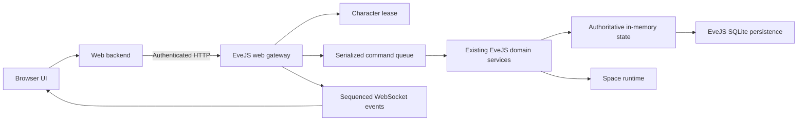
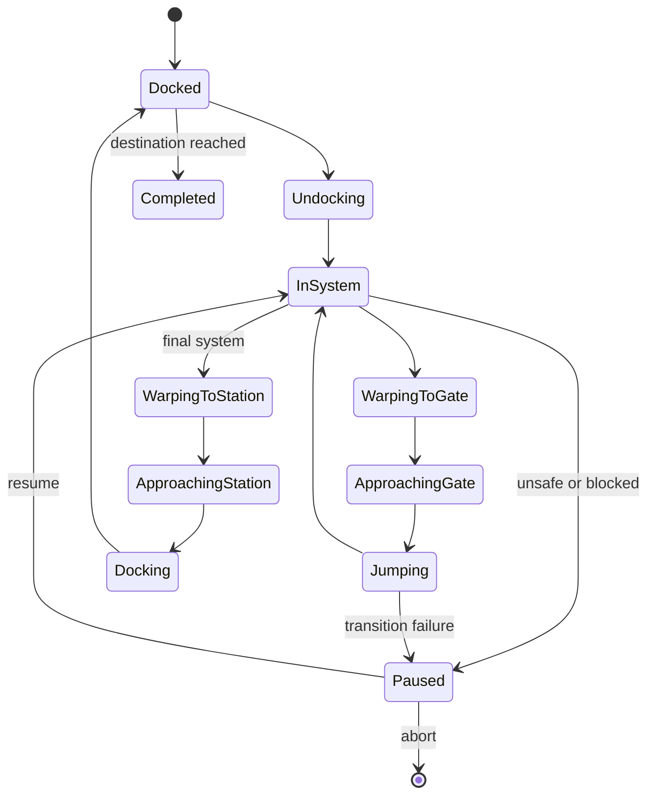

# EveJS Browser Client: Scope, Research, and Roadmap

**Status:** Planning baseline

**Decision date:** 2026-07-12

**Related repositories:** `eve.js` and `evejs-web-poc`

## 1. Goal

Build a text-first, EVE-style browser interface that can perform as much useful EveJS gameplay as is practical without running the retail EVE client.

The browser application should eventually support most docked character management and a focused logistics gameplay loop. Its first true gameplay milestone is an end-to-end courier mission completed through the browser, including agent interaction, cargo handling, undocking, autopilot travel, docking, delivery, and mission completion.

This is an alternate interface to EveJS, not an independent game simulation. EveJS remains authoritative for all state, validation, movement, transactions, and persistence.

## 2. Scope Decisions

The following decisions replace the broader ambitions considered during the initial brainstorm.

### 2.1 Courier missions only

Combat missions are out of scope.

The browser will support courier missions because they exercise valuable non-combat systems:

- agent conversations and mission offers;
- accepting, declining, and completing missions;
- mission journal and objective status;
- mission cargo creation, movement, and delivery;
- route planning and multi-system travel;
- wallet, loyalty point, and standing rewards.

Combat mission support would require a responsive overview, targeting, module control, drones, damage feedback, NPC threat evaluation, and much tighter real-time interaction. The implementation cost and latency sensitivity are not justified for this project.

### 2.2 Autopilot is the space MVP

Initial browser-controlled space activity is limited to travel required for courier gameplay:

- claim exclusive control of an offline character;
- select or activate a ship while docked;
- undock;
- calculate and display a route;
- warp to gates and stations;
- approach gates or stations when required;
- jump between systems;
- dock at the destination;
- pause safely when travel cannot continue.

The autopilot must run inside EveJS. The browser may start, pause, resume, or abort a travel job, but browser timers and polling must not drive ship movement.

Mining is a possible future space interaction, but it is not part of the current roadmap. It should only be reconsidered after autopilot, browser-owned sessions, live state delivery, and reconnect recovery are reliable.

### 2.3 Advanced gameplay is excluded

The following systems are out of scope for the foreseeable future:

- combat missions and general PvE combat;
- PvP combat;
- manual targeting and combat module control;
- drones and fighters in combat;
- probe scanning, directional scanning, and hacking;
- wormhole exploration;
- abyssal gameplay;
- fleet combat and fleet command;
- sovereignty and structure combat;
- advanced manual flight controls;
- graphical space rendering.

These exclusions do not prevent EveJS itself from supporting the systems. They only define what the browser client will attempt to expose.

## 3. Research Findings

### 3.1 Station gameplay is highly viable

EveJS already has authoritative services or runtime modules for most docked activities. Relevant server implementations include:

- inventory listing, item movement, stacking, splitting, fitting, and trashing in `server/src/services/inventory/invBrokerService.js` and `itemStore.js`;
- ship activation, assembly, fitting, and undocking in `server/src/services/ship/shipService.js`;
- market browsing and buy, sell, modify, and cancel operations in `server/src/services/market/marketProxyService.js`;
- mail read, send, labels, read state, trash, and deletion in `server/src/services/mail/mailMgrService.js`;
- industry job installation, completion, and cancellation in `server/src/services/industry/industryManagerService.js`;
- repair, reprocessing, repackaging, and insurance services;
- contracts, including courier collateral and completion flows;
- character skills, fittings, wallet state, standings, corporations, and planetary interaction.

Most of these features need a safe JSON command/query interface and a browser UI, not a new gameplay implementation.

### 3.2 Agent courier mechanics are viable, but content is incomplete

`server/src/services/agent/agentMissionRuntime.js` already contains:

- agent conversation actions;
- mission offer, accept, decline, and completion state;
- courier and fetch objective evaluation;
- mission cargo grants and consumption;
- remote-completion rules;
- ISK, item, loyalty point, and standing rewards;
- mission journal and objective payload generation.

The main mission risk is authored content coverage. The current mission status reports show very limited exact/log-backed mission content, especially above Level 1. The browser can expose whatever courier missions EveJS can currently issue, including placeholder-backed workflows, but browser development does not solve missing mission content.

### 3.3 Autopilot is currently a client-side state machine

The recovered client implementation at:

```text
C:\Users\ryanf\Documents\GitHub\eve.js\tools\ClientCodeGrabber\Latest\eve\client\script\parklife\autopilot.py
```

shows that retail autopilot repeatedly examines route state, session safety, ballpark state, ship mode, distance, gate metadata, and jump state. It then chooses among:

- warp to the next gate or destination;
- approach a nearby target;
- jump through a gate;
- dock at the final station;
- wait for a session transition or ballpark update;
- stop when a restriction or error prevents travel.

EveJS already implements the required low-level operations through `beyonceService.js`, `shipService.js`, `space/runtime.js`, and `space/transitions.js`. The missing piece is an authoritative server-side travel orchestrator that performs the client autopilot loop without relying on a retail client.

### 3.4 Space transitions expect a player session

Undocking, docking, jumping, movement, visibility, and notifications use a session object. The current live session registry treats a TCP socket as proof that a session is alive.

A browser pilot therefore cannot be implemented as a collection of disconnected HTTP calls. EveJS needs a transport-neutral player session abstraction and a browser session adapter that can:

- hold character, ship, corporation, location, and system context;
- attach to and detach from space scenes;
- receive session changes and gameplay notifications;
- translate relevant notifications into browser events;
- remain alive while the browser reconnects;
- participate in the same online-character and duplicate-login rules as a retail client.

### 3.5 The recovered client is a parity reference

The recovered client code should be used to identify workflows, call ordering, arguments, safety checks, confirmation paths, and expected state changes. It should not be copied into the browser application or used as the production runtime.

For each browser workflow:

1. Locate the client UI action and its remote service calls.
2. Locate the corresponding EveJS handlers and underlying runtime functions.
3. Extract or reuse a protocol-independent domain command.
4. Define a typed JSON request and response.
5. Compare behavior with existing parity tests or a captured retail-client call sequence.
6. Add browser-level integration coverage for the complete workflow.

## 4. Required Architecture



### 4.1 State ownership

- The web application must not read or write gameplay SQLite directly.
- All gameplay reads and writes go through authenticated HTTP requests to EveJS.
- EveJS reads and mutates its authoritative in-memory state.
- EveJS alone decides when state is flushed to SQLite.
- The browser bridge token is server-to-server and is never exposed to browser JavaScript.

### 4.2 Commands, queries, and events

The EveJS gateway should expose three interfaces:

- **Queries:** versioned JSON projections for characters, inventory, missions, routes, ships, station services, and live travel state.
- **Commands:** validated mutations carrying a character lease, idempotency key, expected state version, and typed payload.
- **Events:** a sequenced WebSocket stream with snapshots and reconnectable deltas.

The gateway should call shared domain functions. It should not invoke `Handle_*` methods directly because those handlers accept retail protocol shapes and may emit TCP-specific notifications.

### 4.3 Exclusive character control

The character has one authoritative control state:

| State | Permitted writer |
| --- | --- |
| Offline | Short companion commands, subject to validation |
| Retail client online | Retail client only |
| Browser pilot active | Commands carrying the active browser lease |

Starting browser pilot mode claims a lease and marks the character online. A retail client login must not run concurrently. It should either reject the login or explicitly terminate the browser lease before attaching the retail session.

Commands are serialized per character to prevent overlapping inventory, market, mission, and travel mutations.

## 5. Autopilot Travel Job

The server-side travel job owns route execution and recovery.



Each travel job records:

- character and ship IDs;
- destination station or solar system;
- complete route and current route index;
- current state and last confirmed location;
- active target gate or station;
- timestamps, retry counts, and last error;
- initiating browser lease;
- whether docking at the final destination is required.

Travel must pause instead of guessing when the ship is scrambled, the route is invalid, a gate is unavailable, a session transition times out, the ship is destroyed, the character loses control, or EveJS restarts without enough state to resume safely.

## 6. Courier Mission MVP

The MVP is complete only when a player can perform this workflow without opening the retail client:

1. Log in with an EveJS account and select an offline character.
2. View available agents and open an agent conversation.
3. Request and accept a courier mission.
4. See the mission briefing, cargo, pickup, destination, reward, and time bonus.
5. Move mission cargo into the active ship when required.
6. Verify the active ship has sufficient cargo capacity.
7. Claim browser pilot control and start the route.
8. Undock and travel through every required gate using server autopilot.
9. Dock at the destination station.
10. Deliver the required cargo.
11. Complete the mission through the agent interface.
12. Observe updated wallet, loyalty points, standings, inventory, and journal state.

The browser should show a compact live travel panel with the current system, next system, target gate or station, travel state, remaining jumps, elapsed time, and actionable failure reason. A map or rendered space scene is not required.

## 7. Delivery Phases

### Goal-mode execution strategy

Each Goal-mode run should implement one independently verifiable unit. A goal must leave both repositories in a working state, update this roadmap with its status and evidence, and stop before beginning the next goal.

Every goal prompt should include:

- one concrete objective;
- explicit in-scope and out-of-scope work;
- required compatibility behavior;
- a definition of done;
- targeted verification commands or test expectations;
- instructions to preserve unrelated worktree changes;
- instructions not to commit or push unless separately requested.

Phase 0 is divided into the following sequential goals:

| Goal | Status | Scope | Depends on | Exit condition |
| --- | --- | --- | --- | --- |
| 0A | Complete | Explicit EveJS runtime-context injection and versioned web-gateway shell | Current bridge | EveJS and the web app can verify a versioned gateway backed by the live service context without breaking legacy routes |
| 0B | Pending | Exclusive character leases and transport-neutral online presence | 0A | Offline, retail-client, and browser-pilot ownership states are authoritative inside EveJS |
| 0C | Pending | Per-character command queue, idempotency, and state-version preconditions | 0B | Duplicate or overlapping web commands cannot apply a mutation twice |
| 0D | Pending | Sequenced browser event stream and reconnect snapshots | 0C | The browser can disconnect and resume from a known event sequence |
| 0E | Pending | Narrow versioned query projections replacing broad snapshots | 0A, 0D | Required pages read bounded DTOs instead of the full character snapshot |
| 0F | Pending | EveJS-backed web authentication and removal of duplicate gameplay credentials | 0E | The web backend authenticates through EveJS and never receives direct database authority |

### Goal 0A execution status — Complete

**Completed:** 2026-07-15

EveJS now creates one frozen runtime-context boundary containing the live `serviceManager`, passes that exact context through the secondary-service loader and existing Express secondary service, and mounts an authenticated `GET /_evejs-web/v1/health` route. The route reports API version 1, gateway capabilities, and sanitized runtime-dependency readiness without exposing the manager, request credentials, or other internal objects. All pre-existing `/_evejs-web` routes retain their paths and response behavior.

The web backend continues to use the legacy bridge for existing account, character, snapshot, skill queue, PI, and market behavior. Its bridge client now probes `/v1/health` independently and reports whether the gateway is available and whether its injected runtime is ready. Missing, unsupported, or unhealthy v1 endpoints do not invalidate a successful legacy bridge status response.

Files changed in EveJS:

- `server/index.js`
- `server/src/runtimeContext.js`
- `server/src/secondaryServiceLoader.js`
- `server/src/_secondary/express/server.js`
- `server/src/_secondary/express/webCompanionBridge.js`
- `server/tests/runtimeContextPropagation.test.js`
- `server/tests/webGatewayV1.test.js`

Files changed in the web app:

- `src/eveBridgeClient.js`
- `src/server.js`
- `scripts/check.js`
- `test/eveBridgeClient.test.js`
- `package.json`
- `docs/web-client-scope-and-roadmap.md`

Verification evidence:

- EveJS syntax checks passed for all seven scoped source and test files.
- `npm run test:isolated -- server/tests/runtimeContextPropagation.test.js server/tests/webGatewayV1.test.js server/tests/planetRestartExtractors.test.js` passed 12 of 12 tests across three isolated files.
- `npm run test:manifest:check` passed 3 of 3 tests.
- Web-app syntax checks passed for `src/eveBridgeClient.js`, `src/server.js`, `scripts/check.js`, and `test/eveBridgeClient.test.js`.
- `npm test` passed all focused web-client gateway tests, including ready, not-ready, absent, unhealthy, unsupported-version, wrong-source, legacy-compatibility, URL, and server-side-token handling checks.
- A temporary instance of the existing Express secondary service on `127.0.0.1:27602`, using an injected real `ServiceManager`, returned the authenticated v1 health shape with runtime readiness. The web client's `detectGateway()` verified the same endpoint over HTTP. The temporary process was stopped and the port was confirmed free afterward.
- `git diff --check` passed in both repositories.

Consciously deferred to later goals: character leases and online-status changes (0B); command execution, serialization, idempotency, and state versions (0C); WebSockets and event streaming (0D); narrow query projections and removal of broad legacy snapshots (0E); and EveJS-backed web authentication (0F). Proxy-only startup remains supported and reports the v1 gateway as present but its EveJS runtime dependency as not ready because that mode intentionally has no live gameplay `serviceManager`.

Goals 0B through 0F should receive their own reviewed prompts after the preceding goal is complete. Do not pre-implement later goals during an earlier run merely because their future interfaces are known.

The copy/paste prompt for the first run is maintained in [`goal-prompts/phase-0a-runtime-context-and-gateway.md`](goal-prompts/phase-0a-runtime-context-and-gateway.md).

### Phase 0: Gateway foundation

- Replace broad snapshots with versioned query projections.
- Add EveJS-backed web authentication and scoped sessions.
- Introduce character leases and transport-neutral presence.
- Add per-character command serialization and idempotency.
- Add a sequenced WebSocket event stream.
- Pass EveJS runtime and service context into the web gateway.

### Phase 1: Station command coverage

- Inventory move, split, stack, trash, and container operations.
- Ship selection, activation, assembly, fitting, and cargo capacity.
- Mail read, write, read-state, trash, and delete.
- Market buy, sell, modify, cancel, order history, and transactions.
- Industry completion and installation controls.
- Repair, reprocessing, repackaging, and insurance.

Only the inventory and ship operations required by the courier MVP block later phases. The remaining station features can continue incrementally.

### Phase 2: Courier agent interface

- Agent lookup and availability.
- Conversation and action rendering.
- Courier-only mission filtering.
- Mission briefing, objectives, journal, cargo, rewards, and completion.
- Explicit rejection of unsupported combat mission workflows in the browser.

### Phase 3: Browser pilot session

- Claim and release browser control.
- Attach a browser session to EveJS presence and space runtime.
- Undock, receive live state, warp, approach, jump, and dock.
- Recover browser event delivery after a temporary disconnect.
- Block concurrent retail-client control.

### Phase 4: Server autopilot

- Route calculation and destination selection.
- Persistent travel-job state machine.
- Gate and station resolution from authoritative scene data.
- Session-change waiting, retries, pause reasons, resume, and abort.
- Final-station docking.

### Phase 5: End-to-end courier release

- Integrate agent, inventory, ship, travel, wallet, standing, and journal state.
- Add a deterministic test courier mission and route fixture.
- Add integration tests for successful travel, browser reconnect, server restart, blocked travel, lease conflict, and mission completion.
- Add player-facing error recovery and audit history.

### Post-MVP

- Expand station gameplay based on actual usage.
- Improve courier contracts and corporation logistics.
- Add route preferences and avoidance rules.
- Consider mining only after a separate viability review.

## 8. Risks and Mitigations

| Risk | Mitigation |
| --- | --- |
| Space code assumes a TCP client session | Introduce a narrow player-session contract and a browser adapter; do not fake a socket throughout the codebase. |
| Browser disconnect interrupts travel | Keep the travel job in EveJS and allow the UI to reconnect to its event sequence. |
| Duplicate commands after retries | Require idempotency keys and persist recent command outcomes. |
| Retail client and browser mutate together | Enforce an authoritative character lease inside EveJS. |
| Autopilot repeats a jump or inventory action | Record confirmed transition state and make each state action idempotent. |
| Mission content is missing or placeholder-backed | Start with one deterministic courier fixture, then expose only supported courier missions. |
| Polling creates lag or stale state | Use server timestamps, snapshots, and sequenced event deltas rather than rapid polling. |
| Gateway bypasses domain rules | Reuse or extract the same domain commands used by retail protocol handlers. |

## 9. Explicit Non-Goals for the MVP

- No combat missions.
- No combat controls.
- No graphical space scene.
- No player-written automation or scripting interface.
- No multi-character simultaneous piloting.
- No advanced exploration, fleet, sovereignty, or structure gameplay.
- No direct gameplay database access from the web process.
- No requirement to reproduce every retail client confirmation or animation.

## 10. Definition of Success

The project has crossed from companion application to browser-playable EveJS when one player can complete a courier mission entirely through the browser, while EveJS remains the sole authority, the character cannot be controlled concurrently by the retail client, and travel safely survives ordinary browser disconnects.

Everything beyond that result is incremental station coverage, courier depth, reliability, and usability rather than a prerequisite for proving the concept.
